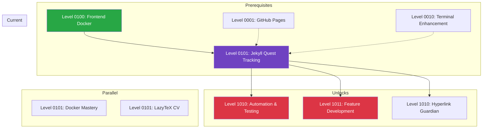
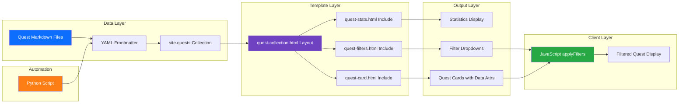

*Greetings, intrepid static site architect! You stand before the great Hall of Collections—a mystical chamber where scattered content transforms into organized, filterable, and dynamic displays. In this quest, you shall master the ancient arts of Jekyll collections, forging powerful layouts that respond to frontmatter incantations and user interactions alike.*

*The knowledge you gain here will allow you to build quest tracking systems, portfolio galleries, documentation hubs, and any content collection that demands organization and discovery. Whether you seek to catalog your own adventures or create portals for fellow travelers, this quest will arm you with the spells needed to succeed.*

## 📜 The Legend Behind This Quest

In the realm of static site generators, Jekyll reigns as the venerable wizard-king—simple yet powerful, transforming markdown into magnificent web pages. But many who wield Jekyll's power never venture beyond basic posts and pages, missing the treasure trove of **collections**.

Collections are Jekyll's secret weapon for organizing related content: quests, products, team members, portfolio pieces—anything that shares a common structure. Combined with **Liquid templating** and **frontmatter metadata**, collections become the foundation for dynamic, data-driven interfaces that rival server-rendered applications.

This quest was born from a real implementation: building a quest tracking system for IT-Journey that displays quests by tier, allows filtering by type/difficulty/technology, shows statistics, and supports level-specific views. You will recreate this system, learning production-ready patterns along the way.

---

## 🎯 Quest Objectives

By the time you complete this epic journey, you will have mastered:

### Primary Objectives (Required for Quest Completion)
- [ ] **Configure Jekyll Collections** - Set up a quests collection with custom output and permalinks
- [ ] **Build Collection Layouts** - Create `quest-collection.html` layout with tier-based grouping
- [ ] **Create Reusable Includes** - Build modular components (cards, filters, stats) for flexibility
- [ ] **Implement Client-Side Filtering** - Add JavaScript-powered filtering using data attributes
- [ ] **Automate Frontmatter Management** - Write Python script to ensure consistent metadata

### Secondary Objectives (Bonus Achievements)
- [ ] **Add Level-Aware Filtering** - Make filters scope to specific levels when viewing level pages
- [ ] **Handle Edge Cases** - Gracefully manage mixed data types (Integer/String levels) in Liquid
- [ ] **Create Responsive Layouts** - Ensure the system works beautifully on all screen sizes
- [ ] **Document the System** - Update READMEs with usage examples and architecture

### Mastery Indicators
You'll know you've truly mastered this quest when you can:
- [ ] Explain the difference between Jekyll pages, posts, and collections
- [ ] Debug Liquid template errors using `--trace` and strategic output
- [ ] Extend the system to new collection types without modifying core layouts
- [ ] Mentor others in building collection-based interfaces

---

## 🗺️ Quest Prerequisites

### 📋 Knowledge Requirements
- [ ] Basic understanding of Jekyll site structure (`_config.yml`, `_layouts/`, `_includes/`)
- [ ] Familiarity with YAML frontmatter syntax and structure
- [ ] Completion of foundational Docker/Jekyll setup quests
- [ ] Basic JavaScript for DOM manipulation and event handling

### 🛠️ System Requirements
- [ ] Modern operating system (Windows 10+, macOS 10.14+, or Linux)
- [ ] Jekyll development environment (Docker recommended for consistency)
- [ ] Text editor with YAML/Liquid syntax highlighting (VS Code recommended)
- [ ] Python 3.x for automation scripts
- [ ] Git for version control

### 🧠 Skill Level Indicators
This 🔴 Hard quest expects:
- [ ] Solid foundation in HTML, CSS, and basic JavaScript
- [ ] Comfortable working with Jekyll and Liquid templating
- [ ] Ready for 4-6 hours of focused, hands-on learning

---

## 🌍 Choose Your Adventure Platform

*Different platforms offer unique advantages for this quest. Choose the path that best fits your current setup and learning goals.*

### 🐳 Docker Kingdom Path (Recommended)

```bash
# Start Jekyll development environment
docker-compose up -d

# Verify Jekyll is running
docker-compose exec jekyll bundle exec jekyll --version

# Build site with trace for debugging
docker-compose exec jekyll bundle exec jekyll build --trace

# Serve with live reload
docker-compose exec jekyll bundle exec jekyll serve --host 0.0.0.0 --port 4000 --livereload
```

*Docker ensures consistent Ruby/Jekyll versions across all team members and CI/CD pipelines. This is the path of the wise.*

### 🍎 macOS Kingdom Path

```bash
# Install Jekyll via Homebrew
brew install ruby
gem install bundler jekyll

# Navigate to project
cd ~/github/it-journey

# Install dependencies
bundle install

# Build and serve
bundle exec jekyll serve --port 4000 --livereload
```

*macOS provides a native development experience. Ensure you're using a Ruby version manager (rbenv or rvm) to avoid permission issues.*

### 🪟 Windows Empire Path

```powershell
# Using WSL2 (recommended) or RubyInstaller
wsl --install  # If WSL not installed

# In WSL terminal
sudo apt update
sudo apt install ruby-full build-essential zlib1g-dev
gem install bundler jekyll

# Navigate and serve
cd /mnt/c/Users/YourName/github/it-journey
bundle install
bundle exec jekyll serve --port 4000
```

*WSL2 provides a Linux environment within Windows, making Jekyll development smooth.*

### 🐧 Linux Territory Path

```bash
# Install Ruby and Jekyll (Ubuntu/Debian)
sudo apt update
sudo apt install ruby-full build-essential zlib1g-dev
gem install bundler jekyll

# Navigate to project
cd ~/github/it-journey

# Install and serve
bundle install
bundle exec jekyll serve --port 4000 --livereload
```

*Linux is Jekyll's native habitat. Most commands work identically to macOS.*

---

## 🧙‍♂️ Chapter 1: Understanding Jekyll Collections

*Before we forge our quest tracking system, we must understand the mystical nature of Jekyll collections—repositories of related content that share structure and purpose.*

### ⚔️ Skills You'll Forge in This Chapter
- Jekyll collection configuration and output settings
- Collection-specific frontmatter defaults
- Understanding `site.collections` and `site.<collection_name>`

### 🏗️ The Collection Configuration Spell

Open your `_config.yml` and examine (or add) the collections configuration:

```yaml
# _config.yml

# Collections configuration
collections_dir: pages  # Optional: group collections in a subdirectory
collections:
  quests:
    output: true  # Generate individual pages for each quest
    permalink: /:collection/:categories/:name/
    sort_by: level  # Optional: default sort order

# Default frontmatter for quests
defaults:
  - scope:
      path: ""
      type: quests
    values:
      layout: journals  # Default layout for quest pages
      fmContentType: quest
```

**Key Configuration Options:**
- `output: true` - Generates individual HTML pages for each document
- `permalink` - URL structure for collection items
- `sort_by` - Default sorting (overridable in templates)

### 📁 Collection Directory Structure

```
pages/
└── _quests/
    ├── README.md           # Collection index
    ├── templates/          # Quest templates
    │   └── main-quest-template.md
    ├── 0000/               # Level 0000 quests
    │   ├── README.md       # Level index
    │   └── hello-world.md
    ├── 0001/               # Level 0001 quests
    │   └── ...
    └── 0101/               # Level 0101 quests (your current level!)
        ├── README.md
        └── jekyll-quest-tracking.md  # This quest!
```

### 🔍 Accessing Collection Data in Liquid

```liquid

 All quests in the collection 


 Filter quests with a specific attribute 


 Filter using expressions 


 Map to extract specific values 


 Count quests 


```

### 🔮 Knowledge Check: Collection Fundamentals
- [ ] Can you explain why `output: true` is essential for individual quest pages?
- [ ] What happens if a quest file lacks required frontmatter fields?
- [ ] How would you add a new collection (e.g., `achievements`) to your site?

### ⚡ Quick Wins
- [ ] **Config Verified**: `_config.yml` has quests collection configured
- [ ] **Structure Understood**: You can navigate the `_quests` directory hierarchy
- [ ] **Data Access**: You can output `{{ site.quests | size }}` in a template

---

## 🧙‍♂️ Chapter 2: Building the Quest Collection Layout

*Now we forge the heart of our system—a layout that transforms raw quest data into an organized, tier-based display.*

### ⚔️ Skills You'll Forge in This Chapter
- Creating Jekyll layouts that extend `default`
- Grouping quests by binary level tiers
- Conditional rendering based on page context

### 🏗️ The Collection Layout Architecture

Create `_layouts/quest-collection.html`:

```liquid

---
layout: default
---

Quest Collection Layout
Displays quests from the site.quests collection using frontmatter data.
Supports filtering by level (pass level parameter to filter to specific level).


<div class="quest-collection">
  <header class="quest-collection-header">
    <h1>{{ page.title | default: "Quest Collection" }}</h1>
    
    <p class="lead">{{ page.description }}</p>
    
  </header>

   Quest Statistics 
  

   Quest Filters 
  

   
  Determine which quests to display:
  - If page.level is set, filter to that level only
  - Otherwise show all quests
  
  
  
    
  
    
  

   Group quests by level tier 
  
  
  
  
  
   Continue for all 16 levels... 

   Apprentice Tier (0000-0011) 
  
  
  <section class="quest-tier quest-tier-apprentice" data-tier="apprentice">
    <h2 class="tier-header">
      <span class="tier-icon">🌱</span>
      <span class="tier-name">Apprentice Tier</span>
      <span class="tier-levels">(Levels 0000-0011)</span>
      <span class="tier-count">{{ apprentice_quests.size }} quests</span>
    </h2>
    <p class="tier-description">Foundation skills for beginning your IT journey.</p>
    <div class="quest-grid">
      
        
      
    </div>
  </section>
  

   Repeat for Adventurer, Warrior, Master tiers... 

   Page Content (for additional markdown content) 
  
  <section class="quest-collection-content">
    {{ content }}
  </section>
  
</div>

```

### 🎨 Tier Styling Magic

```css
/* Quest Tier Sections */
.quest-tier {
  margin-bottom: 3rem;
  padding: 1.5rem;
  border-radius: 8px;
  background: var(--bg-secondary, #f8f9fa);
}

/* Tier Colors */
.quest-tier-apprentice { border-left: 4px solid #28a745; }  /* 🌱 Green */
.quest-tier-adventurer { border-left: 4px solid #fd7e14; }  /* ⚔️ Orange */
.quest-tier-warrior { border-left: 4px solid #dc3545; }     /* 🔥 Red */
.quest-tier-master { border-left: 4px solid #6f42c1; }      /* 👑 Purple */

/* Quest Grid */
.quest-grid {
  display: grid;
  grid-template-columns: repeat(auto-fill, minmax(320px, 1fr));
  gap: 1.5rem;
}
```

### 🔍 Knowledge Check: Layout Architecture
- [ ] Why do we pass `level=page.level` to the includes?
- [ ] How does `| concat:` work to combine arrays in Liquid?
- [ ] What's the purpose of `page.level == nil` in conditionals?

### ⚡ Quick Wins
- [ ] **Layout Created**: `quest-collection.html` exists in `_layouts/`
- [ ] **Tier Grouping**: Quests are grouped by binary level ranges
- [ ] **Responsive Grid**: Cards display in a flexible grid layout

---

## 🧙‍♂️ Chapter 3: Forging the Quest Card Component

*Each quest deserves a beautifully crafted card that displays its vital statistics. We shall create a reusable include component.*

### ⚔️ Skills You'll Forge in This Chapter
- Creating Jekyll includes with parameters
- Using data attributes for JavaScript filtering
- Displaying frontmatter data elegantly

### 🏗️ The Quest Card Include

Create `_includes/quest-card.html`:

```liquid


  Quest Card Include
  
  Usage: 
  
  Required frontmatter in quest pages:
  - title, difficulty, estimated_time, quest_type, level, description




<article class="quest-card" 
         data-difficulty="{{ quest.difficulty | default: 'Unknown' }}"
         data-quest-type="{{ quest.quest_type | default: 'main_quest' }}"
         data-level="{{ quest.level | default: '0000' }}"
         data-technology="{{ quest.primary_technology | default: '' }}"
         data-skill-focus="{{ quest.skill_focus | default: '' }}"
         data-title="{{ quest.title | escape }}"
         data-description="{{ quest.description | default: '' | strip_html | escape }}">
  
  <div class="quest-card-header">
    
      
      <span class="quest-difficulty" title="{{ quest.difficulty }}">{{ diff }}</span>
    
    
    
      
        
          <span class="quest-type quest-type-main" title="Main Quest">🏰</span>
        
          <span class="quest-type quest-type-side" title="Side Quest">⚔️</span>
        
          <span class="quest-type quest-type-bonus" title="Bonus Quest">🎁</span>
        
          <span class="quest-type quest-type-epic" title="Epic Quest">👑</span>
      
    
  </div>
  
  <h3 class="quest-card-title">
    <a href="{{ quest.url | relative_url }}">{{ quest.title | default: 'Untitled Quest' }}</a>
  </h3>
  
  
    <p class="quest-card-description">{{ quest.description | truncate: 120 }}</p>
  
  
  <div class="quest-card-meta">
    
      <span class="quest-time" title="Estimated Time">🕐 {{ quest.estimated_time }}</span>
    
    
      <span class="quest-level" title="Level {{ quest.level }}">📊 Lvl {{ quest.level }}</span>
    
    
      <span class="quest-tech" title="Primary Technology">🛠️ {{ quest.primary_technology }}</span>
    
  </div>
  
  <a href="{{ quest.url | relative_url }}" class="quest-card-link">Begin Quest →</a>
</article>

```

### 💡 The Power of Data Attributes

Data attributes (`data-*`) are the bridge between server-rendered HTML and client-side JavaScript:

```html
<article class="quest-card" 
         data-difficulty="🔴 Hard"
         data-quest-type="side_quest"
         data-level="0101"
         data-technology="jekyll">
```

JavaScript can then read these attributes:
```javascript
const card = document.querySelector('.quest-card');
console.log(card.dataset.difficulty);  // "🔴 Hard"
console.log(card.dataset.questType);   // "side_quest" (camelCase conversion)
```

### 🔍 Knowledge Check: Component Design
- [ ] Why use `| escape` when outputting to data attributes?
- [ ] What's the difference between `include.quest` and `quest`?
- [ ] How would you add a new data attribute for filtering by tags?

### ⚡ Quick Wins
- [ ] **Include Created**: `quest-card.html` exists in `_includes/`
- [ ] **Data Attributes**: Card outputs all filterable data as attributes
- [ ] **Fallbacks**: Component handles missing frontmatter gracefully

---

## 🧙‍♂️ Chapter 4: The Filtering Enchantment

*Now we weave JavaScript magic to enable real-time filtering of our quest collection.*

### ⚔️ Skills You'll Forge in This Chapter
- Building filter UI with Liquid-generated options
- Implementing client-side filtering with JavaScript
- Handling the Integer/String level sorting edge case

### 🏗️ The Quest Filters Include

Create `_includes/quest-filters.html`:

```liquid


Quest Filters Include
Provides interactive filtering UI for quest collections.


 Collect unique values for filter dropdowns 


  


 Get unique quest types 


 Get unique difficulties 


 
IMPORTANT: Level sorting edge case fix!
Some frontmatter has level: 1100 (Integer), others level: "1100" (String).
Liquid's sort filter fails on mixed types. We coerce all to strings.




  



<div class="quest-filters" id="quest-filters">
  <div class="filters-header">
    <h3>🔍 Filter Quests</h3>
    <button type="button" class="btn-reset-filters" onclick="resetAllFilters()">
      Reset All
    </button>
  </div>
  
  <div class="filters-grid">
     Quest Type Filter 
    <div class="filter-group">
      <label for="filter-quest-type">Quest Type</label>
      <select id="filter-quest-type" onchange="applyFilters()">
        <option value="">All Types</option>
        
        <option value="{{ type }}">
          
            🏰 Main Quest
            ⚔️ Side Quest
            🎁 Bonus Quest
            👑 Epic Quest
            {{ type | replace: "_", " " | capitalize }}
          
        </option>
        
      </select>
    </div>

     Additional filters: difficulty, level, technology, skill_focus, search 
     ... (similar pattern for each filter) ... 
  </div>
</div>

<script>
function applyFilters() {
  const questType = document.getElementById('filter-quest-type').value.toLowerCase();
  const difficulty = document.getElementById('filter-difficulty').value.toLowerCase();
  const level = document.getElementById('filter-level').value.toLowerCase();
  const technology = document.getElementById('filter-technology').value.toLowerCase();
  const skillFocus = document.getElementById('filter-skill-focus').value.toLowerCase();
  const searchTerm = document.getElementById('filter-search').value.toLowerCase().trim();

  const questCards = document.querySelectorAll('.quest-card');
  let visibleCount = 0;

  questCards.forEach(card => {
    const cardType = (card.dataset.questType || '').toLowerCase();
    const cardDifficulty = (card.dataset.difficulty || '').toLowerCase();
    const cardLevel = (card.dataset.level || '').toLowerCase();
    const cardTechnology = (card.dataset.technology || '').toLowerCase();
    const cardSkillFocus = (card.dataset.skillFocus || '').toLowerCase();
    const cardTitle = (card.dataset.title || '').toLowerCase();
    const cardDescription = (card.dataset.description || '').toLowerCase();

    let show = true;

    // Apply each filter
    if (questType && !cardType.includes(questType)) show = false;
    if (show && difficulty && !cardDifficulty.includes(difficulty)) show = false;
    if (show && level && cardLevel !== level) show = false;
    if (show && technology && !cardTechnology.includes(technology)) show = false;
    if (show && skillFocus && !cardSkillFocus.includes(skillFocus)) show = false;
    if (show && searchTerm) {
      const matchesSearch = cardTitle.includes(searchTerm) || 
                           cardDescription.includes(searchTerm) ||
                           cardTechnology.includes(searchTerm);
      if (!matchesSearch) show = false;
    }

    if (show) {
      card.classList.remove('filtered-out');
      visibleCount++;
    } else {
      card.classList.add('filtered-out');
    }
  });

  // Update tier visibility
  updateTierVisibility();
  
  // Update results count
  document.getElementById('results-count').textContent = 
    `Showing ${visibleCount} of ${questCards.length} quests`;
}

function updateTierVisibility() {
  const tiers = document.querySelectorAll('.quest-tier');
  tiers.forEach(tier => {
    const visibleCards = tier.querySelectorAll('.quest-card:not(.filtered-out)');
    tier.classList.toggle('filtered-empty', visibleCards.length === 0);
  });
}

function resetAllFilters() {
  document.getElementById('filter-quest-type').value = '';
  document.getElementById('filter-difficulty').value = '';
  document.getElementById('filter-level').value = '';
  document.getElementById('filter-technology').value = '';
  document.getElementById('filter-skill-focus').value = '';
  document.getElementById('filter-search').value = '';
  applyFilters();
}

// Initialize on page load
document.addEventListener('DOMContentLoaded', applyFilters);
</script>

```

### ⚠️ The Integer/String Sorting Trap

**The Problem**: Jekyll's Liquid will fail with `comparison of Integer with String failed` when sorting an array containing both `1100` (Integer) and `"1100"` (String).

**The Solution**: Coerce all values to strings using the join/split pattern:

```liquid




  



```

This forces all values through string concatenation, ensuring uniform types.

### 🔍 Knowledge Check: Filtering Logic
- [ ] Why use `.toLowerCase()` when comparing filter values?
- [ ] How does `card.classList.toggle('filtered-empty', condition)` work?
- [ ] What would break if we used `==` instead of `includes()` for difficulty?

### ⚡ Quick Wins
- [ ] **Filters Work**: Selecting a filter updates visible quests
- [ ] **Reset Works**: Reset button clears all filters
- [ ] **Count Updates**: Results count reflects current filter state

---

## 🧙‍♂️ Chapter 5: Python Automation for Frontmatter

*Manual frontmatter updates are tedious and error-prone. We shall forge a Python spell to automate the task.*

### ⚔️ Skills You'll Forge in This Chapter
- Python file path manipulation with `pathlib`
- YAML frontmatter parsing and modification
- Batch processing directory contents

### 🏗️ The Frontmatter Update Script

Create `scripts/development/update_level_readmes.py`:

```python
#!/usr/bin/env python3
"""
Script to ensure all level README files have consistent frontmatter:
- layout: quest-collection
- level: <directory_name>
- categories: quests

Only updates README.md files in direct child directories of pages/_quests
where the directory name is a 4-digit binary string (e.g., 0101, 1100).
"""

import os
import re
from pathlib import Path

# Calculate repo root: script is in scripts/development/
ROOT = Path(__file__).resolve().parents[2]
QUESTS_DIR = ROOT / 'pages' / '_quests'

# Regex to match binary level directories (0000-1111)
LEVEL_DIR_RE = re.compile(r'^[01]{4}$')


def process_readme(path: Path, level: str):
    """Update a README.md with required frontmatter fields."""
    text = path.read_text(encoding='utf-8')
    
    # Check for frontmatter
    if not text.startswith('---'):
        print(f"Skipping {path}: no frontmatter detected")
        return

    # Split into header and body
    parts = text.split('---', 2)
    header = parts[1]
    body = parts[2] if len(parts) > 2 else ''

    # Parse header into lines
    lines = [line.rstrip('\n') for line in header.split('\n')]

    # Check for required keys
    has_layout = any(re.match(r'\s*layout\s*:', line) for line in lines)
    has_level = any(re.match(r'\s*level\s*:', line) for line in lines)
    has_categories = any(re.match(r'\s*categories\s*:', line) for line in lines)

    # Append missing keys
    new_lines = lines.copy()
    appended = False
    
    if not has_layout:
        new_lines.append('layout: quest-collection')
        appended = True
    if not has_level:
        new_lines.append(f'level: {level}')
        appended = True
    if not has_categories:
        new_lines.append('categories: quests')
        appended = True

    # Write back if changes made
    if appended:
        new_header = '\n'.join(new_lines)
        new_text = '---\n' + new_header + '\n---' + body
        path.write_text(new_text, encoding='utf-8')
        print(f"Updated frontmatter for {path}")
    else:
        print(f"No changes for {path}")


def main():
    """Process all level directories."""
    if not QUESTS_DIR.exists():
        print("Quests directory not found at:", QUESTS_DIR)
        return

    for entry in QUESTS_DIR.iterdir():
        if entry.is_dir() and LEVEL_DIR_RE.match(entry.name):
            readme = entry / 'README.md'
            if readme.exists():
                process_readme(readme, entry.name)
            else:
                print(f"Skipping {entry}: README.md not present")


if __name__ == '__main__':
    main()
```

### 🔧 Running the Script

```bash
# From repo root with Python virtual environment
python scripts/development/update_level_readmes.py

# Or using the venv explicitly
.venv/bin/python scripts/development/update_level_readmes.py
```

**Expected Output:**
```
Updated frontmatter for /Users/you/github/it-journey/pages/_quests/0000/README.md
Updated frontmatter for /Users/you/github/it-journey/pages/_quests/0001/README.md
No changes for /Users/you/github/it-journey/pages/_quests/0101/README.md
Skipping /Users/you/github/it-journey/pages/_quests/1001: README.md not present
```

### 🔍 Knowledge Check: Automation Patterns
- [ ] Why use `Path(__file__).resolve().parents[2]` instead of a hardcoded path?
- [ ] What happens if a README has no frontmatter delimiter (`---`)?
- [ ] How would you extend this to add other frontmatter fields?

### ⚡ Quick Wins
- [ ] **Script Runs**: No errors when executing the script
- [ ] **Files Updated**: Level READMEs have consistent frontmatter
- [ ] **Idempotent**: Running twice produces no additional changes

---

## 🎮 Mastery Challenges

### 🟢 Novice Challenge: Add a New Filter
**Goal**: Add a "Learning Style" filter to the quest filters

**Requirements**:
- Add a new dropdown for `learning_style` (hands-on, conceptual, project-based)
- Add `data-learning-style` attribute to quest cards
- Update the JavaScript `applyFilters()` function

**Success Criteria**: Filtering by learning style works correctly

**Estimated Time**: 30 minutes

### 🟡 Apprentice Challenge: Statistics Enhancement
**Goal**: Add technology distribution to quest statistics

**Requirements**:
- Count quests by `primary_technology` in the stats include
- Display top 5 technologies with counts
- Style the technology badges appropriately

**Success Criteria**: Stats show technology breakdown

**Estimated Time**: 45 minutes

### 🔴 Expert Challenge: Pagination
**Goal**: Implement pagination for large quest collections

**Requirements**:
- Limit displayed quests per tier to 6 initially
- Add "Show More" button per tier
- Track expanded state in localStorage

**Success Criteria**: Pagination improves page load and UX for large collections

**Estimated Time**: 1-2 hours

### ⚔️ Master Challenge: Search Autocomplete
**Goal**: Add autocomplete suggestions to the search filter

**Requirements**:
- As user types, show matching quest titles as suggestions
- Click suggestion to filter to that quest
- Keyboard navigation (up/down arrows, enter to select)

**Success Criteria**: Professional-quality search autocomplete

**Estimated Time**: 2-3 hours

---

## 🏆 Quest Completion Validation

### Portfolio Artifacts Created
- [ ] `_layouts/quest-collection.html` - Collection layout with tier grouping
- [ ] `_includes/quest-card.html` - Reusable quest card component
- [ ] `_includes/quest-filters.html` - Interactive filter UI with JavaScript
- [ ] `_includes/quest-stats.html` - Statistics display component
- [ ] `scripts/development/update_level_readmes.py` - Frontmatter automation

### Skills Demonstrated
- [ ] Created multi-component Jekyll layout system
- [ ] Implemented client-side filtering with data attributes
- [ ] Handled edge cases (Integer/String sorting, missing data)
- [ ] Wrote Python automation for batch frontmatter updates

### Knowledge Gained
- [ ] Jekyll collections configuration and access patterns
- [ ] Liquid templating with includes and parameters
- [ ] JavaScript DOM manipulation and filtering logic
- [ ] Python pathlib and file processing

### Final Validation
Build the site and verify:

```bash
docker-compose exec jekyll bundle exec jekyll build --trace
```

Check for:
- [ ] No Liquid errors in build output
- [ ] Quest collection pages render correctly
- [ ] Filters function as expected
- [ ] Statistics display accurate counts

---

## 🗺️ Quest Network Position



---

## ⚙️ Implementation Flow Diagram



---

## 🎉 Congratulations, Collection Architect!

*You have successfully forged the Jekyll Quest Tracking system! Your mastery of collections, Liquid templating, and client-side filtering has created a powerful, reusable system for organizing and discovering content.*

### 🌟 What's Next?

Your newfound powers open several paths:

- **Deepen Your Mastery**: Explore Jekyll plugins for advanced functionality
- **Expand Your Toolkit**: Apply these patterns to portfolios, documentation sites, or blogs
- **Apply Your Skills**: Build a production quest tracking system for your own learning platform
- **Join the Community**: Share your implementations and help others learn

### 📚 Additional Resources

| Resource | Description |
|----------|-------------|
| [Jekyll Collections Docs](https://jekyllrb.com/docs/collections/) | Official documentation |
| [Liquid Reference](https://shopify.github.io/liquid/) | Complete Liquid syntax |
| [CSS Grid Guide](https://css-tricks.com/snippets/css/complete-guide-grid/) | Grid layout mastery |
| [JavaScript Dataset API](https://developer.mozilla.org/en-US/docs/Web/API/HTMLElement/dataset) | Data attribute access |

---

## 📓 AI Collaboration Log

This quest was developed through AI-assisted content generation:

| Phase | AI Contribution | Human Validation |
|-------|----------------|------------------|
| Planning | Analyzed open commits to understand implementation | Confirmed scope and objectives |
| Structure | Generated quest outline following templates | Reviewed for accuracy |
| Code Examples | Created Liquid/JS/Python snippets | Tested in Jekyll environment |
| Diagrams | Generated Mermaid visualizations | Verified relationships |

**Key AI Insights**:
- Identified Integer/String sorting issue from actual build error
- Suggested data attribute pattern for filtering
- Proposed Python automation based on observed frontmatter inconsistencies

---

## 🧠 Lessons & Next Steps

### Key Takeaways
1. **Collections are powerful** - They transform Jekyll from a blog engine into a CMS
2. **Data attributes bridge static/dynamic** - Server-render data, filter client-side
3. **Automation saves time** - Batch frontmatter updates prevent manual errors
4. **Edge cases matter** - The Integer/String issue only surfaces with mixed data

### Future Enhancements
- [ ] Add LocalStorage to persist filter preferences
- [ ] Implement lazy loading for large collections
- [ ] Add animated transitions for filter changes
- [ ] Create a "Favorites" feature for quest bookmarking

### README Updates Required
- [ ] Update `/pages/_quests/README.md` with this quest link
- [ ] Update `/pages/_quests/0101/README.md` with quest entry
- [ ] Verify cross-references in related quests

---

## ✅ Quest Validation Checklist

Before committing, verify:

- [ ] **Frontmatter Complete**: All required fields populated with valid values
- [ ] **Mermaid Renders**: Both diagrams render correctly in preview
- [ ] **Commands Tested**: Jekyll build completes without errors
- [ ] **README Updated**: Level 0101 README includes this quest
- [ ] **Links Work**: All internal links resolve correctly
- [ ] **Fantasy Theme**: Content maintains RPG terminology and emojis

---

## 🔧 Kaizen Hooks

### Suggested Improvements for Future Revisions
1. Add more detailed CSS styling examples
2. Include unit tests for the Python automation script
3. Create a video walkthrough companion
4. Add troubleshooting section for common Jekyll errors

### Metrics to Monitor
- Quest completion rate (via feedback or analytics)
- Time to complete vs. estimated time
- Common stumbling points (via support questions)

### Derivative Quest Ideas
- **Side Quest**: Custom Jekyll Plugins for Collections
- **Bonus Quest**: SEO Optimization for Collection Pages
- **Epic Quest**: Building a Full Learning Management System with Jekyll

---

*May your collections be organized, your filters be fast, and your frontmatter be consistent! Ready for your next adventure? Check the [Quest Map](/quests/) for your next challenge!* ⚔️✨
