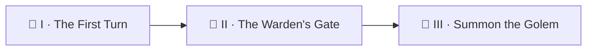

*A loop that cannot be stopped is not an engine — it is a runaway cart. Before your serpent grows teeth (golems, fix lanes, self-merges), it must learn the Wardens' first law: **everything autonomous is OFF until a named switch turns it on, and it stops the instant that switch is unset.** Today you build the gate itself — and then you meet the failure that killed the real engine three mornings straight without producing a single log line.*

*The real-world skills: opt-in automation via repository variables, go/no-go gate jobs, least-privilege `permissions`, and the GitHub Actions rule that a caller job's permissions **cap** every job in a workflow it calls — validated at trigger time, where no linter can save you.*

> 🧭 **Campaign note:** Level `0101` is the Factory — CI/CD & DevOps — exactly where a gate belongs. The campaign's chapters climb its difficulty ladder, not the level order.

## 📖 The Legend Behind This Quest

*When the quest-perfection engine first shipped, its conductor never played a note: three scheduled mornings in a row ended in `startup_failure` — zero jobs, zero logs, only a single sentence on the run's page. The fix was two lines. The lesson was permanent: some laws are enforced by the realm itself, at the gate, before any of your code runs — and your loop must be designed so that "off" is a clean, silent, zero-cost state, not an error.*

## 🎯 Quest Objectives

By the end of this quest you will:

- [ ] **Add a kill switch** — a `LOOP_ENABLED` repository variable your workflow checks before doing anything
- [ ] **Build a gate job** — one cheap job that outputs `go=true/false`; every other job needs it
- [ ] **Apply least privilege** — workflow-level `permissions: contents: read`, elevated only where written proof requires it
- [ ] **Trigger and read a `startup_failure`** — and learn why `gh run view --log-failed` returns nothing for it
- [ ] **Grant caller permissions to a called workflow** — the two-line fix for the whole class

## 🗺️ Quest Prerequisites

- 📋 Chapter I's `potion-book` repo with a green First Turn run
- 📋 15 minutes of patience for GitHub's scheduler (or use `workflow_dispatch` levers)

## 🧙‍♂️ Chapter 1: The Kill Switch and the Gate Job

The gate pattern is one cheap job that decides **go or no-go** — and a workflow whose every other job refuses to start without it. Add this to your First Turn workflow:


```yaml
# .github/workflows/first-turn.yml  (additions)
permissions:
  contents: read          # the workflow-wide floor: read-only

jobs:
  gate:
    runs-on: ubuntu-latest
    outputs:
      go: ${{ steps.check.outputs.go }}
    steps:
      - id: check
        env:
          ENABLED: ${{ vars.LOOP_ENABLED }}
        run: |
          set -euo pipefail
          go=false
          if [ "$ENABLED" = "true" ]; then
            go=true
          else
            echo "loop idle (LOOP_ENABLED=$ENABLED) — flip the variable to arm."
          fi
          echo "go=$go" >> "$GITHUB_OUTPUT"

  turn:
    needs: gate
    if: ${{ needs.gate.outputs.go == 'true' }}
    permissions:
      contents: write     # elevated ONLY here — this job commits the ledger
    runs-on: ubuntu-latest
    steps:
      # … your Chapter I steps unchanged …
```


Arm and disarm it like a warden, and watch both behaviors:

```bash
gh variable set LOOP_ENABLED --body true    # armed
gh workflow run first-turn.yml && gh run watch

gh variable delete LOOP_ENABLED             # disarmed
gh workflow run first-turn.yml && gh run watch   # gate: success, turn: skipped
```

The disarmed run is the important one: **green, silent, zero side effects.** An automation that errors when disabled trains humans to ignore red — the Sentinel's Horn fatigue rule applies to CI too.

### ⚔️ Skills You'll Forge
- The `vars.*` context (repository variables) vs `secrets.*` — switches are variables, credentials are secrets
- Job outputs → `needs.<job>.outputs.<name>` — how gate verdicts travel
- Per-job `permissions` elevation over a read-only floor

### 🔍 Knowledge Check
- [ ] Why check the switch in a *job* instead of skipping the whole workflow with a repository setting?
- [ ] When you later add auth (Chapter III), the gate should require the switch **and** the secret. Why both?

## 🧙‍♂️ Chapter 2: The Error With No Logs — `startup_failure`

Some failures happen **before any job exists**. GitHub validates the whole workflow graph at trigger time; if the graph itself is illegal, the run is stamped `startup_failure` — no jobs, no logs, and `gh run view --log-failed` shrugs. The real engine hit exactly this, three days straight, with this shape:


```yaml
# The trap: a workflow-level read-only floor…
permissions:
  contents: read

jobs:
  fix:
    uses: ./.github/workflows/quest-fix.yml   # …calling a workflow whose jobs
    secrets: inherit                          # request contents:write — DENIED
```


The realm's law: **a caller job's permissions cap every job in the workflow it calls.** The called workflow requested `contents: write, pull-requests: write`; the caller granted `contents: read`. Verdict, rendered at the gate, before the gate job itself could even run:

```text
Invalid workflow file …
The nested job 'fix' is requesting 'contents: write, pull-requests: write',
but is only allowed 'contents: read, pull-requests: none'.
```

The two-line cure — grant on the caller job exactly what the called jobs request:


```yaml
  fix:
    permissions:
      contents: write
      pull-requests: write
    uses: ./.github/workflows/quest-fix.yml
    secrets: inherit
```


Two survival notes from the same battle:

- **actionlint cannot catch this.** The rule is validated server-side. Lint locally, but *smoke-test the graph* by dispatching with inputs that make the expensive jobs no-op (the real engine uses a `max_slices: 0` dispatch input for exactly this).
- **The error lives only on the run's web page.** When a scheduled run shows `startup_failure` with zero jobs, open it in the browser — the one-sentence verdict is printed there and nowhere else.

### 🔍 Knowledge Check
- [ ] Why does GitHub validate called-workflow permissions at *trigger* time instead of when the job starts?
- [ ] Your gate job never ran during the startup failures. What does that tell you about where in the lifecycle graph validation sits?

## 🔁 Reproduce It

Study the real two-line fix and its battle report:

- PR [#422](https://github.com/bamr87/it-journey/pull/422) — `bamr87/it-journey@cfeb5e3aa` (+24/−2): the caller-permissions grant, the artifact-name fix, and the `max_slices=0` smoke-test pattern, written up after three silent `startup_failure` mornings
- The gate pattern at full scale: `gate:` jobs in `.github/workflows/quest-perfection.yml`, `quest-fix.yml`, and `quest-walkthrough.yml` — every lane carries its own `*_ENABLED` switch (`QUEST_PERFECTION_ENABLED`, `QUEST_FIX_ENABLED`, …), so a human can kill one arm without silencing the others

## 🎮 Mastery Challenge

**Objective:** stage-gate your potion book like a real fleet.

**Success Criteria:**
- [ ] Split your loop into two lanes — `first-turn.yml` (check + ledger) and a stub `potion-fix.yml` reusable workflow with its own `FIX_ENABLED` gate — and call the stub from the first lane
- [ ] Deliberately reproduce the `startup_failure` (call the stub while its jobs request `contents: write` under a read-only caller), read the error on the run page, then fix it with the caller grant
- [ ] Prove both kill switches work independently: walk-only mode (`LOOP_ENABLED=true`, `FIX_ENABLED` unset) runs the check and skips the fix lane cleanly

## 🎁 Rewards & Progression

- 🚦 **Warden of the Gate** — earned when your disarmed loop runs green, silent, and free
- ⚡ Skills unlocked: gate jobs · kill switches · least privilege · startup-failure forensics
- 📊 **+75 XP**

## 🗺️ Quest Network



## 🔮 Next Adventures

- 🤖 [Chapter III — Summon the Golem](/quests/0011/ouroboros-loop-03-summon-the-golem/): a Claude Code agent joins the loop, under oath
- 👑 Campaign hub: [Epic Quest: The Ouroboros Loop](/quests/codex/ouroboros-loop/)

## 📚 Resource Codex

- [GitHub Actions: workflow permissions](https://docs.github.com/actions/security-for-github-actions/security-guides/automatic-token-authentication#permissions-for-the-github_token)
- [GitHub Actions: reusing workflows](https://docs.github.com/actions/sharing-automations/reusing-workflows) — the caller/called permission rules
- [actionlint](https://github.com/rhysd/actionlint) — catches much, but not server-side graph law

## 🕸️ Knowledge Graph

*Structured wiki-links connect this quest to the IT-Journey knowledge graph.*

**Campaign hub:** [[Epic Quest: The Ouroboros Loop]] **Previous:** [[The First Turn]] · **Next:** [[Summon the Golem]] **Level home:** [[Level 0101 - CI/CD & DevOps]]
