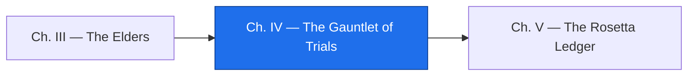

*You now know what the relic does and, for two of its rules, why. The temptation is to start changing it. Resist. A relic changed before it is pinned grows heads: the Hydra of regressions, one for every rule nobody wrote a trial for. This chapter builds the net — trials that pin the relic's true behavior, a circle that makes it run identically on any world, and a Factory that runs the gauntlet on every push. Only then may anyone swing.*

*The real-world skill: characterization tests, golden masters, containerizing a legacy build, and a CI job that proves nothing changed.*

## 📖 The Legend Behind This Quest

*A specification test says what a system should do. A characterization trial says what it does — and for a relic, the second is the only kind you can write honestly, because nobody alive holds the specification. The craft has a name in the mortal world: Michael Feathers called them characterization tests, and the golden master is their oldest form — capture the output once, before you touch anything, and let every future run be judged against it. The guild's rule: **the master is captured, never authored.** If the relic is wrong today, the master is wrong today, and that is correct; the trials exist to catch change, not to define truth.*

## 🎯 Quest Objectives

### Primary Objectives

- [ ] **Capture golden masters** — the relic's report for two as-of dates, saved before any change
- [ ] **Write the trials** — four characterization tests: two golden comparisons, one that encodes ADR-0001, one that encodes ADR-0002
- [ ] **Let the familiar propose, then verify** — every branch of the `EVALUATE` as a proposed trial, each confirmed by a rerun
- [ ] **Draw the summoning circle** — a Dockerfile that installs the compiler, builds the relic, and runs it from a clean image
- [ ] **Raise the Factory** — a GitHub Actions workflow that rebuilds the relic and runs the gauntlet on every push

### Mastery Indicators

- [ ] You can explain to a teammate why editing a golden master by hand is forbidden
- [ ] You can name which trial would fail if someone "fixed" the pivot to 2000-only, and which if they aged disputed invoices
- [ ] Your Factory run is green on a machine that never had COBOL installed

## 🗺️ Quest Prerequisites

- **Chapters I–III** — the relic, its dictionary, and `lore/ADR-0001` and `ADR-0002`; two of the trials below encode those records.
- **Python `unittest`** — it ships with Python, needs no potion, and is enough.
- **A GitHub repository** — push your `relic-raisers` folder to one you own before Chapter 4 of this quest.
- **Docker** — optional. The circle is the cloud path; everything else runs on the host.

## 🧙‍♂️ Chapter 1: Capture the Golden Masters

### ⚔️ Skills You'll Forge

- Recording behavior before change
- Running the relic in a scratch directory so fixtures never drift

The relic writes `AGING.RPT` beside itself, so capture the master for the campaign's as-of date, then run it once more in a scratch directory for a second date — New Year's Day 2027, the date Chapter I already used as a probe.

```bash
mkdir -p golden
cp AGING.RPT golden/AGING-260914.RPT
T=$(mktemp -d) && cp INVOICES.DAT arage01 "$T/" && echo 270101 > "$T/ASOF.PRM"
(cd "$T" && ./arage01) && cp "$T/AGING.RPT" golden/AGING-270101.RPT && rm -rf "$T"
tail -8 golden/AGING-270101.RPT
```

```text
TOTALS
CURRENT                0.00
1-30 DAYS              0.00
31-60 DAYS             0.00
61-90 DAYS             0.00
OVER 90 DAYS       13475.74
DISPUTED            2100.50
INVOICES READ     8
```

Two masters, two very different shapes of the same data. Commit them now, before anything else happens to the relic. The masters are evidence; from here on, only a deliberate, recorded decision may change them.

```bash
git add golden && git commit -q -m "gauntlet: golden masters for 260914 and 270101, captured before any change"
```

### 🔍 Knowledge Check

- [ ] Why run the second master in a scratch directory instead of editing `ASOF.PRM` in place?
- [ ] If a bug is found in the relic next month, what happens to the master, and in what order?
- [ ] Why two dates rather than one?

## 🧙‍♂️ Chapter 2: The Trials

### ⚔️ Skills You'll Forge

- Trials that run the real binary, not a model of it
- Encoding a decision record as an executable check

Save this as `test_relic.py`. Each trial runs the compiled relic in its own scratch directory and judges the report it writes. The first two compare against the masters byte for byte. The third is `ADR-0001` made executable: disputed money is reported but never aged. The fourth is `ADR-0002`: a `99` year ages as 1999.

```python
#!/usr/bin/env python3
"""test_relic.py — characterization trials for ARAGE01.

These tests do not say what the relic SHOULD do. They pin what it DOES, so any
change that alters its behavior fails loudly. Run: python3 -m unittest -v test_relic
Requires the compiled relic (cobc -x -o arage01 ARAGE01.cob) beside this file.
"""
import os
import shutil
import subprocess
import tempfile
import unittest
from decimal import Decimal

HERE = os.path.dirname(os.path.abspath(__file__))

def run_relic(asof):
    """Run arage01 in a scratch directory for one as-of date; return the report text."""
    work = tempfile.mkdtemp()
    for name in ("INVOICES.DAT", "arage01"):
        shutil.copy(os.path.join(HERE, name), work)
    with open(os.path.join(work, "ASOF.PRM"), "w") as f:
        f.write(asof + "\n")
    subprocess.run(["./arage01"], cwd=work, check=True)
    with open(os.path.join(work, "AGING.RPT")) as f:
        report = f.read()
    shutil.rmtree(work)
    return report

def golden(name):
    with open(os.path.join(HERE, "golden", name)) as f:
        return f.read()

class CharacterizationTrials(unittest.TestCase):
    def test_report_matches_golden_master_for_20260914(self):
        self.assertEqual(run_relic("260914"), golden("AGING-260914.RPT"))

    def test_report_matches_golden_master_for_20270101(self):
        self.assertEqual(run_relic("270101"), golden("AGING-270101.RPT"))

    def test_disputed_invoices_are_kept_out_of_the_aging_buckets(self):
        report = run_relic("260914")
        totals = {l[:14].strip(): Decimal(l[14:].strip()) for l in report.splitlines()
                  if l.startswith(("CURRENT", "1-30", "31-60", "61-90", "OVER", "DISPUTED"))}
        aged = sum(v for k, v in totals.items() if k != "DISPUTED")
        self.assertEqual(aged, Decimal("13475.74"))
        self.assertEqual(totals["DISPUTED"], Decimal("2100.50"))

    def test_last_century_due_dates_age_as_last_century(self):
        # INV10006 is due 99-12-31: the relic windows it to 1999, not 2099
        line = next(l for l in run_relic("260914").splitlines() if "INV10006" in l)
        self.assertIn("1999/12/31", line)
        self.assertTrue(line.rstrip().endswith("OVER 90"))

if __name__ == "__main__":
    unittest.main()
```

Run the gauntlet:

```bash
python3 -m unittest -v test_relic
```

```text
test_disputed_invoices_are_kept_out_of_the_aging_buckets (test_relic.CharacterizationTrials.test_disputed_invoices_are_kept_out_of_the_aging_buckets) ... ok
test_last_century_due_dates_age_as_last_century (test_relic.CharacterizationTrials.test_last_century_due_dates_age_as_last_century) ... ok
test_report_matches_golden_master_for_20260914 (test_relic.CharacterizationTrials.test_report_matches_golden_master_for_20260914) ... ok
test_report_matches_golden_master_for_20270101 (test_relic.CharacterizationTrials.test_report_matches_golden_master_for_20270101) ... ok

----------------------------------------------------------------------
Ran 4 tests in 0.022s

OK
```

Four trials is a start, not a net. The relic has more branches than four, and this is where the familiar earns its keep — as a proposer, never a judge. Ask it to enumerate the branches; then you run each one.

```bash
cat ARAGE01.cob | claude -p "List every branch of this program's EVALUATE and IF statements as a Markdown table with columns: condition, an example input record that takes the branch, the bucket it lands in. Do not run anything and do not guess outputs; I will run them."
```

For each row, forge a record that takes the branch (edit the `ROWS` list in a copy of `forge_relic_data.py`), rerun the relic, and only then write the trial with the value the relic printed. A trial written from the familiar's expected bucket instead of the relic's actual output is a Plausible Ghost with a green checkmark — the most dangerous kind.

### 🔍 Knowledge Check

- [ ] Which trial fails if someone changes the pivot to treat every year as 20YY? Which fails if disputed invoices start being aged?
- [ ] Why does `run_relic` copy the binary into a scratch directory instead of running it in place?
- [ ] What is wrong with writing a trial's expected value from the familiar's table?

## 🧙‍♂️ Chapter 3: The Summoning Circle

### ⚔️ Skills You'll Forge

- Binding a legacy toolchain in an image
- Making "works on my fortress" impossible to say

The relic depends on a compiler most machines lack. A circle fixes that: an image that installs the compiler, builds the relic, and runs it — identically on every world. Save this as `Dockerfile`. It runs the same `apt` line the Linux path used in Chapter I, on the same Ubuntu release the reference lab ran on.

```dockerfile
# The summoning circle: the relic runs identically in every world.
FROM ubuntu:24.04
RUN apt-get update && apt-get install -y --no-install-recommends gnucobol3 \
    && rm -rf /var/lib/apt/lists/*
WORKDIR /relic
COPY ARAGE01.cob INVREC.CPY INVOICES.DAT ASOF.PRM ./
RUN cobc -x -o arage01 ARAGE01.cob
CMD ["./arage01"]
```

Build it and run the relic inside, printing the report it writes there:

```bash
docker build -t arage01 .
docker run --rm arage01 sh -c './arage01 && cat AGING.RPT'
```

The report should match `golden/AGING-260914.RPT` exactly; if it does not, the circle is not sealed — a locale, a compiler version, a line ending — and that difference is a finding worth an ADR before it is a bug worth fixing. The reference lab ran the install and build lines on the host, not inside Docker, so treat your first image build as the verification the circle needs.

### 🔍 Knowledge Check

- [ ] Why copy `ASOF.PRM` into the image rather than reading it from the host?
- [ ] What would you change so the container could age a *different* data file without a rebuild?
- [ ] Name one difference between two worlds that a circle removes, and one it does not.

## 🧙‍♂️ Chapter 4: The Factory

### ⚔️ Skills You'll Forge

- A CI job that installs a compiler and rebuilds a relic from source
- Running the gauntlet on every push

The Factory is a golem that runs the gauntlet whether or not anyone remembers to. Save this as `.github/workflows/gauntlet.yml`; every line of it is a command you have already run by hand in this campaign, on the same Ubuntu release the runner uses.

```yaml
name: gauntlet
on: [push, pull_request]
jobs:
  trials:
    runs-on: ubuntu-latest
    steps:
      - uses: actions/checkout@v4
      - run: sudo apt-get update && sudo apt-get install -y gnucobol3
      - run: cobc -x -o arage01 ARAGE01.cob
      - run: python3 forge_relic_data.py && ./arage01 && diff AGING.RPT golden/AGING-260914.RPT
      - run: python3 -m unittest -v test_relic
```

Push it and watch the golem work:

```bash
git add Dockerfile test_relic.py .github/workflows/gauntlet.yml
git commit -q -m "gauntlet: trials, summoning circle, and the Factory"
git push -u origin main
```

A green run on a runner that has never held a COBOL compiler is the proof that matters: the relic, its data, and its trials are fully reproducible from source. From this chapter on, every change to the campaign — the port, the gate, the docs — travels through this gauntlet, and a red run is the Hydra being caught before it breathes.

### 🔍 Knowledge Check

- [ ] The workflow forges the data file before running the relic. What would break if it did not?
- [ ] Why does the `diff` step exist when the first unittest already compares against the master?
- [ ] What should happen to this workflow when Chapter V adds a port?

## 🎮 Mastery Challenge

**Objective:** a net under the relic that no change can slip through.

- [ ] Two golden masters committed, captured before any change, never edited by hand
- [ ] The four trials pass locally; at least one more trial exists for a branch the familiar proposed, with its expected value taken from a rerun
- [ ] `docker run --rm arage01 sh -c './arage01 && cat AGING.RPT'` prints the 260914 master exactly
- [ ] The Factory is green on GitHub, and the run log shows `cobc` installing from apt

## 🎁 Rewards & Progression

- 🛡️ **Golden Master** — you pinned the relic with trials that run in a circle and a Factory
- 🧪 **Skill unlocked:** characterization trials and golden masters
- ⭕ **Skill unlocked:** binding a legacy build in a container
- 🏭 **Skill unlocked:** a CI gauntlet that runs the relic on every push
- **+100 XP**

## 🔁 Reproduce It

The golden masters, the four trials, and the unittest output above were produced on 2026-09-14 on Ubuntu 24.04 with GnuCOBOL 3.1.2 and Python 3.11, from the unchanged Chapter I files. The Dockerfile and the workflow reuse those exact commands; the reference lab had no Docker daemon and did not push to GitHub, so your first image build and your first Factory run are the verifications of those two files.

## 🗺️ Quest Network



## 🔮 Next Adventures

The relic is pinned. Now comes the boss: translate it into a modern tongue, and prove — not argue — that the translation says the same thing.

- ➡️ **Next chapter:** [Chapter V — The Rosetta Ledger](/quests/1100/relic-raisers-05-the-rosetta-ledger/) 🐉
- 🏺 **Campaign hub:** [Epic Quest: The Relic Raisers](/quests/codex/relic-raisers/)
- 🏭 **More Factory craft:** [GitHub Actions Basics](/quests/0101/github-actions-basics/)

## 📚 Resource Codex

- [Python `unittest`](https://docs.python.org/3/library/unittest.html) — the trial framework that ships with the Sages' tongue
- [GitHub Actions: Quickstart](https://docs.github.com/en/actions/quickstart) — workflows, jobs, steps, and the runner images
- [Dockerfile reference](https://docs.docker.com/reference/dockerfile/) — every instruction the summoning circle uses
- [GnuCOBOL](https://gnucobol.sourceforge.io/) — the compiler the Factory installs from apt

## 🕸️ Knowledge Graph

*Structured wiki-links connect this quest to the IT-Journey knowledge graph. Open the [Obsidian Graph View](/notes/obsidian/graph/) to explore connections.*

**Campaign hub:** [[Epic Quest: The Relic Raisers]] **Level hub:** [[Level 0101 - Advanced Docker & DevOps]] **Previous:** [[The Elders: Recover the Reasons Before They Retire]] **Next:** [[The Rosetta Ledger: Translate the Relic and Prove It Ties Out]] **Obsidian docs:** [[Obsidian Knowledge Graph and Wiki Links]]
