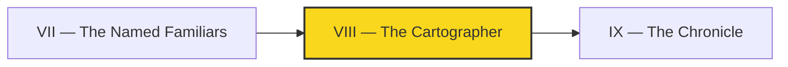

*The bug bites at midnight. A page renders sideways, a build fails on a config you never touched, and your first instinct is to reach for a patch — a little override here, a `!important` there, a workaround buried in your own repo. But the Cartographer pauses. She asks a sharper question: is this **my** land, or the **continent** I'm standing on? Because if the fault lies in the bedrock — the shared theme, the platform everyone builds on — then patching your own corner just hides the crack while everyone else keeps falling through it.*

*The real-world skill you forge here is **triage and stewardship**: telling a product bug from a platform bug, resisting the easy local hack, and filing a clean, maintainer-ready issue upstream so the fix lands once and helps everyone.*

## 📖 The Legend Behind This Quest

In the Autonomous Realm, your website is a city, and the city is built on the shared bedrock of the `bamr87/zer0-mistakes` theme — the platform every IT-Journey site stands upon. When a fault appears, a junior builder slaps a tarp over their own roof and calls it done. The Cartographer draws a map instead: she marks exactly where the fault line runs, proves it isn't her construction, and carries that map to the people who own the bedrock. A good upstream issue is a map a stranger can follow without you in the room — and that map is the most valuable contribution a thin product can make.

## 🎯 Quest Objectives

### Primary Objectives

- [ ] Distinguish a **product bug** (your repo's content/config) from a **platform bug** (the upstream theme/dependency) using a reproducible test
- [ ] Reproduce the platform bug in isolation, removing your repo's customizations as variables
- [ ] Write a **maintainer-ready** upstream issue with title, repro steps, expected vs. actual, and environment
- [ ] Choose deliberately between filing an issue, opening an upstream PR, or a temporary local workaround — and document the choice

### Mastery Indicators

- [ ] You can explain why patching around a platform bug in your own repo accrues hidden debt
- [ ] Your upstream issue is actionable by a maintainer who has never seen your project
- [ ] You leave a tracking note in your repo linking back to the upstream issue

## 🗺️ Quest Prerequisites

Before you draw your first fault line, make sure your pack is stocked:

- **Prior chapter:** Complete [Chapter VII — The Named Familiars](/quests/1101/self-operating-website-07-the-named-familiars/). This quest assumes you already have a working autonomous repo with named agents.
- **Tools:** Git, a text editor or IDE, and a local Ruby/Jekyll toolchain (`bundle exec jekyll build` must run) so you can reproduce builds. A terminal with Bash for the triage script.
- **Accounts:** A GitHub account and a repository you own. To file upstream you'll also need access to the upstream repo's issue tracker (for IT-Journey that's `bamr87/zer0-mistakes` — public, so you can open issues without special permissions).
- **Optional:** A Claude Code OAuth token if you want the agent steps to draft repro notes for you.

## 🧙‍♂️ Chapter 1: Reading the Fault Line — Product vs. Platform

### ⚔️ Skills You'll Forge

- Bisecting a bug down to its true owner
- Building a minimal reproduction that removes your repo as a suspect

A **product bug** lives in code *you* own: a typo in frontmatter, a broken Liquid include in your `pages/`, a misconfigured workflow in your `.github/`. A **platform bug** lives in something you *depend on*: the remote theme, a gem, a GitHub Action. The fix for the first is in your hands; the fix for the second belongs to a maintainer, and patching around it locally means you carry the workaround forever — and re-discover it every upgrade.

The decisive move is **isolation**. Strip away your customizations until only the platform remains. If the bug survives a clean reproduction, it's upstream. Here is a triage script that builds your site two ways — your full product, and a single minimal page against the bare theme — so you can compare BOTH builds and see which layer owns the fault:

```bash
#!/usr/bin/env bash
# triage.sh — does the bug live in MY repo or the THEME?
set -euo pipefail

echo "==> 1. Build with the full product (your repo as-is)"
bundle exec jekyll build --trace 2>&1 | tee build-product.log || true

echo "==> 2. Build a minimal page against the bare theme"
# NOTE: do NOT put the repro in a hidden .triage/ dir — Jekyll skips dotdirs
# by default, so the page would never build. Use a visible directory instead.
mkdir -p triage && cat > triage/min.md <<'EOF'
---
layout: default
title: Minimal Repro
permalink: /triage/min/
---
Just the theme. No custom includes, no custom CSS.
EOF
bundle exec jekyll build --trace 2>&1 | tee build-minimal.log || true

echo "==> 3. Compare: if the bug appears in BOTH, it is a PLATFORM bug."
echo "    If it only appears in build-product.log, it is a PRODUCT bug."
grep -iE 'error|warning' build-product.log build-minimal.log || echo "No errors in either build."
```

> If your build config (`_config.yml`) uses an `include:`/`exclude:` list that hides the `triage/` directory, add `triage` to `include:` so the minimal page is actually rendered. The point is the same: the minimal page must reach the build.

If the minimal page reproduces the failure, you've drawn the fault line: it runs through the bedrock, not your construction. Document the exact commit of the theme you're on (`remote_theme: bamr87/zer0-mistakes@<sha>`), because "it broke" without a version is a map with no coordinates.

**Finding the theme `<sha>`.** The remote theme is resolved to a specific commit at build time. To pin it precisely, you can:

- Run `bundle exec gem contents jekyll-remote-theme` to locate the gem and inspect what it fetched, then check the theme's working copy under your cache.
- Read your `Gemfile.lock` — it pins the gem versions involved in resolving the theme.
- Check the upstream theme repo's commit history (`bamr87/zer0-mistakes`) and record the commit your build pulled (the latest on the branch your `remote_theme:` points at, at build time).

Whichever route you take, capture a concrete commit SHA so your bug report names exact coordinates.

### 🔍 Knowledge Check

- [ ] Given a rendering bug, what is the first variable you remove to test whether your repo is at fault?
- [ ] Why is pinning the upstream theme's commit/version essential to a credible bug report?
- [ ] What hidden cost do you take on by patching a platform bug inside your own repo?

## 🧙‍♂️ Chapter 2: Drawing the Map — A Maintainer-Ready Upstream Issue

### ⚔️ Skills You'll Forge

- Structuring an issue a stranger can act on
- Choosing between issue, PR, and temporary workaround

A maintainer-ready issue is a contract: it gives the person who owns the bedrock everything they need to confirm and fix the fault without a single follow-up question. The structure that earns a fast fix is always the same: a precise **title**, **steps to reproduce**, **expected vs. actual**, **environment**, and a **minimal repro** they can paste. Vague reports rot in the backlog; mapped reports get merged.

Use a checklist so you never ship a half-drawn map. The block below is a **personal draft/checklist** — not a GitHub template file. It's a scratchpad you fill in, then paste the filled-in fields as Markdown into the upstream repo's "New issue" form:

```yaml
# upstream-issue-draft.yml — a PERSONAL checklist, not a GitHub template.
# Fill every field, then paste the values into the upstream "New issue" form.
title: "Custom permalink ignored when remote_theme layout overrides it"
labels: [bug, theme]
summary: >
  Pages using a custom permalink render at the theme's default path
  instead of the configured one.
steps_to_reproduce:
  - "Add `permalink: /custom/` to a page's frontmatter"
  - "Set `remote_theme: bamr87/zer0-mistakes@<sha>`"
  - "Run `bundle exec jekyll build`"
expected: "Page builds to /custom/index.html"
actual: "Page builds to the theme default path; /custom/ is empty"
environment:
  jekyll: "4.3.x"
  ruby: "3.2.x"
  theme_commit: "<sha>"
minimal_repro: "https://github.com/<you>/min-repro"
```

If you maintain a repo and want a *real* reusable issue form (the kind that lives in `.github/ISSUE_TEMPLATE/` and renders as a structured form), GitHub uses a different schema — a top-level `body:` list of typed fields. Here is the same bug report expressed as a valid GitHub issue-form template:

```yaml
# .github/ISSUE_TEMPLATE/platform-bug.yml — a real GitHub issue form
name: Platform bug report
description: Report a bug in the shared theme/platform
labels: [bug, theme]
body:
  - type: input
    id: title-summary
    attributes:
      label: Summary
      description: One-line description of the fault
    validations:
      required: true
  - type: textarea
    id: steps
    attributes:
      label: Steps to reproduce
      description: Numbered, copy-pasteable steps
      placeholder: |
        1. Add `permalink: /custom/` to a page's frontmatter
        2. Set the remote_theme to a pinned commit
        3. Run `bundle exec jekyll build`
    validations:
      required: true
  - type: textarea
    id: expected-actual
    attributes:
      label: Expected vs. actual
      placeholder: |
        Expected: Page builds to /custom/index.html
        Actual: Page builds to the theme default path; /custom/ is empty
    validations:
      required: true
  - type: textarea
    id: environment
    attributes:
      label: Environment
      placeholder: |
        Jekyll: 4.3.x
        Ruby: 3.2.x
        Theme commit: <sha>
    validations:
      required: true
```

**How to actually file it.** Go to the upstream repo's issue tracker (for IT-Journey: the `bamr87/zer0-mistakes` repo), click **New issue**, paste your drafted fields as Markdown into the body, set a clear title, and apply the `bug` and `theme` labels. That's the whole filing mechanic — a clean title, the pasted Markdown body, the right labels.

Then decide the **disposition** deliberately. Three honest paths: (1) **file an issue** when you've found the fault but a fix needs the maintainer's judgment; (2) **open an upstream PR** when you can fix it cleanly and a test proves it; (3) **temporary local workaround** only when you're blocked *and* you leave a tracking note that links the upstream issue, so the hack is removed the moment upstream lands. The Cartographer never lets a workaround go un-mapped.

Leave a breadcrumb in your own repo so future-you knows the debt exists and where it's tracked:

```bash
# Record the workaround AND its upstream tracking link.
git commit -m "fix: temp permalink override

Workaround for platform bug; remove when upstream lands.
Tracking: bamr87/zer0-mistakes#<n>"
```

If you wire the tracking note into an automated workflow that re-checks the upstream issue, you'll see GitHub Actions expression syntax like the block below. (The `raw`/`endraw` tags are Jekyll escapes for this site's renderer — omit them when you copy the YAML into your own `.github/workflows/`.)


```yaml
# .github/workflows/check-upstream.yml — reminder gate for a tracked workaround
name: Check upstream tracking
on:
  schedule:
    - cron: "0 9 * * 1"   # Monday mornings
jobs:
  remind:
    runs-on: ubuntu-latest
    steps:
      - name: Note the tracked issue
        run: echo "Workaround active; upstream tracked at ${{ env.UPSTREAM_ISSUE }}"
        env:
          UPSTREAM_ISSUE: bamr87/zer0-mistakes#NN
```


### 🔍 Knowledge Check

- [ ] What five fields make an upstream issue actionable without a follow-up question?
- [ ] When is opening an upstream PR the right disposition instead of just filing an issue?
- [ ] If you must apply a local workaround, what one thing must the commit message contain?

## 🔁 Reproduce It

Every chapter of this campaign is anchored to a real merged branch. The triage-and-upstream discipline you just practiced is exactly the pattern used in the lifehacker.dev build:

- **`bamr87/lifehacker.dev#42`** (`bamr87/lifehacker.dev@5853ef43b`) — kept the product thin by routing a platform-level fault to the shared theme instead of burying a one-off patch in the product repo, modeling the product-vs-platform triage this chapter teaches.

## 🎮 Mastery Challenge

**Objective:** Take one real failure in your own site, prove which layer owns it, and produce a maintainer-ready artifact.

- [ ] Run an isolation/triage build that demonstrates whether the bug is product or platform
- [ ] Produce a complete upstream issue body (title, repro steps, expected vs. actual, environment, minimal repro) — file it if it's a real platform bug
- [ ] If you apply any local workaround, commit it with a message that links the upstream tracking issue

## 🎁 Rewards & Progression

- **Badge:** 🧭 Cartographer — filed a maintainer-ready upstream issue
- **Skills unlocked:** 🧭 Product-vs-platform triage · 🛠️ Maintainer-ready upstream issue filing
- **+60 XP**

## 🗺️ Quest Network



## 🔮 Next Adventures

- **Next chapter:** [IX — The Chronicle](/quests/1110/self-operating-website-09-the-chronicle/)
- **Campaign hub:** [The Self-Operating Website](/quests/codex/self-operating-website/)

## 📚 Resource Codex

- [GitHub Issues documentation](https://docs.github.com/en/issues) — how to file, label, and track issues
- [Syntax for issue forms](https://docs.github.com/en/communities/using-templates-to-encourage-useful-issues-and-pull-requests/syntax-for-githubs-form-schema) — the real `.github/ISSUE_TEMPLATE/` form schema
- [Creating a pull request from a fork](https://docs.github.com/en/pull-requests/collaborating-with-pull-requests/proposing-changes-to-your-work-with-pull-requests/creating-a-pull-request-from-a-fork) — for upstream contributions
- [Jekyll remote theme usage](https://jekyllrb.com/docs/themes/) — how themes layer over your site
- [Git Basics — recording changes](https://git-scm.com/book/en/v2/Git-Basics-Recording-Changes-to-the-Repository) — commit hygiene for tracking notes

## 🕸️ Knowledge Graph

*Structured wiki-links connect this quest to the IT-Journey knowledge graph. Open the [Obsidian Graph View](/notes/obsidian/graph/) to explore connections.*

**Campaign hub:** [[Epic Quest: The Self-Operating Website]] **Previous:** [[The Named Familiars]] **Next:** [[The Chronicle]] **Obsidian docs:** [[Obsidian Knowledge Graph and Wiki Links]]
