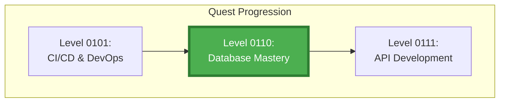
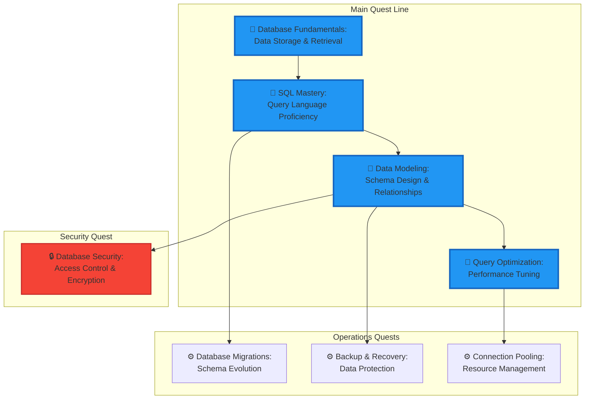

---

title: Level 0110 (6) - Database Mastery
description: Master the arts of data storage, retrieval, and management through SQL sorcery and NoSQL adventures
preview: images/previews/level-0110-database-mastery.png
permalink: /quests/0110/
categories:
  - Quests
  - Level-0110
  - Data-Engineering
tags:
  - lvl-0110
  - databases
  - sql
  - nosql
  - data-modeling
  - quest-collection
lastmod: 2025-12-20
toc: true
toc_sticky: true
draft: false

level: 0110
---

# Level 0110 (6) - Database Mastery

*Deep within the Data Vaults of the Digital Realm lies ancient knowledge of data persistence and retrieval. Here, brave adventurers learn the sacred arts of SQL sorcery, master the flexible powers of NoSQL databases, and discover the secrets of efficient data storage that power the world's greatest applications.*

## 🎯 Level Overview

**Theme**: Data Engineering | **XP Range**: 600-800 | **Tier**: Journeyman ⚔️

Database mastery represents a critical milestone in any IT journey. This level transforms adventurers from simple data consumers into skilled data architects capable of designing, optimizing, and securing the data systems that underpin modern applications.

You'll master both relational (SQL) and non-relational (NoSQL) paradigms, understanding when to apply each approach. From crafting elegant queries to designing normalized schemas, from implementing backup strategies to optimizing query performance—this level provides the complete toolkit for professional data management.

### Level Positioning in Quest Network

## 🎓 Core Learning Objectives

By completing this level, adventurers will master:

### Knowledge Objectives
- [ ] **Relational Database Theory** - Understanding normalization, ACID properties, and relational algebra
- [ ] **NoSQL Paradigms** - Document, key-value, column-family, and graph database concepts
- [ ] **Data Modeling** - Entity-relationship design and schema optimization principles

### Skill Objectives
- [ ] **SQL Proficiency** - Complex queries, joins, subqueries, and stored procedures
- [ ] **Database Administration** - Backup, recovery, migration, and performance tuning
- [ ] **Security Implementation** - Access control, encryption, and injection prevention

### Application Objectives
- [ ] **Schema Design** - Design and implement production-ready database schemas
- [ ] **Query Optimization** - Profile and optimize slow queries for performance
- [ ] **Integration Patterns** - Connect databases to applications using ORMs and drivers

## 🗺️ Level Quest Map

## 📚 Quest Inventory

### Main Quests (Required)

| Quest | Difficulty | Time | XP | Status |
|-------|-----------|------|-----|--------|
| [Database Fundamentals](database-fundamentals.md) | 🔴 Hard | 90-120 min | 150 | 📋 Placeholder |
| [SQL Mastery](sql-mastery.md) | 🔴 Hard | 90-120 min | 150 | 📋 Placeholder |
| [Data Modeling](data-modeling.md) | 🔴 Hard | 90-120 min | 150 | 📋 Placeholder |
| [Query Optimization](query-optimization.md) | 🔴 Hard | 90-120 min | 150 | 📋 Placeholder |

### Operations Quests

| Quest | Difficulty | Time | XP | Status |
|-------|-----------|------|-----|--------|
| [Database Migrations](database-migrations.md) | 🔴 Hard | 75-90 min | 120 | 📋 Placeholder |
| [Backup & Recovery](backup-recovery.md) | 🔴 Hard | 75-90 min | 120 | 📋 Placeholder |
| [Connection Pooling](connection-pooling.md) | 🔴 Hard | 60-75 min | 100 | 📋 Placeholder |

### Security Quest

| Quest | Difficulty | Time | XP | Status |
|-------|-----------|------|-----|--------|
| [Database Security](database-security.md) | 🔴 Hard | 90-120 min | 150 | 📋 Placeholder |

## 🛠️ Required Tools & Technologies

### Database Systems
- **PostgreSQL** - Primary relational database for learning
- **SQLite** - Lightweight database for development
- **MongoDB** - Document database fundamentals
- **Redis** - Key-value store and caching

### Development Tools
- **DBeaver/pgAdmin** - Database GUI management
- **SQL Clients** - Command-line query tools
- **Migration Tools** - Flyway, Alembic, or similar

### Languages & ORMs
- **SQL** - Standard query language
- **Python + SQLAlchemy** - ORM examples
- **Node.js + Prisma** - Modern ORM patterns

## 📋 Prerequisites

Before beginning this level, ensure completion of:

- ✅ **Level 0101** - CI/CD & DevOps fundamentals
- ✅ **Level 0100** - Container basics for database deployment
- ✅ **Level 0010** - Terminal proficiency for CLI tools
- ✅ Basic programming knowledge in Python or JavaScript

## 🏆 Level Completion Rewards

Upon completing all main quests:

- 🎖️ **Title**: Database Guardian
- ⚔️ **Skill Unlock**: Advanced data architecture
- 🔓 **Next Level**: API Development (0111)
- 📜 **Certificate**: Database Engineering Fundamentals

## 🔗 Related Resources

- [PostgreSQL Documentation](https://www.postgresql.org/docs/)
- [MongoDB University](https://university.mongodb.com/)
- [SQL Tutorial - W3Schools](https://www.w3schools.com/sql/)
- [Database Design Patterns](https://www.postgresql.org/docs/current/ddl.html)

---

**Level Status**: 📋 Placeholder quests generated | **Quests**: 8 | **Est. Time**: 10-14 hours

## Available Quests

| Quest | Difficulty | Time | Type | Status |
|-------|------------|------|------|--------|
| [Backup and Recovery: Data Protection Strategies for Databases](/quests/level-0110-backup-recovery/) | 🔴 Hard | 60-75 minutes | main_quest | 🔮 Placeholder |
| [Connection Pooling: Efficient Database Resource Management](/quests/level-0110-connection-pooling/) | 🔴 Hard | 45-60 minutes | main_quest | 🔮 Placeholder |
| [Data Modeling: Schema Design and Database Relationships](/quests/level-0110-data-modeling/) | 🔴 Hard | 75-90 minutes | main_quest | 🔮 Placeholder |
| [Database Fundamentals: Data Storage and Retrieval](/quests/level-0110-database-fundamentals/) | 🔴 Hard | 90-120 minutes | main_quest | 🔮 Placeholder |
| [Database Migrations: Schema Evolution and Version Control](/quests/level-0110-database-migrations/) | 🔴 Hard | 60-75 minutes | main_quest | 🔮 Placeholder |
| [Database Security: Access Control and Data Encryption](/quests/level-0110-database-security/) | 🔴 Hard | 75-90 minutes | main_quest | 🔮 Placeholder |
| [Query Optimization: Performance Tuning for Fast Database Queries](/quests/level-0110-query-optimization/) | 🔴 Hard | 75-90 minutes | main_quest | 🔮 Placeholder |
| [SQL Mastery: Query Language Proficiency for Data Professionals](/quests/level-0110-sql-mastery/) | 🔴 Hard | 90-120 minutes | main_quest | 🔮 Placeholder |

