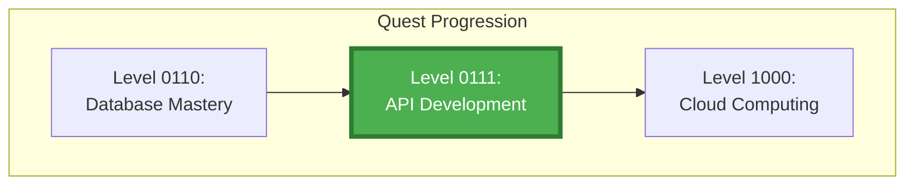
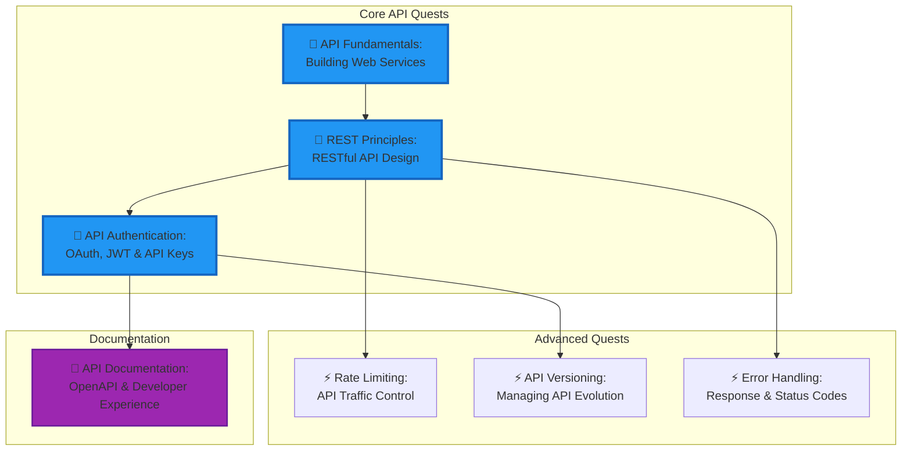

---

title: Level 0111 (7) - API Development
description: Master the craft of building robust, secure, and well-documented APIs that power modern applications
preview: images/previews/level-0111-api-development.png
permalink: /quests/0111/
categories:
  - Quests
  - Level-0111
  - Backend-Development
tags:
  - lvl-0111
  - api
  - rest
  - authentication
  - backend
  - quest-collection
lastmod: 2025-12-20
toc: true
toc_sticky: true
draft: false

layout: quest-collection
level: 0111
---

# Level 0111 (7) - API Development

*At the crossroads of the Digital Realm stand the great API Gateways—magical interfaces that allow disparate systems to communicate in harmony. Here, adventurers learn the ancient protocols of REST, master the arcane arts of authentication, and forge the secure bridges that connect the modern digital world.*

## 🎯 Level Overview

**Theme**: Backend Development | **XP Range**: 700-900 | **Tier**: Journeyman ⚔️

API development represents the culmination of the Journeyman tier, bringing together skills from previous levels into the practical craft of building web services. This level teaches you to create APIs that are not just functional, but elegant, secure, and well-documented.

From understanding RESTful principles to implementing OAuth authentication, from designing proper error responses to managing API versioning—you'll gain the complete skillset needed to build production-grade APIs that power mobile apps, web frontends, and third-party integrations.

### Level Positioning in Quest Network

## 🎓 Core Learning Objectives

By completing this level, adventurers will master:

### Knowledge Objectives
- [ ] **REST Architecture** - Understanding RESTful design principles and constraints
- [ ] **API Security** - OAuth 2.0, JWT, API keys, and security best practices
- [ ] **HTTP Protocol** - Methods, status codes, headers, and content negotiation

### Skill Objectives
- [ ] **API Design** - Create intuitive, consistent, and developer-friendly APIs
- [ ] **Authentication Implementation** - Secure endpoints with modern auth patterns
- [ ] **Documentation** - Generate comprehensive API docs with OpenAPI/Swagger

### Application Objectives
- [ ] **Production APIs** - Build and deploy real-world API services
- [ ] **Error Handling** - Implement graceful error responses and logging
- [ ] **Performance** - Apply rate limiting, caching, and optimization

## 🗺️ Level Quest Map

## 📚 Quest Inventory

### Core API Quests (Required)

| Quest | Difficulty | Time | XP | Status |
|-------|-----------|------|-----|--------|
| [API Fundamentals](api-fundamentals.md) | 🔴 Hard | 75-90 min | 140 | 📋 Placeholder |
| [REST Principles](rest-principles.md) | 🔴 Hard | 75-90 min | 140 | 📋 Placeholder |
| [API Authentication](api-authentication.md) | 🔴 Hard | 90-120 min | 160 | 📋 Placeholder |

### Advanced Quests

| Quest | Difficulty | Time | XP | Status |
|-------|-----------|------|-----|--------|
| [Rate Limiting](rate-limiting.md) | 🔴 Hard | 60-75 min | 100 | 📋 Placeholder |
| [API Versioning](api-versioning.md) | 🔴 Hard | 60-75 min | 100 | 📋 Placeholder |
| [Error Handling](error-handling.md) | 🔴 Hard | 60-75 min | 100 | 📋 Placeholder |

### Documentation Quest

| Quest | Difficulty | Time | XP | Status |
|-------|-----------|------|-----|--------|
| [API Documentation](api-documentation.md) | 🔴 Hard | 75-90 min | 120 | 📋 Placeholder |

## 🛠️ Required Tools & Technologies

### Frameworks
- **Express.js** (Node.js) - Lightweight API framework
- **FastAPI** (Python) - Modern, fast Python framework
- **Flask** (Python) - Micro web framework

### API Tools
- **Postman/Insomnia** - API testing and documentation
- **Swagger/OpenAPI** - API specification and documentation
- **curl** - Command-line HTTP client

### Security Tools
- **JWT Libraries** - Token generation and validation
- **OAuth Libraries** - OAuth 2.0 implementation
- **Helmet.js** - Security headers middleware

### Testing
- **Jest/Pytest** - Unit and integration testing
- **Supertest** - HTTP assertion library
- **Newman** - Postman collection runner

## 📋 Prerequisites

Before beginning this level, ensure completion of:

- ✅ **Level 0110** - Database fundamentals for data persistence
- ✅ **Level 0101** - CI/CD for deployment pipelines
- ✅ **Level 0100** - Container basics for API deployment
- ✅ Basic understanding of HTTP and web concepts

## 🏆 Level Completion Rewards

Upon completing all core quests:

- 🎖️ **Title**: API Architect
- ⚔️ **Skill Unlock**: Full-stack integration capability
- 🔓 **Next Level**: Cloud Computing (1000)
- 📜 **Certificate**: API Development Fundamentals

## 🔗 Related Resources

- [REST API Tutorial](https://restfulapi.net/)
- [OpenAPI Specification](https://swagger.io/specification/)
- [OAuth 2.0 Simplified](https://oauth.net/2/)
- [HTTP Status Codes](https://httpstatuses.com/)

---

**Level Status**: 📋 Placeholder quests generated | **Quests**: 7 | **Est. Time**: 8-10 hours

## Available Quests

| Quest | Difficulty | Time | Type | Status |
|-------|------------|------|------|--------|
| [API Authentication: OAuth, JWT, and API Keys Implementation](/quests/level-0111-api-authentication/) | 🔴 Hard | 90-120 minutes | main_quest | 🔮 Placeholder |
| [API Documentation: OpenAPI Specification and Developer Experience](/quests/level-0111-api-documentation/) | 🔴 Hard | 60-75 minutes | main_quest | 🔮 Placeholder |
| [API Fundamentals: Building Web Services and HTTP APIs](/quests/level-0111-api-fundamentals/) | 🔴 Hard | 90-120 minutes | main_quest | 🔮 Placeholder |
| [API Versioning: Managing API Evolution and Backwards Compatibility](/quests/level-0111-api-versioning/) | 🔴 Hard | 60-75 minutes | main_quest | 🔮 Placeholder |
| [Error Handling: API Response Patterns and HTTP Status Codes](/quests/level-0111-error-handling/) | 🔴 Hard | 45-60 minutes | main_quest | 🔮 Placeholder |
| [Rate Limiting: API Traffic Control and Throttling Strategies](/quests/level-0111-rate-limiting/) | 🔴 Hard | 60-75 minutes | main_quest | 🔮 Placeholder |
| [REST Principles: RESTful API Design Best Practices](/quests/level-0111-rest-principles/) | 🔴 Hard | 75-90 minutes | main_quest | 🔮 Placeholder |

