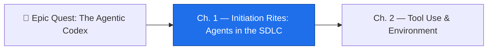

*The realm has summoned its first familiars — tireless constructs that read your code, draft your changes, and stand ready at the gate. But a familiar without a leash is a liability. Loose one with the keys to the whole castle and no record of where it walked, and the first night it errs you will have no torch to follow its steps. The Initiation Rites teach the oldest discipline of the agentic order: give every familiar a **bound** — a door it enters, rooms it may touch, a task it knows is finished, and a trail of footprints anyone can read.*

*Behind the spellcraft is the most-tested idea in GH-600 Domain 1 (18% of the exam): an agent is most useful and least dangerous when it has a **bounded role** in the software development lifecycle. You will design where Copilot's coding agent enters the SDLC, separate the act of **planning** from the act of **doing** with a human-approved gate, and make every agent run leave an **observable trace**. These are not three tricks — they are the contract that lets autonomy scale without becoming a runaway machine.*

## 📖 The Legend Behind This Quest

When developers first meet GitHub Copilot, they meet an autocomplete: the model suggests, the human accepts or rejects, and the human is always in control. The agent's role is narrow by construction. The certification covers a far more expansive vision — agents that operate **across the entire SDLC**, taking on planning, implementation, testing, review, and even deployment tasks with minimal moment-to-moment supervision.

That is a qualitative shift, not a bigger autocomplete. It changes how teams think about code ownership, how workflows are designed, and how risk is managed. The classic failure of early agentic SDLC designs is the agent that **does too much**: given write access to the whole repository, no structured success criteria, and no logging. When it fails — or quietly produces unintended results — there is no way to understand *why*. Domain 1 exists to test whether you can prevent that: bound the agent's role, split planning from action, and make the whole thing observable. Master these rites and every later domain — tools, memory, evaluation, orchestration, guardrails — has a stable foundation to stand on.

## 🎯 Quest Objectives

By the end of this chapter you will have designed and reasoned through:

### Primary Objectives (Required for Completion)
- [ ] **A bounded-agent design** — define an agent's entry point, file scope, exit condition, and observable trace
- [ ] **Inputs, outputs, and success criteria** — write the contract for one concrete SDLC agent task
- [ ] **A plan-then-act workflow** — a planning job and an execution job separated by a human approval gate
- [ ] **An observable run** — structured JSONL logs plus a workflow step summary an auditor can read without re-running anything

### Mastery Indicators
You will know you have mastered this chapter when you can:
- [ ] Name the four properties of a bounded agent and recognise the "does too much" anti-pattern on sight
- [ ] Explain why the *planning phase* and the *action phase* are distinct, separated concerns (sub-skill 1.2)
- [ ] Choose the **least-privilege** `permissions:` block for an agent that opens a pull request
- [ ] Decide where a human gate belongs *without* slowing delivery for low-risk actions (sub-skill 1.3)

## 🗺️ Quest Prerequisites

This is the first chapter of **The Agentic Codex**, so there is no prior chapter to clear — but you do need a working bench:

- **A GitHub account with Copilot access** — the coding agent and Copilot Chat are the familiars you will reason about.
- **A repository you own with Actions enabled** — Settings → Actions → General → allow workflows to run.
- **Comfort with Git branches, commits, and pull requests** — agents act *through* PRs, so this is the medium you will gate.
- **Basic GitHub Actions familiarity** — you can read a workflow YAML and know where `.github/workflows/` lives.
- **Recommended:** start at the campaign hub, [Epic Quest: The Agentic Codex](/quests/codex/agentic-codex/), so the six-domain map is in view before you begin Domain 1.

## 🧙‍♂️ Rite One: The Bound — Four Walls Around a Familiar

### ⚔️ Skills You'll Forge

- Stating the **four properties** every bounded agent must have
- Recognising and mitigating the "does too much" anti-pattern
- Writing **inputs, outputs, and success criteria** as the agent's task contract

The first rite draws the boundary. The key insight of Domain 1 is **bounded agency**: an agent is most useful and least dangerous when it has four walls.

1. **A defined entry point** — it activates on a specific trigger: an issue label, a workflow event, a schedule, or an `@`-mention. It does not wake on its own whim.
2. **A scoped file-system access** — it may touch specific directories, not the entire repo. The blast radius is bounded *before* it runs.
3. **A clear exit condition** — it knows when it is done, and what *done* looks like. No open-ended "keep improving."
4. **An observable trace** — every action is logged with enough context to reconstruct what happened, after the fact, without re-running it.

The anti-pattern Domain 1 hammers on is the agent that **does too much**: full-repo write access, no success criteria, no logs. The fix is not "trust it less" — it is to *write the bound down*. For the GitHub Copilot **coding agent**, you do that with three artifacts working together:

- **The task** comes from a GitHub issue you assign to Copilot (or invoke from Copilot Chat). The issue body *is* the agent's brief — inputs and success criteria belong there.
- **The scope** is enforced by repository custom instructions in `.github/copilot-instructions.md` plus what the agent is allowed to do in its sandbox.
- **The output** is a pull request — a reviewable, revertable artifact, never a direct push to `main`.

Write the contract explicitly. A good agent task names its inputs, its expected output, and the criteria that make the result acceptable:

```yaml
# A bounded-agent task contract (paste the body into a Copilot-assigned issue)
task: "Add input validation to the /signup endpoint"
inputs:
  - file: src/routes/signup.ts          # the only file in scope
  - spec: "reject empty email or password < 8 chars with HTTP 400"
outputs:
  - a pull request from a feature branch (never a push to main)
  - a unit test proving the rejection path
success_criteria:
  - "npm test" passes
  - no edits outside src/routes/signup.ts and its test file
exit_condition: "PR opened, checks green, awaiting human review"
```

Pair that with repository custom instructions so the agent inherits a standing bound on *every* task it ever runs:

```markdown
<!-- .github/copilot-instructions.md -->
- Open changes as a pull request from a branch; never commit to `main`.
- Touch only the files named in the issue. Do not refactor unrelated code.
- Every change ships with a test. If you cannot test it, say so and stop.
- If the task is ambiguous, write a comment asking for clarification — do not guess.
```

The lesson of Rite One: the bound is **data you write before the agent runs**, not a hope you hold while it runs.

### 🔍 Knowledge Check

- [ ] What are the four properties of a bounded agent, and which one prevents an unbounded blast radius?
- [ ] Why is a pull request a safer agent **output** than a direct commit to `main`?
- [ ] An agent keeps refactoring files no one asked it to touch. Which bound is missing, and where do you add it?

## 🧙‍♂️ Rite Two: The Two Sigils — Plan, Then Act

### ⚔️ Skills You'll Forge

- Separating an agent's **planning phase** from its **execution phase**
- Producing a structured, reviewable **plan artifact**
- Gating execution behind an **environment** approval so action waits for a human

The second rite is the heart of sub-skill 1.2, and the single most-tested pattern in Domain 1: **plan-then-execute**. Two phases, deliberately separated.

1. **Phase 1 — Plan.** The agent reads the task, analyses the codebase, and produces a *written plan*. No file changes. No execution. Just a document describing what it intends to do and why.
2. **Phase 2 — Execute.** *After a human approves the plan*, the agent implements exactly what it planned.

This maps cleanly onto GitHub Actions: two **jobs**, with an `environment:` gate between them. The environment carries a **required reviewer**, so the execution job cannot start until a human clicks *Approve*. Velocity is preserved for the cheap half (planning runs freely) while judgement is inserted exactly where it matters (before anything is written).


```yaml
# .github/workflows/plan-then-act.yml
name: Plan-then-Act Agent
on:
  issues:
    types: [labeled]          # entry point: a specific label, not "any issue"
permissions:
  contents: write             # needs to push a branch to open a PR
  pull-requests: write        # ...and open the PR itself
  issues: read

jobs:
  plan:
    if: github.event.label.name == 'agent-task'
    runs-on: ubuntu-latest
    steps:
      - uses: actions/checkout@v4
      - name: Produce a structured plan (no code changes)
        run: |
          # The agent writes plan.json describing intended edits.
          # This job NEVER touches source files — it only plans.
          echo "Plan generated and uploaded as an artifact for review."
      - uses: actions/upload-artifact@v4
        with:
          name: agent-plan
          path: plan.json

  execute:
    needs: plan
    runs-on: ubuntu-latest
    environment:
      name: agent-approval     # <-- the gate: requires a human reviewer
    steps:
      - uses: actions/checkout@v4
      - name: Implement the approved plan
        run: |
          # Runs ONLY after a reviewer approves the 'agent-approval' environment.
          echo "Applying the approved plan and opening a pull request."
```


The gate is configured outside the YAML: **Settings → Environments → New environment → `agent-approval`**, then add yourself (or a CODEOWNER) under **Required reviewers**. Now the `execute` job sits in a *Waiting* state until someone approves — exactly the "prevent agent action until checked and approved" sub-skill the exam asks about.

Two details the exam loves:

- A valid plan artifact is **structured** (`plan.json`, a Markdown checklist) so it can be *validated* — diffed against the request, scanned for out-of-scope files — not just skimmed.
- The `permissions:` block is **least-privilege**: this agent opens a PR, so it needs `contents: write` and `pull-requests: write` and nothing more. It does **not** get `actions: write`, `admin`, or `id-token` it has no use for. On the exam, the right answer is almost always the *narrowest* block that still lets the agent do its one job.

### 🔍 Knowledge Check

- [ ] In the plan-then-act pattern, what is the agent *forbidden* from doing during Phase 1?
- [ ] Which GitHub Actions feature inserts the human-approval gate between the two jobs?
- [ ] Which `permissions:` keys does an agent that only opens a PR actually need — and which common ones should it *not* have?

## 🧙‍♂️ Rite Three: The All-Seeing Eye — Observability Without Re-Running

### ⚔️ Skills You'll Forge

- Emitting **structured** (JSON/JSONL) log entries for every significant action
- Recording **input state** and **output state** at each step
- Producing inspectable artifacts inside standard tooling — so a human can audit without re-running

The third rite is sub-skill 1.3: **observability and control**. An agent you cannot watch is an agent you cannot trust to scale. An observable agent workflow does three things:

- Emits **structured log entries** (JSONL preferred) for every significant action — one line, one event, machine-parseable.
- Records both the **input state** and the **output state** of each step, so you can see what it saw and what it changed.
- Reports **success or failure, and why**, in a way a human can inspect *without re-running the workflow*.

The cheapest place to surface this is the GitHub Actions **step summary** (`$GITHUB_STEP_SUMMARY`) for the human-readable view, plus a committed JSONL trace for the machine-readable audit log. Together they give you a glance and a forensic record.

```bash
#!/usr/bin/env bash
# scripts/agent-trace.sh — emit a structured trace line + a human summary
set -euo pipefail

action="$1"        # e.g. "edit-file"
target="$2"        # e.g. "src/routes/signup.ts"
result="$3"        # "ok" | "fail"

# 1) Machine-readable JSONL: one event per line, appended to a committed log.
printf '{"ts":"%s","action":"%s","target":"%s","result":"%s"}\n' \
  "$(date -u +%FT%TZ)" "$action" "$target" "$result" \
  >> .agent/trace.jsonl

# 2) Human-readable: a row in the Actions run summary, no re-run required.
{
  echo "### Agent action: \`$action\`"
  echo "- target: \`$target\`"
  echo "- result: **$result**"
} >> "$GITHUB_STEP_SUMMARY"
```

Wire it into the workflow so every meaningful step narrates itself:


```yaml
      - name: Apply edit (observed)
        run: |
          # ...the agent edits the scoped file...
          ./scripts/agent-trace.sh edit-file src/routes/signup.ts ok
      - name: Run tests (observed)
        run: |
          if npm test; then
            ./scripts/agent-trace.sh run-tests project ok
          else
            ./scripts/agent-trace.sh run-tests project fail
            exit 1            # fail loudly — a silent failure is the worst trace of all
          fi
```


Now the **degree of autonomy** is a dial you control: the JSONL trail is the evidence, the step summary is the dashboard, and the environment gate from Rite Two is the brake. Crucially, observability lets you keep the human gate *small* — you can let low-risk, fully-traced actions flow freely and reserve approval for the irreversible ones, which is precisely the "human intervention without slowing delivery" the exam rewards. For the full agent-observability build — workflow step summaries plus committed JSONL traces — continue into **The All-Seeing Eye** in the next section.

### 🔍 Knowledge Check

- [ ] Why is a JSONL trace more useful to an auditor than free-text log lines?
- [ ] What two artifacts let a reviewer understand an agent run *without re-running* the workflow?
- [ ] How does good observability let you *shrink* the set of actions that need a human approval gate?

## ⚔️ The Quests of This Domain

Domain 1 splits into three playable quests — one per sub-skill. Clear all three to complete the Initiation Rites:

- 🎯 **[Initiation Rites: Embedding Agents in the SDLC](/quests/0111/agentic-sdlc-integration/)** — sub-skill 1.1: integrate agents into the SDLC, identify and mitigate anti-patterns, and define inputs, outputs, and success criteria for an agent task.
- 🎯 **[The Three Sigils: Plan, Reason, Act](/quests/0111/agentic-plan-vs-action-boundaries/)** — sub-skill 1.2: separate planning from execution, output a structured plan, validate it, and block action until it is checked and approved.
- 🎯 **[The All-Seeing Eye: Observability for AI Agents](/quests/1000/agentic-observability-and-control/)** — sub-skill 1.3: configure autonomy and guardrails, produce inspectable artifacts in standard tooling, and add human intervention without slowing delivery.

## 🎮 Mastery Challenge

**Objective:** Embed one bounded agent into your own repository and prove the gate holds.

- [ ] In a repo you own, create a GitHub issue that states a single small task with explicit **inputs, outputs, and success criteria** (use the contract from Rite One)
- [ ] Add a `.github/copilot-instructions.md` that bounds the agent to PR-only changes within named files
- [ ] Configure a `plan-then-act` workflow with a `plan` job and an `execute` job separated by an `agent-approval` **environment** that requires a reviewer
- [ ] Trigger a run, confirm the `execute` job sits in *Waiting* until you approve, then approve and watch it proceed
- [ ] Confirm the run leaves an observable trace: a JSONL line per action **and** a readable step summary you can audit without re-running

Pass all five and you have demonstrated every Domain 1 sub-skill end-to-end.

## 🎁 Rewards & Progression

- 🜂 **Initiate of the SDLC** — you embedded your first bounded agent with a written contract
- 🔍 **The Observer** — you made an agent workflow inspectable without a re-run
- 🛠️ **Skill unlocked:** Bounded-agent architecture across the SDLC
- 🧭 **Skill unlocked:** Plan-then-act approval gates in GitHub Actions
- 👁️ **Skill unlocked:** Observability for autonomous workflows
- **+60 XP** toward The Agentic Codex

## 🗺️ Quest Network



## 🔮 Next Adventures

The familiars now know their bounds, wait at the gate, and leave footprints. Next, you arm them: the tools they may wield, the MCP servers they may reach, and the environments they may enter.

- ➡️ **Next chapter:** [Chapter 2 — Tool Use & Environment](/quests/1000/agentic-codex-02-tool-use-and-environment/)
- 👑 **Campaign hub:** [Epic Quest: The Agentic Codex](/quests/codex/agentic-codex/)
- 📜 **Go deeper on Domain 1:** play the three domain quests above in order.

## 📚 Resource Codex

- [GH-600 study guide (Microsoft Learn)](https://learn.microsoft.com/en-us/credentials/certifications/resources/study-guides/gh-600) — the official skills-measured outline for every domain
- [GitHub Copilot coding agent](https://docs.github.com/en/copilot/using-github-copilot/coding-agent) — assigning issues to the agent and reviewing its PRs
- [Repository custom instructions for Copilot](https://docs.github.com/en/copilot/customizing-copilot/adding-repository-custom-instructions-for-github-copilot) — bounding the agent with `.github/copilot-instructions.md`
- [Model Context Protocol (MCP)](https://modelcontextprotocol.io/) — the tool-and-context standard you arm agents with in Chapter 2
- [GitHub Actions: environments & required reviewers](https://docs.github.com/en/actions/deployment/targeting-different-environments/using-environments-for-deployment) — the human-approval gate behind plan-then-act
- [Workflow commands: job summaries](https://docs.github.com/en/actions/using-workflows/workflow-commands-for-github-actions#adding-a-job-summary) — `$GITHUB_STEP_SUMMARY` for inspectable agent traces

## 🕸️ Knowledge Graph

*Structured wiki-links connect this quest to the IT-Journey knowledge graph. Open the [Obsidian Graph View](/notes/obsidian/graph/) to explore connections.*

**Campaign hub:** [[Epic Quest: The Agentic Codex]]
**Previous:** none — first chapter of the Codex
**Next:** [[Tool Use & Environment]]
**Domain 1 quests:** [[Initiation Rites: Embedding Agents in the SDLC]] · [[The Three Sigils: Plan, Reason, Act]] · [[The All-Seeing Eye: Observability for AI Agents]]
**Obsidian docs:** [[Obsidian Knowledge Graph and Wiki Links]]
