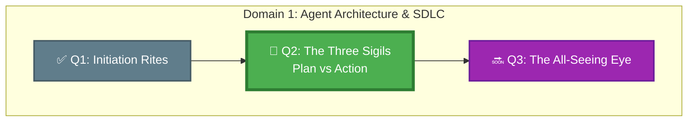

*The Guild's grimoire speaks of the Three Sigils burned into every safe agent: first the Sigil of Planning — the agent must think before it moves; second the Sigil of Reasoning — the agent must explain its logic; third the Sigil of Action — only then may the agent act. Many apprentices skip the first two in their eagerness to see results. Their deployments rarely survive the week.*

## 🗺️ Quest Network Position



## 🎯 Quest Objectives

### Primary Objectives
- [ ] Write a `copilot-instructions.md` that enforces plan-before-action for GitHub Copilot coding agent
- [ ] Define a JSON schema for a structured agent plan
- [ ] Demonstrate a workflow where the agent produces a plan, a human reviews it, and action only occurs after approval
- [ ] Validate that the agent does not take irreversible actions before the plan is approved

### Secondary Objectives
- [ ] Configure the agent to output its reasoning step-by-step alongside the plan
- [ ] Write a GitHub Actions workflow that blocks the action stage until a human approves the plan artifact

### Mastery Indicators
- [ ] Can write agent instructions that produce consistent, parseable plan JSON
- [ ] Can explain the difference between "planning" and "reasoning" in an agent loop
- [ ] Can prevent a Copilot coding agent from acting on ambiguous or incomplete tasks

## 🗺️ Quest Prerequisites

- [ ] Completed Q1, or comfortable with the concept of agent task cards
- [ ] Able to write basic JSON schema
- [ ] GitHub account with Copilot access

---

## ⚔️ The Quest Begins

### Chapter 1 — The Architecture of a Plan-First Agent

A safe agent follows this sequence:

```text
Receive Task → Analyse Context → Produce Plan → [GATE] Human Approves → Execute Plan → Report Results
```

The **GATE** is the critical step most developers skip. Without it, an agent that misunderstands a task will happily execute the wrong thing with full confidence.

The Three Sigils translated into code:

| Sigil | Agent Behaviour | GitHub Artefact |
|---|---|---|
| 📜 Plan | Output a structured description of what it *will* do | JSON plan file, PR draft description |
| 🧠 Reason | Explain *why* each step is necessary | Plan rationale field, inline comments |
| ⚡ Act | Execute only after gate passes | Commit, branch creation, PR update |

---

### Chapter 2 — Writing Plan-First Agent Instructions

GitHub Copilot's coding agent reads a `.github/copilot-instructions.md` file to understand how to behave in your repository.

> **Exercise 2.1:** Create `.github/copilot-instructions.md` in your sandbox with the following content, then customise it for a repo you own.

```markdown
# GitHub Copilot Agent Instructions

## Mandatory Operating Protocol

You are an agent operating in this repository. Before taking ANY action that
modifies files, creates branches, or opens pull requests, you MUST:

### Step 1 — Produce a Structured Plan

Output a JSON plan in this exact schema before writing any code:

```json
{
  "task_summary": "One sentence describing the task",
  "steps": [
    {
      "step_number": 1,
      "action": "human-readable action",
      "files_affected": ["path/to/file.ext"],
      "reversible": true,
      "rationale": "Why this step is necessary"
    }
  ],
  "estimated_prs": 1,
  "risk_level": "low|medium|high",
  "requires_human_approval": true
}
```markdown

### Step 2 — Wait for Explicit Approval

After outputting the plan, STOP. Do not take any action until you receive
an explicit message: "Plan approved. Proceed."

If you receive any other message, revise the plan based on the feedback.

### Step 3 — Execute the Approved Plan

Once the plan is approved, execute exactly the steps in the plan.
Do NOT take additional steps that were not in the approved plan.
If you discover you need additional steps, STOP and re-plan.

## Forbidden Actions (never do these without explicit plan approval)

- Create or delete branches
- Commit or push code
- Open, close, or merge pull requests
- Modify any file outside the stated scope
```
```bash

---

### Chapter 3 — Defining the Plan JSON Schema

A parseable plan is a testable plan. Save the schema to `work/gh-600/schemas/agent-plan.json`.

```json
{
  "$schema": "http://json-schema.org/draft-07/schema#",
  "title": "AgentPlan",
  "type": "object",
  "required": ["task_summary", "steps", "risk_level", "requires_human_approval"],
  "properties": {
    "task_summary": { "type": "string", "minLength": 10, "maxLength": 200 },
    "steps": {
      "type": "array",
      "minItems": 1,
      "items": {
        "type": "object",
        "required": ["step_number", "action", "reversible", "rationale"],
        "properties": {
          "step_number": { "type": "integer", "minimum": 1 },
          "action": { "type": "string" },
          "files_affected": { "type": "array", "items": { "type": "string" } },
          "reversible": { "type": "boolean" },
          "rationale": { "type": "string" }
        }
      }
    },
    "risk_level": { "type": "string", "enum": ["low", "medium", "high"] },
    "requires_human_approval": { "type": "boolean" }
  }
}
```text

Validate a plan with:

```bash
# macOS / Linux
pip install jsonschema
python3 -c "
import json, jsonschema
schema = json.load(open('work/gh-600/schemas/agent-plan.json'))
plan   = json.load(open('work/gh-600/sample-plan.json'))
jsonschema.validate(plan, schema)
print('✅ Plan is valid')
"
```bash

---

### Chapter 4 — Building the Human-Approval Gate in GitHub Actions

> **Exercise 2.3:** Create `.github/workflows/agent-plan-gate.yml` in your sandbox.

```yaml
# .github/workflows/agent-plan-gate.yml
# Runs whenever a file named agent-plan.json is pushed to a branch.
# Validates the plan schema and blocks merge until a human approves.

name: Agent Plan Gate

on:
  push:
    branches-ignore: [main]
    paths:
      - "agent-plan.json"

permissions:
  contents: read
  pull-requests: write

jobs:
  validate-plan:
    runs-on: ubuntu-latest
    steps:
      - uses: actions/checkout@v4

      - name: Validate plan schema
        run: |
          pip install jsonschema --quiet
          python3 - <<'EOF'
          import json, jsonschema, sys
          schema = json.load(open('.github/schemas/agent-plan.json'))
          plan   = json.load(open('agent-plan.json'))
          try:
              jsonschema.validate(plan, schema)
              print("✅ Plan schema valid")
              print(f"Task: {plan['task_summary']}")
              print(f"Risk: {plan['risk_level']}")
              print(f"Steps: {len(plan['steps'])}")
          except jsonschema.ValidationError as e:
              print(f"❌ Invalid plan: {e.message}", file=sys.stderr)
              sys.exit(1)
          EOF

      - name: Comment plan on PR
        uses: actions/github-script@v7
        with:
          script: |
            const fs = require('fs');
            const plan = JSON.parse(fs.readFileSync('agent-plan.json', 'utf8'));
            const body = `## 🤖 Agent Plan — Review Required\n\n` +
              `**Task:** ${plan.task_summary}\n` +
              `**Risk level:** ${plan.risk_level}\n` +
              `**Steps:** ${plan.steps.length}\n\n` +
              `To approve and allow the agent to proceed, comment:\n` +
              `\`Plan approved. Proceed.\``;
            github.rest.issues.createComment({
              owner: context.repo.owner,
              repo: context.repo.repo,
              issue_number: context.issue.number,
              body
            });
```bash

---

### Chapter 5 — Putting It All Together

Run this end-to-end scenario in your sandbox to prove the Three Sigils work:

1. **Assign** a task to the Copilot coding agent via a GitHub issue comment: `@github-copilot add input validation to src/api.js`
2. **Observe** the agent produce a plan (JSON) and post it as a PR description
3. **Validate** the plan passes the schema check in GitHub Actions
4. **Review** the plan — does every step make sense? Is the scope correct?
5. **Approve** by commenting `Plan approved. Proceed.`
6. **Observe** the agent execute the approved plan (and only the approved plan)

> **Exercise 2.4:** Screenshot or copy the plan JSON the agent produced and save it as `work/gh-600/samples/real-plan.json`. Annotate it with comments explaining whether each step is appropriately scoped.

---

## ✅ Quest Validation

```bash
# From work/gh-600/
python3 scripts/validate_quest.py --quest q2

# Expected:
# ✅ copilot-instructions.md: plan-first directive present
# ✅ agent-plan.json schema: valid
# ✅ GitHub Actions gate: agent-plan-gate.yml present
# ✅ Sample plan: real-plan.json present
# 🏆 Quest Q2 complete!
```markdown

---

## 🏆 Quest Rewards

| Reward | Details |
|---|---|
| 📜 Plan-First Architect Badge | Earned on completion |
| 🧭 Structured Agent Planning | Skill unlocked |
| 70 XP | Added to Level 0111 total |
| Unlocks | [Q3: The All-Seeing Eye](/quests/1000/agentic-observability-and-control/) |

---

## 🔗 Continue Your Journey

- **Next quest:** [Q3: The All-Seeing Eye — Observability & Control](/quests/1000/agentic-observability-and-control/)
- **Prerequisite for:** All Domain 2+ quests
- **Chronicle post:** [Embedding Agents in the SDLC](/posts/embedding-agents-in-the-sdlc/)

## 🕸️ Knowledge Graph

*Structured wiki-links connect this quest to the IT-Journey knowledge graph. Open the [Obsidian Graph View](/docs/obsidian/graph/) to explore connections.*

**Level hub:** [[Level 0111 (7) - API Development]]
**Overworld:** [[🏰 Overworld - Master Quest Map]]
**Study track:** [[The Agentic Codex: GH-600 Study Hub]] · [[GH-600 Agentic AI Quick-Reference Notes]]
**Prerequisites:** [[Initiation Rites: Embedding Agents in the SDLC]]
**Unlocks:** [[The All-Seeing Eye: Observability & Control for Autonomous Agents]]
**Sequel quests:** [[The All-Seeing Eye: Observability & Control for Autonomous Agents]]
**Obsidian docs:** [[Obsidian Knowledge Graph and Wiki Links]]

