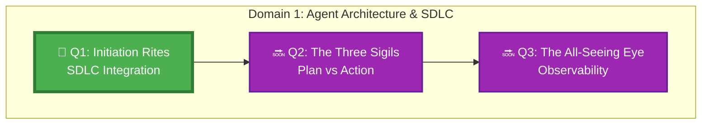
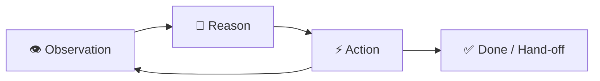
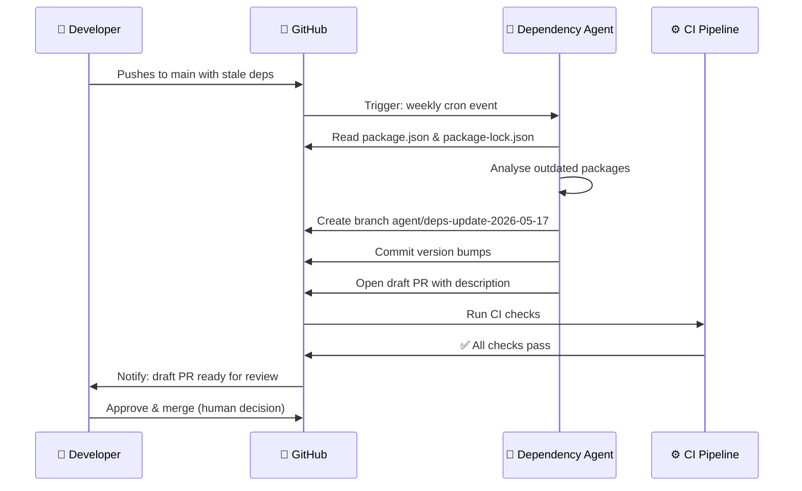

*Deep in the GitHub Citadel, the Initiation Hall hums with the energy of thousands of autonomous agents. But before you can summon one, you must answer the guildmaster's three ancient questions: What does this agent do? What does it consume? What does it produce? Only those who can answer with precision earn the right to proceed.*

*This is where your journey into the Agentic Codex begins — not with code, but with clarity.*

## 📖 The Legend Behind This Quest

When developers first began using AI assistants, they treated them like clever search engines: ask a question, get an answer. But agents are different. An agent *acts* — it reads code, creates branches, opens pull requests, and runs commands. Without clear boundaries woven into the SDLC from the start, agents become unpredictable, wasteful, or dangerous.

The Guild of Agentic Architects discovered this the hard way: 80% of failed agent deployments failed not because of model capability, but because no one defined what success looked like before deployment.

This quest teaches you to establish those definitions so your agents succeed from the first run.

## 🗺️ Your Quest Network Position



## 🎯 Quest Objectives

### Primary Objectives
- [ ] **Define an agent's SDLC role** — identify which steps in your development workflow are agent-appropriate
- [ ] **Specify inputs, outputs, and success criteria** for a concrete agent task
- [ ] **Catalogue agent anti-patterns** — recognize and document at least three failure modes common in agentic workflows
- [ ] **Design your first agent task card** — a structured document capturing all the above

### Secondary Objectives
- [ ] **Map agent touchpoints** — produce a Mermaid diagram showing where agents intervene in a PR lifecycle
- [ ] **Write a definition-of-done** for agent output that would pass human code review
- [ ] **Compare two agent scopes** — repo-scoped vs. org-scoped — and identify when each is appropriate

### Mastery Indicators
You'll know you've mastered this quest when you can:
- [ ] Explain the difference between an AI assistant and an AI agent without looking it up
- [ ] Write an agent task card from scratch in under 10 minutes
- [ ] Critique a proposed agent integration and identify its anti-patterns

## 🗺️ Quest Prerequisites

### 📋 Knowledge Requirements
- [ ] You've opened at least one pull request on GitHub
- [ ] You've used GitHub Copilot Chat at least once (even to ask a question)
- [ ] You understand what a GitHub Actions workflow does at a high level

### 🛠️ System Requirements
- [ ] GitHub account with Copilot Individual or Enterprise access
- [ ] VS Code with the [GitHub Copilot extension](https://marketplace.visualstudio.com/items?itemName=GitHub.copilot) installed
- [ ] Git installed, or access to GitHub Codespaces

### 🧠 Skill Level Indicators
This **🟡 Medium** quest expects:
- [ ] Comfortable reading and writing YAML
- [ ] Able to navigate a GitHub repository confidently
- [ ] Willing to experiment and observe unexpected behaviour without panicking

## 🌍 Choose Your Adventure Platform

<details>
<summary>🍎 macOS / Linux</summary>

```bash
# Clone the starter sandbox
git clone https://github.com/bamr87/it-journey.git
cd it-journey/work/gh-600

# Install Python deps for the agent task card generator
python3 -m pip install --quiet pyyaml

# Verify GitHub CLI is available (used in later steps)
gh --version
```

</details>

<details>
<summary>🪟 Windows (PowerShell)</summary>

```powershell
git clone https://github.com/bamr87/it-journey.git
Set-Location it-journey/work/gh-600

python -m pip install --quiet pyyaml

gh --version
```

</details>

<details>
<summary>☁️ GitHub Codespaces</summary>

1. Open `https://github.com/bamr87/it-journey` and click **Code → Codespaces → New codespace**.
2. All prerequisites are pre-installed. Navigate to `work/gh-600/` in the terminal.

</details>

---

## ⚔️ The Quest Begins

### Chapter 1 — What Is an Agent, Really?

An **agent** is a system that takes an *observation*, reasons about it, and takes an *action* — potentially repeating this loop many times to complete a complex task. Unlike a one-shot AI completion:

| Concept | One-Shot AI | Agent |
|---|---|---|
| Loops | No | Yes — observe → reason → act |
| Tool Use | No | Yes — file reads, web calls, bash commands |
| Memory | None (context window) | Can persist state across steps |
| SDLC Position | "helpful suggestion" | Autonomous step in a pipeline |



> **Exercise 1.1:** In your own words (or in `work/gh-600/notes/q1-reflection.md`), write the answer to: *"What would make a task agent-appropriate vs. better done by a human or a deterministic script?"*

---

### Chapter 2 — Identifying Agent-Ready Steps in Your SDLC

Not every SDLC step should be handed to an agent. Use this decision grid:

| Criterion | Agent-Appropriate | Human-Required |
|---|---|---|
| Success can be auto-verified | ✅ Tests pass, linter clean | ❌ UX review, business logic judgement |
| Reversible action | ✅ Branch creation, draft PR | ❌ Production deploy, data deletion |
| Well-defined inputs | ✅ GitHub issue with acceptance criteria | ❌ Vague "make it better" requests |
| Low blast radius | ✅ Touches one file/module | ❌ Cross-cutting architectural changes |

> **Exercise 1.2:** Open any GitHub repository you own. List 5 steps in a typical PR workflow. For each, decide: agent-appropriate or human-required? Write results in `work/gh-600/notes/q1-sdlc-map.md`.

---

### Chapter 3 — Defining Inputs, Outputs, and Success Criteria

Every agent task must have three things before it runs:

**1. Inputs** — what the agent reads or receives
- GitHub issue body  
- PR diff  
- Specific file paths  
- Environment variables  

**2. Outputs** — what the agent produces
- Code changes committed to a branch  
- A draft PR with a description  
- A JSON report artifact  
- A GitHub issue comment  

**3. Success Criteria** — how you know it worked
- All CI checks pass  
- Specific strings appear in the output  
- Human reviewer approves without requesting changes  
- Metric is within acceptable range  

> **Exercise 1.3:** Using the template below, write an agent task card for a "dependency update checker" agent that reads your `package.json`, identifies outdated packages, and opens a draft PR with the updates.

```yaml
# work/gh-600/task-cards/dependency-updater.yml
agent_name: dependency-updater
sdlc_phase: maintenance
description: Checks for outdated npm dependencies and opens a draft PR with bumped versions.

inputs:
  - type: file
    path: package.json
  - type: file
    path: package-lock.json

outputs:
  - type: branch
    name_pattern: "agent/deps-update-{date}"
  - type: pull_request
    draft: true
    title_pattern: "chore(deps): bump {N} outdated packages"

success_criteria:
  - all_ci_checks_pass: true
  - pr_description_contains: "Breaking changes:"
  - diff_scope: package.json only
  - human_approval_required: true   # before merge
```

---

### Chapter 4 — Agent Anti-Patterns

The Guild's Hall of Shame displays the five most destructive agent anti-patterns. Learn them so you never repeat them.

**Anti-Pattern 1: The Infinite Reasoner 🌀**  
Agent loops forever refining a plan without producing output. *Fix: add a max-iteration limit and a forced-output gate.*

**Anti-Pattern 2: The Scope Creep Sorcerer 🕷️**  
Agent modifies files outside its stated scope because the task description was vague. *Fix: always specify exact file paths or glob patterns as inputs.*

**Anti-Pattern 3: The Silent Destroyer 💀**  
Agent takes irreversible actions (deletes branches, merges PRs) with no audit trail. *Fix: every action must produce a traceable artifact; irreversible actions require explicit authorization.*

**Anti-Pattern 4: The Hallucinating Herald 🎭**  
Agent reports success when it silently failed or produced garbage output. *Fix: define machine-verifiable success criteria; never rely only on the agent's self-report.*

**Anti-Pattern 5: The Context Amnesiac 🧊**  
Agent repeats work it already did because it has no memory of prior steps. *Fix: use durable state artifacts (covered in Domain 3 quests).*

> **Exercise 1.4:** Look at the `dependency-updater.yml` task card you wrote in Exercise 1.3. Which anti-patterns could it fall into? Add a `mitigations:` section to the YAML listing at least three.

---

### Chapter 5 — The SDLC Integration Diagram

Now produce a visual map of where your agent fits in the PR lifecycle.

> **Exercise 1.5:** Create `work/gh-600/diagrams/q1-sdlc-agent-map.md` with the following Mermaid diagram, then customise it with the agent you designed.



---

## ✅ Quest Validation

Run the quest self-check to confirm completion:

```bash
# From work/gh-600/
python3 scripts/validate_quest.py --quest q1

# Expected output:
# ✅ Task card: dependency-updater.yml present
# ✅ Inputs defined: 2
# ✅ Outputs defined: 2
# ✅ Success criteria: 4
# ✅ Mitigations: ≥3 anti-patterns addressed
# ✅ SDLC diagram: q1-sdlc-agent-map.md present
# 🏆 Quest Q1 complete!
```

---

## 🏆 Quest Rewards

| Reward | Details |
|---|---|
| 🤖 Agent Initiate Badge | Earned on quest completion |
| 🛠️ SDLC Agent Integration | Skill unlocked |
| 70 XP | Added to your Level 0111 total |
| Unlocks | [Q2: The Three Sigils](/quests/0111/agentic-plan-vs-action-boundaries/) |

---

## 🔗 Continue Your Journey

- **Next quest:** [Q2: The Three Sigils — Plan, Reason, Act](/quests/0111/agentic-plan-vs-action-boundaries/)
- **Domain hub:** [Domain 1 in the GH-600 Skills Measured breakdown](/docs/certifications/gh-600/skills-measured/#domain-1)
- **Chronicle post:** [Embedding Agents in the SDLC](/posts/embedding-agents-in-the-sdlc/)
- **Official docs:** [GitHub Copilot coding agent](https://docs.github.com/en/copilot/using-github-copilot/using-github-copilot-for-pull-requests/about-copilot-coding-agent)

## 🕸️ Knowledge Graph

*Structured wiki-links connect this quest to the IT-Journey knowledge graph. Open the [Obsidian Graph View](/docs/obsidian/graph/) to explore connections.*

**Level hub:** [[Level 0111 (7) - API Development]]
**Overworld:** [[🏰 Overworld - Master Quest Map]]
**Study track:** [[The Agentic Codex: GH-600 Study Hub]] · [[GH-600 Agentic AI Quick-Reference Notes]] · [[GH-600 Exam Overview]]
**Recommended:** [[REST Principles: RESTful API Design Best Practices]]
**Unlocks:** [[The Three Sigils: Plan, Reason, Act]]
**Sequel quests:** [[The Three Sigils: Plan, Reason, Act]]
**Obsidian docs:** [[Obsidian Knowledge Graph and Wiki Links]]

