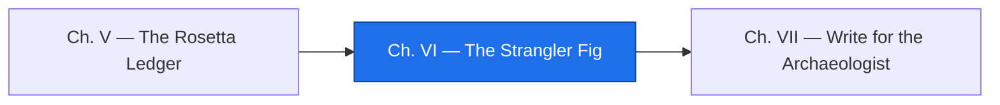

*The Council wants the relic behind an API by the end of the quarter. The rewrite crowd wants to switch it off and turn the port on. The Relic Raisers do neither. They plant a fig: a modern gate that grows around the relic, answers from it exactly as before, and quietly asks the port the same question on every request — logging every disagreement — until the day the port has earned the answer. Nothing goes dark on cutover day, because cutover is a flag, and so is going back.*

*The real-world skill: the strangler-fig pattern — an anti-corruption layer with shadow traffic, staged cutover, and rollback by configuration.*

## 📖 The Legend Behind This Quest

*In the forests of the realm a strangler fig begins as a seed in the canopy of an old tree, sends roots down around the trunk, and thrives on the same light and soil. For years both live. When the old tree finally goes, the fig stands hollow-hearted and whole. Martin Fowler named the migration pattern after it: grow the new system around the old, route one call at a time, and cut nothing until the new has carried the load. The guild adds one discipline the forest does not need — **shadow mode**: the old answers, the new runs too, and every disagreement is written down. A port that has been silent in shadow for a season has earned the gate. A port that was merely reviewed has not.*

## 🎯 Quest Objectives

### Primary Objectives

- [ ] **Raise the gate** — an HTTP service, standard library only, that answers aging totals as JSON
- [ ] **Run the shadow** — the relic answers every request while the port runs beside it, and each request logs MATCH or MISMATCH
- [ ] **Cut over and roll back** — switch the engine with a flag, prove the answer is the same, switch back
- [ ] **Hold the gate under load** — a loop of requests with different as-of dates, every one matched
- [ ] **Find the hazard** — let a familiar review the gate, reproduce one hazard it names, fix it at the door, and pin it with a trial

### Mastery Indicators

- [ ] You can explain to the Council why "switch it off and turn the port on" is a bet, and shadow mode is a proof
- [ ] You can name what the relic does with a garbage date, what the port does, and what the gate must do
- [ ] Your rollback is a restart, not a deploy

## 🗺️ Quest Prerequisites

- **Chapter V** — the gate routes to `aging.py`; only a reconciled port may stand in the shadow.
- **`curl`** — the only client you need; it ships with most worlds.
- **`http.server`** — Python's built-in server is enough for a gate that runs one batch program per request. A production gate would sit behind a real server; the routing logic does not change.

## 🧙‍♂️ Chapter 1: Raise the Gate

### ⚔️ Skills You'll Forge

- Wrapping a batch program as an HTTP endpoint
- Running each request in its own scratch directory

Save this as `relic_api.py`. It exposes one portal, `GET /aging?asof=YYMMDD`, and it decides who answers with a flag, not a code change: `relic` (the default — nothing changes), `shadow` (the relic answers, the port runs too, mismatches are logged), or `port` (the port answers, once it has earned it).

```python
#!/usr/bin/env python3
"""relic_api.py — the strangler fig: a modern gate in front of an ancient relic.

GET /aging?asof=YYMMDD returns the aging totals as JSON. Which engine answers
is a routing decision, not a rewrite:
  --engine relic   the COBOL program answers (the default: nothing changes)
  --engine shadow  the relic answers; the port runs too and every mismatch is logged
  --engine port    the Python port answers (cut over only after shadow is silent)
Stdlib only. Usage: python3 relic_api.py --engine shadow --port 8765
"""
import argparse
import json
import os
import shutil
import subprocess
import sys
import tempfile
from http.server import BaseHTTPRequestHandler, HTTPServer
from urllib.parse import parse_qs, urlparse

HERE = os.path.dirname(os.path.abspath(__file__))

def run_engine(engine, asof):
    """Run one engine in a scratch dir and return its totals as a dict."""
    work = tempfile.mkdtemp()
    shutil.copy(os.path.join(HERE, "INVOICES.DAT"), work)
    with open(os.path.join(work, "ASOF.PRM"), "w") as f:
        f.write(asof + "\n")
    if engine == "relic":
        shutil.copy(os.path.join(HERE, "arage01"), work)
        subprocess.run(["./arage01"], cwd=work, check=True)
        report = os.path.join(work, "AGING.RPT")
    else:
        subprocess.run([sys.executable, os.path.join(HERE, "aging.py")], cwd=work, check=True,
                       stdout=subprocess.DEVNULL)
        report = os.path.join(work, "AGING_PY.RPT")
    totals, in_totals = {}, False
    for line in open(report):
        line = line.rstrip("\n")
        if line == "TOTALS":
            in_totals = True
            continue
        if in_totals and line.strip():
            totals[line[:14].strip()] = line[14:].strip()
    shutil.rmtree(work)
    return totals

class Gate(BaseHTTPRequestHandler):
    engine = "relic"

    def do_GET(self):
        url = urlparse(self.path)
        if url.path != "/aging":
            self.send_error(404)
            return
        asof = parse_qs(url.query).get("asof", ["260914"])[0]
        if self.engine == "shadow":
            answer, shadow = run_engine("relic", asof), run_engine("port", asof)
            diffs = {k: (answer[k], shadow.get(k)) for k in answer if answer[k] != shadow.get(k)}
            print(f"SHADOW asof={asof} " + ("MATCH" if not diffs else f"MISMATCH {diffs}"), file=sys.stderr)
            served = "relic"
        else:
            answer, served = run_engine(self.engine, asof), self.engine
        body = json.dumps({"asof": asof, "engine": served, "totals": answer}).encode()
        self.send_response(200)
        self.send_header("Content-Type", "application/json")
        self.end_headers()
        self.wfile.write(body)

    def log_message(self, fmt, *args):
        print(f"GATE {self.command} {self.path} -> {args[1]}", file=sys.stderr)

if __name__ == "__main__":
    ap = argparse.ArgumentParser()
    ap.add_argument("--engine", choices=("relic", "shadow", "port"), default="relic")
    ap.add_argument("--port", type=int, default=8765)
    a = ap.parse_args()
    Gate.engine = a.engine
    print(f"gate open on http://127.0.0.1:{a.port}/aging  engine={a.engine}", file=sys.stderr)
    HTTPServer(("127.0.0.1", a.port), Gate).serve_forever()
```

Open the gate in shadow mode, in a second terminal or backgrounded, then knock:

```bash
python3 relic_api.py --engine shadow --port 8765 2> gate.log &
curl -s "http://127.0.0.1:8765/aging?asof=260914" | python3 -m json.tool
```

```json
{
    "asof": "260914",
    "engine": "relic",
    "totals": {
        "CURRENT": "11050.00",
        "1-30 DAYS": "1250.00",
        "31-60 DAYS": "560.00",
        "61-90 DAYS": "340.75",
        "OVER 90 DAYS": "274.99",
        "DISPUTED": "2100.50",
        "INVOICES READ": "8"
    }
}
```

The relic answered — the same numbers as the report from Chapter I, now as JSON over HTTP, with the COBOL untouched. Behind the answer the port ran too. Read the gate's log:

```bash
cat gate.log
```

```text
gate open on http://127.0.0.1:8765/aging  engine=shadow
SHADOW asof=260914 MATCH
GATE GET /aging?asof=260914 -> 200
```

### 🔍 Knowledge Check

- [ ] Why does every request run in a fresh scratch directory rather than in the repository folder?
- [ ] In shadow mode, which engine's totals go back to the caller, and where do the port's go?
- [ ] What would a MISMATCH line in the log tell you that the Chapter V ledger did not?

## 🧙‍♂️ Chapter 2: Shadow, Cutover, Rollback

### ⚔️ Skills You'll Forge

- Staged cutover as a routing plan
- Proving the plan with requests, not promises

The routing plan is the whole pattern in four rows:

| Stage | `--engine` | Who answers | What you learn |
|---|---|---|---|
| Day 0 | `relic` | the relic | nothing changed; the gate is transparent |
| Shadow | `shadow` | the relic | every disagreement between relic and port, per real request |
| Cutover | `port` | the port | the port carries real traffic; the relic stands by |
| Rollback | `relic` | the relic | a restart with a flag undoes cutover in seconds |

Hold the gate under a small load first — five requests with five different as-of dates — and count the shadow's verdicts:

```bash
for i in 1 2 3 4 5; do
  curl -s "http://127.0.0.1:8765/aging?asof=2609$(printf '%02d' $((i*5)))" \
    | python3 -c 'import json,sys; d=json.load(sys.stdin); print(d["asof"], d["engine"], "CURRENT", d["totals"]["CURRENT"])'
done
grep -c "SHADOW.*MATCH" gate.log; grep -c MISMATCH gate.log
```

```text
260905 relic CURRENT 11050.00
260910 relic CURRENT 11050.00
260915 relic CURRENT 9800.00
260920 relic CURRENT 9800.00
260925 relic CURRENT 9800.00
5
0
```

Between the 10th and the 15th, `INV10007` (due the 14th) leaves CURRENT — and the port agreed with the relic on every date. Five matches, zero mismatches. On a real gate you leave shadow mode running for weeks against real traffic and read this count every morning; "silent" means the mismatch count stayed at zero while the request count grew. Then, and only then, cut over:

```bash
kill %1
python3 relic_api.py --engine port --port 8765 2> gate.log &
curl -s "http://127.0.0.1:8765/aging?asof=260914" \
  | python3 -c 'import json,sys; d=json.load(sys.stdin); print(d["engine"], d["totals"]["CURRENT"], d["totals"]["DISPUTED"])'
# port 11050.00 2100.50
```

The port answers now, and the numbers are the ones the ledger blessed. Rollback is the same motion in reverse — `kill %1`, restart with `--engine relic` — and takes as long as a process takes to start. That is the property to defend above all others: **going back must cost nothing.** The moment rollback needs a deploy, a migration, or a meeting, the fig has strangled the wrong tree.

### 🔍 Knowledge Check

- [ ] What is the observable difference between the shadow stage and the cutover stage, from the caller's side?
- [ ] Why run shadow for weeks when the ledger already reconciled two dates?
- [ ] What would you record in an ADR before the first cutover, and what evidence would it cite?

## 🧙‍♂️ Chapter 3: The Familiar Reviews the Gate — and You Verify One Hazard

### ⚔️ Skills You'll Forge

- Using a familiar as a hazard finder, not a hazard judge
- Reproducing a hazard before fixing it
- Validating at the gate

A gate in front of a relic is a new attack surface and a new failure surface. Ask the familiar to hunt hazards — it is good at listing what can go wrong — and then do what it cannot: reproduce one.

```bash
cat relic_api.py | claude -p "Review this HTTP gateway for hazards: what breaks under concurrent requests, a missing binary, a bad or missing asof value, or a slow engine? For each hazard cite the line that causes it and describe one request that would expose it. Do not fix anything; I will reproduce first."
```

Take the bad-asof hazard, because it exposes a truth about the relic itself. First ask the relic directly, in a scratch directory, what it does with a date that is not a date:

```bash
T=$(mktemp -d) && cp INVOICES.DAT arage01 "$T/" && cd "$T"
echo xyz123 > ASOF.PRM && ./arage01; echo "relic exit=$?"; head -1 AGING.RPT
```

```text
relic exit=0
AR AGING REPORT       AS OF 2700/41/23
```

The relic accepts garbage, prints a report as of the 41st month of the year 2700, and exits clean. That is not a bug in 1997 terms — `ASOF.PRM` was always written by a trusted nightly job, so nobody validated it, and that unwritten assumption is a stratum of its own. Now the same request through the gate in shadow mode:

```bash
cd - > /dev/null && rm -rf "$T"
curl -s -o /dev/null -w "http %{http_code}\n" "http://127.0.0.1:8765/aging?asof=xyz123"
curl -s "http://127.0.0.1:8765/aging?asof=260914" | python3 -c 'import json,sys; d=json.load(sys.stdin); print("still serving:", d["engine"], d["totals"]["CURRENT"])'
grep -m1 ValueError gate.log
```

```text
http 000
still serving: relic 11050.00
ValueError: invalid literal for int() with base 10: 'xy'
```

Three facts, all real: the port refused the garbage with a `ValueError`, the gate's request handler died mid-request so the caller got no response at all (`000`), and the server survived to serve the next request. The relic was wrong silently; the port was right loudly; the gate was neither. The fix belongs at the door — validate before either engine runs — and it is four lines in `do_GET`, right after `asof` is read:

```python
        if not (len(asof) == 6 and asof.isdigit()):
            self.send_error(400, "asof must be YYMMDD")
            return
```

Restart the gate and knock again with the same garbage:

```bash
curl -s -o /dev/null -w "http %{http_code}\n" "http://127.0.0.1:8765/aging?asof=xyz123"
# http 400
```

A `400` tells the caller what they did wrong, runs no engine, and leaves the log clean. Pin it: add a trial to `test_relic.py` (or a new `test_gate.py`) that starts the gate, sends `asof=xyz123`, and asserts a `400`. The hazard the familiar named became a reproduced failure, a verified fix, and a trial — in that order, never another.

### 🔍 Knowledge Check

- [ ] Why reproduce the hazard against the relic alone before reproducing it through the gate?
- [ ] The relic's silent acceptance of garbage is "correct" for 1997. Which ADR would you write about it, and what would its Consequences say?
- [ ] Which of the familiar's other hazards (concurrency, missing binary, slow engine) would you reproduce next, and how?

## 🎮 Mastery Challenge

**Objective:** a fig that could carry real traffic tomorrow, and be uprooted in seconds.

- [ ] Shadow mode serves the relic's answer and logs a verdict for every request; the five-date loop shows five matches
- [ ] Cutover to `port` and rollback to `relic` each took one restart, and the JSON totals were identical before and after
- [ ] The bad-asof hazard is reproduced (relic: silent garbage; port: `ValueError`; gate: no response), fixed with a `400`, and covered by a trial
- [ ] `lore/ADR-0004` records that shadow runs before any cutover, with the gate log as evidence

## 🎁 Rewards & Progression

- 🌳 **Gatekeeper of the Fig** — you routed one request at a time with shadow mode and rollback
- 🚪 **Skill unlocked:** an HTTP gate in front of a batch relic
- 👥 **Skill unlocked:** shadow traffic and mismatch logging
- 🔁 **Skill unlocked:** cutover and rollback as configuration, not code
- **+120 XP**

## 🔁 Reproduce It

The gate, every `curl` response, the five-date loop, the port-mode answer, the relic's `2700/41/23` report, the port's `ValueError`, the `000` and the `400` were all produced on 2026-09-14 on Ubuntu 24.04 with GnuCOBOL 3.1.2, Python 3.11, and curl, against the unchanged Chapter I files and the Chapter V port. Ports 8765–8768 were used in the lab; any free port works.

## 🗺️ Quest Network



## 🔮 Next Adventures

The relic lives behind a gate it never knew was built. One chapter remains: leave the map, the reasons, and the roadmap where the next raiser will dig.

- ➡️ **Next chapter:** [Chapter VII — Write for the Archaeologist](/quests/1110/relic-raisers-07-write-for-the-archaeologist/)
- 🏺 **Campaign hub:** [Epic Quest: The Relic Raisers](/quests/codex/relic-raisers/)
- 🚪 **More on gates:** [API Fundamentals](/quests/0111/api-fundamentals/) · [Error Handling](/quests/0111/error-handling/)

## 📚 Resource Codex

- [Strangler Fig Application](https://martinfowler.com/bliki/StranglerFigApplication.html) — Martin Fowler's original note on the pattern
- [Python `http.server`](https://docs.python.org/3/library/http.server.html) — the standard-library server the gate is built on
- [Python `subprocess`](https://docs.python.org/3/library/subprocess.html) — running the relic and the port per request
- [curl](https://curl.se/docs/manpage.html) — the client that knocked on every door in this chapter

## 🕸️ Knowledge Graph

*Structured wiki-links connect this quest to the IT-Journey knowledge graph. Open the [Obsidian Graph View](/notes/obsidian/graph/) to explore connections.*

**Campaign hub:** [[Epic Quest: The Relic Raisers]] **Level hub:** [[Level 0111 (7) - API Development]] **Previous:** [[The Rosetta Ledger: Translate the Relic and Prove It Ties Out]] **Next:** [[Write for the Archaeologist: Leave the Lore Where the Next One Digs]] **Obsidian docs:** [[Obsidian Knowledge Graph and Wiki Links]]
