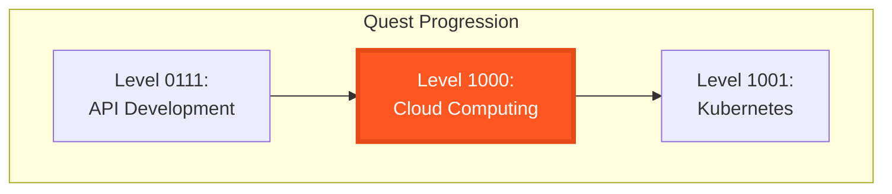
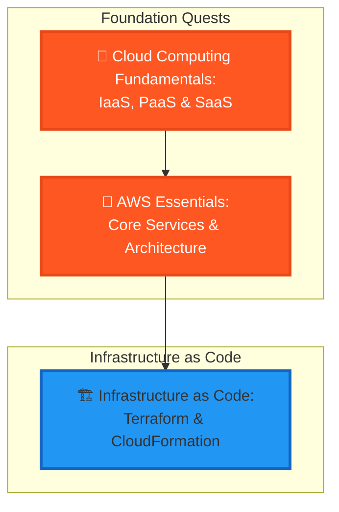

---

title: Level 1000 (8) - Cloud Computing Fundamentals
description: Ascend to the clouds and master the infrastructure that powers global-scale applications
preview: images/previews/level-1000-cloud-computing.png
permalink: /quests/1000/
categories:
  - Quests
  - Level-1000
  - Cloud-Computing
tags:
  - lvl-1000
  - cloud
  - aws
  - infrastructure
  - iaas
  - paas
  - quest-collection
lastmod: 2025-12-20
toc: true
toc_sticky: true
draft: false

layout: quest-collection
level: 1000
---

# Level 1000 (8) - Cloud Computing Fundamentals

*High above the mortal realm, floating citadels of computation await. Welcome to the Cloud Domain—where infinite resources stretch across virtual horizons and infrastructure bends to the will of code. Here, Expert-tier adventurers learn to command vast computing empires with mere configuration files.*

## 🎯 Level Overview

**Theme**: Cloud Infrastructure | **XP Range**: 800-1000 | **Tier**: Expert 🔥

Cloud computing marks your transition to the Expert tier, where infrastructure becomes programmable and scalability becomes limitless. This level introduces the fundamental concepts and services that power modern cloud platforms, with a focus on AWS as the primary learning environment.

You'll understand the differences between IaaS, PaaS, and SaaS, learn to provision and manage cloud resources, and master Infrastructure as Code using tools like Terraform and CloudFormation. These skills are essential for any modern DevOps or cloud engineering role.

### Level Positioning in Quest Network

## 🎓 Core Learning Objectives

By completing this level, adventurers will master:

### Knowledge Objectives
- [ ] **Cloud Service Models** - Understanding IaaS, PaaS, SaaS distinctions and use cases
- [ ] **Cloud Architecture** - Designing highly available, fault-tolerant systems
- [ ] **Infrastructure as Code** - Declarative infrastructure provisioning concepts

### Skill Objectives
- [ ] **AWS Core Services** - Proficiency with EC2, S3, RDS, Lambda, and VPC
- [ ] **Terraform/CloudFormation** - Write and manage infrastructure code
- [ ] **Cloud Security** - IAM, security groups, and encryption best practices

### Application Objectives
- [ ] **Cloud Deployments** - Deploy applications to production cloud environments
- [ ] **Cost Optimization** - Understand and manage cloud spending
- [ ] **Disaster Recovery** - Implement backup and recovery strategies

## 🗺️ Level Quest Map

## 📚 Quest Inventory

### Main Quests (Required)

| Quest | Difficulty | Time | XP | Status |
|-------|-----------|------|-----|--------|
| [Cloud Computing Fundamentals](cloud-computing-fundamentals.md) | 🔴 Hard | 90-120 min | 180 | 📋 Placeholder |
| [AWS Essentials](aws-essentials.md) | 🔴 Hard | 120-150 min | 200 | 📋 Placeholder |
| [Infrastructure as Code](infrastructure-as-code.md) | 🔴 Hard | 120-150 min | 200 | 📋 Placeholder |

## 🛠️ Required Tools & Technologies

### Cloud Platforms
- **AWS** - Primary cloud platform for learning
- **AWS CLI** - Command-line interface for AWS
- **AWS Console** - Web-based management interface

### Infrastructure as Code
- **Terraform** - Multi-cloud IaC tool
- **CloudFormation** - AWS-native IaC
- **AWS CDK** - Cloud Development Kit (optional)

### Development Tools
- **VS Code** - With AWS and Terraform extensions
- **Git** - Version control for infrastructure code
- **Docker** - For containerized deployments

### AWS Services Covered
- **EC2** - Virtual servers
- **S3** - Object storage
- **RDS** - Managed databases
- **Lambda** - Serverless compute
- **VPC** - Virtual networking
- **IAM** - Identity and access management

## 📋 Prerequisites

Before beginning this level, ensure completion of:

- ✅ **Level 0111** - API development fundamentals
- ✅ **Level 0110** - Database concepts
- ✅ **Level 0100** - Container fundamentals
- ✅ AWS Free Tier account (required)
- ✅ Basic networking knowledge (IP, DNS, HTTP)

## ⚠️ Important Notes

### Cost Considerations
- Use AWS Free Tier resources whenever possible
- Set up billing alerts before starting
- Clean up resources after each quest
- Consider using LocalStack for local development

### Account Security
- Enable MFA on your AWS account
- Never commit AWS credentials to git
- Use IAM roles instead of long-term credentials
- Follow least-privilege principles

## 🏆 Level Completion Rewards

Upon completing all main quests:

- 🎖️ **Title**: Cloud Architect Initiate
- ⚔️ **Skill Unlock**: Infrastructure as Code proficiency
- 🔓 **Next Level**: Kubernetes Orchestration (1001)
- 📜 **Certificate**: Cloud Computing Fundamentals

## 🔗 Related Resources

- [AWS Documentation](https://docs.aws.amazon.com/)
- [Terraform Documentation](https://www.terraform.io/docs/)
- [AWS Well-Architected Framework](https://aws.amazon.com/architecture/well-architected/)
- [A Cloud Guru / Linux Academy](https://acloudguru.com/)

---

**Level Status**: 📋 Placeholder quests generated | **Quests**: 3 | **Est. Time**: 6-8 hours

## Available Quests

| Quest | Difficulty | Time | Type | Status |
|-------|------------|------|------|--------|
| [AWS Essentials: Core Services and Cloud Architecture Patterns](/quests/level-1000-aws-essentials/) | 🔴 Hard | 120-150 minutes | main_quest | 🔮 Placeholder |
| [Cloud Computing Fundamentals: IaaS, PaaS, and SaaS Explained](/quests/level-1000-cloud-computing-fundamentals/) | 🔴 Hard | 90-120 minutes | main_quest | 🔮 Placeholder |
| [Infrastructure as Code: Terraform and CloudFormation Fundamentals](/quests/level-1000-infrastructure-as-code/) | 🔴 Hard | 120-150 minutes | main_quest | 🔮 Placeholder |

