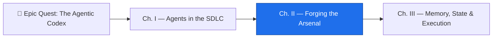

*The forge glows in the dark of the smithy. You have summoned an agent and taught it to plan before it acts — but a planner without tools is a strategist with empty hands. It can reason about a pull request it cannot open, describe a build it cannot run, name an API it cannot reach. This chapter is the arming-room: you will choose its weapons, fit its armor, and bind it to the realm it must defend — granting exactly the reach it needs and not one tool more.*

*The real-world skill under the spellcraft is the highest-weighted domain on the GH-600 exam: **how an agent acquires capability**. You will select and configure tools, stand up a Model Context Protocol (MCP) server so the agent can reach systems beyond the repository, scope its permissions to least privilege, and invoke it safely inside a GitHub Actions workflow. Get the arsenal wrong and the agent is either useless or dangerous. Get it right and it becomes a trusted member of your team.*

## 📖 The Legend Behind This Quest

Every capable agent is defined less by the model that powers it than by the **tools it can hold**. A reasoning engine alone cannot mutate the world; it produces words. Capability arrives the moment you hand it a tool — a function it can call to read an issue, open a pull request, run a build, query a database. In the old guilds, an apprentice was never given every key on the master's ring; they were trusted with exactly the doors their craft required, and the ring grew only as the trust did. That discipline has a modern name — **least privilege** — and Domain 2 of GH-600 (worth 20–25% of the exam, the single heaviest slice) is built around it.

The dragon at the heart of this domain is not loud. It is 🐉 **The Silent CI Failure**: an agent wired into a workflow that, lacking the one permission or tool it needs, fails without a useful error — the run goes green, nothing happens, and no one notices for a week. Learn to give an agent precisely enough capability, wired to fail *loudly* when it cannot proceed, and you have learned the deepest lesson of agent tooling: power is nothing without a clean boundary and a clear alarm.

## 🎯 Quest Objectives

By the end of this chapter you will have equipped and verified:

### Primary Objectives (Required for Chapter Completion)

- [ ] **Select the minimum tool set** for a stated agent task and justify each tool against least privilege
- [ ] **Configure a Model Context Protocol (MCP) server** — including a GitHub remote MCP server — as a tool the agent can call
- [ ] **Write an MCP allow list** and a fine-grained permission scope so the agent reaches only what its task requires
- [ ] **Invoke an agent inside a GitHub Actions workflow** with a branch-based scope and a least-privilege `permissions:` block
- [ ] **Wire a safe execution path** — a retry, a timeout, and an escalation route — so failures surface loudly instead of silently

### Mastery Indicators

You will know you have mastered this chapter when you can:

- [ ] Explain the difference between **scoped and unscoped tools** and argue the blast-radius case for scoping
- [ ] Read an MCP server definition and name where the token, the registry, and the allow list each live
- [ ] Diagnose a CI-triggered agent that "succeeds" but does nothing — and name the missing permission
- [ ] Choose the correct `permissions:` block from four plausible options (a real GH-600 question archetype)

## 🗺️ Quest Prerequisites

Before you light the forge, gather your reagents. This is Chapter II of **The Agentic Codex** — the previous chapter taught the agent to plan and to keep planning distinct from action. Now it earns its tools:

- **Domain 1 under your belt** — finish [Chapter I — Agents in the SDLC](/quests/0111/agentic-codex-01-agents-in-the-sdlc/) (or be comfortable with embedding agents in the software lifecycle and the plan-vs-action boundary).
- **A GitHub account and a repository you own** — you need push access and the ability to add secrets and variables.
- **GitHub Copilot access** — VS Code with the Copilot extension, or access to the **Copilot coding agent** (the asynchronous agent that opens its own pull requests).
- **A fine-grained personal access token** — minted with only the scopes you intend the agent to use, for wiring the GitHub MCP server.
- **Basic GitHub Actions and YAML literacy** — enough to read a workflow file and know that `permissions:` controls the `GITHUB_TOKEN`'s reach.

## 🧙‍♂️ Chapter 1: Choosing the Weapons — Tool Selection & Least-Privilege Permissions

### ⚔️ Skills You'll Forge

- Identifying the **minimum tool set** a task actually requires
- Configuring agent tools and their permissions
- Reasoning about **blast radius** when an agent is given an ambiguous instruction

A blacksmith without the right tools is just a storyteller. An agent is the same: its capabilities *are* its tools. GH-600 sub-skill **2.1 — Select and configure agent tools** asks you to do three things in order: **identify** the tools the task needs, **configure** them, and **configure their permissions**. The principle that governs all three is least privilege — an agent should hold only the tools the current task requires, no more.

Work it as a table. For a **code-review agent**, the task is: read the diff, comment on the PR. That dictates the arsenal:

| Capability | Code-review agent | Why |
|---|---|---|
| Read repository contents | ✅ | Must read the diff under review |
| Create PR review comments | ✅ | Its entire output |
| Create issues | ❌ | Not part of reviewing |
| Manage repo settings | ❌ | Never; catastrophic blast radius |
| Delete branches | ❌ | Irreversible, not its job |

Every ✅ is a door the agent can open; every ❌ is a door you keep locked. Tool scoping **reduces the blast radius** of an agent that misbehaves or is handed an ambiguous instruction. An agent that can only comment cannot accidentally delete your `main` branch, no matter how it is prompted.

In GitHub's world, an agent's "tools" surface in several places. For the **Copilot coding agent**, the workflow's `permissions:` block scopes the `GITHUB_TOKEN` it runs under — this is the exam's favorite **config-selection** question. The minimum block for an agent that opens a pull request is narrow and explicit:


```yaml
# .github/workflows/agent.yml — least-privilege scope for a PR-opening agent
permissions:
  contents: write        # create a branch and commit
  pull-requests: write   # open the PR
  # everything else defaults to 'none' — issues, packages, deployments all locked
```


The trap to recognize on the exam: a block that grants `permissions: write-all` (or omits the block, inheriting broad defaults) is **wrong** even though the agent "works" — it violates least privilege. The block that grants exactly `contents: write` + `pull-requests: write` and nothing else is the correct answer, because every unlisted scope falls back to `none`.

For tools the agent calls at runtime, the same discipline applies: enumerate the tool set explicitly and grant each tool only the access its function needs. A read-only analysis tool gets read scope; a tool that writes review comments gets comment scope; nothing gets repo-admin scope.

### 🔍 Knowledge Check

- [ ] For a code-review agent, which two GitHub capabilities are required and which two should be denied?
- [ ] Why is `permissions: write-all` the *wrong* answer even when the agent completes its task?
- [ ] What does "blast radius" mean in the context of an agent given an ambiguous instruction?

## 🧙‍♂️ Chapter 2: The MCP Conclave — Model Context Protocol Servers

### ⚔️ Skills You'll Forge

- Explaining what **MCP** is and why it replaces bespoke per-tool integrations
- Adding an MCP server (including a **GitHub remote MCP server**) as a tool to an agent
- Writing an **MCP allow list** and configuring MCP **registries**

Sub-skill **2.2 — Configure MCP servers** is the heart of the highest-weight domain. The **Model Context Protocol (MCP)** is an open standard that lets AI models connect to external tools in a structured, predictable way. Think of it as a **universal adapter**. Without MCP, every tool integration demands custom glue code. With MCP, a tool exposes one standard interface, and any MCP-compatible model — Copilot included — can use it. The **GitHub MCP server** is among the most important implementations: it gives an agent the ability to read and create issues, read and update pull requests, query repository contents, check workflow run statuses, and manage labels and milestones — all without writing custom GitHub API code in every agent.

You wire an MCP server by declaring it in configuration. In **VS Code**, MCP servers live in `.vscode/mcp.json` at the workspace level (or in user settings). The token is supplied through an `${input:...}` prompt rather than hardcoded, so it never lands in the file:

```json
{
  "servers": {
    "github": {
      "command": "npx",
      "args": ["-y", "@modelcontextprotocol/server-github"],
      "env": {
        "GITHUB_PERSONAL_ACCESS_TOKEN": "${input:github-token}"
      }
    }
  },
  "inputs": [
    {
      "id": "github-token",
      "type": "promptString",
      "description": "Fine-grained GitHub PAT (scoped to this agent's task)",
      "password": true
    }
  ]
}
```

The `${input:github-token}` pattern prompts for the token securely at runtime instead of committing a secret. The PAT you supply should be **fine-grained** and scoped — the same least-privilege rule from Chapter 1 applies to the credential the MCP server carries.

A **remote** GitHub MCP server (hosted by GitHub rather than spawned locally) is configured by pointing at its URL and authenticating, rather than invoking a local `command`. The exam tests that you can tell a local (`command` + `args`) server from a remote (URL-based) one, and that you know the token still rides in `env`/auth, never in the repository.

Two more sub-skill 2.2 controls matter:

- **MCP registries** — where the client discovers available servers. Configuring a registry tells the agent which catalog of MCP servers it may pull from.
- **MCP allow lists** — the gate on *which tools within a server* the agent may call. This is the MCP-layer equivalent of the `permissions:` block: even a server that *can* do twenty things is constrained to the handful the task needs.

An allow list is the difference between "the GitHub MCP server is connected" and "the agent may only read issues and comment on PRs through it." Conceptually:

```jsonc
// allow list: constrain a connected server to a least-privilege tool subset
{
  "github": {
    "allowed_tools": [
      "get_issue",
      "list_pull_requests",
      "create_pull_request_review_comment"
    ]
    // create_issue, delete_*, and admin tools are absent → blocked
  }
}
```

The omission *is* the denial. If a tool is not on the allow list, the agent cannot call it — the same blast-radius logic as repository permissions, applied one layer deeper at the protocol boundary.

### 🔍 Knowledge Check

- [ ] In one sentence, why does MCP remove the need for custom API code in every agent?
- [ ] Where does the GitHub token live in `.vscode/mcp.json`, and why is it never hardcoded?
- [ ] What is the difference between configuring an MCP *registry* and an MCP *allow list*?

## 🧙‍♂️ Chapter 3: Binding to the Realm — Dev Environment & Safe Execution

### ⚔️ Skills You'll Forge

- Evaluating an agent's **execution context** and scoping it to a repository and a branch
- Invoking an agent **inside a CI workflow** with a least-privilege token
- Implementing **retries, timeouts, and escalation** so failures surface loudly

Sub-skill **2.3 — Integrate agents within development environments** and **2.4 — Operate agents with safe execution paths** finish the arsenal. An agent bound to a well-configured realm performs consistently; an agent cast into an unknown environment is dangerous. Binding means three things: telling the agent the realm's conventions, scoping where it may act, and wiring how it recovers when a tool fails.

The agent reads its conventions from files in the repo. The two the exam expects you to name:

- **`AGENTS.md`** — the file the agent reads to learn the repository's conventions, forbidden actions, and preferred patterns. It is the realm's law, written for the agent.
- **`.github/copilot-instructions.md`** — instructions Copilot reads to understand project context.

A minimal `AGENTS.md` makes the boundary explicit:

```markdown
# AGENTS.md — conventions for agents in this repo

## Build & test
- Run `make build-ci` before opening any PR.
- Never edit generated files under `_data/quests/`.

## Boundaries
- Never push to `main`. Branch with `agent/<task>`.
- Do not modify `.github/workflows/` without a human reviewer.

## Identity
- Commit as `github-actions[bot]` with a clear, conventional message.
```

To **invoke the agent in CI** with a **branch-based scope**, trigger a workflow and let it open its own branch and pull request — never write to `main` directly. The `permissions:` block from Chapter 1 returns here as the agent's least-privilege identity inside the runner:


```yaml
# .github/workflows/agent-task.yml — a CI-invoked, branch-scoped agent
name: Agent Task
on:
  workflow_dispatch:        # human-triggered; explicit invocation
  issues:
    types: [labeled]        # or: react to an 'agent' label
permissions:
  contents: write
  pull-requests: write
concurrency:
  group: agent-${{ github.ref }}   # one agent run per branch — no self-collision
  cancel-in-progress: false
jobs:
  run-agent:
    runs-on: ubuntu-latest
    timeout-minutes: 15            # bound the blast radius in time
    steps:
      - uses: actions/checkout@v4
      - name: Run agent
        id: agent
        run: ./scripts/run-agent.sh   # opens a branch + PR; never commits to main
        env:
          GITHUB_TOKEN: ${{ secrets.GITHUB_TOKEN }}
```


Now defend against 🐉 **The Silent CI Failure**. Sub-skill 2.4 asks for **error handling, retries, rollbacks, escalation, and traceability**. The pattern: retry transient failures a bounded number of times, fail *loudly* on real errors, and escalate to a human rather than swallowing the error and reporting green.

```bash
#!/usr/bin/env bash
# scripts/run-agent.sh — safe execution: bounded retries, then loud escalation
set -euo pipefail   # fail loudly: any error aborts, no silent green

attempt=0
max_attempts=3
until ./agent-step.sh; do
  attempt=$((attempt + 1))
  if [ "$attempt" -ge "$max_attempts" ]; then
    echo "::error::Agent failed after ${max_attempts} attempts — escalating to a human."
    gh issue create \
      --title "Agent run failed: $(date -u +%FT%TZ)" \
      --label "needs-human" \
      --body "The agent exhausted ${max_attempts} retries. Logs: ${RUNNER_TRACE_URL:-see Actions run}."
    exit 1   # non-zero so the workflow goes RED, not green
  fi
  echo "Attempt ${attempt} failed; retrying after backoff…"
  sleep $((attempt * 5))   # linear backoff
done
echo "Agent step succeeded on attempt $((attempt + 1))."
```

Three safety properties make this safe: **bounded retries** (transient blips recover, but a broken tool does not loop forever), **escalation** (a real failure files a `needs-human` issue — the human-in-the-loop seam), and **traceability** (`::error::` surfaces in the Actions UI and the run ends *red*). The dragon dies the moment a failed agent run cannot masquerade as a passing one.

### 🔍 Knowledge Check

- [ ] What does an agent learn from `AGENTS.md` that it cannot infer from the code alone?
- [ ] Why must the script `exit 1` on final failure instead of logging and returning 0?
- [ ] How does `timeout-minutes` bound an agent's blast radius differently than `permissions:` does?

## 🧪 Hands-On Lab: Slay the Silent Failure on Your Own Bench

*You do not need a CI runner to fight this dragon — you need a flaky tool and a script that refuses to lie about it.* This lab runs entirely on your machine with zero credentials: a stub tool fails deterministically, the safe-execution wrapper retries and escalates, and you verify every exit code yourself.

### Step 1 — Build the flaky tool and a stubbed `gh`

```bash
mkdir -p ~/codex-arsenal-lab && cd ~/codex-arsenal-lab

# The tool: fails twice, succeeds on the third call — a classic transient fault
cat > agent-step.sh <<'EOF'
#!/usr/bin/env bash
n=$(cat .attempts 2>/dev/null || echo 0)
echo $((n + 1)) > .attempts
if [ "$n" -lt 2 ]; then
  echo "tool error: transient failure (call $((n + 1)))" >&2
  exit 1
fi
echo "tool ok on call $((n + 1))"
EOF
chmod +x agent-step.sh

# A stub gh so the escalation path is observable without touching GitHub
cat > gh <<'EOF'
#!/usr/bin/env bash
echo "[stub gh] would run: $*"
EOF
chmod +x gh
export PATH="$PWD:$PATH"
```

### Step 2 — Copy in the safe-execution wrapper

Save the `run-agent.sh` script from Chapter 3 above as `run-agent.sh` in this directory (replace `./agent-step.sh` paths as-is — they match), then `chmod +x run-agent.sh`.

### Step 3 — Watch bounded retries absorb a transient fault

```bash
rm -f .attempts && ./run-agent.sh; echo "exit=$?"
```

Expected — two failures absorbed, success on the third, exit code 0:

```text
tool error: transient failure (call 1)
Attempt 1 failed; retrying after backoff…
tool error: transient failure (call 2)
Attempt 2 failed; retrying after backoff…
tool ok on call 3
Agent step succeeded on attempt 3.
exit=0
```

### Step 4 — Make the fault permanent and watch it escalate loudly

```bash
rm -f .attempts
sed -i.bak 's/-lt 2/-lt 99/' agent-step.sh    # now it always fails
./run-agent.sh; echo "exit=$?"
```

Expected — the retries exhaust, a `needs-human` issue is filed (by the stub), and the run ends **red**:

```text
tool error: transient failure (call 1)
Attempt 1 failed; retrying after backoff…
tool error: transient failure (call 2)
Attempt 2 failed; retrying after backoff…
tool error: transient failure (call 3)
::error::Agent failed after 3 attempts — escalating to a human.
[stub gh] would run: issue create --title Agent run failed: … --label needs-human …
exit=1
```

That `exit=1` is the whole lesson: the dragon only lives where a failed run can report green. Now break the wrapper on purpose — delete the `exit 1` line and re-run — and watch the run end `exit=0` while the tool never succeeded. You have reproduced the Silent CI Failure and can name the one line that kills it.

### Step 5 — Take it to the real forge (optional)

Swap the stub for reality: commit `run-agent.sh` and `agent-step.sh` to a scratch repo, wrap them in the CI workflow from Chapter 3, and confirm the Actions run goes red with a real `needs-human` issue filed by the real `gh`. The scripts do not change — only the bench does.

## ⚔️ The Quests of This Domain

This chapter is the field guide; the four quests below are the forge where you swing the hammer. Walk them in order — they ascend Domain 2's sub-skills 2.1 → 2.4.

- **[Forging the Agent's Arsenal: Tool Selection & Permissions](/quests/1000/agentic-tool-selection-and-permissions/)** — sub-skill 2.1: identify, configure, and restrict the exact tools your agent needs, then scope its permissions to least privilege.
- **[The MCP Conclave: Mastering Model Context Protocol Servers](/quests/1000/agentic-mcp-server-mastery/)** — sub-skill 2.2: configure local and remote MCP servers, registries, and allow lists so agents reach external systems securely.
- **[Bind the Agent to the Realm: Dev Environment Integration](/quests/1001/agentic-dev-environment-integration/)** — sub-skill 2.3: wire `AGENTS.md`, a dev container, and secrets so an agent runs identically in Codespaces, CI, and on your machine.
- **[The Shield of Retries: Safe Execution and Error Handling](/quests/1001/agentic-safe-execution-and-error-handling/)** — sub-skill 2.4: build retry logic, timeouts, rollbacks, and escalation paths that survive tool and API failures.

## 🎮 Mastery Challenge

**Objective:** Arm a single agent end-to-end — scoped tools, an MCP server, a CI binding, and a loud failure path — and prove each boundary holds.

**Success Criteria:**

- [ ] You can produce a least-privilege `permissions:` block for a PR-opening agent and explain why every omitted scope matters
- [ ] You wired a GitHub MCP server (local or remote) with the token supplied via secure input, never committed
- [ ] You wrote an MCP allow list that constrains a connected server to a least-privilege tool subset
- [ ] Your agent is invoked from a CI workflow on a branch scope with a `timeout-minutes` bound — never touching `main`
- [ ] A simulated tool failure retries a bounded number of times, escalates to a `needs-human` issue, and ends the run **red**

## 🎁 Rewards & Progression

- 🗡️ **Arsenal Smith** — equipped an agent with scoped tools and a remote MCP server
- 🛡️ **Realm Warden** — bound an agent to a CI environment with safe execution paths
- 🛠️ **Skill unlocked:** Agent tool selection and least-privilege permissions
- 🔌 **Skill unlocked:** MCP server configuration, registries, and allow lists
- 🏰 **Skill unlocked:** CI-invoked, branch-scoped agents with retries and escalation
- **+90 XP** toward the Agentic Codex campaign

## 🗺️ Quest Network



## 🔮 Next Adventures

The agent now holds its weapons and stands inside the realm's walls — but it has no memory. Run it twice and it repeats itself, forgetting every decision it made an hour ago. The next chapter teaches it to remember.

- ➡️ **Next chapter:** [Chapter III — Memory, State & Execution](/quests/1001/agentic-codex-03-memory-state-and-execution/)
- ⬅️ **Previous chapter:** [Chapter I — Agents in the SDLC](/quests/0111/agentic-codex-01-agents-in-the-sdlc/)
- 🏰 **Campaign hub:** [Epic Quest: The Agentic Codex](/quests/codex/agentic-codex/)

## 📚 Resource Codex

- [GH-600 study guide — Microsoft Learn](https://learn.microsoft.com/en-us/credentials/certifications/resources/study-guides/gh-600) — the official Domain 2 objectives
- [Model Context Protocol — specification](https://modelcontextprotocol.io/) — the open standard MCP servers implement
- [GitHub MCP Server](https://github.com/github/github-mcp-server) — the reference GitHub MCP implementation
- [Extending Copilot Chat with MCP — GitHub Docs](https://docs.github.com/en/copilot/customizing-copilot/extending-copilot-chat-with-mcp) — wiring MCP into Copilot
- [Copilot coding agent — GitHub Docs](https://docs.github.com/en/copilot/using-github-copilot/coding-agent) — the asynchronous, PR-opening agent
- [Controlling permissions for `GITHUB_TOKEN`](https://docs.github.com/en/actions/security-for-github-actions/security-guides/automatic-token-authentication#permissions-for-the-github_token) — the least-privilege `permissions:` block
- [Using environments for deployment — GitHub Docs](https://docs.github.com/en/actions/deployment/targeting-different-environments/using-environments-for-deployment) — environment protection rules and required reviewers
- 🏰 **In the wild (this repo):** [`.vscode/mcp.json`](https://github.com/bamr87/it-journey/blob/main/.vscode/mcp.json) (editor MCP, prompt-supplied token), [`scripts/ai/mcp/github-readonly.json`](https://github.com/bamr87/it-journey/blob/main/scripts/ai/mcp/github-readonly.json) (runner MCP + allow-list convention), and the least-privilege `permissions:` blocks in every workflow. Full domain map: [GH-600 in the Wild](/notes/gh-600/implemented-in-it-journey/)

## 🕸️ Knowledge Graph

*Structured wiki-links connect this quest to the IT-Journey knowledge graph. Open the [Obsidian Graph View](/notes/obsidian/graph/) to explore connections.*

**Campaign hub:** [[Epic Quest: The Agentic Codex]]
**Previous:** [[Agents in the SDLC]]
**Next:** [[Memory, State & Execution]]
**Domain 2 quests:** [[Forging the Agent's Arsenal: Tool Selection & Permissions]] · [[The MCP Conclave: Mastering Model Context Protocol Servers]] · [[Bind the Agent to the Realm: Dev Environment Integration]] · [[The Shield of Retries: Safe Execution and Error Handling]]
**Reference doc:** [[MCP Servers and Agent Tooling in Practice]]
**Obsidian docs:** [[Obsidian Knowledge Graph and Wiki Links]]
