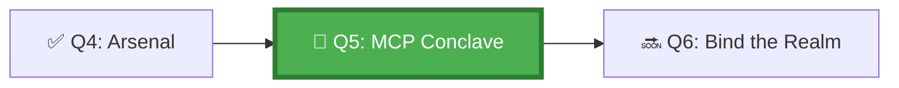

*In the Protocol Archives, the ancient contracts are kept — the Model Context Protocol scrolls that allow agents to speak with systems beyond the Repository walls. Each MCP server is a Guild-certified interpreter, transforming the agent's structured requests into calls the external world understands. Without the Conclave's blessing, an agent that reaches beyond the Repository risks corruption, injection, or worse — unapproved data exfiltration.*

## 🗺️ Quest Network Position



## 🎯 Quest Objectives

- [ ] **Explain MCP** — articulate what Model Context Protocol is and why agents need it
- [ ] **Configure an MCP server** — connect GitHub Copilot to a GitHub MCP server (or VS Code MCP server)
- [ ] **Invoke a tool through MCP** — ask the agent to use an MCP-backed tool and observe the request/response
- [ ] **Secure the connection** — confirm MCP server runs with least-privilege access tokens
- [ ] **Inspect the trace** — verify the MCP tool call appears in the agent's execution trace

## ⚔️ The Quest Begins

### Chapter 1 — What Is the Model Context Protocol?

MCP is an open standard that defines how AI agents communicate with external tools and data sources. Think of it as an adapter layer:

```text
Agent ──► MCP Client ──► MCP Protocol (JSON-RPC) ──► MCP Server ──► External Tool/API
```

Without MCP, every agent-tool integration requires bespoke code. With MCP, any MCP-compatible agent can talk to any MCP-compatible server using the same protocol.

**Key MCP concepts:**

| Concept | Description |
|---|---|
| **Server** | A process exposing tools/resources to an MCP client |
| **Tool** | A callable function the agent can invoke (e.g., `search_code`, `get_issue`) |
| **Resource** | A data source the agent can read (e.g., file, DB row) |
| **Prompt** | A reusable prompt template the server exposes |
| **Transport** | How client and server communicate: stdio or SSE |

---

### Chapter 2 — Configuring the GitHub MCP Server

The `github/github-mcp-server` provides GitHub API tools (repos, issues, PRs, code search) via MCP.

**Option A: VS Code + GitHub Copilot (recommended)**

> **Exercise 5.1:** Add the GitHub MCP server to your VS Code settings.

```json
// .vscode/settings.json  (or User Settings)
{
  "github.copilot.chat.mcpServers": {
    "github": {
      "type": "stdio",
      "command": "npx",
      "args": ["-y", "@modelcontextprotocol/server-github"],
      "env": {
        "GITHUB_PERSONAL_ACCESS_TOKEN": "${env:GITHUB_TOKEN}"
      }
    }
  }
}
```

```bash
# macOS / Linux — set your PAT in the environment
export GITHUB_TOKEN=ghp_yourTokenHere

# Verify Node.js is available
node --version   # must be >= 18

# Test the MCP server manually
echo '{"jsonrpc":"2.0","id":1,"method":"tools/list","params":{}}' \
  | GITHUB_PERSONAL_ACCESS_TOKEN=$GITHUB_TOKEN \
    npx @modelcontextprotocol/server-github
```

<details>
<summary>Windows (PowerShell)</summary>

```powershell
$env:GITHUB_TOKEN = "ghp_yourTokenHere"

# Test the MCP server
echo '{"jsonrpc":"2.0","id":1,"method":"tools/list","params":{}}' |
  $env:GITHUB_PERSONAL_ACCESS_TOKEN=$env:GITHUB_TOKEN
  npx @modelcontextprotocol/server-github
```

</details>

**Expected output** (truncated):
```json
{
  "jsonrpc": "2.0",
  "id": 1,
  "result": {
    "tools": [
      { "name": "search_repositories", ... },
      { "name": "get_file_contents", ... },
      { "name": "create_issue", ... },
      ...
    ]
  }
}
```

---

### Chapter 3 — Invoking MCP Tools Through Copilot

Once the server is configured, the Copilot agent can invoke GitHub API tools natively.

> **Exercise 5.2:** Open VS Code, switch to a Copilot Chat session with "Agent" mode, and run:

```text
@github List the last 5 open issues in this repository, including their titles and authors.
```

Observe:
1. Copilot invokes the `list_issues` MCP tool (you'll see a "Used tool: list_issues" indicator in the chat)
2. The response includes structured data from the GitHub API
3. No additional auth is needed — the MCP server uses the `GITHUB_TOKEN` you configured

---

### Chapter 4 — Writing a Custom MCP Server (Minimal Example)

For the GH-600 exam, you need to understand the MCP server structure. Build a minimal one:

```javascript
// work/gh-600/mcp-server/src/index.js
// A minimal custom MCP server that exposes two tools:
// - get_timestamp: returns current UTC time
// - validate_plan: validates an agent plan JSON against a schema

const { Server } = require("@modelcontextprotocol/sdk/server/index.js");
const { StdioServerTransport } = require("@modelcontextprotocol/sdk/server/stdio.js");

const server = new Server(
  { name: "gh600-sandbox-mcp", version: "0.1.0" },
  { capabilities: { tools: {} } }
);

server.setRequestHandler("tools/list", async () => ({
  tools: [
    {
      name: "get_timestamp",
      description: "Returns the current UTC timestamp",
      inputSchema: { type: "object", properties: {} }
    },
    {
      name: "validate_plan",
      description: "Validates an agent plan JSON string",
      inputSchema: {
        type: "object",
        required: ["plan_json"],
        properties: {
          plan_json: { type: "string", description: "JSON string of the agent plan" }
        }
      }
    }
  ]
}));

server.setRequestHandler("tools/call", async (req) => {
  if (req.params.name === "get_timestamp") {
    return { content: [{ type: "text", text: new Date().toISOString() }] };
  }
  if (req.params.name === "validate_plan") {
    try {
      const plan = JSON.parse(req.params.arguments.plan_json);
      const valid = plan.task_summary && Array.isArray(plan.steps);
      return { content: [{ type: "text", text: valid ? "✅ Plan valid" : "❌ Plan missing required fields" }] };
    } catch {
      return { content: [{ type: "text", text: "❌ Invalid JSON" }] };
    }
  }
});

async function main() {
  const transport = new StdioServerTransport();
  await server.connect(transport);
}
main();
```

```bash
# Install dependencies and test
cd work/gh-600/mcp-server
npm init -y
npm install @modelcontextprotocol/sdk

echo '{"jsonrpc":"2.0","id":1,"method":"tools/list","params":{}}' | node src/index.js
```

---

### Chapter 5 — Security: Scoping MCP Token Permissions

MCP servers inherit the permissions of their access tokens. Apply least-privilege:

```bash
# Create a fine-grained PAT for the MCP server with ONLY what it needs
# GitHub Settings > Developer Settings > Fine-grained Personal Access Tokens

# For the GitHub MCP server in a read-only observability role:
# Required scopes:
# - Contents: Read-only
# - Issues: Read-only
# - Pull requests: Read-only
# - Metadata: Read-only (required by all fine-grained PATs)

# Store the token as a GitHub Actions secret (not as a local variable in prod)
gh secret set GITHUB_MCP_TOKEN --body "ghp_yourFinegrainedToken"
```

**Never** use a PAT with `admin:org` or `repo:write` for an MCP server unless the server's purpose explicitly requires those permissions.

---

## ✅ Quest Validation

```bash
python3 scripts/validate_quest.py --quest q5
# ✅ VS Code MCP settings: configured
# ✅ Custom MCP server: src/index.js present
# ✅ Token scope: documented at minimum required
# 🏆 Quest Q5 complete!
```

## 🏆 Quest Rewards

| Reward | Details |
|---|---|
| 🌐 MCP Initiate Badge | Earned on completion |
| 🔌 MCP Server Configuration | Skill unlocked |
| 100 XP | Added to Level 1000 total |
| Unlocks | [Q6: Bind the Agent to the Realm](/quests/1001/agentic-dev-environment-integration/) |

## 🔗 Continue Your Journey

- **Next:** [Q6: Bind the Agent to the Realm](/quests/1001/agentic-dev-environment-integration/)
- **Reference note:** [MCP Quick Reference](/notes/gh-600/mcp-quickref/)
- **Chronicle post:** [MCP Servers and Agent Tooling in Practice](/posts/mcp-servers-and-agent-tooling-in-practice/)

## 🕸️ Knowledge Graph

*Structured wiki-links connect this quest to the IT-Journey knowledge graph. Open the [Obsidian Graph View](/docs/obsidian/graph/) to explore connections.*

**Level hub:** [[Level 1000 (8) - Cloud Computing Fundamentals]]
**Overworld:** [[🏰 Overworld - Master Quest Map]]
**Study track:** [[The Agentic Codex: GH-600 Study Hub]] · [[GH-600 Agentic AI Quick-Reference Notes]] · [[MCP Quick Reference]]
**Prerequisites:** [[Forging the Agent's Arsenal: Tool Selection & Permissions]]
**Unlocks:** [[Bind the Agent to the Realm: Dev Environment Integration]]
**Sequel quests:** [[Bind the Agent to the Realm: Dev Environment Integration]]
**Obsidian docs:** [[Obsidian Knowledge Graph and Wiki Links]]

