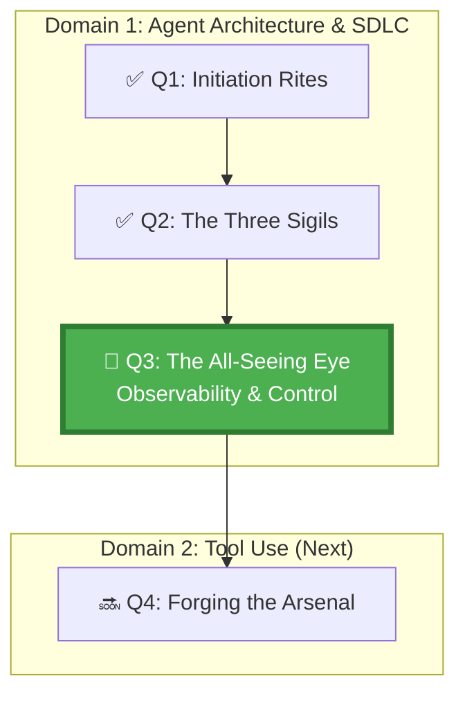

*High in the Watchtower of the GitHub Citadel, the Scriers keep vigil. They do not control the agents — the agents operate freely. But the Scriers see everything: every decision, every action, every output. When an agent strays, the Scriers raise the alarm. Without them, the Citadel would fall to the very agents sworn to protect it.*

## 🗺️ Quest Network Position



## 🎯 Quest Objectives

### Primary Objectives
- [ ] **Configure execution tracing** — each agent run produces a machine-readable execution log artifact in GitHub Actions
- [ ] **Instrument inspectable artifacts** — agent outputs include structured metadata (timestamps, decision rationale, files touched)
- [ ] **Define human intervention points** — configure at least one mandatory review gate for high-risk actions without blocking routine runs
- [ ] **Verify audit trail completeness** — confirm every agent action is traceable to a specific run, commit, and actor

### Secondary Objectives
- [ ] **Dashboard a multi-run history** — use GitHub Actions API to list the last 10 agent runs with status summaries
- [ ] **Test a runaway scenario** — deliberately trigger an agent with an ambiguous task and verify the observability layer catches the drift

### Mastery Indicators
- [ ] Can explain what "observable" means for an agent vs. for a traditional microservice
- [ ] Can reconstruct exactly what an agent did, in what order, from the artifacts it produced

## 🗺️ Quest Prerequisites

- [ ] Completed Q2 (Three Sigils) — can write a plan-first agent workflow
- [ ] Comfortable creating GitHub Actions workflows (`.github/workflows/*.yml`)
- [ ] GitHub account with Actions enabled

---

## ⚔️ The Quest Begins

### Chapter 1 — Why Observability Is Different for Agents

Traditional software observability is about measuring **performance** (latency, error rates, throughput). Agent observability is about measuring **intent fidelity** — did the agent do what we meant, not just what we said?

| Dimension | Traditional Service | Autonomous Agent |
|---|---|---|
| Key metric | Latency, error rate | Intent match, scope adherence |
| Trace unit | HTTP request | Agent decision/reasoning step |
| Failure signature | Exception, 5xx | Silent hallucination, scope creep |
| Audit requirement | Optional | Mandatory for compliance |

The GH-600 exam expects you to configure agents that produce **inspectable artifacts** — structured data that a human (or another system) can read to understand exactly what happened.

---

### Chapter 2 — Instrumenting Agent Execution Traces

> **Exercise 3.1:** Create a GitHub Actions workflow that runs the Copilot coding agent and captures a structured execution trace.

```yaml
# .github/workflows/agent-with-tracing.yml
name: Agent Execution with Tracing

on:
  issues:
    types: [labeled]

permissions:
  contents: write
  pull-requests: write
  issues: write

jobs:
  agent-run:
    if: contains(github.event.label.name, 'copilot')
    runs-on: ubuntu-latest
    steps:
      - uses: actions/checkout@v4

      - name: Record run start
        id: trace_start
        run: |
          echo "start_time=$(date -u +%Y-%m-%dT%H:%M:%SZ)" >> "$GITHUB_OUTPUT"
          echo "run_id=${{ github.run_id }}" >> "$GITHUB_OUTPUT"
          echo "issue_number=${{ github.event.issue.number }}" >> "$GITHUB_OUTPUT"

      # Copilot coding agent would run here — this step represents its work
      - name: (placeholder) Copilot agent work
        id: agent_work
        run: |
          echo "Agent processing issue #${{ github.event.issue.number }}"
          # In a real scenario the agent SDK or CLI call happens here

      - name: Generate execution trace artifact
        if: always()
        run: |
          cat > agent-execution-trace.json << 'EOF'
          {
            "trace_version": "1.0",
            "run_id": "${{ github.run_id }}",
            "workflow": "${{ github.workflow }}",
            "repository": "${{ github.repository }}",
            "trigger": {
              "event": "issues.labeled",
              "issue_number": ${{ github.event.issue.number }},
              "label": "${{ github.event.label.name }}",
              "actor": "${{ github.actor }}"
            },
            "timing": {
              "started_at": "${{ steps.trace_start.outputs.start_time }}",
              "completed_at": "$(date -u +%Y-%m-%dT%H:%M:%SZ)"
            },
            "outcome": {
              "status": "${{ job.status }}",
              "agent_result": "completed"
            }
          }
          EOF

      - name: Upload trace artifact
        if: always()
        uses: actions/upload-artifact@v4
        with:
          name: agent-trace-run-${{ github.run_id }}
          path: agent-execution-trace.json
          retention-days: 90
```

**Why 90 days?** Agent audit trails should persist long enough for a post-incident review. 90 days is a common compliance minimum.

---

### Chapter 3 — Configuring a Human Intervention Gate

An intervention gate is a point where the agent pauses for human input before continuing with high-risk actions. GitHub's native mechanism is **Environments with required reviewers**.

> **Exercise 3.2:** Configure a protected environment for agent actions in your repository.

```bash
# Create the "agent-production" environment via GitHub CLI
gh api \
  --method PUT \
  -H "Accept: application/vnd.github+json" \
  /repos/{owner}/{repo}/environments/agent-production \
  -f wait_timer=0 \
  -f reviewers='[{"type":"User","id":YOUR_GITHUB_USER_ID}]' \
  -f deployment_branch_policy='{"protected_branches":false,"custom_branch_policies":true}'

echo "Environment 'agent-production' created with required reviewer"
```

Then update the workflow to use the environment for the action phase:

```yaml
  agent-act:
    needs: agent-run
    runs-on: ubuntu-latest
    environment: agent-production   # ← blocks until reviewer approves
    steps:
      - name: Execute approved agent plan
        run: |
          echo "Human approved. Executing agent plan..."
          # Agent action steps here
```

This pattern lets agents **plan freely** but **act only after explicit human approval** for production-scoped work. Routine dev-branch work doesn't need this gate.

---

### Chapter 4 — Making Agent Output Inspectable

Every artifact an agent produces should contain structured metadata linking it to the originating run.

> **Exercise 3.3:** Add a metadata header to every file your agent creates.

```python
# work/gh-600/scripts/stamp_artifact.py
# Adds agent metadata header to any file produced by the agent

import json
import sys
import os
from datetime import datetime, timezone

def stamp(filepath: str, agent_run_id: str, task: str) -> None:
    with open(filepath, 'r') as f:
        content = f.read()

    header = f"""# AGENT ARTIFACT
# Generated by: GitHub Copilot Coding Agent
# Run ID: {agent_run_id}
# Repository: {os.environ.get('GITHUB_REPOSITORY', 'unknown')}
# Timestamp: {datetime.now(timezone.utc).isoformat()}
# Task: {task}
# This file was produced autonomously. Review before merging.
# Trace: https://github.com/{os.environ.get('GITHUB_REPOSITORY', '')}/actions/runs/{agent_run_id}

"""
    with open(filepath, 'w') as f:
        f.write(header + content)
    print(f"✅ Stamped {filepath} with agent metadata")

if __name__ == "__main__":
    stamp(sys.argv[1], sys.argv[2], sys.argv[3])
```

---

### Chapter 5 — Testing Observability: The Runaway Scenario

The best way to verify your observability layer works is to deliberately trigger a scenario where an agent might go off-track.

> **Exercise 3.4:** File a GitHub issue with an intentionally vague task: *"Fix everything in the auth module."*

Observe:
1. Does the agent's execution trace log show it attempted to clarify before acting?
2. Does the agent produce a plan that you can inspect before it modifies any files?
3. Does the trace artifact include the original task text alongside the agent's interpretation?

If any of these are missing, your observability layer has a gap. Update the workflow to capture them.

---

## ✅ Quest Validation

```bash
python3 scripts/validate_quest.py --quest q3

# Expected:
# ✅ Workflow: agent-with-tracing.yml present
# ✅ Trace artifact: agent-execution-trace.json schema valid
# ✅ Environment gate: agent-production configured
# ✅ Artifact stamping: stamp_artifact.py present
# 🏆 Quest Q3 complete!
```

---

## 🏆 Quest Rewards

| Reward | Details |
|---|---|
| 🔭 Observability Warden Badge | Earned on completion |
| 👁️ Agent Tracing & Audit | Skill unlocked |
| 80 XP | Added to Level 1000 total |
| Unlocks | [Q4: Forging the Agent's Arsenal](/quests/1000/agentic-tool-selection-and-permissions/) |

---

## 🔗 Continue Your Journey

- **Next quest:** [Q4: Forging the Agent's Arsenal](/quests/1000/agentic-tool-selection-and-permissions/) — Domain 2 begins
- **Chronicle post:** [Embedding Agents in the SDLC](/posts/embedding-agents-in-the-sdlc/)
- **Related note:** [Evaluation Signals Table](/notes/gh-600/evaluation-signals-table/)

## 🕸️ Knowledge Graph

*Structured wiki-links connect this quest to the IT-Journey knowledge graph. Open the [Obsidian Graph View](/docs/obsidian/graph/) to explore connections.*

**Level hub:** [[Level 1000 (8) - Cloud Computing Fundamentals]]
**Overworld:** [[🏰 Overworld - Master Quest Map]]
**Study track:** [[The Agentic Codex: GH-600 Study Hub]] · [[GH-600 Agentic AI Quick-Reference Notes]]
**Prerequisites:** [[The Three Sigils: Plan, Reason, Act]]
**Unlocks:** [[Forging the Agent's Arsenal: Tool Selection & Permissions]]
**Sequel quests:** [[Forging the Agent's Arsenal: Tool Selection & Permissions]]
**Obsidian docs:** [[Obsidian Knowledge Graph and Wiki Links]]

