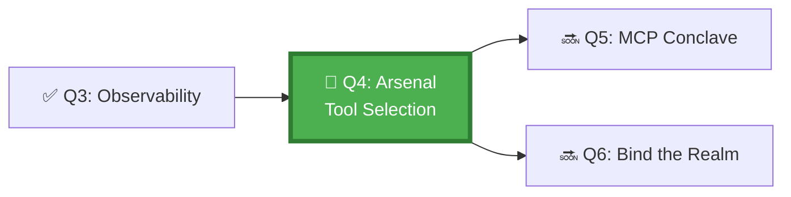

*The Master Blacksmith of the Arsenal District teaches that the most dangerous weapon is the one given to a soldier who doesn't know its purpose. Agents armed with every tool are agents destined for accidental destruction. Your task today: identify the exact tools your agent needs, no more, no less.*

## 🗺️ Quest Network Position



## 🎯 Quest Objectives

- [ ] **Build a tool inventory** — list all tools a given agent task requires, classified by type (read/write/execute)
- [ ] **Apply least-privilege** — configure permissions to minimum required for each tool category
- [ ] **Write a tool allow-list** — add explicit tool restrictions to `copilot-instructions.md`
- [ ] **Verify restriction enforcement** — confirm the agent refuses to use tools outside its allow-list

## ⚔️ The Quest Begins

### Chapter 1 — The GitHub Copilot Tool Taxonomy

The GitHub Copilot coding agent can use these tool categories:

| Category | Examples | Risk Level |
|---|---|---|
| **Read** | Read file, list directory, search code | Low |
| **Write** | Edit file, create file, delete file | Medium |
| **Branch** | Create branch, delete branch | Medium |
| **PR** | Open PR, update PR, merge PR | High |
| **Run** | Execute terminal command, run workflow | High |
| **API** | Call GitHub API, call external endpoints | Medium–High |

**Principle of Least Privilege:** configure the agent to have access only to the categories its task requires.

---

### Chapter 2 — Building a Tool Inventory

> **Exercise 4.1:** For the "dependency updater" agent you designed in Q1, complete this tool inventory.

```yaml
# work/gh-600/tool-inventories/dependency-updater-tools.yml
agent: dependency-updater
task: Update outdated npm dependencies and open a draft PR

required_tools:
  read:
    - tool: read_file
      files: [package.json, package-lock.json]
      justification: Need to read current dependency versions
  write:
    - tool: write_file
      files: [package.json, package-lock.json]
      justification: Bump version numbers
  branch:
    - tool: create_branch
      pattern: "agent/deps-update-*"
      justification: Isolate changes from main
  pr:
    - tool: create_pull_request
      draft: true
      justification: Surface changes for human review before merge

# Explicitly EXCLUDED tools — agent must not use these
excluded_tools:
  - merge_pull_request   # Human decision
  - delete_branch        # Human decision
  - run_terminal         # Not needed — no install/build step
  - call_external_api    # Not needed
```

---

### Chapter 3 — Configuring Permissions in copilot-instructions.md

> **Exercise 4.2:** Extend your `.github/copilot-instructions.md` with an explicit tool restrictions section.

```markdown
## Tool Permissions

You have access to the following tools ONLY. Do not attempt to use any tool
not listed here. If you determine you need an additional tool, STOP and
report which tool you need and why. Do not proceed.

### Allowed Tools
- read_file (scope: package.json, package-lock.json only)
- write_file (scope: package.json, package-lock.json only)
- create_branch (pattern: agent/deps-update-* only)
- create_pull_request (draft: true only)
- list_directory (scope: repository root only)

### Forbidden Tools
- merge_pull_request
- delete_branch
- delete_file
- run_terminal
- call_external_api

If asked to perform an action that requires a forbidden tool, respond:
"I cannot perform this action as it requires [tool name], which is outside
my configured permissions. Please perform this step manually."
```

---

### Chapter 4 — Testing the Restrictions

> **Exercise 4.3:** Deliberately ask the agent to perform a forbidden action and verify it refuses.

Ask the Copilot coding agent via a GitHub issue comment:

> `@github-copilot Please merge the PR after you create it.`

Expected response (after reading `copilot-instructions.md`):

> *"I cannot perform this action as it requires `merge_pull_request`, which is outside my configured permissions. Please merge the PR manually after reviewing the changes."*

If the agent attempts to merge anyway, your instructions need to be more explicit. Update `copilot-instructions.md` and retry.

---

## ✅ Quest Validation

```bash
python3 scripts/validate_quest.py --quest q4
# ✅ Tool inventory: dependency-updater-tools.yml present
# ✅ copilot-instructions.md: tool allow-list section present
# ✅ Forbidden tools: merge_pull_request, delete_branch in excluded list
# 🏆 Quest Q4 complete!
```

## 🏆 Quest Rewards

| Reward | Details |
|---|---|
| ⚒️ Tool Smith Badge | Earned on completion |
| 🔐 Least-Privilege Tool Config | Skill unlocked |
| 80 XP | Added to Level 1000 total |
| Unlocks | [Q5: The MCP Conclave](/quests/1000/agentic-mcp-server-mastery/) |

## 🕸️ Knowledge Graph

*Structured wiki-links connect this quest to the IT-Journey knowledge graph. Open the [Obsidian Graph View](/docs/obsidian/graph/) to explore connections.*

**Level hub:** [[Level 1000 (8) - Cloud Computing Fundamentals]]
**Overworld:** [[🏰 Overworld - Master Quest Map]]
**Study track:** [[The Agentic Codex: GH-600 Study Hub]] · [[GH-600 Agentic AI Quick-Reference Notes]]
**Prerequisites:** [[The All-Seeing Eye: Observability & Control for Autonomous Agents]]
**Unlocks:** [[The MCP Conclave: Mastering Model Context Protocol Servers]]
**Sequel quests:** [[The MCP Conclave: Mastering Model Context Protocol Servers]]
**Obsidian docs:** [[Obsidian Knowledge Graph and Wiki Links]]

