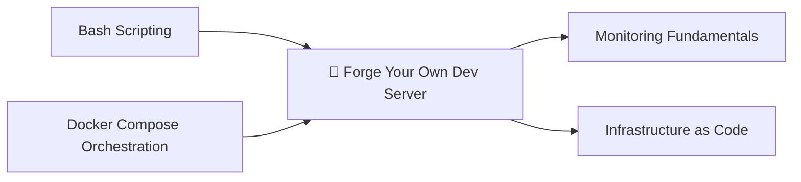

*Every cloud you have ever rented is somebody else's forge. This quest hands you the hammer: one bare machine, one evening, and a sequence of incantations that turns an anonymous slab of silicon into a named, hardened, observable development server that answers to you alone.*

*You will start from a freshly installed Debian 13 box that knows nothing about you, and finish with a machine that carries your name, refuses strangers at the gate, speaks Node and Python and Rust, serves a database to your laptop, and reports its own vital signs on a dashboard that never sleeps.*

## 📖 The Legend Behind This Quest

*Before the cloud, every engineer kept a machine under the desk. It hummed, it warmed the room, and it taught its keeper more about computing than any managed service ever would - because when it broke, no support ticket could save you.*

*The cloud did not make that machine obsolete; it made it optional, and therefore precious. A box you provision yourself is the only place where you can see the whole stack at once: the kernel, the package manager, the firewall table, the container runtime, the dashboard. Cloud quests teach you to describe infrastructure. This quest teaches you what you are describing.*

## 🧪 About the Screenshots in This Quest

Every terminal image below is a **real capture from a real run**, not a mock-up. The whole sequence was executed against a clean `debian:trixie-slim` container - a disposable stand-in for a fresh Debian 13 install - and the service-stack chapter ran against a live Docker daemon. The transcripts were recorded as the commands executed and then rendered to images, the same way IT-Journey's own quest-walkthrough tooling seals its evidence.

That honesty cuts both ways: where the sandbox could not reproduce something a real machine does, this quest says so instead of faking it. Look for the **⚠️ Sandbox note** callouts.

## 🎯 Quest Objectives

By the time you complete this journey, you will have mastered:

### Primary Objectives (Required for Quest Completion)
- [ ] **Reconnaissance** - Read a machine's identity, capacity, and storage before changing anything
- [ ] **The Foundation** - Bring the system current and install a deliberate, minimal toolset
- [ ] **Identity and Access** - Name the host, create your user, and grant sudo safely
- [ ] **The Perimeter** - Close every port by default and open only what the LAN needs
- [ ] **Toolchains** - Install per-user Node, Python, and Rust that survive OS upgrades
- [ ] **The Service Stack** - Run Postgres, Redis, and a database UI as restart-safe containers
- [ ] **The Console Mirror** - Share one terminal between the physical monitor and your SSH session
- [ ] **The Watchtower** - Write a health check and put it on a dashboard that refreshes itself
- [ ] **The Watchtower's Eye** - Run btop as your primary instrument, and fix it when it refuses to draw
- [ ] **The Operator's Toolkit** - Drive containers, repositories and disk usage from purpose-built TUIs

### Secondary Objectives (Bonus Achievements)
- [ ] **Idempotent Scripts** - Capture the whole build as scripts you can re-run without harm
- [ ] **Health History** - Log every check to disk so you can answer "when did this start?"
- [ ] **Wake Discipline** - Stop the box from sleeping, and learn to wake it when it does
- [ ] **Release-Tarball Installs** - Install tools that never shipped as Debian packages

### Mastery Indicators
You'll know you've truly mastered this quest when you can:
- [ ] Explain every line of your firewall table without looking it up
- [ ] Add a new check to the health script and see it on the dashboard within one refresh
- [ ] Rebuild the entire box from your scripts onto a second machine
- [ ] Diagnose a check that reports the wrong verdict because of the user it runs as
- [ ] Explain why btop refuses to draw, from the error alone, in under a minute

## 🗺️ Quest Prerequisites

### 📋 Knowledge Requirements
- [ ] Completion of [Bash Scripting](/quests/0010/bash-scripting/) - you will write and read shell scripts throughout
- [ ] Comfort with the terminal: navigation, file editing, reading exit codes
- [ ] Container basics, ideally [Docker Compose Orchestration](/quests/0100/docker-compose-orchestration/)

### 🛠️ System Requirements
- [ ] A machine to sacrifice: an old desktop, a spare laptop, a VM, or a cloud instance
- [ ] Debian 13 (trixie) freshly installed, with network access
- [ ] Physical or SSH access with an account that can `sudo`
- [ ] A second computer on the same network to connect from

### 🧠 Skill Level Indicators
- [ ] You would rather understand a machine than click through a control panel
- [ ] You can read an error, form a hypothesis, and test it without panic

## 🌍 Choose Your Adventure Platform

The **server** is Debian either way. This section is about the machine you drive it *from*.

### 🍎 macOS Kingdom Path
```bash
# Reach the box and give it a memorable name in your SSH config
ssh-keygen -t ed25519 -C "$(whoami)@$(hostname)"     # if you have no key yet
ssh-copy-id forge@192.168.4.89                        # push your public key
printf 'Host forge\n  HostName 192.168.4.89\n  User forge\n' >> ~/.ssh/config
ssh forge
```

### 🪟 Windows Empire Path
```powershell
# OpenSSH ships with Windows 10+; WSL2 also works and behaves like the Linux path
ssh-keygen -t ed25519
type $env:USERPROFILE\.ssh\id_ed25519.pub | ssh forge@192.168.4.89 "mkdir -p ~/.ssh && cat >> ~/.ssh/authorized_keys"
ssh forge@192.168.4.89
```

### 🐧 Linux Territory Path
```bash
ssh-keygen -t ed25519
ssh-copy-id forge@192.168.4.89
ssh forge@192.168.4.89
```

### ☁️ Cloud Realms Path
```bash
# No spare hardware? Rent the metal for an hour - every command below is identical.
# Any Debian 13 image on any provider works; a 2 vCPU / 4 GB instance is plenty.
ssh admin@<instance-public-ip>
```

## 🧙‍♂️ Chapter 1: Reconnaissance - Know the Machine

### ⚔️ Skills You'll Forge in This Chapter
- Reading a machine's true identity before trusting any assumption about it
- Establishing the baseline you will compare against for the rest of the build

Never change a system you have not measured. Four commands tell you what you are standing on: which Debian, which kernel and architecture, how much compute and memory, and how much disk you have to spend.

```bash
cat /etc/os-release | head -3      # which distribution and release
uname -srm                          # kernel version and CPU architecture
nproc                               # how many cores you can spend
grep -E "^(MemTotal|MemAvailable)" /proc/meminfo   # memory, before anything is running
df -h /                             # room on the root filesystem
id && hostname                      # who you are and where you are
```


Note what the machine calls itself right now: `debian`, the name the installer gave it. By the end of Chapter 3 it will answer to a name you chose.

> **Why `/proc/meminfo` and not `free -h`?** On a minimal install, `free` may not exist yet - it arrives with the `procps` package in the next chapter. `/proc/meminfo` is provided by the kernel itself and is always there. Reconnaissance should never depend on software you have not installed.

### 🔍 Knowledge Check: Reconnaissance
- [ ] Can you state your machine's architecture and why it determines which binaries you can install?
- [ ] Which number here would make you reconsider running a database on this box?

## 🧙‍♂️ Chapter 2: The Foundation - Bring the System Current

### ⚔️ Skills You'll Forge in This Chapter
- Distinguishing "update" from "upgrade" and knowing when each matters
- Choosing a deliberate toolset instead of installing a distribution's kitchen sink

```bash
sudo apt-get update                 # refresh the package lists
sudo apt-get upgrade -y             # bring installed packages current

# One deliberate toolset: shell, multiplexer, editor, search, JSON, process view
sudo apt-get install -y \
  sudo curl git build-essential zsh tmux vim \
  ripgrep fd-find jq htop ca-certificates unzip procps iproute2 less
```


Always finish an install by proving the tools answer:

```bash
git --version && tmux -V && zsh --version && jq --version
```

> **`ripgrep` and `fd-find`** are the modern replacements for `grep -r` and `find`. On Debian the `fd` binary installs as `fdfind` to avoid a name collision; alias it with `alias fd=fdfind` in your shell config.

### 🔍 Knowledge Check: The Foundation
- [ ] What is the difference between `apt-get update` and `apt-get upgrade`?
- [ ] Why install `ca-certificates` before fetching anything over HTTPS?

## 🧙‍♂️ Chapter 3: Identity and the Keys - Name the Machine, Make Your User

### ⚔️ Skills You'll Forge in This Chapter
- Renaming a host completely, including the loopback mapping most guides forget
- Creating a user with sudo rights and validating the sudoers file before trusting it

A machine called `debian` is a machine you will confuse with the next one. Rename it - and remember that the hostname lives in **two** places.

```bash
sudo hostnamectl set-hostname forge          # the running system and /etc/hostname
printf "127.0.1.1\tforge\n" | sudo tee -a /etc/hosts   # the loopback mapping
```

Skip that second line and every `sudo` call greets you with `unable to resolve host forge` - a warning that means your name resolution disagrees with your identity.

```bash
sudo useradd -m -s /bin/zsh -G sudo forge    # home directory, zsh, sudo group
echo "forge ALL=(ALL) NOPASSWD: ALL" | sudo tee /etc/sudoers.d/forge
sudo chmod 440 /etc/sudoers.d/forge
sudo visudo -c -f /etc/sudoers.d/forge       # ALWAYS validate before logging out
```


> **The `visudo -c` habit will save you.** A malformed sudoers file locks every user out of root on a machine you may only be able to reach over SSH. Validating costs one second; recovering costs a rescue boot.

### 🔍 Knowledge Check: Identity
- [ ] Why does the hostname need to be set in `/etc/hosts` as well as `/etc/hostname`?
- [ ] What is the trade-off of `NOPASSWD: ALL` on a single-user home server versus a shared one?

## 🧙‍♂️ Chapter 4: The Perimeter - Deny by Default

### ⚔️ Skills You'll Forge in This Chapter
- Building a firewall from a default-deny posture rather than patching holes shut
- Scoping every rule to the network that should have it, not to the whole internet

The correct starting posture is *nothing gets in*. Then you open exactly what you need, to exactly who needs it.

```bash
sudo apt-get install -y ufw openssh-server

sudo ufw default deny incoming        # the posture that matters
sudo ufw allow from 192.168.4.0/24 to any port 22   proto tcp comment "ssh from LAN"
sudo ufw allow from 192.168.4.0/24 to any port 5432 proto tcp comment "postgres from LAN"
sudo ufw --force enable
sudo ufw status verbose
```


Notice the shape of those rules: not `allow 22`, but `allow from 192.168.4.0/24 ... port 22`. The first opens SSH to the entire internet; the second opens it to your house. Replace `192.168.4.0/24` with your own subnet - `ip -4 addr | grep inet` will tell you what it is.

Then harden SSH itself, and *validate the config before restarting the daemon you are connected through*:

```bash
printf "PermitRootLogin no\nPasswordAuthentication no\nPubkeyAuthentication yes\n" \
  | sudo tee /etc/ssh/sshd_config.d/10-forge.conf
sudo sshd -t && echo "sshd config valid"     # never skip this
sudo systemctl reload ssh
```

> **Copy your public key to the box *before* disabling password authentication.** Do it in the other order and you have locked yourself out of a machine that now refuses passwords. Use `ssh-copy-id forge@<ip>` from your laptop first, and keep the current session open until a second, new session succeeds.

### 🔍 Knowledge Check: The Perimeter
- [ ] Why is `default deny incoming` safer than adding deny rules for known-bad ports?
- [ ] What does `sshd -t` check, and what happens if you reload a broken config without it?

## 🧙‍♂️ Chapter 5: The Toolchains - Per-User Languages

### ⚔️ Skills You'll Forge in This Chapter
- Installing language runtimes per user instead of fighting the system package manager
- Understanding why version managers outlive the OS release you installed them on

Debian's `nodejs` package tracks Debian's release, not your project's needs. Install runtimes **per user**, with managers that let each repository pin its own version.

```bash
# Node, via fnm - fast, and switches automatically per directory
curl -fsSL https://fnm.vercel.app/install | bash -s -- --skip-shell
export PATH="$HOME/.local/share/fnm:$PATH"; eval "$(fnm env)"
fnm install --lts && fnm default lts-latest

# Python, via uv - resolver, venv manager, and interpreter installer in one binary
curl -LsSf https://astral.sh/uv/install.sh | sh
export PATH="$HOME/.local/bin:$PATH"
uv python install 3.13

# Rust, via rustup
curl --proto "=https" --tlsv1.2 -sSf https://sh.rustup.rs | sh -s -- -y --profile minimal
```


> **⚠️ Sandbox note:** the first attempt at the rustup line failed with `zsh:1: https not found`. In zsh, an unquoted `=https` triggers *equals expansion*, which tries to resolve `https` as a command. Quoting it - `--proto "=https"` - fixes it. The command above is the corrected one, and it is a genuine difference between running installers in bash and in zsh.

Persist the paths so new shells inherit them:

```bash
cat >> ~/.zshrc <<'EOF'
export PATH="$HOME/.local/share/fnm:$HOME/.local/bin:$HOME/.cargo/bin:$PATH"
eval "$(fnm env --use-on-cd)"      # switch Node version on cd, per .node-version
EOF
```

### 🔍 Knowledge Check: Toolchains
- [ ] Why does a per-user toolchain survive a distribution upgrade better than an apt-installed one?
- [ ] What does `fnm env --use-on-cd` change about entering a project directory?

## 🧙‍♂️ Chapter 6: The Service Stack - Databases as Cattle

### ⚔️ Skills You'll Forge in This Chapter
- Declaring backing services as restart-safe containers instead of hand-installed daemons
- Using health checks so "running" means "actually answering"

Every project wants a database. Installing Postgres onto the host makes it *the host's* Postgres forever. Declare it instead, in `~/dev/stack/docker-compose.yml`:

```yaml
services:
  postgres:
    image: postgres:17-alpine
    container_name: forge-postgres
    restart: unless-stopped
    environment:
      POSTGRES_USER: dev
      POSTGRES_PASSWORD: dev
      POSTGRES_DB: dev
    ports: ["5432:5432"]
    volumes: ["pgdata:/var/lib/postgresql/data"]
    healthcheck:
      test: ["CMD-SHELL", "pg_isready -U dev"]
      interval: 10s
      timeout: 5s
      retries: 5

  redis:
    image: redis:8-alpine
    container_name: forge-redis
    restart: unless-stopped
    ports: ["6379:6379"]
    command: ["redis-server", "--appendonly", "yes"]
    healthcheck:
      test: ["CMD", "redis-cli", "ping"]
      interval: 10s
      timeout: 3s
      retries: 5

  adminer:
    image: adminer:latest
    container_name: forge-adminer
    restart: unless-stopped
    ports: ["8080:8080"]
    depends_on: [postgres]

volumes:
  pgdata:
```

```bash
cd ~/dev/stack && docker compose up -d
docker compose ps                    # look for "(healthy)", not merely "Up"
```


`restart: unless-stopped` is what makes this a *server* rather than a laptop: the stack returns by itself after a power cut, and stays down only when you deliberately stop it.

### 🔍 Knowledge Check: The Service Stack
- [ ] What does a health check tell you that a "Up 2 minutes" status does not?
- [ ] Why is the named `pgdata` volume the difference between a database and a scratch pad?

## 🧙‍♂️ Chapter 7: The Console Mirror - One Terminal, Two Windows

### ⚔️ Skills You'll Forge in This Chapter
- Sharing a single tmux session between the physical console and remote clients
- Reasoning about tmux clients, sessions, and who controls the window size

Here is the trick that turns a headless box into a machine you can *watch*: instead of the physical monitor and your SSH session being separate terminals, make them two **clients of one session**. What you type over SSH appears on the monitor, live.

```bash
sudo tee /usr/local/bin/forge-console >/dev/null <<'EOF'
#!/usr/bin/env bash
# forge-console — attach to the shared console session, or create it.
SESSION="${FORGE_SESSION:-console}"
if tmux has-session -t "$SESSION" 2>/dev/null; then
  exec tmux attach-session -t "$SESSION"   # join what the monitor shows
else
  exec tmux new-session -s "$SESSION" -n shell
fi
EOF
sudo chmod +x /usr/local/bin/forge-console
```

Point the machine's console autologin at `forge-console`, and add it to your `~/.zshrc` guarded by an escape hatch, so an SSH login joins the same session:

```bash
# in ~/.zshrc — join the shared console unless explicitly opted out
[[ -z "$TMUX" && -n "$SSH_CONNECTION" && -z "$NOTMUX" ]] && exec forge-console
```


Two clients, one session - `/dev/pts/1` is the monitor, `/dev/pts/2` is your laptop, and both render the same pane. Keep the escape hatch: `ssh -t forge NOTMUX=1 zsh` gives you a private shell when you do not want an audience.

> **⚠️ Sandbox note:** tmux sizes a window to its *smallest* attached client. Two 80x24 clients squeeze the dashboard you are about to build into 80x24, whatever the monitor's real resolution. Detaching the demo clients before building it - or attaching from a maximized terminal - gives the panes room. An attempt to force this with `set-option -g window-size manual` crashed the tmux server outright in the sandbox; releasing the clients is the safer move.

### 🔍 Knowledge Check: The Console Mirror
- [ ] What is the difference between a tmux *session*, *window*, *pane*, and *client*?
- [ ] Why does the `NOTMUX` escape hatch belong in the shell config from day one?

## 🧙‍♂️ Chapter 8: The Watchtower - Health You Can See

### ⚔️ Skills You'll Forge in This Chapter
- Writing a health check that renders a verdict instead of dumping raw numbers
- Assembling a self-refreshing dashboard, and logging history for later questions

A monitoring stack you have to *interpret* is not monitoring. Write a script that renders a verdict - `OK`, `WARN`, or `CRIT` - for each thing that can go wrong.

```bash
sudo tee /usr/local/bin/forge-health >/dev/null <<'EOF'
#!/usr/bin/env bash
# forge-health — one-screen health verdict for the dev box.
G=$'\e[32m'; Y=$'\e[33m'; R=$'\e[31m'; D=$'\e[2m'; N=$'\e[0m'
ok()   { printf '%s[ OK ]%s %-11s %s\n' "$G" "$N" "$1" "$2"; }
warn() { printf '%s[WARN]%s %-11s %s\n' "$Y" "$N" "$1" "$2"; }
crit() { printf '%s[CRIT]%s %-11s %s\n' "$R" "$N" "$1" "$2"; }

printf 'forge health %s%s - up %s%s\n\n' "$D" "$(date '+%Y-%m-%d %H:%M')" \
  "$(uptime -p | sed 's/^up //')" "$N"

cores=$(nproc); load=$(awk '{print $1}' /proc/loadavg)
awk -v l="$load" -v c="$cores" 'BEGIN{exit !(l > c)}' \
  && warn load "$load (cores: $cores)" || ok load "$load (cores: $cores)"

read -r total avail <<<"$(free -m | awk '/^Mem:/{print $2, $7}')"
pct=$(( avail * 100 / total ))
[ "$pct" -lt 15 ] && crit memory "${pct}% available of ${total}Mi" \
                  || ok memory "${pct}% available of ${total}Mi"

use=$(df -P / | awk 'NR==2{print $5}' | tr -d '%'); free_h=$(df -Ph / | awk 'NR==2{print $4}')
[ "$use" -gt 85 ] && warn disk "/ ${use}% used (${free_h} free)" \
                  || ok disk "/ ${use}% used (${free_h} free)"

# NOTE: ufw status needs root. The dashboard runs as your unprivileged user,
# so ask via `sudo -n` or every refresh reports a false CRIT.
if sudo -n ufw status 2>/dev/null | grep -q "Status: active"; then
  ok firewall "ufw active"
else
  crit firewall "ufw INACTIVE"
fi

ok processes "$(ps -e --no-headers | wc -l | tr -d ' ') running"
EOF
sudo chmod +x /usr/local/bin/forge-health
```


That `sudo -n` in the firewall check is the whole lesson of this chapter, and it was a real bug caught during this build. The first version called `ufw status` directly. Run by hand it printed `[ OK ] firewall ufw active`; run on the dashboard as the unprivileged `forge` user it printed `[CRIT] firewall ufw INACTIVE` - **every five seconds, forever**. The check was not measuring the firewall. It was measuring who was asking.

Now assemble the dashboard as a window in the shared console session, so it lives on the monitor:

```bash
sudo tee /usr/local/bin/forge-dash >/dev/null <<'EOF'
#!/usr/bin/env bash
# forge-dash — build the monitoring dashboard window in the console session.
SESSION="${FORGE_SESSION:-console}"
tmux has-session -t "$SESSION" 2>/dev/null || tmux new-session -d -s "$SESSION" -n shell
tmux kill-window -t "$SESSION:dash" 2>/dev/null
tmux new-window   -d -t "$SESSION" -n dash 'top -d 5'
tmux split-window -v -t "$SESSION:dash"    'watch -tn 5 forge-health'
tmux split-window -v -t "$SESSION:dash"    'tail -f /var/log/forge/health.log'
tmux select-layout -t "$SESSION:dash" even-vertical >/dev/null
echo "dashboard built: $SESSION:dash ($(tmux list-panes -t "$SESSION:dash" | wc -l | tr -d ' ') panes)"
EOF
sudo chmod +x /usr/local/bin/forge-dash
```


Panes are sized by tmux, not by you: releasing the two 80x24 demo clients let the `dash` window take the session's full 110x45, giving each pane fourteen usable rows instead of seven. Capture the live panes to prove the dashboard is actually running rather than merely built:

```bash
tmux capture-pane -p -t console:dash.1     # the health pane
tmux capture-pane -p -t console:dash.2     # the rolling history pane
```


And log history, so you can answer *when did this start?* rather than only *what is wrong now?*

```bash
sudo install -d -o "$USER" /var/log/forge
# every 5 minutes, append a timestamped, colour-stripped snapshot
( crontab -l 2>/dev/null; echo '*/5 * * * * { date "+\%Y-\%m-\%d \%H:\%M:\%S"; /usr/local/bin/forge-health | sed "s/\x1b\[[0-9;]*m//g" | tail -n +3; echo; } >> /var/log/forge/health.log' ) | crontab -
```

### 🔍 Knowledge Check: The Watchtower
- [ ] Why did the firewall check report a different verdict on the dashboard than in your shell?
- [ ] What question can the health *log* answer that the health *screen* cannot?

## 🧙‍♂️ Chapter 9: The Watchtower's Eye - btop and Its Discontents

### ⚔️ Skills You'll Forge in This Chapter
- Replacing `top` with an instrument that shows history, not just an instant
- Diagnosing the two ways btop refuses to run, both of which you *will* hit

`top` answers "what is happening right now". It cannot answer "was this spike big, and is it over?" - and on a server, that second question is the one you actually have. **btop** draws a rolling history graph, a meter per core, memory and disk gauges, and a sortable process list, all at once.

```bash
sudo apt-get install -y btop
btop
```

Configure it once, per user, at `~/.config/btop/btop.conf`:

```ini
graph_symbol = "block"     # braille is prettier in a terminal, blocks are safer (see below)
theme_background = False   # inherit your terminal's background instead of painting its own
update_ms = 1000           # once a second is plenty for a box you are not staring at
```


That capture is btop under real load - four `sha256sum` processes were pinning cores while it ran, which is why the history graph has shape and several cores read 100%.

### 🔮 The Two Refusals

btop is opinionated about terminals, and it fails loudly rather than degrading. Both of these came up while building this quest.

**Refusal one: no measurable terminal.** Launch btop from a script, a `cron` job, or anything without a real pty and it dies immediately:

```text
ERROR: Failed to get size of terminal!
```

It is not asking for a *big* terminal, it is asking for *any* terminal it can measure. If you want btop-like data without a terminal, you want `btop --utf-force` inside a tmux pane - or a different tool entirely, because btop is a viewer, not a collector.

**Refusal two: a pane too small.** btop needs at least 80x24. Split a 45-row window three ways evenly and each pane gets 14 rows, so the dashboard you built in Chapter 8 greets you with this instead of a graph:


The fix is to stop splitting evenly and give the instrument the room it asks for. Sizes, not fractions:

```bash
# btop keeps the top ~28 rows; health and history share the rest
tmux new-window   -d -t console -n dash 'btop --utf-force'
tmux split-window -v -t console:dash.0 -l 17 'watch -tn 5 forge-health'
tmux split-window -v -t console:dash.1 -l 8  'tail -f /var/log/forge/health.log'
tmux list-panes   -t console:dash -F 'pane #P: #{pane_current_command} (#{pane_width}x#{pane_height})'
```


Those are the same three panes as Chapter 8, captured one after another - 28 rows for btop, 8 each for the health verdict and the rolling log.

> **⚠️ The sizing trap from Chapter 7 returns here.** tmux sizes a window to its *smallest attached client*, so a forgotten 80x24 session on another machine silently shrinks the monitor's dashboard until btop refuses to draw. If btop worked yesterday and not today, run `tmux list-clients` before you touch the config - the culprit is usually a stale client, not btop.

**glances** is worth knowing as the alternate view: one screen covering CPU, memory, network, disks, sensors and containers, and it can serve that same view over HTTP with `glances -w` - useful on a box whose monitor you cannot see from where you are sitting.

### 🔍 Knowledge Check: The Watchtower's Eye
- [ ] What question does a history graph answer that a snapshot cannot?
- [ ] Your dashboard shows "Terminal size too small" - name two different causes and how you would tell them apart.

## 🧙‍♂️ Chapter 10: The Operator's Toolkit - TUIs for Services, Disks, and Repos

### ⚔️ Skills You'll Forge in This Chapter
- Installing tools that ship as release tarballs rather than Debian packages
- Driving containers, repositories and disk usage without memorising flags

Not every good tool is a `.deb`. `lazygit` and `lazydocker` ship as GitHub release tarballs, so fetch them with a small reusable function rather than copying a URL out of a browser:

```bash
gh_install() {                       # gh_install <owner/repo> <binary> <asset-pattern>
  local repo="$1" bin="$2" pat="$3" ver url
  ver=$(curl -fsSL "https://api.github.com/repos/$repo/releases/latest" \
        | grep -m1 '"tag_name"' | sed -E 's/.*"v?([^"]+)".*/\1/')
  url="https://github.com/$repo/releases/download/v${ver}/${pat//VER/$ver}"
  curl -fsSL "$url" -o "/tmp/$bin.tgz"
  sudo tar -xzf "/tmp/$bin.tgz" -C /usr/local/bin "$bin"
  echo "$bin $ver installed"
}
ARCH=$([ "$(dpkg --print-architecture)" = arm64 ] && echo arm64 || echo x86_64)
gh_install jesseduffield/lazygit    lazygit    "lazygit_VER_Linux_${ARCH}.tar.gz"
gh_install jesseduffield/lazydocker lazydocker "lazydocker_VER_Linux_${ARCH}.tar.gz"
```

**lazydocker** turns the stack from Chapter 6 into something you can steer: containers with health state, live logs, stats, and restart or shell access on a keystroke.


**lazygit** does the same for repositories, which matters because a dev server accumulates them. Staging hunks, rewording commits, and reading a diff are all one key away.


**ncdu** answers the question every server eventually asks you: *where did the disk go?* It walks a tree once and sorts by size, so you can descend into the guilty directory instead of guessing.

```bash
sudo apt-get install -y ncdu duf
ncdu /usr        # navigate with arrows, delete with d, quit with q
duf              # a friendlier df: one table, colour-coded, per-filesystem
```


Finally, the small daily replacements. **eza** lists files with git status inline; **bat** is `cat` with syntax highlighting and line numbers; **fzf** turns any list into a fuzzy search; **zoxide** learns the directories you actually visit.

```bash
sudo apt-get install -y eza bat fzf zoxide
cat >> ~/.zshrc <<'EOF'
alias ls='eza --git --group-directories-first'
alias cat='batcat --style=plain'     # Debian ships bat as batcat
eval "$(zoxide init zsh)"            # then `z stack` jumps to ~/dev/stack
source /usr/share/doc/fzf/examples/key-bindings.zsh   # Ctrl-R history, Ctrl-T files
EOF
```


> **The `batcat` and `fdfind` renames are not a mistake.** Debian ships `bat` and `fd` under alternate names to avoid colliding with existing packages. Alias them and move on - but remember the real names when you write a script that must run on a machine without your dotfiles.

### 🔍 Knowledge Check: The Operator's Toolkit
- [ ] Why does `gh_install` resolve the version from the API instead of hard-coding a URL?
- [ ] `cat` is aliased to `batcat` in your shell - why might that break a script, and what protects you?

## 🎮 Mastery Challenges

### 🟢 Novice Challenge: Prove the Box
Run a single verification pass and capture the output. Every line should be something you can explain.

```bash
hostname && whoami
node --version; uv --version; rustc --version
sudo -n ufw status | head -2
tmux ls
forge-health
```


**Success Criteria:**
- [ ] The hostname is the one you chose, and `sudo` no longer warns about resolving it
- [ ] All three toolchains answer with versions
- [ ] The firewall reports `Status: active`
- [ ] `forge-health` reports no `CRIT` lines

### 🟡 Intermediate Challenge: Add a Check
Add a **swap** check and a **container count** check to `forge-health`, then watch them appear on the dashboard without restarting anything.

**Success Criteria:**
- [ ] The new checks use the same `ok`/`warn`/`crit` verdict helpers
- [ ] The container check degrades gracefully when Docker is not running
- [ ] The dashboard pane shows both within one refresh interval

### 🔴 Advanced Challenge: Rebuild From Scripts
Turn everything you ran into four idempotent scripts - `01-system.sh`, `02-user.sh`, `03-console.sh`, `04-dashboard.sh` - then prove they are idempotent by running them twice on the same box, and prove they are complete by running them on a second machine.

**Success Criteria:**
- [ ] A second run changes nothing and reports no errors
- [ ] A fresh machine reaches an identical state with no manual steps
- [ ] Each script logs to `~/setup/logs/` so a failed run can be diagnosed after the fact

## 🏆 Quest Rewards & Achievements

- 🏆 **Forgemaster of the Home Realm** - you provisioned a bare machine into a working development server
- 🔭 **Keeper of the Watchtower** - you built health checks and a dashboard for a machine you own
- 🔬 **Instrument Adept** - you read the machine through btop, lazydocker, lazygit and ncdu rather than guessing
- ⚡ **Skills unlocked:** end-to-end Linux provisioning, host firewalling, SSH hardening, per-user toolchains, container service stacks, tmux session sharing, self-authored monitoring, TUI-driven operations
- 📈 **+100 progression points** toward the Expert tier

## 🗺️ Next Steps in Your Journey

- [Monitoring Fundamentals](/quests/1010/monitoring-fundamentals/) - graduate from a health script to metrics, retention, and alerting
- [Infrastructure as Code](/quests/1000/infrastructure-as-code/) - describe this machine declaratively instead of by hand
- [Cloud Computing Fundamentals](/quests/1000/cloud-computing-fundamentals/) - compare what you built to what a provider rents you

### Character Class Recommendations
- **🛡️ Security Specialists** - extend the perimeter chapter with fail2ban, auditd, and key rotation
- **⚙️ DevOps Engineers** - drive the whole build from Ansible and diff it against these scripts
- **📊 Data Engineers** - the Postgres in Chapter 6 is a real warehouse target for later quests



## 📚 Resources

### Official Documentation
- [Debian Administrator's Handbook](https://www.debian.org/doc/manuals/debian-handbook/) - the canonical reference for everything in this quest
- [ufw manual](https://manpages.debian.org/testing/ufw/ufw.8.en.html) - every rule form, including the LAN scoping used here
- [OpenSSH sshd_config reference](https://man.openbsd.org/sshd_config) - what each hardening directive actually does
- [tmux manual](https://man.openbsd.org/tmux) - sessions, windows, panes, clients, and formats
- [Docker Compose specification](https://docs.docker.com/reference/compose-file/) - health checks and restart policies

### The Instruments
- [btop](https://github.com/aristocratos/btop) - the system monitor from Chapter 9, including its config reference
- [glances](https://nicolargo.github.io/glances/) - the alternate one-screen view, with a built-in web server
- [lazydocker](https://github.com/jesseduffield/lazydocker) and [lazygit](https://github.com/jesseduffield/lazygit) - the container and repository TUIs
- [ncdu](https://dev.yorhel.nl/ncdu) and [duf](https://github.com/muesli/duf) - disk usage, interactively and at a glance
- [eza](https://eza.rocks/), [bat](https://github.com/sharkdp/bat), [fzf](https://junegunn.github.io/fzf/) and [zoxide](https://github.com/ajeetdsouza/zoxide) - the daily replacements

### Learning Materials
- [fnm](https://github.com/Schniz/fnm), [uv](https://docs.astral.sh/uv/), and [rustup](https://rust-lang.github.io/rustup/) - the three toolchain managers installed here
- [Arch Wiki: Security](https://wiki.archlinux.org/title/Security) - distribution-agnostic hardening reference

## 🤝 Quest Completion Checklist

- [ ] The machine answers to a name you chose, in both `/etc/hostname` and `/etc/hosts`
- [ ] Your user exists, has validated sudo rights, and logs in with an SSH key
- [ ] `ufw status verbose` shows default-deny with LAN-scoped rules you can explain
- [ ] Node, Python, and Rust answer with versions from per-user installs
- [ ] `docker compose ps` shows the stack healthy and it survives a reboot
- [ ] The monitor and your SSH session share one tmux console
- [ ] `forge-health` reports verdicts, the dashboard refreshes them, and history lands in `/var/log/forge/`
- [ ] btop runs in a pane tall enough to draw, and you can explain both of its refusals
- [ ] lazydocker, lazygit and ncdu are installed and answer for the stack, your repos, and your disk
- [ ] The whole build exists as scripts you could run again tomorrow

## 🕸️ Knowledge Graph

*Structured wiki-links connect this quest to the IT-Journey knowledge graph. Open the [Obsidian Graph View](/notes/obsidian/graph/) to explore connections.*

**Level hub:** [[Level 1000 (8) - Cloud Computing]] **Overworld:** [[🏰 Overworld - Master Quest Map]] **Prerequisites:** [[Bash Scripting: Automation Fundamentals]] **Unlocks:** [[Monitoring Fundamentals: Observability Essentials]] **Related:** [[Infrastructure as Code: Terraform Fundamentals and State]]
