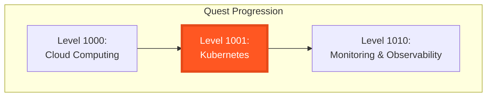
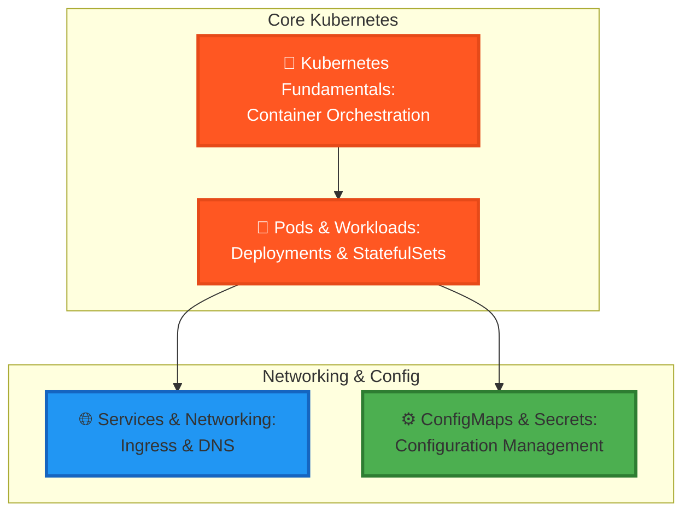

---

title: Level 1001 (9) - Kubernetes Orchestration
description: Command the container orchestration platform that powers enterprise-scale deployments
preview: images/previews/level-1001-kubernetes.png
permalink: /quests/1001/
categories:
  - Quests
  - Level-1001
  - Container-Orchestration
tags:
  - lvl-1001
  - kubernetes
  - k8s
  - containers
  - orchestration
  - devops
  - quest-collection
lastmod: 2025-12-20
toc: true
toc_sticky: true
draft: false

level: 1001
date: 2025-12-20T20:02:51.000Z

---

# Level 1001 (9) - Kubernetes Orchestration

*Beyond the realm of single containers lies a vast federation of pods, services, and deployments. Welcome to the Kubernetes Dominion—where container orchestration transforms chaos into harmony and applications scale to meet the demands of millions. Here, Expert-tier adventurers learn to command the most powerful orchestration platform in the realm.*

## 🎯 Level Overview

**Theme**: Container Orchestration | **XP Range**: 900-1100 | **Tier**: Expert 🔥

Kubernetes (K8s) is the industry-standard platform for container orchestration, and mastering it is essential for modern DevOps and cloud-native development. This level takes you from understanding K8s architecture to deploying and managing production workloads.

You'll learn to work with pods, deployments, services, and ingress controllers. You'll understand how Kubernetes manages configuration through ConfigMaps and Secrets, and how to implement persistent storage for stateful applications.

### Level Positioning in Quest Network


```mermaid
graph TB
    subgraph "Quest Progression"
        PrevLevel[Level 1000:<br/>Cloud Computing]
        CurrentLevel[Level 1001:<br/>Kubernetes]
        NextLevel[Level 1010:<br/>Monitoring & Observability]
    end
    
    PrevLevel --> CurrentLevel
    CurrentLevel --> NextLevel
    
    style CurrentLevel fill:#FF5722,stroke:#E64A19,stroke-width:4px,color:#fff
```

## 🎓 Core Learning Objectives

By completing this level, adventurers will master:

### Knowledge Objectives
- [ ] **Kubernetes Architecture** - Understanding control plane, nodes, and core components
- [ ] **Pod Lifecycle** - Container runtime, scheduling, and resource management
- [ ] **Networking Model** - Services, DNS, Ingress, and network policies

### Skill Objectives
- [ ] **kubectl Mastery** - Command-line management of K8s resources
- [ ] **YAML Manifests** - Writing deployments, services, and configurations
- [ ] **Troubleshooting** - Debugging pods, services, and networking issues

### Application Objectives
- [ ] **Production Deployments** - Deploy real applications to K8s clusters
- [ ] **Configuration Management** - Use ConfigMaps and Secrets effectively
- [ ] **Scaling & Updates** - Implement rolling updates and horizontal scaling

## 🗺️ Level Quest Map


```mermaid
graph TB
    subgraph "Core Kubernetes"
        MQ1[🎯 Kubernetes Fundamentals:<br/>Container Orchestration]
        MQ2[🎯 Pods & Workloads:<br/>Deployments & StatefulSets]
    end
    
    subgraph "Networking & Config"
        NQ1[🌐 Services & Networking:<br/>Ingress & DNS]
        CQ1[⚙️ ConfigMaps & Secrets:<br/>Configuration Management]
    end
    
    MQ1 --> MQ2
    MQ2 --> NQ1
    MQ2 --> CQ1
    
    style MQ1 fill:#FF5722,stroke:#E64A19,stroke-width:3px,color:#fff
    style MQ2 fill:#FF5722,stroke:#E64A19,stroke-width:3px,color:#fff
    style NQ1 fill:#2196F3,stroke:#1565C0,stroke-width:3px
    style CQ1 fill:#4CAF50,stroke:#2E7D32,stroke-width:3px
```

## 📚 Quest Inventory

### Main Quests (Required)

| Quest | Difficulty | Time | XP | Status |
|-------|-----------|------|-----|--------|
| [Kubernetes Fundamentals](kubernetes-fundamentals.md) | 🔴 Hard | 120-150 min | 200 | 📋 Placeholder |
| [Pods & Workloads](k8s-pods-workloads.md) | 🔴 Hard | 90-120 min | 180 | 📋 Placeholder |
| [Services & Networking](k8s-services-networking.md) | 🔴 Hard | 90-120 min | 180 | 📋 Placeholder |
| [ConfigMaps & Secrets](k8s-config-secrets.md) | 🔴 Hard | 75-90 min | 140 | 📋 Placeholder |

## 🛠️ Required Tools & Technologies

### Kubernetes Tools
- **kubectl** - Kubernetes CLI
- **minikube** or **kind** - Local K8s clusters
- **k9s** - Terminal UI for K8s
- **Lens** - Kubernetes IDE (optional)

### Cloud K8s Services
- **EKS** (AWS) - Elastic Kubernetes Service
- **GKE** (Google) - Google Kubernetes Engine
- **AKS** (Azure) - Azure Kubernetes Service

### Development Tools
- **Helm** - Kubernetes package manager
- **Kustomize** - Configuration customization
- **VS Code** - With Kubernetes extension

### Container Registry
- **Docker Hub** - Public registry
- **ECR/GCR/ACR** - Cloud provider registries
- **Harbor** - Self-hosted registry

## 📋 Prerequisites

Before beginning this level, ensure completion of:

- ✅ **Level 1000** - Cloud computing fundamentals
- ✅ **Level 0100** - Docker and container basics
- ✅ **Level 0101** - CI/CD fundamentals
- ✅ Docker Desktop or equivalent installed
- ✅ Basic YAML knowledge

## 💡 Learning Environment Options

### Local Development (Recommended for Learning)
```bash
# Option 1: minikube
minikube start --driver=docker

# Option 2: kind (Kubernetes in Docker)
kind create cluster

# Option 3: Docker Desktop (Enable Kubernetes in settings)
```

### Cloud-Based (For Production Patterns)
- AWS EKS with Free Tier EC2 nodes
- Google Cloud GKE (free tier available)
- Azure AKS (free control plane)

## 🏆 Level Completion Rewards

Upon completing all main quests:

- 🎖️ **Title**: Kubernetes Commander
- ⚔️ **Skill Unlock**: Container orchestration mastery
- 🔓 **Next Level**: Monitoring & Observability (1010)
- 📜 **Certificate**: Kubernetes Fundamentals (CKA preparation)

## 🔗 Related Resources

- [Kubernetes Documentation](https://kubernetes.io/docs/)
- [Kubernetes The Hard Way](https://github.com/kelseyhightower/kubernetes-the-hard-way)
- [CNCF Kubernetes Tutorials](https://kubernetes.io/docs/tutorials/)
- [kubectl Cheat Sheet](https://kubernetes.io/docs/reference/kubectl/cheatsheet/)

---

**Level Status**: 📋 Placeholder quests generated | **Quests**: 4 | **Est. Time**: 7-9 hours


## Available Quests

| Quest | Difficulty | Time | Type | Status |
|-------|------------|------|------|--------|
| [Azure Ascension: Deploying Jekyll to the Cloud Kingdom](/quests/azure-ascension-jekyll-deployment/) | 🔴 Hard | 90-120 minutes | main_quest | ✅ Complete |
| [Kubernetes ConfigMaps and Secrets: Configuration Management Best Practices](/quests/level-1001-k8s-config-secrets/) | 🔴 Hard | 75-90 minutes | main_quest | 🔮 Placeholder |
| [Kubernetes Pods and Workloads: Deployments and StatefulSets](/quests/level-1001-k8s-pods-workloads/) | 🔴 Hard | 90-120 minutes | main_quest | 🔮 Placeholder |
| [Kubernetes Services and Networking: Ingress and DNS Configuration](/quests/level-1001-k8s-services-networking/) | 🔴 Hard | 90-120 minutes | main_quest | 🔮 Placeholder |
| [Kubernetes Fundamentals: Container Orchestration Essentials](/quests/level-1001-kubernetes-fundamentals/) | 🔴 Hard | 120-150 minutes | main_quest | 🔮 Placeholder |


