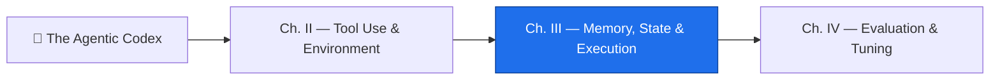

*The agent stands again at the threshold of your repository, exactly as it stood yesterday — and it remembers nothing. Not the decision you reached together at dusk, not the file it carefully rewrote, not the plan it swore to follow. Every workflow run is a fresh-summoned familiar with no past. This is not a flaw to be patched over; it is the iron law of the realm. An agent forgets by design — and so **memory is something you must build, deliberately, from stone you lay yourself.***

*Beneath this castle lie the Vaults of Recollection. Some chambers hold what vanishes when a single job ends. Some hold what survives a run but no longer. And one deep vault — sealed with a committed file — holds what endures across every awakening. Learn which vault holds which truth, and you will have learned the lesson on which 19% of the GH-600 exam turns, and the skill on which most real agentic systems quietly fail. The real-world stakes are blunt: an agent that "forgets" a prior decision will happily undo a colleague's work, re-run an irreversible step, or ship a plan built on a world that no longer exists.*

## 📖 The Legend Behind This Quest

Every agentic AI design eventually collides with the same wall: agents do not automatically remember things across tasks. A GitHub Actions workflow starts in a clean, ephemeral runner every single time. A Copilot coding-agent session begins with no recollection of the conversation before it. This is **by design** — isolation is what makes runs reproducible and safe — but it means memory is your responsibility, not the model's.

The Agentic Codex models this with **three tiers** of memory, each mapped to a concrete GitHub primitive: ephemeral memory inside one job, session memory across jobs in one run, and persistent memory across runs. Get the tiers wrong and you get the quiet failure mode of agentic systems — **context drift** — where what the agent *believes* about the world has silently diverged from what is *true*. This chapter (GH-600 Domain 3, 19% of the exam) teaches you to choose the right vault for each memory, to detect drift before it corrupts a run, and to hand context cleanly across the tools and surfaces a task crosses on its way from issue to merge.

## 🎯 Quest Objectives

### Primary Objectives

- [ ] Map the **three memory tiers** (ephemeral, session, persistent) to their GitHub Actions primitives
- [ ] Persist a plan from a planning job and consume it in an execution job using **artifacts**
- [ ] Commit a **persistent memory file** that survives across workflow runs
- [ ] Build a **state-snapshot drift detector** that aborts or re-plans when key files change mid-run
- [ ] Write a **context-handoff document** that carries intent across issue → branch → PR → Actions

### Mastery Indicators

- [ ] You can be handed a piece of agent state and place it in the correct tier without hesitation
- [ ] You can explain the three causes of context drift and the snapshot that catches them
- [ ] You can describe how Copilot, MCP, and Actions each see (or fail to see) shared state

## 🗺️ Quest Prerequisites

Before you descend into the vaults, confirm your bench is ready:

- **Chapter II cleared** — you should already know how an agent selects tools and binds to an environment (see [Tool Use & Environment](/quests/1000/agentic-codex-02-tool-use-and-environment/)). Memory builds directly on that execution context.
- **A GitHub repository you own, with Actions enabled** — you will run real workflows that upload artifacts and commit files.
- **Comfort reading workflow YAML** — you will edit `.github/workflows/` and reason about jobs, steps, and `needs:`.
- **Basic JSON + shell** — the drift detector and handoff document are a few lines each of `jq`, `sha256sum`, and `bash`.
- **Access to GitHub Copilot + a Models/MCP-capable agent** — so the memory you build has a mind to serve.

## 🧙‍♂️ Chapter 1: The Three Vaults — Mapping Agent Memory to GitHub Primitives

### ⚔️ Skills You'll Forge

- Distinguishing short-term, long-term, and external memory for an agent (GH-600 sub-skill 3.1)
- Mapping each tier to a concrete GitHub Actions mechanism
- Scoping memory to *task-relevant* information and defining expiration/reset rules

The single most useful mental model in Domain 3 is the **three-tier vault**. Each tier answers one question — *how long must this survive?* — and each maps to a different GitHub primitive. Choosing the wrong tier is the root cause behind most "the agent forgot" exam scenarios.

**Tier 1 — Ephemeral memory** lives and dies inside a single job. It is the `env:` block, values written to the `$GITHUB_ENV` file, and step `outputs`. When the job ends, it is gone. Use it for intermediate calculations, step-to-step data passing, and temporary counters — never for anything the next job needs.


```yaml
# Tier 1 — ephemeral: a value passed step-to-step inside ONE job
- name: Compute a plan id
  id: plan
  run: echo "plan_id=plan-$(date +%s)" >> "$GITHUB_OUTPUT"
- name: Use it later in the SAME job
  run: echo "Working on ${{ steps.plan.outputs.plan_id }}"
```


**Tier 2 — Session memory** persists for the duration of one workflow *run*, across jobs. In GitHub Actions this is implemented with **artifacts**: one job uploads a file, a later job downloads it. This is the canonical way to carry a *plan* generated in a planning phase into a separate *execution* phase — the plan/act boundary you forged in Domain 1, now made durable.

**Tier 3 — Persistent memory** survives across *runs*. In GitHub Actions this means **repository files** the agent commits and pushes, or the **Actions cache** for non-authoritative data. Use it for agent instruction changelogs, a running task register, an approved-action history, or evaluation metrics that must compound over time.

| Tier | Survives | GitHub primitive | Use it for |
|---|---|---|---|
| 1 · Ephemeral | one job | `env:`, `$GITHUB_ENV`, step `outputs` | counters, step-to-step passing |
| 2 · Session | one run (across jobs) | **artifacts** (upload/download) | the plan handed from planning → execution |
| 3 · Persistent | across runs | **committed repo files** / Actions cache | changelogs, task registers, metrics |

The discipline that separates a competent design from a leaky one is **scoping and expiry**. Persistent memory is not a junk drawer — scope it to task-relevant information, and define explicit pruning and reset rules (e.g. truncate a task register to the last N entries, or reset a counter on a new milestone). Unbounded persistent memory is itself a drift source: stale entries are mistaken for current truth.

> **Exam tip (sub-skill 3.1).** When a question describes an agent "forgetting" something, the answer is almost always *"the state was placed in too short-lived a tier."* A plan needed across jobs belongs in an **artifact** (Tier 2), not a step output (Tier 1); a decision needed next week belongs in a **committed file** (Tier 3), not an artifact.

### 🔍 Knowledge Check

- [ ] Which GitHub Actions primitive implements *session* memory across jobs in one run?
- [ ] You need a decision to survive until next month's workflow run — which tier, and which mechanism?
- [ ] Why is unbounded persistent memory itself a cause of drift?

## 🧙‍♂️ Chapter 2: Carving the Vaults — Persist a Plan Across Jobs and Across Runs

### ⚔️ Skills You'll Forge

- Capturing task progress and decisions as durable artifacts (GH-600 sub-skill 3.2)
- Implementing Tier 2 with artifact upload/download between jobs
- Implementing Tier 3 with an agent-committed memory file

The plan/act split survives restarts and reviews only when the **plan** is a real, durable object rather than a fleeting chat turn. Here a `plan` job lets the agent (via the Copilot coding agent or a Models-API call) write a structured plan to disk, then **uploads it as an artifact**. A separate `act` job **downloads** that artifact and executes against it. The plan crossed a job boundary — Tier 2 session memory — without ever living in a database.


```yaml
# .github/workflows/plan-then-act.yml — Tier 2 session memory via artifacts
name: Plan then act
on: workflow_dispatch
jobs:
  plan:
    runs-on: ubuntu-latest
    steps:
      - uses: actions/checkout@v4
      # An agent step writes a structured plan to plan.json here
      - name: Write the plan
        run: |
          mkdir -p .agent
          echo '{"goal":"update changelog","steps":["read","edit","verify"]}' > .agent/plan.json
      - uses: actions/upload-artifact@v4
        with:
          name: agent-plan
          path: .agent/plan.json
  act:
    needs: plan                 # runs only after plan succeeds
    runs-on: ubuntu-latest
    steps:
      - uses: actions/checkout@v4
      - uses: actions/download-artifact@v4
        with:
          name: agent-plan
          path: .agent
      - name: Execute against the plan
        run: |
          jq -r '.steps[]' .agent/plan.json   # the act job now sees the plan
```


For **Tier 3**, the agent must write memory that outlives the run. The pattern is a committed file under a known path — `.agent/memory/task-register.json` or a Markdown changelog — pushed back to the branch by a least-privilege step. This is *resumability*: the next run reads the register and continues without repeating completed steps or contradicting prior decisions. Grant only `contents: write`; nothing here needs admin scope.


```yaml
# Tier 3 — persistent: commit a memory file so the NEXT run remembers
permissions:
  contents: write
jobs:
  remember:
    runs-on: ubuntu-latest
    steps:
      - uses: actions/checkout@v4
      - name: Append to the task register
        run: |
          mkdir -p .agent/memory
          ts=$(date -u +%FT%TZ)
          jq -n --arg ts "$ts" --arg id "${{ github.run_id }}" \
            '{run:$id, at:$ts, status:"completed"}' >> .agent/memory/task-register.jsonl
      - name: Commit the memory
        run: |
          git config user.name "agent[bot]"
          git config user.email "agent@users.noreply.github.com"
          git add .agent/memory/task-register.jsonl
          git commit -m "chore(memory): record run ${{ github.run_id }}" || echo "nothing to record"
          git push
```


When persistence must be fast and is *not* the source of truth (cached embeddings, a resolved-dependency snapshot), reach for **`actions/cache`** instead of a commit — but never trust the cache for decisions that must be auditable. The rule of thumb: **if a human or a future audit must be able to read the decision, commit it; if it is a disposable optimization, cache it.**

### 🔍 Knowledge Check

- [ ] Why does the `act` job declare `needs: plan`, and what would break without it?
- [ ] What `permissions:` scope does the Tier-3 commit step require — and what must it *not* request?
- [ ] When should persistent state go in the Actions cache rather than a committed file?

## 🧙‍♂️ Chapter 3: The Drifting World — Detect and Recover from Context Drift

### ⚔️ Skills You'll Forge

- Detecting and correcting context drift during extended execution (GH-600 sub-skill 3.2)
- Building a state snapshot and comparing it against current reality
- Choosing between *abort* and *re-plan* as recovery strategies

**Context drift** is the quiet failure of agentic systems: the state the agent *believes* the world is in diverges from the state the world *actually* is in. Three causes recur on the exam:

1. The agent read a file at the start of the run; someone else changed it mid-run.
2. The agent based its plan on a previous task's output, but that output is now stale.
3. The agent's persistent memory file was never updated after a prior run ended abnormally.

Detection (sub-skill 3.2) is mechanical and reliable: take a **state snapshot** — a hash of the key files — at the start of a task, then re-hash and compare before the agent acts on its plan. If the hashes differ, the world moved; **abort or re-plan**. Do not let the agent proceed on a snapshot of a world that no longer exists.

```bash
#!/usr/bin/env bash
# scripts/drift-guard.sh — snapshot key files, then verify before acting
set -euo pipefail
SNAP=".agent/snapshot.sha256"
WATCH=("README.md" "_config.yml" ".agent/plan.json")

snapshot() { mkdir -p "$(dirname "$SNAP")"; sha256sum "${WATCH[@]}" > "$SNAP"; echo "Snapshot taken."; }

verify() {
  if sha256sum -c "$SNAP" --quiet; then
    echo "No drift — safe to act."
  else
    echo "::warning::Context drift detected — key files changed since snapshot."
    exit 78          # neutral/abort: stop before acting on a stale world
  fi
}

case "${1:-verify}" in
  snapshot) snapshot ;;
  verify)   verify   ;;
esac
```

Wire it into the run so the snapshot is taken right after planning and verified right before acting. The `exit 78` is GitHub Actions' neutral exit — a clean way to halt a step without marking a false hard failure, then hand control to a re-plan path or a human.


```yaml
- name: Snapshot the world after planning
  run: bash scripts/drift-guard.sh snapshot
# ... agent does long-running work, other commits may land ...
- name: Verify before acting
  run: bash scripts/drift-guard.sh verify
```


Recovery is a design choice, not an afterthought. **Abort** when the changed state could make the action destructive or incorrect — better a halted run than a corrupted file. **Re-plan** when the drift is benign enough that the agent can re-read the world and regenerate its plan. The Models API and Copilot coding agent make re-planning cheap; the expensive thing is acting confidently on a stale belief.

### 🔍 Knowledge Check

- [ ] Name the three causes of context drift from this chapter.
- [ ] What does the snapshot actually compare, and why is hashing sufficient?
- [ ] When is *abort* the right recovery, and when is *re-plan* preferable?

## 🧙‍♂️ Chapter 4: Crossing the Planes — Context Continuity Across Tools

### ⚔️ Skills You'll Forge

- Sharing agent state and preventing conflicting or stale context (GH-600 sub-skill 3.3)
- Authoring a context-handoff document for the issue → branch → PR → Actions journey
- Reasoning about what Copilot, MCP, and Actions each can and cannot see

Sub-skill 3.3 is the most nuanced in Domain 3: **continuity of memory and state across tools and environments.** A single task crosses many planes — it starts as an issue, becomes a branch, opens a pull request, triggers an Actions run, and finally merges. Each surface is a different execution context with its own (lack of) memory. The Copilot coding agent that drafted the branch does not share a memory with the workflow that later runs on the PR; an MCP server the agent called is stateless between invocations unless you make it otherwise.

The key tool is a **context-handoff document** — a small JSON file that captures the relevant state at each transition. When the agent opens the PR, it writes `context-handoff.json` summarizing the issue's intent, the decisions made during planning, and any unresolved questions. When the Actions workflow runs on that PR, it **reads** the handoff to understand what it is supposed to be doing — rather than re-deriving intent and risking a conflicting interpretation.

```json
{
  "schema": "context-handoff/v1",
  "issue": 123,
  "intent": "Add a drift-guard step to the nightly agent workflow",
  "decisions": [
    "Watch README.md and _config.yml for drift",
    "Use neutral exit (78) to halt, not hard-fail"
  ],
  "open_questions": ["Should re-plan be automatic or require human approval?"],
  "produced_by": "copilot-coding-agent",
  "handoff_at": "2026-06-30T00:00:00.000Z"
}
```

This single document prevents the two failure modes named in the sub-skill. It prevents **conflicting context** — the workflow acts on the agent's actual decisions instead of guessing — and it prevents **stale context** by timestamping the handoff so a downstream consumer can reject one that is too old. Commit the handoff (Tier 3) so it travels with the branch; an MCP tool, a Models-API reasoning step, and the Actions run can all read the same source of truth.

> **Exam tip (sub-skill 3.3).** When a scenario shows two surfaces "disagreeing" about a task, the fix is almost always *share state explicitly* — a committed handoff document — rather than hoping each tool re-derives the same conclusion. Shared state beats independent re-derivation every time.

### 🔍 Knowledge Check

- [ ] Which two failure modes does a context-handoff document prevent?
- [ ] Why does the handoff carry a `handoff_at` timestamp?
- [ ] Why can't you assume the Copilot agent and the PR's Actions run already share memory?

## 🧪 Hands-On Lab: Carve All Three Vaults on Your Own Machine

*The vaults do not require a cloud — they require discipline you can practice at a terminal.* This lab builds every memory tier and the drift guard locally, in ten minutes, with `git`, `jq`, and `sha256sum`.

### Step 1 — Raise the lab realm

```bash
mkdir -p ~/codex-vaults-lab && cd ~/codex-vaults-lab
git init -q && echo "# The Realm" > README.md
mkdir -p .agent/memory scripts
git add . && git commit -qm "lab: the realm stands"
```

### Step 2 — Tier 2: hand a plan across a job boundary

Simulate the `plan` job and the `act` job as two separate shells that share **only** the artifact directory:

```bash
# --- the "plan job": writes the plan, touches nothing else
jq -n '{goal:"update changelog",steps:["read","edit","verify"]}' > .agent/plan.json

# --- the "act job": knows nothing except what the artifact tells it
jq -r '.steps[]' .agent/plan.json
```

Expected:

```text
read
edit
verify
```

The act shell recovered the plan's full intent from the artifact alone. That is Tier 2: state that survives the job boundary because you made it a **file**, not a memory.

### Step 3 — Tier 3: commit memory the next run can read

```bash
jq -n --arg ts "$(date -u +%FT%TZ)" '{run:"local-1", at:$ts, status:"completed"}' \
  >> .agent/memory/task-register.jsonl
git add .agent/memory && git commit -qm "chore(memory): record run local-1"

# A "next run", hours later, asks: what already happened?
jq -r '.run + " → " + .status' .agent/memory/task-register.jsonl
```

Expected: `local-1 → completed` — the next run resumes instead of repeating. Delete your shell history if you like; the memory is in Git now, which is the point.

### Step 4 — The drift guard catches a moved world

Save the `drift-guard.sh` script from Chapter 3 above into `scripts/drift-guard.sh` (`chmod +x` it), then:

```bash
# Snapshot right after "planning"
bash scripts/drift-guard.sh snapshot

# Verify immediately — the world has not moved
bash scripts/drift-guard.sh verify; echo "exit=$?"

# Now the world moves out from under the agent…
echo "a rival scribe edits the scroll" >> README.md
bash scripts/drift-guard.sh verify; echo "exit=$?"
```

Expected:

```text
Snapshot taken.
No drift — safe to act.
exit=0
::warning::Context drift detected — key files changed since snapshot.
exit=78
```

*(Adjust the `WATCH` array in the script to `("README.md" ".agent/plan.json")` for this lab — the realm has no `_config.yml`.)* The `exit=78` is your abort-before-acting signal: the plan was drawn against a world that no longer exists, and the guard refused to let the agent pretend otherwise.

### Step 5 — Prove you can place state in its tier

Close the lab with the placement drill from the Mastery Indicators. For each item, say the tier aloud before checking: a retry counter inside one job (*Tier 1 — ephemeral*), the plan crossing plan→act (*Tier 2 — artifact*), the task register (*Tier 3 — committed file*), a cached dependency graph (*Tier 3 — cache, non-authoritative*). If any answer surprised you, re-read Chapter 1's table — the exam will hand you exactly this drill.

## ⚔️ The Quests of This Domain

This chapter is the map of the Vaults; these three quests are the chambers you descend into. Each carries complete workflows, drift-detection scripts, and the handoff schema — finish all three to seal Domain 3.

- 🧠 [**Vaults of Recollection: Agent Memory Strategies**](/quests/1001/agentic-memory-strategies/) — choose between short-term, long-term, and external memory, scope it to the task, and set expiration and reset rules (sub-skill 3.1).
- 🧭 [**Anchoring the Drifting Agent: Stop Context Drift**](/quests/1010/agentic-state-persistence-and-drift/) — capture progress as durable artifacts, resume without repeating steps, and detect and correct drift mid-run (sub-skill 3.2).
- 🌉 [**Crossing the Tool Planes: State Continuity Across Tools**](/quests/1010/agentic-state-continuity-cross-tools/) — share agent state across surfaces and prevent conflicting or stale context with a handoff document (sub-skill 3.3).

## 🎮 Mastery Challenge

**Objective:** Build a workflow whose agent genuinely remembers — across jobs, across runs, and across surfaces.

- [ ] A `plan` job writes a structured plan and uploads it as an artifact; an `act` job downloads and executes against it (Tier 2 proven)
- [ ] The workflow commits a `.agent/memory/` register that a *subsequent* run reads to avoid repeating completed work (Tier 3 proven)
- [ ] `scripts/drift-guard.sh` snapshots key files after planning and halts the run with a neutral exit when they change before acting
- [ ] The agent writes a `context-handoff.json` on PR creation that the PR's Actions run reads to recover intent
- [ ] You can hand any one of these four pieces of state to a peer and have them name its correct tier

## 🎁 Rewards & Progression

- 🧠 **Keeper of the Vault** — you mastered the three tiers of agent memory
- 🧭 **Drift Hunter** — you built a state snapshot that catches context drift
- 🗄️ **Skill unlocked:** Three-tier agent memory design (ephemeral / session / persistent)
- 🌉 **Skill unlocked:** Cross-surface context handoff across issue → PR → Actions
- **+90 XP** toward GH-600 mastery

## 🗺️ Quest Network



## 🔮 Next Adventures

The vaults are carved and the world can no longer drift out from under your agent. But memory that is never measured is memory you cannot trust — and that is the next domain.

- ➡️ **Next chapter:** [Chapter IV — Evaluation & Tuning](/quests/1010/agentic-codex-04-evaluation-and-tuning/)
- ⬅️ **Previous chapter:** [Chapter II — Tool Use & Environment](/quests/1000/agentic-codex-02-tool-use-and-environment/)
- 🏰 **Campaign hub:** [Epic Quest: The Agentic Codex](/quests/codex/agentic-codex/)

## 📚 Resource Codex

- [GH-600 Study Guide — Developing in Agentic AI Systems](https://learn.microsoft.com/en-us/credentials/certifications/resources/study-guides/gh-600) — the official skills-measured list; Domain 3 is 19% of the exam
- [GitHub Copilot coding agent documentation](https://docs.github.com/en/copilot/using-github-copilot/coding-agent) — the agent whose sessions start without memory
- [Storing workflow data as artifacts](https://docs.github.com/en/actions/using-workflows/storing-workflow-data-as-artifacts) — Tier 2 session memory
- [Caching dependencies with `actions/cache`](https://docs.github.com/en/actions/using-workflows/caching-dependencies-to-speed-up-workflows) — non-authoritative persistent state
- [Model Context Protocol (MCP)](https://modelcontextprotocol.io/introduction) — stateless tool surfaces that need explicit shared state
- [GitHub Models](https://docs.github.com/en/github-models) — the reasoning engine behind cheap re-planning
- [GH-600 Study Hub](/notes/gh-600/) — the campaign map: domains, weights, and the full quest line
- 🏰 **In the wild (this repo):** [`scripts/ai/drift-guard.sh`](https://github.com/bamr87/it-journey/blob/main/scripts/ai/drift-guard.sh) is this chapter's drift detector in production, and the committed [`.quests/` ledger](https://github.com/bamr87/it-journey/blob/main/.quests/README.md) is Tier-3 memory the quest-perfection loop resumes from daily. Full domain map: [GH-600 in the Wild](/notes/gh-600/implemented-in-it-journey/)

## 🕸️ Knowledge Graph

*Structured wiki-links connect this quest to the IT-Journey knowledge graph. Open the [Obsidian Graph View](/notes/obsidian/graph/) to explore connections.*

**Campaign hub:** [[Epic Quest: The Agentic Codex]]
**Previous:** [[Tool Use & Environment]]
**Next:** [[Evaluation & Tuning]]
**Domain quests:** [[Vaults of Recollection: Agent Memory Strategies]] · [[Anchoring the Drifting Agent: Stop Context Drift]] · [[Crossing the Tool Planes: State Continuity Across Tools]]
**Reference:** [[Taming Agent Memory and Context Drift]]
**Obsidian docs:** [[Obsidian Knowledge Graph and Wiki Links]]
