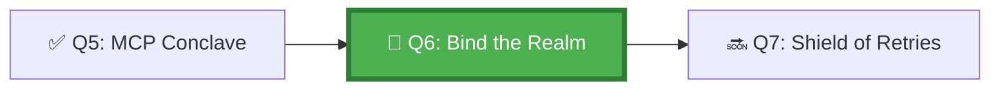

*Before a soldier enters battle, their weapons are sharpened, their armor fitted, their orders memorised. An agent entering a repository without an `AGENTS.md` is a soldier sent to an unknown castle with a broken sword. The Barracks Masters spend their days writing the binding documents that turn a strange repository into a familiar home for any agent that enters.*

## 🗺️ Quest Network Position



## 🎯 Quest Objectives

- [ ] **Write an `AGENTS.md`** — create the canonical agent operating guide for a sample repository
- [ ] **Configure a dev container** — define `devcontainer.json` with agent-required tools and secrets
- [ ] **Validate environment parity** — verify the agent runs identically in Codespaces and locally
- [ ] **Document environment dependencies** — list all required secrets, tokens, and tool versions in AGENTS.md
- [ ] **Test cold-start** — spin up a fresh Codespace and confirm the agent can run without manual setup

## ⚔️ The Quest Begins

### Chapter 1 — The Purpose of AGENTS.md

`AGENTS.md` is the agent-readable README. While `README.md` is written for humans, `AGENTS.md` is written for AI agents — it tells them how to operate in this specific repository.

Key sections an `AGENTS.md` must include:

| Section | Purpose |
|---|---|
| Project Overview | What the repo is, what the agent can and cannot do here |
| Available Tools | Which MCP servers, CLI tools, and APIs are configured |
| Restricted Areas | Files and directories the agent must not touch |
| Test Commands | How to run tests to validate changes |
| Build Commands | How to build the project |
| PR Guidelines | Branch naming, commit format, review requirements |

---

### Chapter 2 — Writing AGENTS.md

> **Exercise 6.1:** Create `AGENTS.md` in the root of your sandbox repository.

```markdown
# AGENTS.md — Agent Operating Guide

This file provides operating instructions for AI agents (GitHub Copilot
coding agent, and any MCP-compatible agent) working in this repository.
Read this file before taking any action.

## Repository Overview

- **Type:** Node.js REST API
- **Language:** JavaScript (Node.js 18)
- **Package manager:** npm
- **Test runner:** Jest
- **CI:** GitHub Actions

## Agent Permissions

### Allowed Operations
- Read any file in `src/`, `test/`, and `docs/`
- Write to `src/` and `test/` only
- Create branches with pattern `agent/*`
- Open draft PRs targeting `main`
- Run `npm test` and `npm run lint`

### Forbidden Operations
- Do NOT modify `.github/workflows/` without explicit permission
- Do NOT modify `package.json` dependencies without a separate task
- Do NOT delete any file — mark as deprecated instead
- Do NOT merge PRs or delete branches

## Available Tools

### MCP Servers
- `github`: GitHub API (issues, PRs, code search) — read-only scope
- `sandbox`: Internal validation tools — see `work/gh-600/mcp-server/`

### CLI Tools (available in devcontainer)
- `git`, `node`, `npm`, `gh` (GitHub CLI, read-only PAT)
- `jq` for JSON processing

## Test Commands

```bash
# Run all tests
npm test

# Run tests with coverage
npm test -- --coverage

# Lint
npm run lint
```markdown

## Build Commands

```bash
# Build for production
npm run build

# Start development server
npm run dev
```bash

## Commit Message Format

Follow conventional commits: `type(scope): description`
Types: feat, fix, docs, refactor, test, chore

## Secrets Available

The following environment variables are set in the devcontainer:
- `GITHUB_TOKEN` — fine-grained PAT, read-only (issues, PRs, metadata)
- `NODE_ENV` — set to "development"

Do NOT use any other secrets. If your task requires a secret not listed
here, STOP and report what you need.
```

---

### Chapter 3 — Configuring the Dev Container

> **Exercise 6.2:** Create `.devcontainer/devcontainer.json` for agent-consistent environments.

```json
// .devcontainer/devcontainer.json
{
  "name": "Agent-Ready Development Environment",
  "image": "mcr.microsoft.com/devcontainers/javascript-node:1-18-bullseye",
  "features": {
    "ghcr.io/devcontainers/features/github-cli:1": {
      "version": "latest"
    }
  },
  "customizations": {
    "vscode": {
      "extensions": [
        "GitHub.copilot",
        "GitHub.copilot-chat",
        "GitHub.vscode-github-actions",
        "dbaeumer.vscode-eslint"
      ],
      "settings": {
        "terminal.integrated.defaultProfile.linux": "bash"
      }
    }
  },
  "postCreateCommand": "npm install && echo 'Dev container ready for agent use'",
  "remoteEnv": {
    "GITHUB_TOKEN": "${localEnv:GITHUB_TOKEN}",
    "NODE_ENV": "development"
  },
  "mounts": [
    "source=${localWorkspaceFolder}/work/gh-600,target=/workspaces/gh-600-sandbox,type=bind,consistency=cached"
  ]
}
```

---

### Chapter 4 — Validating Environment Parity

> **Exercise 6.3:** Run this parity check script to confirm the environment is correctly configured.

```bash
#!/usr/bin/env bash
# work/gh-600/scripts/check_agent_env.sh
# Validates that the agent environment is correctly set up

set -euo pipefail

PASS=0
FAIL=0

check() {
    local name="$1"
    local cmd="$2"
    if eval "$cmd" &>/dev/null; then
        echo "✅ $name"
        ((PASS++))
    else
        echo "❌ $name"
        ((FAIL++))
    fi
}

echo "=== Agent Environment Check ==="

check "Node.js 18+" "node --version | grep -E '^v1[89]|^v[2-9][0-9]'"
check "npm present" "npm --version"
check "git present" "git --version"
check "gh CLI present" "gh --version"
check "GITHUB_TOKEN set" "test -n '${GITHUB_TOKEN:-}'"
check "AGENTS.md present" "test -f AGENTS.md"
check "devcontainer.json present" "test -f .devcontainer/devcontainer.json"
check "copilot-instructions.md present" "test -f .github/copilot-instructions.md"

echo ""
echo "=== Results ==="
echo "Passed: $PASS | Failed: $FAIL"

if [ "$FAIL" -gt 0 ]; then
    echo "❌ Environment not ready for agent use. Fix failures above."
    exit 1
else
    echo "✅ Environment is agent-ready!"
fi
```

```bash
chmod +x work/gh-600/scripts/check_agent_env.sh
./work/gh-600/scripts/check_agent_env.sh
```

---

### Chapter 5 — Cold-Start Test

> **Exercise 6.4:** Delete your local environment copies (or open a fresh Codespace) and verify a cold start.

```bash
# Simulate cold start — only GITHUB_TOKEN should be needed manually
export GITHUB_TOKEN=ghp_yourToken

# Clone fresh
git clone https://github.com/YOUR_ORG/YOUR_REPO /tmp/cold-start-test
cd /tmp/cold-start-test

# Run the parity check — should pass without any manual intervention
./work/gh-600/scripts/check_agent_env.sh
```

If any check fails in a cold-start scenario, document it in `AGENTS.md` under a "Known Setup Issues" section.

---

## ✅ Quest Validation

```bash
python3 scripts/validate_quest.py --quest q6
# ✅ AGENTS.md: present and has required sections
# ✅ devcontainer.json: present with required extensions
# ✅ check_agent_env.sh: present and executable
# 🏆 Quest Q6 complete!
```

## 🏆 Quest Rewards

| Reward | Details |
|---|---|
| 🏠 Realm Binder Badge | Earned on completion |
| 📋 AGENTS.md Authoring | Skill unlocked |
| 100 XP | Added to Level 1001 total |
| Unlocks | [Q7: The Shield of Retries](/quests/1001/agentic-safe-execution-and-error-handling/) |

## 🕸️ Knowledge Graph

*Structured wiki-links connect this quest to the IT-Journey knowledge graph. Open the [Obsidian Graph View](/docs/obsidian/graph/) to explore connections.*

**Level hub:** [[Level 1001 (9) - Kubernetes Orchestration]]
**Overworld:** [[🏰 Overworld - Master Quest Map]]
**Study track:** [[The Agentic Codex: GH-600 Study Hub]] · [[GH-600 Agentic AI Quick-Reference Notes]]
**Prerequisites:** [[The MCP Conclave: Mastering Model Context Protocol Servers]]
**Unlocks:** [[The Shield of Retries: Safe Execution and Error Handling]]
**Sequel quests:** [[The Shield of Retries: Safe Execution and Error Handling]]
**Obsidian docs:** [[Obsidian Knowledge Graph and Wiki Links]]

