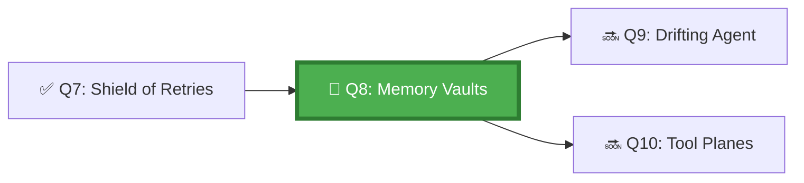

*The Vault Masters remember what all others forget. Each vault holds a tier of memory — ephemeral scrolls that burn after each session, session stones that persist through a day's work, and the eternal archives that outlive the agents that wrote them. An agent that knows which vault to consult, and when to write to each, is an agent that learns.*

## 🗺️ Quest Network Position



## 🎯 Quest Objectives

- [ ] **Map the three memory tiers** — define ephemeral, session, and persistent memory for GitHub agents
- [ ] **Implement ephemeral memory** — in-context state that exists only within a single agent run
- [ ] **Implement session memory** — GitHub Actions artifacts that persist across runs within a session
- [ ] **Implement persistent memory** — repository files that store long-lived agent knowledge
- [ ] **Demonstrate context injection** — show the agent reading from memory before making decisions

## ⚔️ The Quest Begins

### Chapter 1 — The Three Memory Tiers

Agents working on GitHub have access to three natural memory tiers:

| Tier | Lifespan | GitHub Mechanism | Use Case |
|---|---|---|---|
| **Ephemeral** | Single agent run (minutes) | LLM context window, environment variables | Current task context, in-flight reasoning |
| **Session** | Hours to days | GitHub Actions Artifacts, Issue comments | Multi-step task progress, work-in-progress state |
| **Persistent** | Indefinitely | Repository files, PR descriptions, issue body | Architectural decisions, learned patterns, standing instructions |

---

### Chapter 2 — Ephemeral Memory: Using the Context Window Well

Ephemeral memory is the LLM's context window — what it's "thinking about" right now. For Copilot coding agents, this is populated by the files it reads, the issue text, and the `copilot-instructions.md`.

**Maximise ephemeral memory quality:**

```markdown
# In copilot-instructions.md — ensure the agent loads the right context

## Context Loading Protocol

At the start of every task, read these files in order:
1. `AGENTS.md` — repository operating guide
2. `docs/architecture/OVERVIEW.md` — current architecture
3. `docs/decisions/LATEST.md` — most recent architectural decisions
4. The issue or PR body that triggered this task

Only then proceed to plan.
```

---

### Chapter 3 — Session Memory with GitHub Artifacts

> **Exercise 8.1:** Implement session memory using GitHub Actions artifacts.

```yaml
# .github/workflows/agent-with-session-memory.yml
name: Agent with Session Memory

on:
  issues:
    types: [labeled]

jobs:
  agent-run:
    runs-on: ubuntu-latest
    steps:
      - uses: actions/checkout@v4

      - name: Restore session memory (if exists)
        id: restore_memory
        uses: actions/cache@v4
        with:
          path: .agent-memory/session.json
          key: agent-session-${{ github.event.issue.number }}
          restore-keys: |
            agent-session-${{ github.event.issue.number }}

      - name: Initialise session memory
        run: |
          mkdir -p .agent-memory
          if [ ! -f .agent-memory/session.json ]; then
            cat > .agent-memory/session.json << 'EOF'
            {
              "session_id": "${{ github.run_id }}",
              "issue_number": ${{ github.event.issue.number }},
              "started_at": "$(date -u +%Y-%m-%dT%H:%M:%SZ)",
              "completed_steps": [],
              "decisions": [],
              "files_modified": []
            }
            EOF
          fi

      - name: Run agent task (reads and updates session memory)
        run: |
          echo "Agent reading session memory..."
          cat .agent-memory/session.json
          
          # Agent would update memory here — add completed step
          python3 - << 'EOF'
          import json
          from datetime import datetime, timezone
          
          with open('.agent-memory/session.json', 'r') as f:
              memory = json.load(f)
          
          memory['completed_steps'].append({
              'step': 'initial-analysis',
              'timestamp': datetime.now(timezone.utc).isoformat(),
              'outcome': 'Task scope identified'
          })
          
          with open('.agent-memory/session.json', 'w') as f:
              json.dump(memory, f, indent=2)
          
          print("✅ Session memory updated")
          EOF

      - name: Save session memory
        uses: actions/upload-artifact@v4
        with:
          name: agent-session-${{ github.event.issue.number }}-${{ github.run_id }}
          path: .agent-memory/session.json
          retention-days: 1
```

> **Why upload-artifact instead of `actions/cache/save`?** GitHub Actions caches are **immutable** — once a key is written, later writes for the same key are silently ignored, so the agent can restore stale session memory. For *mutable* same-run handoff, use upload/download artifacts (per-run). For *cross-run* mutable state, write to a repo file in a PR, or post the JSON as an issue comment and re-read it.

---

### Chapter 4 — Persistent Memory with Repository Files

Persistent memory is stored in repository files — it persists indefinitely and can be read by any agent working in the repo.

> **Exercise 8.2:** Create the persistent memory structure for your sandbox.

```bash
mkdir -p docs/agent-memory
touch docs/agent-memory/architectural-decisions.md
touch docs/agent-memory/learned-patterns.md
touch docs/agent-memory/known-issues.md
```

```markdown
<!-- docs/agent-memory/learned-patterns.md -->
# Agent Learned Patterns

This file is maintained by agents. Each entry documents a pattern learned
from previous agent runs that should inform future decisions.

## Last updated: 2026-05-17

### Pattern: PR Title Format
- **Observed:** PRs with titles starting "fix:" are merged faster
- **Source:** Analysis of 50 PRs in this repo
- **Recommendation:** Use conventional commits format for all agent-opened PRs

### Pattern: Test File Location
- **Observed:** Tests always live in `/test/<module>/<filename>.test.js`
- **Source:** Repository convention (confirmed in AGENTS.md)
- **Recommendation:** Never place test files alongside source files
```

---

### Chapter 5 — Context Injection: Combining the Tiers

> **Exercise 8.3:** Update `copilot-instructions.md` to inject all three memory tiers into the agent's context.

```markdown
## Memory Loading Protocol (update in copilot-instructions.md)

### Before Every Task — Load in This Order:

1. **Ephemeral** (this session):
   - Issue or PR body
   - Referenced files in the issue
   
2. **Session** (this multi-step task):
   - `.agent-memory/session.json` if it exists
   - Review completed steps to avoid re-doing work
   
3. **Persistent** (all prior knowledge):
   - `docs/agent-memory/learned-patterns.md`
   - `docs/agent-memory/architectural-decisions.md`
   - `AGENTS.md`

### After Every Task — Write Back:

1. Add completed steps to `.agent-memory/session.json`
2. If a new pattern was discovered, add to `docs/agent-memory/learned-patterns.md`
   in a draft PR section awaiting human review
```

---

## ✅ Quest Validation

```bash
python3 scripts/validate_quest.py --quest q8
# ✅ Session memory: agent-with-session-memory.yml present
# ✅ Persistent memory: docs/agent-memory/ directory with .md files
# ✅ Context injection: copilot-instructions.md has memory loading protocol
# 🏆 Quest Q8 complete!
```

## 🏆 Quest Rewards

| Reward | Details |
|---|---|
| 🗄️ Vault Keeper Badge | Earned on completion |
| 🧠 Agent Memory Architecture | Skill unlocked |
| 100 XP | Added to Level 1001 total |
| Unlocks | [Q9: Anchoring the Drifting Agent](/quests/1010/agentic-state-persistence-and-drift/) |

## 🔗 Continue Your Journey

- **Next:** [Q9: Anchoring the Drifting Agent](/quests/1010/agentic-state-persistence-and-drift/)
- **Chronicle post:** [Taming Agent Memory and Context Drift](/posts/taming-agent-memory-and-context-drift/)
- **Related note:** [Evaluation Signals Table](/notes/gh-600/evaluation-signals-table/)

## 🕸️ Knowledge Graph

*Structured wiki-links connect this quest to the IT-Journey knowledge graph. Open the [Obsidian Graph View](/docs/obsidian/graph/) to explore connections.*

**Level hub:** [[Level 1001 (9) - Kubernetes Orchestration]]
**Overworld:** [[🏰 Overworld - Master Quest Map]]
**Study track:** [[The Agentic Codex: GH-600 Study Hub]] · [[GH-600 Agentic AI Quick-Reference Notes]]
**Prerequisites:** [[The Shield of Retries: Safe Execution and Error Handling]]
**Unlocks:** [[Anchoring the Drifting Agent: State Persistence and Drift Prevention]]
**Sequel quests:** [[Anchoring the Drifting Agent: State Persistence and Drift Prevention]]
**Obsidian docs:** [[Obsidian Knowledge Graph and Wiki Links]]

