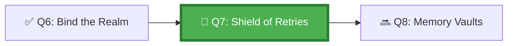

*The old shield-masters say: a shield that breaks on first impact is worse than no shield — the warrior trusted it. Build the Shield of Retries with three principles: try again when appropriate, admit defeat when necessary, and always report your final state so the next defender knows where you fell.*

## 🗺️ Quest Network Position



## 🎯 Quest Objectives

- [ ] **Classify failure types** — categorise agent errors into retryable vs. non-retryable
- [ ] **Implement retry policy** — configure exponential backoff in a GitHub Actions agent workflow
- [ ] **Set timeouts** — add per-step and per-job timeouts to prevent infinite loops
- [ ] **Design an escalation path** — agent failure triggers a PR comment + human notification
- [ ] **Test failure recovery** — simulate a tool error and verify the retry + escalation path works

## ⚔️ The Quest Begins

### Chapter 1 — Classifying Agent Failures

Not all failures are equal. Before building retry logic, classify what can and cannot be retried:

| Failure Type | Example | Retryable? | Strategy |
|---|---|---|---|
| Transient API error | GitHub 503 | ✅ Yes | Exponential backoff, max 3 tries |
| Rate limit | GitHub 429 | ✅ Yes | Wait for `Retry-After` header |
| Auth error | 401 Unauthorized | ❌ No | Escalate immediately |
| Task ambiguity | Agent cannot determine scope | ❌ No | Stop, report, request clarification |
| Resource not found | 404 on required file | ❌ No | Escalate, do not create wrong file |
| Infinite loop | Agent re-plans endlessly | ❌ No | Hard timeout + escalate |
| Schema validation failure | Plan JSON invalid | ✅ Yes (1x) | Re-plan once, then escalate |

---

### Chapter 2 — Implementing Retry Logic in GitHub Actions

> **Exercise 7.1:** Add retry configuration to your agent workflow.

```yaml
# .github/workflows/agent-with-retries.yml
name: Agent with Resilient Execution

on:
  issues:
    types: [labeled]

jobs:
  agent-run:
    if: contains(github.event.label.name, 'copilot')
    runs-on: ubuntu-latest
    timeout-minutes: 30          # ← Hard job timeout
    steps:
      - uses: actions/checkout@v4

      - name: Attempt agent task with retries
        id: agent_task
        timeout-minutes: 15      # ← Per-step timeout
        env:
          RETRY_MAX: 3
          RETRY_DELAY: 10        # seconds
        run: |
          for attempt in $(seq 1 $RETRY_MAX); do
            echo "=== Attempt $attempt of $RETRY_MAX ==="
            
            if python3 work/gh-600/scripts/run_agent_task.py \
                --issue "${{ github.event.issue.number }}" \
                --output agent-result.json; then
              echo "✅ Agent task succeeded on attempt $attempt"
              echo "succeeded=true" >> "$GITHUB_OUTPUT"
              exit 0
            fi
            
            # Check if error is retryable
            ERROR_CODE=$(jq -r '.error_code // "unknown"' agent-result.json 2>/dev/null)
            if [[ "$ERROR_CODE" == "auth_error" || "$ERROR_CODE" == "scope_ambiguous" ]]; then
              echo "❌ Non-retryable error: $ERROR_CODE — escalating"
              echo "succeeded=false" >> "$GITHUB_OUTPUT"
              echo "error_code=$ERROR_CODE" >> "$GITHUB_OUTPUT"
              exit 1
            fi
            
            if [ "$attempt" -lt "$RETRY_MAX" ]; then
              DELAY=$((RETRY_DELAY * (2 ** (attempt - 1))))  # exponential backoff
              echo "⏳ Retryable error. Waiting ${DELAY}s before retry..."
              sleep "$DELAY"
            fi
          done
          
          echo "succeeded=false" >> "$GITHUB_OUTPUT"
          echo "error_code=max_retries_exceeded" >> "$GITHUB_OUTPUT"
          exit 1

      - name: Escalate on failure
        if: failure() || steps.agent_task.outputs.succeeded == 'false'
        uses: actions/github-script@v7
        with:
          script: |
            const errorCode = '${{ steps.agent_task.outputs.error_code }}' || 'unknown';
            const runUrl = `https://github.com/${{ github.repository }}/actions/runs/${{ github.run_id }}`;
            
            await github.rest.issues.createComment({
              owner: context.repo.owner,
              repo: context.repo.repo,
              issue_number: context.issue.number,
              body: `## 🚨 Agent Task Failed — Human Intervention Required\n\n` +
                `**Error code:** \`${errorCode}\`\n` +
                `**Run:** ${runUrl}\n\n` +
                `The agent could not complete this task. Please review the run logs ` +
                `and either clarify the task or complete it manually.\n\n` +
                `To retry with a clearer task description, close and reopen this issue ` +
                `with an updated body.`
            });
```

---

### Chapter 3 — Designing the Escalation Ladder

An escalation ladder defines what happens at each failure level:

```text
Level 1 — Retryable error:      Retry with backoff (up to max_retries)
Level 2 — Max retries hit:      Comment on PR/issue + add "needs-human" label
Level 3 — Non-retryable error:  Immediate comment + alert + stop execution
Level 4 — Timeout:              Hard stop + comment + disable agent label
```

> **Exercise 7.2:** Add "needs-human" label creation to your escalation step.

```yaml
      - name: Add needs-human label on escalation
        if: failure()
        uses: actions/github-script@v7
        with:
          script: |
            // Ensure label exists
            try {
              await github.rest.issues.createLabel({
                owner: context.repo.owner,
                repo: context.repo.repo,
                name: 'needs-human',
                color: 'FF4444',
                description: 'Agent requires human intervention'
              });
            } catch (e) { /* label already exists */ }
            
            // Apply label to issue
            await github.rest.issues.addLabels({
              owner: context.repo.owner,
              repo: context.repo.repo,
              issue_number: context.issue.number,
              labels: ['needs-human']
            });
```

---

### Chapter 4 — Testing Failure Scenarios

> **Exercise 7.3:** Create a test that deliberately causes each failure type and verify the escalation path.

```bash
# work/gh-600/scripts/test_failure_scenarios.sh
#!/usr/bin/env bash
set -euo pipefail

echo "=== Testing Agent Failure Scenarios ==="

# Scenario 1: Transient error → should retry
echo "Test 1: Transient error (expect retry)"
# Mock a 503 response and verify the workflow retries 3 times

# Scenario 2: Auth error → should escalate immediately
echo "Test 2: Auth error (expect immediate escalation, no retry)"
# Mock a 401 response and verify workflow does NOT retry

# Scenario 3: Timeout → should escalate with timeout error code
echo "Test 3: Step timeout (expect hard stop + escalation)"
# Run a step that sleeps > timeout_minutes

echo "=== All failure scenarios validated ==="
```

---

### Chapter 5 — Agent Error Reporting Format

Every failed agent run should produce a machine-readable error report:

```json
{
  "error_report_version": "1.0",
  "run_id": "github-run-id",
  "error_code": "max_retries_exceeded",
  "error_category": "retryable",
  "attempts": 3,
  "last_error_message": "GitHub API returned 503: Service Unavailable",
  "recommended_action": "Retry with same task after GitHub status is green",
  "run_url": "https://github.com/org/repo/actions/runs/ID",
  "escalated": true,
  "escalated_at": "2026-05-17T10:30:00Z"
}
```

---

## ✅ Quest Validation

```bash
python3 scripts/validate_quest.py --quest q7
# ✅ Workflow: agent-with-retries.yml present
# ✅ Retry config: exponential backoff implemented
# ✅ Timeout: job-level and step-level timeouts set
# ✅ Escalation: PR comment + label on failure
# ✅ Error report schema: present
# 🏆 Quest Q7 complete!
```

## 🏆 Quest Rewards

| Reward | Details |
|---|---|
| 🛡️ Resilience Keeper Badge | Earned on completion |
| ♻️ Agent Retry Patterns | Skill unlocked |
| 100 XP | Added to Level 1001 total |
| Unlocks | [Q8: Vaults of Recollection](/quests/1001/agentic-memory-strategies/) |

## 🕸️ Knowledge Graph

*Structured wiki-links connect this quest to the IT-Journey knowledge graph. Open the [Obsidian Graph View](/docs/obsidian/graph/) to explore connections.*

**Level hub:** [[Level 1001 (9) - Kubernetes Orchestration]]
**Overworld:** [[🏰 Overworld - Master Quest Map]]
**Study track:** [[The Agentic Codex: GH-600 Study Hub]] · [[GH-600 Agentic AI Quick-Reference Notes]]
**Prerequisites:** [[Bind the Agent to the Realm: Dev Environment Integration]]
**Unlocks:** [[Vaults of Recollection: Agent Memory Strategies]]
**Sequel quests:** [[Vaults of Recollection: Agent Memory Strategies]]
**Obsidian docs:** [[Obsidian Knowledge Graph and Wiki Links]]

