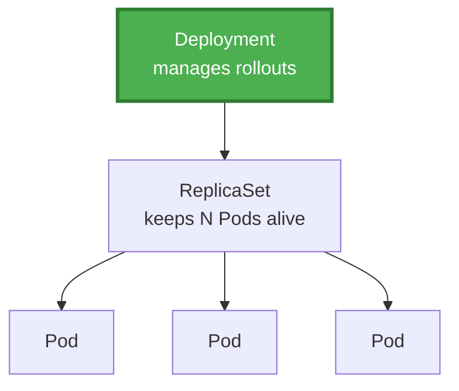

*Welcome back, Warrior. In the previous quest you learned that a lone Pod is fragile - delete it, and it stays dead, for no controller watches over it. Now you will learn to command the **workload legions**: the controllers that create Pods, keep them at the right count, heal them when they fall, and upgrade them without downtime. This is where Kubernetes stops being a curiosity and becomes a production weapon.*

*Whether you are deploying a stateless web frontend, a database that demands stable identity, or a log collector that must run on every node, this adventure teaches you to pick the right controller and wield it with confidence.*

## 📖 The Legend Behind This Quest

*Before orchestration, deploying a new version meant a midnight maintenance window, a held breath, and a prayer. If the new version broke, rolling back meant a frantic manual scramble. Kubernetes workload controllers turned that ritual into a routine: declare a new image, and the cluster replaces old Pods with new ones gradually, watching health at every step, ready to halt or reverse at the first sign of trouble.*

*This quest teaches the controllers that make that possible - and the subtle but vital differences between them. Master these, and zero-downtime deployment becomes the default, not the exception.*

## 🎯 Quest Objectives

By the time you complete this epic journey, you will have mastered:

### Primary Objectives (Required for Quest Completion)
- [ ] **The Pod as the Atom** - Explain why the Pod, not the container, is the smallest deployable unit
- [ ] **Deployments and ReplicaSets** - Use a Deployment to keep a stateless app at a desired replica count
- [ ] **Rolling Updates and Rollbacks** - Ship a new version with zero downtime and reverse it if it fails
- [ ] **Choosing a Workload Kind** - Select Deployment, StatefulSet, DaemonSet, or Job correctly

### Secondary Objectives (Bonus Achievements)
- [ ] **StatefulSets** - Run workloads that need stable identity and storage (databases)
- [ ] **DaemonSets** - Run exactly one Pod per node (agents, log collectors)
- [ ] **Health Probes** - Add liveness and readiness probes to make rollouts safe

### Mastery Indicators
You'll know you've truly mastered this quest when you can:
- [ ] Draw the ownership chain Deployment → ReplicaSet → Pod
- [ ] Predict what happens during a rolling update step by step
- [ ] Explain when a StatefulSet is required over a Deployment
- [ ] Roll back a bad deployment in one command

## 🗺️ Quest Prerequisites

### 📋 Knowledge Requirements
- [ ] Completion of [Kubernetes Fundamentals](/quests/1001/kubernetes-fundamentals/)
- [ ] Comfort applying YAML manifests with `kubectl apply`
- [ ] Understanding of the reconciliation loop

### 🛠️ System Requirements
- [ ] Modern operating system (Windows 10+, macOS 10.14+, or Linux)
- [ ] A running local cluster (`kind`, `minikube`, or `k3d`)
- [ ] `kubectl` configured and on your `PATH`

### 🧠 Skill Level Indicators
This **🔴 Hard** quest expects:
- [ ] You can already apply and inspect a Pod
- [ ] You are ready to reason about controllers owning other objects
- [ ] Ready for 90-120 minutes of hands-on practice

## 🌍 Choose Your Adventure Platform

*The manifests in this quest run identically everywhere. You only need a working cluster and `kubectl`. Confirm your environment before you begin.*

### 🍎 macOS Kingdom Path

<details>
<summary>Click to expand macOS instructions</summary>

```bash
# Ensure your cluster from the previous quest is running
kubectl config use-context kind-citadel
kubectl get nodes
# Create a workspace namespace for this quest
kubectl create namespace legions
kubectl config set-context --current --namespace=legions
```

</details>

### 🪟 Windows Empire Path

<details>
<summary>Click to expand Windows instructions</summary>

```powershell
# Confirm the cluster and create a working namespace
kubectl config use-context kind-citadel
kubectl get nodes
kubectl create namespace legions
kubectl config set-context --current --namespace=legions
```

</details>

### 🐧 Linux Territory Path

<details>
<summary>Click to expand Linux instructions</summary>

```bash
# Same everywhere - confirm cluster and namespace
kubectl get nodes
kubectl create namespace legions
kubectl config set-context --current --namespace=legions
```

</details>

### ☁️ Cloud Realms Path

<details>
<summary>Click to expand Cloud/Container instructions</summary>

```bash
# On managed clusters (EKS/GKE/AKS) the workflow is identical.
# Just ensure kubectl points at the right cluster:
kubectl config current-context
kubectl create namespace legions
```

</details>

## 🧙‍♂️ Chapter 1: The Pod and the ReplicaSet - From Atom to Army

*The **Pod** is the smallest thing Kubernetes deploys. It wraps one or more containers that share a network namespace and storage. You rarely create Pods directly - instead, a controller creates them for you. The first such controller is the **ReplicaSet**, whose only job is to keep N identical Pods running.*

### ⚔️ Skills You'll Forge in This Chapter
- Why the Pod is the unit of deployment
- How a ReplicaSet keeps a desired replica count
- The label-selector mechanism that links controllers to Pods

### 🏗️ The Ownership Chain



A **ReplicaSet** finds the Pods it owns using a **label selector**. If the count is below desired, it creates Pods; if above, it deletes them. You almost never create a ReplicaSet directly - a Deployment manages one for you - but understanding it explains everything above it.

```yaml
apiVersion: apps/v1
kind: ReplicaSet
metadata:
  name: web-rs
spec:
  replicas: 3
  selector:
    matchLabels:
      app: web          # the ReplicaSet owns Pods carrying this label
  template:             # the Pod blueprint it stamps out
    metadata:
      labels:
        app: web
    spec:
      containers:
        - name: web
          image: nginx:1.27
          ports:
            - containerPort: 80
```

```bash
# Apply it, then delete a Pod and watch the ReplicaSet replace it instantly
kubectl apply -f web-rs.yaml
kubectl get pods -l app=web
kubectl delete pod -l app=web --wait=false
kubectl get pods -l app=web --watch   # a fresh Pod appears - this is self-healing
```

### 🔍 Knowledge Check: Pods and ReplicaSets
- [ ] What does a Pod share between its containers?
- [ ] How does a ReplicaSet decide which Pods it owns?
- [ ] Why do you rarely create a ReplicaSet directly?

### ⚡ Quick Wins and Checkpoints
- [ ] **Replicas Running**: `kubectl get pods -l app=web` shows three Pods
- [ ] **Self-Healing Seen**: A deleted Pod was replaced automatically

## 🧙‍♂️ Chapter 2: Deployments - Zero-Downtime Rollouts and Rollbacks

*The **Deployment** is the workhorse of stateless applications. It manages ReplicaSets to give you declarative updates: change the image, and the Deployment creates a new ReplicaSet, shifts Pods over gradually, and keeps the old one around so you can roll back.*

### ⚔️ Skills You'll Forge in This Chapter
- Declaring a Deployment with health probes
- Performing a rolling update
- Inspecting rollout status and rolling back

### 🏗️ A Production-Shaped Deployment

```yaml
apiVersion: apps/v1
kind: Deployment
metadata:
  name: web
spec:
  replicas: 3
  selector:
    matchLabels:
      app: web
  strategy:
    type: RollingUpdate
    rollingUpdate:
      maxUnavailable: 1     # never lose more than 1 Pod at a time
      maxSurge: 1           # spin up at most 1 extra Pod during the update
  template:
    metadata:
      labels:
        app: web
    spec:
      containers:
        - name: web
          image: nginx:1.27
          ports:
            - containerPort: 80
          readinessProbe:    # don't send traffic until the app is ready
            httpGet:
              path: /
              port: 80
            initialDelaySeconds: 2
            periodSeconds: 5
          livenessProbe:     # restart the container if it becomes unhealthy
            httpGet:
              path: /
              port: 80
            initialDelaySeconds: 10
            periodSeconds: 10
          resources:
            requests:
              cpu: 50m
              memory: 64Mi
            limits:
              cpu: 250m
              memory: 128Mi
```

Apply it, then perform a rolling update and a rollback:

```bash
# Deploy version 1.27
kubectl apply -f web-deployment.yaml
kubectl rollout status deployment/web

# Roll out a new version - watch Pods replace gradually with no downtime
kubectl set image deployment/web web=nginx:1.27.1
kubectl rollout status deployment/web

# Inspect the rollout history
kubectl rollout history deployment/web

# Something wrong? Roll back to the previous revision in one command
kubectl rollout undo deployment/web

# Scale up under load
kubectl scale deployment/web --replicas=5
```

The readiness probe is what makes the rollout *safe*: a new Pod receives no traffic until it reports ready, so a broken image fails the probe and the rollout stalls instead of taking the app down.

### 🔍 Knowledge Check: Deployments
- [ ] What does `maxUnavailable` control during a rolling update?
- [ ] Why is a readiness probe essential for safe rollouts?
- [ ] Which command reverses a bad deployment?

## 🧙‍♂️ Chapter 3: StatefulSets, DaemonSets, and Jobs - The Right Tool for the Job

*Not every workload is a stateless web server. Databases need stable identity and storage. Node agents must run everywhere. Batch tasks must run to completion. Kubernetes offers a controller for each.*

### ⚔️ Skills You'll Forge in This Chapter
- When to choose StatefulSet over Deployment
- Running a per-node agent with a DaemonSet
- Running batch work with Jobs and CronJobs

### 🏗️ StatefulSet - Stable Identity and Storage

A **StatefulSet** gives Pods stable, ordered names (`db-0`, `db-1`, `db-2`) and a dedicated PersistentVolume each. Pods are created and deleted in order, which matters for clustered databases.

```yaml
apiVersion: apps/v1
kind: StatefulSet
metadata:
  name: db
spec:
  serviceName: db          # a headless Service for stable DNS (next quest)
  replicas: 3
  selector:
    matchLabels:
      app: db
  template:
    metadata:
      labels:
        app: db
    spec:
      containers:
        - name: postgres
          image: postgres:16
          ports:
            - containerPort: 5432
          volumeMounts:
            - name: data
              mountPath: /var/lib/postgresql/data
  volumeClaimTemplates:    # each Pod gets its OWN persistent volume
    - metadata:
        name: data
      spec:
        accessModes: ["ReadWriteOnce"]
        resources:
          requests:
            storage: 1Gi
```

### 🏗️ DaemonSet - One Pod Per Node

A **DaemonSet** ensures a copy of a Pod runs on every node (or a selected subset) - perfect for log collectors, metrics agents, and network plugins.

```yaml
apiVersion: apps/v1
kind: DaemonSet
metadata:
  name: node-logger
spec:
  selector:
    matchLabels:
      app: node-logger
  template:
    metadata:
      labels:
        app: node-logger
    spec:
      containers:
        - name: logger
          image: busybox:1.36
          command: ["sh", "-c", "while true; do echo collecting logs; sleep 30; done"]
```

### 🏗️ Job - Run to Completion

```yaml
apiVersion: batch/v1
kind: Job
metadata:
  name: migrate
spec:
  completions: 1
  backoffLimit: 4          # retry up to 4 times on failure
  template:
    spec:
      restartPolicy: Never
      containers:
        - name: migrate
          image: busybox:1.36
          command: ["sh", "-c", "echo running migration; sleep 5; echo done"]
```

**Decision guide - pick the controller by the question it answers:**

| Need | Controller |
| --- | --- |
| Stateless app, any Pod is interchangeable | **Deployment** |
| Stable network identity + per-Pod storage (databases) | **StatefulSet** |
| Exactly one Pod on every node (agents) | **DaemonSet** |
| Run a task to completion once | **Job** |
| Run a task on a schedule | **CronJob** |

```bash
# Apply each and observe how differently they behave
kubectl apply -f db-statefulset.yaml
kubectl get pods -l app=db          # note ordered names: db-0, db-1, db-2
kubectl apply -f node-logger-daemonset.yaml
kubectl get pods -o wide -l app=node-logger   # one per node
kubectl apply -f migrate-job.yaml
kubectl logs job/migrate
```

### 🔍 Knowledge Check: Choosing a Workload
- [ ] Why does a database need a StatefulSet rather than a Deployment?
- [ ] What guarantees does a DaemonSet provide?
- [ ] What is the difference between a Job and a Deployment?

## 🎮 Mastery Challenges

### 🟢 Novice Challenge: Deploy and Scale
**Objective**: Deploy the `web` Deployment and scale it.

**Requirements**:
- [ ] Apply the Deployment with three replicas
- [ ] Scale it to five and back to three
- [ ] Confirm Pods are `Running` and `Ready`

**Validation**: `kubectl get deployment web` shows the desired replica count ready.

### 🟡 Intermediate Challenge: Rolling Update and Rollback
**Objective**: Update the image, observe the rollout, then roll back.

**Requirements**:
- [ ] Change the image with `kubectl set image`
- [ ] Watch the rollout with `kubectl rollout status`
- [ ] Roll back with `kubectl rollout undo` and confirm

**Validation**: `kubectl rollout history` shows multiple revisions.

### 🔴 Advanced Challenge: Match Workloads to Controllers
**Objective**: Deploy one of each controller type and justify the choice.

**Requirements**:
- [ ] Deploy a Deployment, a StatefulSet, a DaemonSet, and a Job
- [ ] Confirm the StatefulSet's ordered Pod names
- [ ] Confirm the DaemonSet runs one Pod per node
- [ ] Confirm the Job reaches `Completed`

**Validation**: You can explain in one sentence why each workload used its controller.

## 🏆 Quest Rewards & Achievements

**🎖️ Badges Earned**:
- 🏆 **Workload Commander** - You master Deployments and rollouts
- 🛡️ **Keeper of State** - You understand StatefulSets and DaemonSets

**🛠️ Skills Unlocked**:
- **Rolling Updates and Rollbacks** - Zero-downtime deployment by default
- **Workload Controller Selection** - The right tool for every workload

**🔓 Unlocked Quests**:
- Services and Networking - Make these workloads reachable
- ConfigMaps and Secrets - Configure them safely

**📊 Progression Points**: +75 XP

## 🗺️ Next Steps in Your Journey

**Continue the Main Story**:
- 🎯 [Services and Networking](/quests/1001/k8s-services-networking/) - Expose your workloads

**Explore Side Adventures**:
- ⚔️ [ConfigMaps and Secrets](/quests/1001/k8s-config-secrets/) - Inject configuration

### Character Class Recommendations

**💻 Software Developer**: Continue to [Services and Networking](/quests/1001/k8s-services-networking/)  
**🏗️ System Engineer**: Explore [ConfigMaps and Secrets](/quests/1001/k8s-config-secrets/)  
**🛡️ Security Specialist**: Revisit [Kubernetes Fundamentals](/quests/1001/kubernetes-fundamentals/)

## 📚 Resources

### Official Documentation
- [Deployments](https://kubernetes.io/docs/concepts/workloads/controllers/deployment/) - Rollouts, scaling, rollbacks
- [StatefulSets](https://kubernetes.io/docs/concepts/workloads/controllers/statefulset/) - Stable identity and storage
- [DaemonSets](https://kubernetes.io/docs/concepts/workloads/controllers/daemonset/) - One Pod per node
- [Jobs and CronJobs](https://kubernetes.io/docs/concepts/workloads/controllers/job/) - Run-to-completion workloads

### Community Resources
- [Configure Liveness, Readiness and Startup Probes](https://kubernetes.io/docs/tasks/configure-pod-container/configure-liveness-readiness-startup-probes/) - Health checks done right
- [Kubernetes Patterns (book site)](https://k8spatterns.io/) - Reusable workload design patterns

### Learning Materials
- [kubectl Cheat Sheet](https://kubernetes.io/docs/reference/kubectl/cheatsheet/) - Rollout and scale commands
- [Killercoda Kubernetes Scenarios](https://killercoda.com/kubernetes) - Hands-on workload labs

## 🤝 Quest Completion Checklist

Before marking this quest as complete, ensure you've:

- [ ] ✅ Completed all primary objectives
- [ ] ✅ Performed a rolling update and a rollback
- [ ] ✅ Deployed each workload controller type
- [ ] ✅ Answered all knowledge check questions
- [ ] ✅ Completed at least one mastery challenge
- [ ] ✅ Identified your next quest in the journey

## 🕸️ Knowledge Graph

*Structured wiki-links connect this quest to the IT-Journey knowledge graph. Open the [Obsidian Graph View](/docs/obsidian/graph/) to explore connections.*

**Level hub:** [[Level 1001 (9) - Kubernetes Orchestration]]
**Overworld:** [[🏰 Overworld - Master Quest Map]]
**Prerequisites:** [[Kubernetes Fundamentals: Container Orchestration Essentials]]
**Unlocks:** [[Kubernetes Services and Networking: Ingress and DNS Configuration]] · [[Kubernetes ConfigMaps and Secrets: Configuration Management Best Practices]]
**Obsidian docs:** [[Obsidian Knowledge Graph and Wiki Links]]
