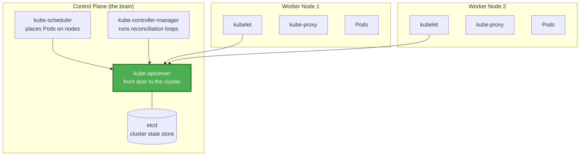

*Greetings, brave adventurer! You have ascended into the **Warrior tier**, and before you rises the **Orchestration Citadel** - a vast fortress where thousands of containers march in disciplined formation. This quest, **Kubernetes Fundamentals**, is your initiation. You will learn how a single brain - the control plane - commands an army of worker nodes, and how you, the operator, issue your will not as a stream of frantic commands but as a single, declared truth.*

*Whether you are a developer who has only ever run `docker run` by hand, or an engineer who has heard the word "Kubernetes" whispered with equal parts awe and dread, this adventure forges the foundation every Warrior of the cloud needs: how the cluster is built, how it heals itself, and how you speak to it through `kubectl` and the object model.*

## 📖 The Legend Behind This Quest

*In the early ages, sysadmins tended individual servers like beloved pets - each one named, patched by hand, and mourned when it fell. Then came containers, and suddenly there were hundreds of them, too many to shepherd by hand. From the halls of Google's Borg emerged Kubernetes (the Greek word for "helmsman"), an open-source orchestrator donated to the Cloud Native Computing Foundation. Its promise was radical: you declare the world you want, and the cluster relentlessly works to make reality match.*

*This quest teaches you the "why" behind that promise. Master the reconciliation loop and the object model, and every later quest - Pods, Services, ConfigMaps - becomes an incantation you understand rather than a spell you merely copy.*

## 🎯 Quest Objectives

By the time you complete this epic journey, you will have mastered:

### Primary Objectives (Required for Quest Completion)
- [ ] **Cluster Architecture** - Describe the control plane, worker nodes, and how they cooperate
- [ ] **The Control Plane Components** - Explain the API server, etcd, scheduler, and controller manager
- [ ] **The kubectl Workflow** - Inspect, describe, and apply resources from the command line
- [ ] **The Declarative Object Model** - Write a manifest and let Kubernetes reconcile desired state

### Secondary Objectives (Bonus Achievements)
- [ ] **Namespaces and Context** - Organize resources and switch between clusters safely
- [ ] **The Reconciliation Loop** - Articulate how controllers drive actual state toward desired state
- [ ] **Troubleshooting Basics** - Diagnose a Pod stuck in `Pending` or `CrashLoopBackOff`

### Mastery Indicators
You'll know you've truly mastered this quest when you can:
- [ ] Explain what each control plane component does without notes
- [ ] Apply a Pod manifest and predict the lifecycle phases it passes through
- [ ] Read `kubectl describe` output and locate the cause of a scheduling failure
- [ ] Explain why Kubernetes is "declarative" rather than "imperative"

## 🗺️ Quest Prerequisites

### 📋 Knowledge Requirements
- [ ] Basic understanding of Docker images, containers, and registries
- [ ] Familiarity with YAML structure (keys, lists, indentation)
- [ ] Comfort running commands in a terminal

### 🛠️ System Requirements
- [ ] Modern operating system (Windows 10+, macOS 10.14+, or Linux)
- [ ] Docker Desktop or another container runtime installed
- [ ] `kubectl` installed and on your `PATH`
- [ ] A local cluster tool: `kind`, `minikube`, or `k3d`

### 🧠 Skill Level Indicators
This **🔴 Hard** quest expects:
- [ ] You have built and run at least one container before
- [ ] You are ready to think in terms of desired state, not step-by-step commands
- [ ] Ready for 120-150 minutes of focused, hands-on learning

## 🌍 Choose Your Adventure Platform

*Kubernetes runs the same everywhere, but spinning up a local practice cluster differs by platform. Choose the path that fits your setup. We recommend `kind` (Kubernetes IN Docker) for its speed and portability.*

### 🍎 macOS Kingdom Path

<details>
<summary>Click to expand macOS instructions</summary>

```bash
# Install kubectl and a local cluster tool with Homebrew
brew install kubectl
brew install kind

# Create a single-node cluster named "citadel"
kind create cluster --name citadel

# Verify the cluster is alive and kubectl is talking to it
kubectl cluster-info --context kind-citadel
kubectl get nodes
```

**macOS-Specific Notes:**
- Docker Desktop must be running before `kind create cluster`.
- `kubectl` ships with Docker Desktop too; `which kubectl` confirms the active binary.

</details>

### 🪟 Windows Empire Path

<details>
<summary>Click to expand Windows instructions</summary>

```powershell
# Install with winget
winget install -e --id Kubernetes.kubectl
winget install -e --id Kubernetes.kind

# Create the practice cluster
kind create cluster --name citadel

# Confirm connectivity
kubectl cluster-info --context kind-citadel
kubectl get nodes
```

**Windows-Specific Notes:**
- Run inside WSL2 for the smoothest Docker + kind experience.
- Ensure Docker Desktop's WSL2 integration is enabled.

</details>

### 🐧 Linux Territory Path

<details>
<summary>Click to expand Linux instructions</summary>

```bash
# Install kubectl (Debian/Ubuntu example)
curl -LO "https://dl.k8s.io/release/$(curl -L -s https://dl.k8s.io/release/stable.txt)/bin/linux/amd64/kubectl"
sudo install -o root -g root -m 0755 kubectl /usr/local/bin/kubectl

# Install kind
go install sigs.k8s.io/kind@latest   # or download the release binary

# Create and verify the cluster
kind create cluster --name citadel
kubectl get nodes
```

**Linux-Specific Notes:**
- Your user must be in the `docker` group, or prefix commands with `sudo`.
- `minikube start --driver=docker` is an equally valid alternative.

</details>

### ☁️ Cloud Realms Path

<details>
<summary>Click to expand Cloud/Container instructions</summary>

```bash
# GitHub Codespaces or any container runtime works with kind:
kind create cluster --name citadel
kubectl get nodes

# Managed clusters (EKS / GKE / AKS) connect by writing a kubeconfig, e.g.:
# aws eks update-kubeconfig --name my-cluster --region us-east-1
# gcloud container clusters get-credentials my-cluster --region us-central1
```

**Cloud-Specific Notes:**
- Managed control planes (EKS, GKE, AKS) hide the control plane - you only manage nodes and workloads.
- The object model and `kubectl` commands are identical whether the cluster is local or managed.

</details>

## 🧙‍♂️ Chapter 1: Cluster Architecture - Anatomy of the Citadel

*A Kubernetes cluster is two kinds of machines working together: the **control plane** (the brain that decides) and the **worker nodes** (the muscle that runs your containers). Understand this split and the whole system clicks into place.*

### ⚔️ Skills You'll Forge in This Chapter
- The roles of the control plane and worker nodes
- What each control plane component is responsible for
- How a worker node runs your containers

### 🏗️ The Two Halves of a Cluster



**Control plane components:**

| Component | Responsibility |
| --- | --- |
| **kube-apiserver** | The single front door. Every read and write goes through its REST API. `kubectl` talks only to this. |
| **etcd** | A distributed key-value store holding the entire cluster state - the single source of truth. |
| **kube-scheduler** | Watches for unscheduled Pods and decides which node each should run on (based on resources, affinity, taints). |
| **kube-controller-manager** | Runs the controllers - background loops that drive actual state toward desired state. |
| **cloud-controller-manager** | (Cloud clusters) Integrates with the provider for load balancers, nodes, and routes. |

**Worker node components:**

| Component | Responsibility |
| --- | --- |
| **kubelet** | The node agent. Talks to the API server, starts/stops containers, reports node and Pod health. |
| **kube-proxy** | Maintains network rules so Services can route traffic to the right Pods. |
| **container runtime** | Actually runs containers (containerd, CRI-O). Docker's shim was removed in v1.24. |

Inspect your real cluster's components:

```bash
# List the nodes and their roles
kubectl get nodes -o wide

# See the control plane Pods (they run as Pods in kube-system)
kubectl get pods -n kube-system

# Confirm which API server kubectl is configured to reach
kubectl config view --minify --output 'jsonpath={..server}'
```

### 🔍 Knowledge Check: Architecture
- [ ] Which component is the *only* one `kubectl` communicates with directly?
- [ ] Where is cluster state actually stored?
- [ ] What is the difference between the kubelet and kube-proxy?

### ⚡ Quick Wins and Checkpoints
- [ ] **Cluster Up**: `kubectl get nodes` shows a `Ready` node
- [ ] **Components Seen**: You listed control plane Pods in `kube-system`

## 🧙‍♂️ Chapter 2: kubectl and the Object Model - Speaking to the Citadel

*Kubernetes is **declarative**. You do not tell it *how* to do things step by step; you describe the **desired state** as objects, and controllers continuously reconcile reality to match. `kubectl` is your voice.*

### ⚔️ Skills You'll Forge in This Chapter
- The anatomy of a Kubernetes object (apiVersion, kind, metadata, spec, status)
- The core `kubectl` verbs: get, describe, apply, delete, logs
- Imperative vs declarative workflows

### 🏗️ Every Object Has the Same Shape

Every resource you ever create - a Pod, a Deployment, a Service - follows the same four-part structure:

```yaml
apiVersion: v1          # which API group/version defines this object
kind: Pod               # what type of object this is
metadata:               # identity: name, namespace, labels
  name: hello-pod
  labels:
    app: hello
spec:                   # the DESIRED state you are declaring
  containers:
    - name: web
      image: nginx:1.27
      ports:
        - containerPort: 80
# status:               # the ACTUAL state, filled in BY Kubernetes (read-only)
```

You write `spec`. Kubernetes writes `status`. The reconciliation loop's only job is to make `status` match `spec`.

Save the manifest and apply it declaratively:

```bash
# Apply the desired state (idempotent - run it as many times as you like)
kubectl apply -f hello-pod.yaml

# List Pods and watch them progress through lifecycle phases
kubectl get pods
kubectl get pods --watch        # Pending -> ContainerCreating -> Running

# Get the full, detailed story of one Pod (events live at the bottom)
kubectl describe pod hello-pod

# Read the container's stdout/stderr logs
kubectl logs hello-pod

# Run a command inside the container interactively
kubectl exec -it hello-pod -- /bin/sh
```

**Imperative vs declarative:**

```bash
# Imperative (quick, but undocumented and hard to reproduce):
kubectl run hello --image=nginx:1.27

# Declarative (the production way - your YAML is version-controlled truth):
kubectl apply -f hello-pod.yaml
```

Prefer declarative manifests in real work: they are reviewable, repeatable, and form the basis of GitOps.

### 🗂️ Namespaces and Context

Namespaces partition a cluster into virtual sub-clusters so teams and environments don't collide:

```bash
# Create a namespace and deploy into it
kubectl create namespace dojo
kubectl apply -f hello-pod.yaml -n dojo

# List resources in a specific namespace
kubectl get pods -n dojo

# Set a default namespace so you stop typing -n every time
kubectl config set-context --current --namespace=dojo

# See every namespace
kubectl get namespaces
```

### 🔍 Knowledge Check: The Object Model
- [ ] Which field do *you* write, and which does Kubernetes fill in?
- [ ] Why is `kubectl apply` safe to run repeatedly?
- [ ] What problem do namespaces solve?

## 🧙‍♂️ Chapter 3: The Reconciliation Loop and Troubleshooting - Self-Healing in Action

*The magic of Kubernetes is the **controller**: a loop that observes actual state, compares it to desired state, and acts to close the gap. This is why a cluster heals itself - and why reading its signals is the key skill.*

### ⚔️ Skills You'll Forge in This Chapter
- How the reconciliation loop produces self-healing
- Reading Pod lifecycle phases
- Diagnosing the two most common failure states

### 🏗️ Watch Self-Healing With Your Own Eyes

```bash
# Delete the running Pod manually...
kubectl delete pod hello-pod

# ...a bare Pod will NOT come back (no controller owns it). That is the lesson:
# controllers (Deployments, covered in the next quest) are what make things
# resilient. A lone Pod has no reconciler watching over it.
```

This is the core insight: **a controller is what makes desired state durable.** In the next quest you'll create a Deployment, delete its Pod, and watch a new one appear within seconds.

### 🚑 The Two Failures You Will See Most

```bash
# Pod stuck in Pending = the scheduler can't place it.
# Read the events for the reason (insufficient CPU/memory, unschedulable taint):
kubectl describe pod <name> | sed -n '/Events/,$p'

# Pod in CrashLoopBackOff = the container starts then exits repeatedly.
# The logs of the previous, crashed instance hold the cause:
kubectl logs <name> --previous

# Cluster-wide event stream, most recent last - your first stop for any mystery:
kubectl get events --sort-by=.lastTimestamp
```

| Symptom | Likely cause | First move |
| --- | --- | --- |
| `Pending` | No node has enough resources, or a taint blocks scheduling | `kubectl describe pod` and read Events |
| `ImagePullBackOff` | Wrong image name/tag or missing registry credentials | Check the `image:` field and pull secrets |
| `CrashLoopBackOff` | App exits immediately (bad config, missing env, panic) | `kubectl logs <pod> --previous` |

### 🔍 Knowledge Check: Reconciliation
- [ ] Why does a deleted bare Pod not return?
- [ ] Where do you find the reason a Pod is stuck in `Pending`?
- [ ] Which flag shows logs from a crashed container's previous run?

## 🎮 Mastery Challenges

### 🟢 Novice Challenge: Stand Up the Citadel
**Objective**: Create a local cluster and confirm it is healthy.

**Requirements**:
- [ ] `kind create cluster` (or `minikube start`) succeeds
- [ ] `kubectl get nodes` reports a `Ready` node
- [ ] You can list control plane Pods in `kube-system`

**Validation**: Run `kubectl get nodes` and see `Ready`.

### 🟡 Intermediate Challenge: Declare and Inspect a Pod
**Objective**: Deploy the `hello-pod` manifest into a namespace you create, then inspect it.

**Requirements**:
- [ ] Create a `dojo` namespace
- [ ] Apply the Pod manifest into it
- [ ] Capture the output of `kubectl describe pod` and identify its current phase

**Validation**: `kubectl get pods -n dojo` shows the Pod `Running`.

### 🔴 Advanced Challenge: Diagnose a Broken Pod
**Objective**: Deliberately break a Pod and diagnose it from cluster signals alone.

**Requirements**:
- [ ] Apply a Pod with a non-existent image tag (e.g. `nginx:does-not-exist`)
- [ ] Identify the failure state from `kubectl get pods`
- [ ] Pinpoint the root cause using `kubectl describe` and/or `kubectl logs`
- [ ] Fix the manifest and re-apply

**Validation**: You can name the failure state and the exact line that caused it.

## 🏆 Quest Rewards & Achievements

**🎖️ Badges Earned**:
- 🏆 **Cluster Initiate** - You stood up a working Kubernetes cluster
- ⚙️ **Keeper of the Control Plane** - You understand how Kubernetes thinks

**🛠️ Skills Unlocked**:
- **kubectl Command Mastery** - Inspect and apply resources fluently
- **Declarative Object Model Reasoning** - Think in desired state, not steps

**🔓 Unlocked Quests**:
- Pods and Workloads - Deployments, ReplicaSets, StatefulSets, and rollouts
- Services and Networking - Expose and connect your workloads
- ConfigMaps and Secrets - Inject configuration the right way

**📊 Progression Points**: +75 XP

## 🗺️ Next Steps in Your Journey

**Continue the Main Story**:
- 🎯 [Pods and Workloads](/quests/1001/k8s-pods-workloads/) - Make your deployments resilient

**Explore Side Adventures**:
- ⚔️ [Services and Networking](/quests/1001/k8s-services-networking/) - Connectivity and Ingress
- ⚔️ [ConfigMaps and Secrets](/quests/1001/k8s-config-secrets/) - Configuration management

### Character Class Recommendations

**💻 Software Developer**: Continue to [Pods and Workloads](/quests/1001/k8s-pods-workloads/)  
**🏗️ System Engineer**: Explore [Services and Networking](/quests/1001/k8s-services-networking/)  
**🛡️ Security Specialist**: Advance to [ConfigMaps and Secrets](/quests/1001/k8s-config-secrets/)

## 📚 Resources

### Official Documentation
- [Kubernetes Concepts: Cluster Architecture](https://kubernetes.io/docs/concepts/architecture/) - The control plane and nodes explained
- [kubectl Command Reference](https://kubernetes.io/docs/reference/kubectl/) - Every verb and flag
- [Understanding Kubernetes Objects](https://kubernetes.io/docs/concepts/overview/working-with-objects/kubernetes-objects/) - spec, status, and the object model

### Community Resources
- [Kubernetes the Hard Way](https://github.com/kelseyhightower/kubernetes-the-hard-way) - Build a cluster component by component
- [kind Quick Start](https://kind.sigs.k8s.io/docs/user/quick-start/) - The local cluster tool used here
- [CNCF Slack](https://slack.cncf.io/) - The community hub

### Learning Materials
- [kubectl Cheat Sheet](https://kubernetes.io/docs/reference/kubectl/cheatsheet/) - The commands you'll use daily
- [Killercoda Kubernetes Playgrounds](https://killercoda.com/playgrounds/scenario/kubernetes) - Free in-browser clusters

## 🤝 Quest Completion Checklist

Before marking this quest as complete, ensure you've:

- [ ] ✅ Completed all primary objectives
- [ ] ✅ Stood up a local cluster and inspected its nodes
- [ ] ✅ Applied a Pod manifest declaratively
- [ ] ✅ Answered all knowledge check questions
- [ ] ✅ Completed at least one mastery challenge
- [ ] ✅ Identified your next quest in the journey

## 🕸️ Knowledge Graph

*Structured wiki-links connect this quest to the IT-Journey knowledge graph. Open the [Obsidian Graph View](/docs/obsidian/graph/) to explore connections.*

**Level hub:** [[Level 1001 (9) - Kubernetes Orchestration]]
**Overworld:** [[🏰 Overworld - Master Quest Map]]
**Unlocks:** [[Kubernetes Pods and Workloads: Deployments and StatefulSets]] · [[Kubernetes Services and Networking: Ingress and DNS Configuration]] · [[Kubernetes ConfigMaps and Secrets: Configuration Management Best Practices]]
**Sequel quests:** [[Monitoring Fundamentals: Master Metrics, Logs & Traces for Observability]]
**Obsidian docs:** [[Obsidian Knowledge Graph and Wiki Links]]
