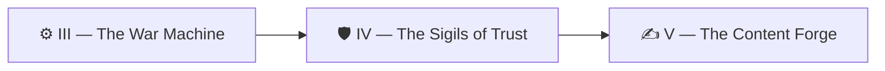

*The War Machine is built. The forges hum, the runners stand ready — and that is exactly the moment a wise realm grows afraid. An automaton that can open pull requests can also, if mis-bound, delete branches, rewrite settings, or push to `main` at three in the morning while you sleep. Raw power without bound is not a servant; it is a loose elemental.*

*This chapter is where you bind the elemental. You will inscribe the **Sigils of Trust** — the credentials, scopes, and switches that let the robot act on your behalf while making it physically impossible for it to escalate beyond its station. The real-world skill is **least-privilege automation security**: choosing OAuth over long-lived keys, minting a bot identity with no admin powers, and wiring a kill switch you can flip the instant something feels wrong.*

> 🧭 **A note on the level number.** This chapter sits at level **1001** as a campaign *difficulty* signal — it is one of the harder chapters in the binary-counted Self-Operating Website epic. Its actual topic is GitHub Actions authentication and security, not whatever "general theme" a level number might otherwise suggest. Read 1001 as "this one is hard," not "this one is about binary."

## 📖 The Legend Behind This Quest

In the old tales, a summoner never handed a spirit the master key to the castle. They carved a **sigil** — a token of authority scoped to one room, one door, one task — and they always kept a word of unbinding ready. Our automation is the same. A GitHub Action that "can do anything" is a breach waiting to happen; a token scoped to exactly the repository it serves, with a `*_ENABLED` switch guarding every workflow, is a bound servant you can trust because you can always *stop* it. Trust, in security, is not the absence of power — it is power you have measured, scoped, and given an off switch.

## 🎯 Quest Objectives

### Primary Objectives

- [ ] Explain when to use **OAuth** versus a long-lived **API key**, and configure the Claude Code agent step with an OAuth token stored as a secret
- [ ] Mint a **least-privilege bot Personal Access Token (PAT)** scoped to a single repository with **no admin scope**, and store it as a repository secret
- [ ] Add a `*_ENABLED` **kill-switch** repository variable that gates an automation workflow so it is off by default
- [ ] Distinguish `gh` CLI auth from `git push` auth and prove the workflow uses the right credential for each

### Mastery Indicators

- [ ] You can describe, without notes, why an admin-scoped token in CI is a privilege-escalation risk
- [ ] You can flip a single repo variable and watch a workflow refuse to run
- [ ] You can audit a workflow's permissions block and explain every grant in it

## 🗺️ Quest Prerequisites

Before you inscribe a single sigil, gather these:

- **Prior chapter:** Finish [Chapter III — The War Machine](/quests/1000/self-operating-website-03-the-war-machine/). You need a working CI/CD workflow to bind — this chapter secures what that one built.
- **Tools:** Git, the [`gh` CLI](https://cli.github.com/) (authenticated to your account via `gh auth login`), and a text editor or IDE.
- **A GitHub repository you own** with Actions enabled, plus permission to manage its secrets and variables (Settings → Secrets and variables → Actions).
- **Accounts & tokens:** a GitHub account that can create a **fine-grained Personal Access Token**, and a **Claude Code OAuth token** to drive the agent steps. Generate the OAuth token by running `claude setup-token` in the [Claude Code CLI](https://docs.anthropic.com/en/docs/claude-code/overview) (it prints a long-lived token intended for CI); this quest stores that value as the `CLAUDE_CODE_OAUTH_TOKEN` secret.

## 🧙‍♂️ Chapter 1: OAuth, API Keys, and the Least-Privilege Sigil

### ⚔️ Skills You'll Forge

- Choosing OAuth tokens over long-lived API keys for agent steps
- Minting a fine-grained PAT scoped to one repo with no admin scope
- Reading and tightening a GitHub Actions `permissions:` block

**Why OAuth over a raw API key?** Both prove identity, but they fail differently. A long-lived API key is a single secret that, once leaked, grants its full power until *someone remembers to rotate it*. An **OAuth token** is issued through an authorization flow, is scoped to what the app was granted, and is built to be refreshed and revoked. For the Claude Code agent in our fleet, we authenticate with a `CLAUDE_CODE_OAUTH_TOKEN` rather than pasting a raw API key into the repo — the token carries only the access the OAuth grant allows, and it can be revoked from the provider side without touching your code.

The cardinal rule: **never let a credential live in the repository in plaintext.** Secrets go in GitHub's encrypted secret store and are referenced by name. The agent step reads the token from `secrets`, never from a committed file.

> ℹ️ *(The `raw` / `endraw` tags in the YAML below are Jekyll escapes for this site's renderer — omit them when you copy the YAML into your own `.github/workflows/`.)*


```yaml
# .github/workflows/content-factory.yml (excerpt)
jobs:
  curate:
    runs-on: ubuntu-latest
    # The secrets context is NOT available at jobs.<id>.if, so we gate the
    # JOB on the kill-switch variable only and validate the secret in a STEP.
    if: vars.CONTENT_FACTORY_ENABLED == 'true'
    # Least-privilege: this job may read code and write content branches,
    # nothing more. No `admin`, no `actions: write`, no `packages`.
    permissions:
      contents: write
      pull-requests: write
    steps:
      - uses: actions/checkout@v4
      - name: Run the content-curator agent
        # Surface the secret as an env var, then guard the step on it.
        # This is the only place a secret expression is valid for gating.
        env:
          CLAUDE_CODE_OAUTH_TOKEN: ${{ secrets.CLAUDE_CODE_OAUTH_TOKEN }}
        if: env.CLAUDE_CODE_OAUTH_TOKEN != ''
        run: scripts/ai/run.sh content-curator
```


**Why not gate the job directly on the secret?** GitHub does **not** expose the `secrets` context at `jobs.<id>.if` — a job-level `if:` may reference `vars`, `github`, `needs`, and `inputs`, but *not* `secrets`. Writing `if: secrets.CLAUDE_CODE_OAUTH_TOKEN != ''` at the job level silently evaluates the secret to an empty string and the job will never run (or worse, behaves unpredictably across runner versions). The correct pattern is two-tier: **gate the job on the kill-switch variable** (`vars.CONTENT_FACTORY_ENABLED == 'true'`), then **inside a step**, surface the secret as an `env:` value and add `if: env.CLAUDE_CODE_OAUTH_TOKEN != ''`. The `env` context *is* available at step level, so this actually evaluates correctly.

Notice the `permissions:` block. By default GitHub may grant a workflow broad token scopes; declaring `permissions:` explicitly **shrinks** the `GITHUB_TOKEN` to only `contents` and `pull-requests`. Everything you do not list is denied. This is least privilege expressed in YAML.

**Now the bot PAT.** The built-in `GITHUB_TOKEN` is fine for many jobs, but it cannot trigger *other* workflows (PRs it opens won't fire your CI), so fleets often mint a dedicated **bot PAT**. When you do, use a **fine-grained PAT** scoped to a single repository, granting only the permissions the bot needs — Contents and Pull requests — and **never** Administration, which would let the token edit branch protection, secrets, or collaborators.

```bash
# Point OWNER and REPO at the repository you own — every gh command below
# uses them, so set them first (they are not secrets, just plain values):
export OWNER="your-github-username"
export REPO="your-repo-name"

# First, put the token value into $FINE_GRAINED_PAT WITHOUT writing it to disk
# or shell history. Either prompt for it silently...
read -rs FINE_GRAINED_PAT     # paste the token, press Enter (input is hidden)
# ...or export it inline for one session (avoid this if your shell logs history):
# export FINE_GRAINED_PAT="github_pat_xxxxxxxxxxxxxxxxxxxx"

# Store a fine-grained, single-repo, no-admin PAT as a repo secret.
# (Create the token in GitHub Settings → Developer settings →
#  Fine-grained tokens: Repository access = "Only select repositories",
#  Permissions = Contents:RW, Pull requests:RW, Administration: No access.)
gh secret set BOT_PAT --repo "$OWNER/$REPO" --body "$FINE_GRAINED_PAT"

# Verify the secret exists (value is never echoed back):
gh secret list --repo "$OWNER/$REPO"
```

If you skip the `read -rs` (or `export`) step and run `gh secret set` with `$FINE_GRAINED_PAT` unset, you'll store an **empty secret** — and every workflow that depends on it will fail in confusing ways. The same trap applies to `$OWNER` and `$REPO`: if either is unset, `--repo "$OWNER/$REPO"` silently expands to the malformed `--repo "/"`, and the command errors or targets the wrong repository with no obvious warning. Always populate all three variables first, then confirm the secret appears in `gh secret list`.

If that token leaks, the blast radius is one repo's content — not your account, not branch protection, not your other projects. That is the entire point of a sigil: it opens exactly one door.

### 🔍 Knowledge Check

- [ ] Why is a leaked OAuth token generally easier to contain than a leaked long-lived API key?
- [ ] What does an explicit `permissions:` block do to the default `GITHUB_TOKEN` scopes?
- [ ] Why can't you reference `secrets.*` in a job-level `if:`, and where *should* the secret check live?
- [ ] Which PAT permission must you leave at "No access" to prevent privilege escalation, and what could the bot do if you granted it?

## 🧙‍♂️ Chapter 2: The Kill Switch and Two Different Logins

### ⚔️ Skills You'll Forge

- Adding a `*_ENABLED` repository variable that gates a workflow off-by-default
- Combining a kill switch with a required secret so automation is doubly bound
- Separating `gh` CLI auth from `git push` auth so each uses the correct credential

**The kill switch.** Every automation in the fleet is **off by default**. It runs only when *both* a `*_ENABLED` repository variable is `true` **and** the auth secret exists. This is the word of unbinding: if anything misbehaves, you flip one variable in the repo settings and the workflow stops at the door without ever executing a step.

Because the `secrets` context cannot be used in a job-level `if:` (see Chapter 1), the kill switch and the secret check live in two different places — the variable gates the **job**, the secret gates a **step**:


```yaml
# Gate the JOB behind a repo variable; gate the STEP behind the secret.
jobs:
  curate:
    # `vars.*` are repository variables (not secrets) and ARE valid here.
    if: vars.CONTENT_FACTORY_ENABLED == 'true'
    runs-on: ubuntu-latest
    steps:
      - name: Confirm the agent token is present
        env:
          TOKEN: ${{ secrets.CLAUDE_CODE_OAUTH_TOKEN }}
        if: env.TOKEN != ''
        run: echo "Automation is armed and authorized."
```


Set the switch with the CLI; it lives in plaintext because it is *not* a secret — it is a flag, and its only job is to be flippable fast:

```bash
# These reuse the $OWNER/$REPO you exported in Chapter 1 — set them again
# here if you started a new shell (an unset value expands to a broken "/").

# Arm the automation (deliberate, explicit, reversible):
gh variable set CONTENT_FACTORY_ENABLED --repo "$OWNER/$REPO" --body "true"

# The kill switch — flip it the instant something feels wrong:
gh variable set CONTENT_FACTORY_ENABLED --repo "$OWNER/$REPO" --body "false"
```

Because the `if:` requires `== 'true'`, any other value — `false`, empty, unset — means the job is skipped entirely. Off-by-default is the safe default: a brand-new fork of your repo runs *nothing* automated until its owner consciously arms it.

**Two different logins.** Here is the gotcha that bites everyone exactly once. Inside a workflow, **`gh` CLI auth and `git push` auth are not the same login.** The `gh` CLI reads `GH_TOKEN` (or `GITHUB_TOKEN`) from the environment to talk to the GitHub *API* — opening PRs, setting variables, commenting. But `git push` authenticates over the *remote URL*, and unless you tell it otherwise it will use whatever credential the checkout configured — often the default `GITHUB_TOKEN`, not your bot PAT.

If you want pushes to carry the bot identity (so they trigger CI), you must wire the PAT into **both** places:


```yaml
steps:
  - uses: actions/checkout@v4
    with:
      # git operations (push) authenticate with the bot PAT:
      token: ${{ secrets.BOT_PAT }}

  - name: Open a PR with the same bot identity
    env:
      # gh CLI (API calls) authenticate with the bot PAT too:
      GH_TOKEN: ${{ secrets.BOT_PAT }}
    run: |
      git push origin "auto/content-$(date +%F)"
      gh pr create --fill --base main --head "auto/content-$(date +%F)"
```


Set the `token:` on `checkout` and `git push` uses the PAT. Set `GH_TOKEN` in the env and `gh` uses the PAT. Forget one, and you'll get a push that succeeds under the wrong identity (no CI triggered) or a `gh` call that fails with a permissions error — two different failures from one conceptual mistake. Bind both sigils, and the bot acts as one coherent, least-privileged identity end to end.

### 🔍 Knowledge Check

- [ ] If `CONTENT_FACTORY_ENABLED` is unset, does the job run? Why?
- [ ] Which credential does `git push` use, and how do you change it inside a workflow?
- [ ] Why might a PR opened by the default `GITHUB_TOKEN` *not* trigger your CI, and how does a bot PAT fix it?

## 🔁 Reproduce It

This lesson mirrors the real auth-and-safety work merged into the `bamr87/lifehacker.dev` reference build. The four links below point at **reference implementations in another repository** — study them for the shape of the real thing, but the mastery challenge below works in **any personal repo you own**; you do not need access to `lifehacker.dev` to complete it. Each PR inscribed one sigil:

- [bamr87/lifehacker.dev#12](https://github.com/bamr87/lifehacker.dev/pull/12) (`bamr87/lifehacker.dev@31aa93c8d`) — wired the Claude Code agent step to authenticate via the `CLAUDE_CODE_OAUTH_TOKEN` secret instead of a raw API key.
- [bamr87/lifehacker.dev#13](https://github.com/bamr87/lifehacker.dev/pull/13) (`bamr87/lifehacker.dev@4d7562569`) — introduced a least-privilege bot PAT scoped to the single repo with no admin scope, stored as a secret.
- [bamr87/lifehacker.dev#14](https://github.com/bamr87/lifehacker.dev/pull/14) (`bamr87/lifehacker.dev@efffe270d`) — added the `*_ENABLED` kill-switch repository variable so every automation is off by default.
- [bamr87/lifehacker.dev#15](https://github.com/bamr87/lifehacker.dev/pull/15) (`bamr87/lifehacker.dev@6666de289`) — separated `gh` CLI auth from `git push` auth so pushes and API calls both carry the correct bot identity.

## 🎮 Mastery Challenge

**Objective:** Arm and disarm a real automation, proving the kill switch and least-privilege binding work end to end. This works in **any repository you own** — no special access required.

- [ ] Create a fine-grained PAT scoped to one repo with Administration set to **No access**, store it as `BOT_PAT`, and confirm `gh secret list` shows it
- [ ] Add a `<NAME>_ENABLED` repo variable and an `if:` gate; set it to `false` and confirm the workflow run shows the job **skipped**
- [ ] Flip the variable to `true`, re-run, and confirm the job executes and any push/PR is attributed to the bot identity (not your personal account)

## 🎁 Rewards & Progression

- 🛡️ **Badge: Security Guardian** — OAuth everywhere, least-privilege PAT, no admin scope
- 🛡️ **Skill unlocked:** Least-privilege automation credentials
- 🧠 **Skill unlocked:** Kill-switch (`*_ENABLED`) gating
- **+90 XP**

## 🗺️ Quest Network



## 🔮 Next Adventures

The robot is now bound — it can act, but never escalate, and you hold the word of unbinding. Next, give it something worthy to do: forge content on its own.

- **Previous chapter:** [The War Machine](/quests/1000/self-operating-website-03-the-war-machine/)
- **Next chapter:** [The Content Forge](/quests/1010/self-operating-website-05-the-content-forge/)
- **Campaign hub:** [The Self-Operating Website](/quests/codex/self-operating-website/)

## 📚 Resource Codex

- [GitHub Actions — Automatic token authentication & `permissions`](https://docs.github.com/en/actions/security-guides/automatic-token-authentication)
- [GitHub Actions — Contexts (and where `secrets` is available)](https://docs.github.com/en/actions/writing-workflows)
- [GitHub — Managing fine-grained personal access tokens](https://docs.github.com/en/authentication/keeping-your-account-and-data-secure/managing-your-personal-access-tokens)
- [GitHub Actions — Using secrets and variables in workflows](https://docs.github.com/en/actions)
- [Claude Code documentation](https://docs.anthropic.com/en/docs/claude-code/overview)

## 🕸️ Knowledge Graph

*Structured wiki-links connect this quest to the IT-Journey knowledge graph. Open the [Obsidian Graph View](/notes/obsidian/graph/) to explore connections.*

**Campaign hub:** [[Epic Quest: The Self-Operating Website]] **Previous:** [[The War Machine]] **Next:** [[The Content Forge]] **Obsidian docs:** [[Obsidian Knowledge Graph and Wiki Links]]
