---

title: Level 1010 - Automation & Testing
description: Build automated testing pipelines, link validation systems, and CI/CD workflows
preview: images/previews/level-1010-automation-testing.png
permalink: /quests/level-1010/
lastmod: 2025-11-29T23:41:31.772Z

layout: quest-collection
level: 1010
categories: quests
---

# Level 1010: Automation & Testing

*Automation is the key to scaling your development efforts. Level 1010 teaches you to build systems that test, validate, and report on your code and content automatically, freeing you to focus on creating.*

## Quest Overview

Level 1010 quests focus on:
- **Automated Testing** - Build reliable test pipelines
- **Link Validation** - Automated hyperlink checking systems
- **Error Reporting** - Comprehensive monitoring and alerting
- **CI/CD Integration** - GitHub Actions and automation workflows

## Available Quests

### 🔗 Automated Validation

#### [Link to the Future: Automated Hyperlink Checking and Error Reporting](link-to-the-future-automated-hyperlink-checking-and-error-reporting.md)
**Quest Type**: Main 🏰 | **Difficulty**: 🟡 Medium | **Estimated Time**: 60-90 minutes

Build an automated hyperlink validation system. Learn to create GitHub Actions workflows that check links, report errors, and maintain documentation quality.

**Skills You'll Master:**
- GitHub Actions workflow creation
- Automated link checking tools
- Error reporting and notification systems
- CI/CD pipeline integration

**Prerequisites:** GitHub account, YAML basics, Git workflows

## Learning Path Recommendations

### For Quality Assurance
1. [Link to the Future](link-to-the-future-automated-hyperlink-checking-and-error-reporting.md)
2. Progress to Level 1011 for feature development
3. Combine with Level 1110 for comprehensive QA

### For Documentation Teams
1. [Link to the Future](link-to-the-future-automated-hyperlink-checking-and-error-reporting.md)
2. Apply to existing documentation projects
3. Extend with custom validation rules

## Quest Dependencies & Progression

```mermaid
graph TD
    A[Level 0101 Complete] --> B[🔗 Automated Link Checking]
    B --> C[Level 1011 Quests]
    B --> D[Level 1110 Quests]
```

## Quest Completion Benefits

Upon completing Level 1010 quests, you'll unlock:
- **Automation Skills** - Build reliable automated systems
- **CI/CD Expertise** - GitHub Actions mastery
- **Quality Assurance** - Automated validation pipelines
- **Error Detection** - Proactive issue identification

## Next Levels

After Level 1010, choose your path:
- [Level 1011 - Feature Development](../1011/README.md) - Build complex features
- [Level 1110 - Quality Assurance](../1110/README.md) - Advanced testing patterns

---

*Automate the boring stuff, focus on the creative work.* 🤖✨
