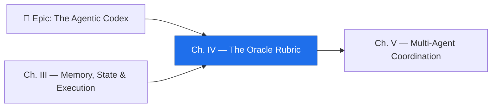

*The Chamber of the Oracle is silent but for the drip of water and the turning of pages. Three figures keep it. The **Oracle** holds the rubric — a list of truths that must all ring true before a quest is named complete; she does not celebrate effort, only completion. The **Necromancer** keeps the catacombs, where every fallen agent lies preserved with its execution trace intact, waiting to be questioned. And the **Forge Master** stands at the fire, because no blade — and no agent — is ever finished, only resting between iterations. To pass this domain you must learn all three crafts: to grade, to diagnose, and to reforge.*

*The real-world skill under the spellcraft is the discipline that separates engineers who **deploy** agents from engineers who **operate** them. Deploying is a one-time act. Operating is continuous work: measuring success with signals a machine can check, performing root-cause analysis when a run fails, and tuning instructions until the agent reliably does what you need. This is GH-600 **Domain 4 — Perform Evaluation, Error Analysis & Tuning (15–20% of the exam)**, and it is where most agent programs quietly die or quietly mature.*

## 📖 The Legend Behind This Quest

Every long-lived agent system runs on a single loop: **define what good looks like → observe what actually happened → diagnose the gap → change the instructions → measure again.** That loop is invisible while an agent succeeds and brutally exposed the first time it fails in production. An engineer who only knows how to *start* an agent will, on that first failure, do the most dangerous thing possible — re-run it and hope. An engineer who has walked this domain instead reaches for a rubric, a trace, and a changelog.

The trick that makes the whole loop possible is **machine-verifiable success criteria**. "The agent should implement the feature correctly" cannot be checked by a workflow — it requires a human to read, judge, and approve. "All CI checks pass, no new code-scanning alerts are opened, the PR references its issue, and it is marked ready for review" *can* be checked automatically, every single run, the same way. Once your definition of done is expressed as GitHub signals — Actions check conclusions, PR states, labels, review counts — evaluation stops being an opinion and becomes a function. This chapter teaches you to write that function, to read the forensic trail when it returns failure, and to feed what you learn back into the agent's instructions.

## 🎯 Quest Objectives

By the end of this chapter you will have built and verified:

### Primary Objectives (Required for Chapter Completion)
- [ ] **A success-criteria schema** — acceptance conditions written so a machine, not a human, can verify them
- [ ] **A signal map** — every criterion bound to a concrete GitHub signal (Actions conclusion, PR state, label, review)
- [ ] **A completion detector** — a `check-task-completion.yml` workflow that grades a run and posts a verdict without human review
- [ ] **A failure taxonomy + one full RCA** — classify a real or simulated failure by layer, then drill it with 5-Why
- [ ] **A tuned instruction with a measured outcome** — change `copilot-instructions.md`/`AGENTS.md`, re-run, and record before/after

### Mastery Indicators
You will know you have mastered this chapter when you can:
- [ ] Rewrite any vague acceptance line as a machine-verifiable one mapped to a GitHub signal
- [ ] Classify a failure as a reasoning error, tool misuse, context drift, or environment issue from its trace
- [ ] Explain why re-running a failed agent without RCA manufactures intermittent failures that never get fixed
- [ ] Tie a single instruction change to a number that moved, recorded in an instruction changelog

## 🗺️ Quest Prerequisites

This is Chapter 4 of **The Agentic Codex**. You do not need the earlier chapters checked off to *learn* here, but they make the work land:

- **Recommended — [Chapter 3: Memory, State & Execution](/quests/1001/agentic-codex-03-memory-state-and-execution/)** — evaluation often surfaces *memory* failures (an agent "forgot" a prior decision), so knowing the memory model helps you classify root causes correctly.
- **A GitHub repository with Actions enabled** and **branch protection** with at least one required status check — you need real signals to grade against.
- **The GitHub CLI (`gh`)** installed and authenticated — the forensics steps download run logs and query PR state through it.
- **At least one prior agent run** — a Copilot coding agent task, or any workflow-invoked agent, so you have a real trace to read rather than a hypothetical one.

## 🧙‍♂️ Chapter 1: The Oracle's Rubric — Machine-Verifiable Success Criteria

### ⚔️ Skills You'll Forge

- Telling **vague** criteria apart from **machine-verifiable** criteria
- Embedding an acceptance-criteria schema where the agent and CI can both read it
- Aligning the criteria with development intent, not just "tests pass"

The Oracle's first law: *if a human must read the output to decide whether the agent succeeded, you have not written success criteria — you have written a vibe.* Domain 4's most-tested distinction is exactly this:

| Vague (un-gradable) | Machine-verifiable (gradable) |
|---|---|
| "Implement the feature correctly" | "Actions check `test` = success **and** check `lint` = success" |
| "Don't break anything" | "No new `code-scanning` alerts opened on the PR" |
| "Open a good PR" | "PR body matches `Closes #\d+`, `draft = false`, ≥ 1 approving review" |
| "Stay in scope" | "`git diff --name-only` ⊆ the declared allow-list" |

Write the rubric where it travels *with the task*. The GitHub-native home is an issue template the Copilot coding agent reads when it picks up the issue, so the definition of done and the agent's marching orders are the same document.

```markdown
<!-- .github/ISSUE_TEMPLATE/agent-task.md -->
---
name: Agent Task
about: Task for the GitHub Copilot coding agent
labels: ['copilot', 'agent-task']
---

## Task
<!-- What should the agent do? Be specific and bounded. -->

## Acceptance Criteria (each line must be machine-verifiable)
- [ ] Tests pass: Actions check `test` = success
- [ ] Lint passes: Actions check `lint` = success
- [ ] No new alerts: zero new code-scanning alerts on the PR
- [ ] References issue: PR body contains `Closes #<this-issue>`
- [ ] Ready for review: PR `draft = false`
- [ ] In scope: only files under `src/` and `test/` are modified

## Out of Scope (failure conditions)
- Do NOT modify CI workflows, secrets, or branch-protection settings
- Do NOT merge the PR — open it for human review only
```

The rule of alignment matters as much as the rule of verifiability: a rubric that grades only `test = success` will happily pass an agent that deleted a feature to make the tests green. Each criterion should encode a slice of **development intent** — scope, safety, traceability — not just a passing build.

### 🔍 Knowledge Check
- [ ] Rewrite "the docs should be updated" as a machine-verifiable criterion and name the GitHub signal it maps to.
- [ ] Why is "all tests pass" alone an insufficient rubric, and what failure does it invite?
- [ ] Where does an acceptance-criteria schema live so that *both* the Copilot coding agent and a CI workflow can read it?

## 🧙‍♂️ Chapter 2: Teaching the Rubric to a Machine — Evaluation Signals & the Completion Detector

### ⚔️ Skills You'll Forge

- Mapping each acceptance criterion to a concrete GitHub signal
- Reading signals through `actions/github-script` and the GitHub API
- Generating an automatic completion verdict — qualitative *and* quantitative

A criterion is only as good as the signal that proves it. Domain 4 asks you to identify both **quantitative** signals (a check conclusion, a count of alerts, a coverage delta) and **qualitative** ones (a required reviewer approved, a label was applied by a human). Bind every rubric line to its source:

| Acceptance Criterion | GitHub Signal | How a workflow reads it |
|---|---|---|
| Tests pass | check run `test`, `conclusion = success` | `checks.listForRef` on `pr.head.sha` |
| No new vulnerabilities | code-scanning alerts on the ref | `code-scanning.listAlertsForRef` |
| PR references issue | PR body matches `Closes #\d+` | string match on `pr.body` |
| Ready for review | `pr.draft = false` | PR object |
| Reviewed by a human | ≥ 1 review with `state = APPROVED` | `pulls.listReviews` |
| In scope | changed files ⊆ allow-list | `pulls.listFiles` + set compare |

Now teach the machine to *grade*. A `check-task-completion.yml` workflow runs after the agent opens or updates its PR, evaluates every signal, and posts a single verdict comment — the Oracle's rubric, automated. (The `raw`/`endraw` tags below are this site's Liquid escapes — drop them when you copy the YAML into your own `.github/workflows/`.)


```yaml
# .github/workflows/check-task-completion.yml
name: Check Agent Task Completion
on:
  pull_request:
    types: [opened, edited, ready_for_review, synchronize]
permissions:
  contents: read
  checks: read
  pull-requests: write
  security-events: read
jobs:
  grade:
    runs-on: ubuntu-latest
    steps:
      - uses: actions/github-script@v7
        with:
          script: |
            const pr = context.payload.pull_request;
            const signals = [];
            const grade = (name, ok) => signals.push({ name, ok: !!ok });

            // Quantitative: required check conclusions
            const { data: checks } = await github.rest.checks.listForRef({
              owner: context.repo.owner, repo: context.repo.repo, ref: pr.head.sha,
            });
            const conclusion = (n) => checks.check_runs.find(c => c.name === n)?.conclusion;
            grade('Tests pass', conclusion('test') === 'success');
            grade('Lint passes', conclusion('lint') === 'success');

            // Qualitative + structural signals
            grade('References issue', /Closes\s+#\d+/i.test(pr.body || ''));
            grade('Ready for review', pr.draft === false);

            const { data: reviews } = await github.rest.pulls.listReviews({
              owner: context.repo.owner, repo: context.repo.repo, pull_number: pr.number,
            });
            grade('Human approved', reviews.some(r => r.state === 'APPROVED'));

            const passed = signals.every(s => s.ok);
            const lines = signals.map(s => `${s.ok ? '✅' : '❌'} ${s.name}`).join('\n');
            const verdict = passed
              ? `## 🔮 Rubric satisfied — task complete\n${lines}`
              : `## ⏳ Rubric not yet satisfied\n${lines}`;

            await github.rest.issues.createComment({
              owner: context.repo.owner, repo: context.repo.repo,
              issue_number: pr.number, body: verdict,
            });
            core.setOutput('passed', String(passed));
```


Note the **least-privilege `permissions:` block** — read-only on checks and security events, write only on the pull request so it can comment. That precise scoping is itself a Domain 6 best-practice the exam loves, and it belongs here because an evaluator should never have power to *change* the thing it grades.

A second pattern worth knowing: GitHub's **Models API** (and the inference action `actions/ai-inference`) lets you add an **LLM-as-judge** signal for the genuinely qualitative criteria a regex cannot reach — "does the PR description actually explain the change?" Use it as *one* signal among deterministic ones, never as the sole gate; a rubric that depends only on a model grading itself is no rubric at all.

### 🔍 Knowledge Check
- [ ] For each rubric line in Chapter 1, name the GitHub API call or payload field that proves it.
- [ ] Why does the completion detector use `pr.head.sha` rather than the branch name when listing checks?
- [ ] When is an LLM-as-judge signal appropriate, and why must it never be the only gate?

## 🧙‍♂️ Chapter 3: The Necromancer's Inquest — Reading Traces & 5-Why RCA

### ⚔️ Skills You'll Forge

- Building a **failure taxonomy** that classifies a failure by its layer
- Pulling the forensic trail with `gh run download`
- Driving a failure to its **root cause** with 5-Why, then shipping a prevention

When the detector returns ❌, the instinct is to re-run. The Necromancer forbids it: *re-running without understanding is how you breed intermittent failures that are never truly fixed.* Instead, classify. Domain 4 sub-skill 4.2 wants you to name the **layer** a failure lives in — reasoning vs tool misuse vs context vs environment — because the fix differs entirely by layer.

| Layer | Example failure | Primary evidence source |
|---|---|---|
| **Reasoning / planning** | Agent built an unrelated change | Issue body + first commit message |
| **Tool misuse** | An MCP tool was called with bad arguments | Actions step logs / tool output |
| **Permissions** | Push to a protected branch rejected | GitHub API error response |
| **Context drift** | Agent edited the wrong file | `git diff` vs the acceptance allow-list |
| **Environment** | A required file or secret was missing | File-system / setup error in logs |
| **Completion** | Declared success before tests passed | Actions run conclusion |

Collect the evidence deterministically. Every Actions run leaves a downloadable trace:

```bash
# Find the failed run, then pull its full log + artifact set
gh run list --workflow=agent-task.yml --status=failure --limit=5
gh run download <RUN_ID> --dir ./forensics/run-<RUN_ID>

# Locate the failure point and the agent's last action before it
grep -rnE "::error|ERROR|FAIL|timeout" ./forensics/run-<RUN_ID> | head -40
grep -rnE "Plan|Step|tool|copilot" ./forensics/run-<RUN_ID> | tail -30
```

Now interrogate the corpse. **5-Why** drills past the symptom to the systemic cause — and the systemic cause is almost never "the agent is dumb," it is "our instructions, tools, or environment let it fail":

```markdown
# forensics/rca-2026-06-30.md

## Incident
- Run: <Actions run URL>   Task: Issue #N
- Failure mode: agent pushed to `main`, rejected by branch protection.

## 5-Why
1. Why fail? → It pushed to `main`, which is protected.
2. Why push to main? → It never created a feature branch.
3. Why no branch? → AGENTS.md says "create a branch" but no command/format.
4. Why no format? → The instruction was written, never tested with a real agent.
5. Why untested? → No agent dry-run existed before deployment.

## Root cause
Under-specified branch protocol in AGENTS.md — an *instruction* failure, not a model failure.

## Prevention (shipped)
- AGENTS.md: explicit `git checkout -b copilot/issue-{N}-{slug}` + "never commit to main".
- Add a dry-run task to the workflow before live use.
```

The crucial reframe: the same failure could have been mis-blamed on the *model*. The trace — last action, exit signal, diff — is what lets you place it in the **instruction** layer instead, which is the only layer you can fix in the next chapter.

### 🔍 Knowledge Check
- [ ] Given a log ending in `::error::Resource not accessible by integration`, which taxonomy layer is it, and why?
- [ ] What does `gh run download` give you that the web log viewer does not?
- [ ] Why does a good 5-Why chain almost always terminate at *our* system (instructions/tools/env) rather than at the model?

## 🧙‍♂️ Chapter 4: The Forge Master — Tuning Behaviour by Instruction

### ⚔️ Skills You'll Forge

- Establishing a **baseline** before you change anything
- Treating instructions like code: versioned, tested, changelogged
- Tying each change to a measured before/after, and refining tools/memory when instructions aren't the lever

The Forge Master's law: *you cannot improve what you cannot measure, and you cannot measure what you have not baselined.* Before touching `copilot-instructions.md` or `AGENTS.md`, run a fixed set of standard tasks and record the signals — this is your control group.

```bash
# measure_agent_baseline.sh — run BEFORE any instruction change
set -euo pipefail
OUT="forensics/baseline.jsonl"
for TASK in 1 2 3; do
  RUN_ID=$(gh run list --workflow=agent-task.yml --limit=1 \
            --json databaseId -q '.[0].databaseId')
  CONCL=$(gh run view "$RUN_ID" --json conclusion -q '.conclusion')
  PR=$(gh pr list --state all --search "issue-$TASK in:title" --json number -q 'length')
  printf '{"task":%s,"run":"%s","tests_passed":%s,"pr_opened":%s}\n' \
    "$TASK" "$RUN_ID" \
    "$([ "$CONCL" = success ] && echo true || echo false)" \
    "$([ "$PR" -gt 0 ] && echo true || echo false)" >> "$OUT"
done
echo "Baseline written to $OUT"
```

Sub-skill 4.3 is explicit that tuning is more than rewriting prose — you can **revise instructions/workflows/constraints**, **refine memory usage**, or **refine tool usage and tool access**. Match the lever to the failure layer you found in the RCA:

| Failure pattern (from RCA) | The right lever | Why this layer |
|---|---|---|
| Agent skips planning, edits blindly | Instruction: mandate a PLAN step first | Reasoning is shaped by instruction |
| Agent wanders outside scope | Constraint: explicit allow/deny path list | Tighten the *constraint*, not the prose |
| Agent re-reads files it already saw | Memory: a "mark as read" convention | A memory refinement, not an instruction |
| A tool returns garbage every run | Tool access: swap/restrict the tool | Tooling, not the model |

Then prove the change helped — one variable at a time, baseline vs after:

```markdown
# Iteration 1 — branch naming
Observation (RCA): agent used `fix-the-thing`, untraceable to its issue.
Hypothesis: an explicit branch-name rule in AGENTS.md fixes it.
Change (2026-06-30): "Branch MUST match copilot/issue-{N}-{slug}".
Measurement: before 0/3 traceable → after 3/3 traceable.
Outcome: ✅ confirmed improvement — change retained.
```

Finally, **treat instructions like code**. Every change goes in a changelog with the metric it targeted, so a future you (or a teammate) can see *why* a rule exists and whether it earned its place:

```markdown
<!-- docs/agent-instructions/CHANGELOG.md -->
## 2026-06-30
### AGENTS.md
- Added: branch-name format `copilot/issue-{N}-{slug}`
  - Reason: untraceable branches in 3 RCA reports
  - Outcome: ✅ 3/3 runs now traceable
### copilot-instructions.md
- Added: mandatory planning step before any file edit
  - Reason: planning skipped in 2/3 baseline runs
  - Outcome: TBD — measuring
```

This closes the loop the legend opened: rubric → signal → trace → tuned instruction → new baseline. The agent is never *finished* — it is resting between iterations.

### 🔍 Knowledge Check
- [ ] Why establish a baseline *before* changing any instruction, even when the fix seems obvious?
- [ ] An agent keeps re-reading the same file every run — is the right lever an instruction, a constraint, a memory rule, or a tool change? Why?
- [ ] What does an instruction changelog give you that a raw `git log` of `AGENTS.md` does not?

## 🧪 Hands-On Lab: Build the Oracle on Your Own Bench

*A rubric you have never watched fail is a rubric you do not understand.* This lab builds a working completion detector locally — deterministic signals in a JSON file, a grader that reads them — then points it at a real pull request with `gh`. Ten minutes, no Copilot required.

### Step 1 — Fabricate a run's signals

```bash
mkdir -p ~/codex-oracle-lab && cd ~/codex-oracle-lab
cat > signals.json <<'EOF'
{
  "checks":        { "test": "success", "lint": "success" },
  "pr":            { "draft": false, "body": "Fix parser crash. Closes #42", "approvals": 1 },
  "new_alerts":    0,
  "changed_files": ["src/parser.js", "test/parser.test.js"]
}
EOF
```

### Step 2 — Write the grader

Every line of the Chapter 1 rubric becomes one `jq` assertion — the machine-verifiable criteria, executed:

```bash
cat > grade.sh <<'EOF'
#!/usr/bin/env bash
# grade.sh — the Oracle's rubric as a function: signals in, verdict out
set -euo pipefail
S="${1:-signals.json}"
fails=0
grade() {  # name, jq-expression that must be true
  if [ "$(jq -r "$2" "$S")" = "true" ]; then echo "✅ $1"
  else echo "❌ $1"; fails=$((fails + 1)); fi
}
grade "Tests pass"          '.checks.test  == "success"'
grade "Lint passes"         '.checks.lint  == "success"'
grade "No new alerts"       '.new_alerts   == 0'
grade "References issue"    '.pr.body | test("Closes #[0-9]+")'
grade "Ready for review"    '.pr.draft     == false'
grade "Human approved"      '.pr.approvals >= 1'
grade "In scope"            '[.changed_files[] | test("^(src|test)/")] | all'
[ "$fails" -eq 0 ] && echo "🔮 Rubric satisfied — task complete" \
                   || { echo "⏳ Rubric not satisfied — $fails signal(s) failing"; exit 1; }
EOF
chmod +x grade.sh && ./grade.sh
```

Expected: seven ✅ lines and `🔮 Rubric satisfied — task complete`, exit code 0.

### Step 3 — Watch it fail for the right reason

```bash
jq '.pr.draft = true | .changed_files += [".github/workflows/deploy.yml"]' \
  signals.json > drifted.json
./grade.sh drifted.json; echo "exit=$?"
```

Expected — the two poisoned signals fail, everything else still passes, and the exit code goes red:

```text
✅ Tests pass
✅ Lint passes
✅ No new alerts
✅ References issue
❌ Ready for review
✅ Human approved
❌ In scope
⏳ Rubric not satisfied — 2 signal(s) failing
exit=1
```

Notice what the second ❌ caught: a workflow file crept into the diff — exactly the "out of scope" failure a tests-only rubric would have waved through.

### Step 4 — Point the Oracle at reality

Now build `signals.json` from a **real** PR instead of a fixture — any PR in a repo you can read:

```bash
repo="<owner>/<repo>"; pr=<number>
jq -n \
  --argjson pr    "$(gh pr view "$pr" --repo "$repo" --json isDraft,body,reviews)" \
  --argjson files "$(gh pr view "$pr" --repo "$repo" --json files -q '[.files[].path]')" \
  '{ checks: {test:"success", lint:"success"},
     pr: { draft: $pr.isDraft, body: $pr.body,
           approvals: ([$pr.reviews[] | select(.state=="APPROVED")] | length) },
     new_alerts: 0, changed_files: $files }' > signals.json
./grade.sh
```

The fabricated `checks`/`new_alerts` fields are the two signals that need a workflow context to read — in CI they come from `checks.listForRef` and `code-scanning.listAlertsForRef`, exactly as in the `check-task-completion.yml` above. The lab's lesson survives the swap: **the rubric is a pure function of signals**, and anything that can produce the signals can be graded — a fixture, a live PR, or the agent run you ship next week.

## ⚔️ The Quests of This Domain

This chapter is the campaign hub for Domain 4. Each linked quest takes one craft deep with hands-on exercises — play them in order:

- **[The Oracle's Rubric: Agent Success Signals](/quests/1010/agentic-success-criteria-and-signals/)** — define the acceptance-criteria schema, map it to GitHub signals, and build the completion detector that grades a run with no human in the loop.
- **[The Necromancer's Inquest: Agent Failure Root Cause Analysis](/quests/1010/agentic-failure-root-cause-analysis/)** — read Actions logs and artifacts, classify failures with the taxonomy, and drive a real failure to its root cause with 5-Why.
- **[Reforging the Agent's Mind: Tuning Behavior by Instruction](/quests/1011/agentic-behavior-tuning/)** — baseline behaviour, iterate on `copilot-instructions.md`/`AGENTS.md`, and keep an instruction changelog that ties every change to a measured outcome.

## 🎮 Mastery Challenge

**Objective:** Operate one agent task through the full evaluate-and-tune loop on your own repository.

- [ ] Write an `agent-task.md` issue template whose acceptance criteria are *all* machine-verifiable, each mapped to a named GitHub signal
- [ ] Ship `check-task-completion.yml` with a least-privilege `permissions:` block; prove it posts a ✅ verdict on a passing PR and a ❌ verdict on a failing one
- [ ] Take one real or simulated failure, classify it by taxonomy layer, and write a 5-Why RCA terminating at an *instruction/tool/environment* root cause
- [ ] Ship the prevention, re-run your baseline tasks, and record the before/after in `docs/agent-instructions/CHANGELOG.md`

## 🎁 Rewards & Progression

**🎖️ Badges**
- 🔮 **Oracle of the Rubric** — you graded an agent run against machine-verifiable criteria, no human review required
- 💀 **Inquest Master** — you traced an agent failure to its true root cause instead of re-running and hoping

**🛠️ Skills Unlocked**
- Machine-verifiable success-criteria design · Agent failure root-cause analysis · Behaviour tuning by instruction

**📊 Progression Points**: +90 XP toward your Level `1010` total

## 🗺️ Quest Network



## 🔮 Next Adventures

You can now grade an agent, diagnose its failures, and reforge its mind. The next domain raises the stakes from one agent to *many* — where evaluation must cover handoffs, conflicts, and stalled familiars.

- ➡️ **Next chapter:** [Chapter V — Multi-Agent Coordination](/quests/1011/agentic-codex-05-multi-agent-coordination/)
- ⬅️ **Previous chapter:** [Chapter III — Memory, State & Execution](/quests/1001/agentic-codex-03-memory-state-and-execution/)
- 🏰 **Campaign hub:** [Epic Quest: The Agentic Codex](/quests/codex/agentic-codex/)

## 📚 Resource Codex

- [GH-600 study guide (Microsoft Learn)](https://learn.microsoft.com/en-us/credentials/certifications/resources/study-guides/gh-600) — the official Domain 4 skills outline
- [GitHub Copilot coding agent](https://docs.github.com/en/copilot/using-github-copilot/coding-agent) — the agent you are grading and tuning
- [Customizing Copilot with `copilot-instructions.md`](https://docs.github.com/en/copilot/customizing-copilot/adding-repository-custom-instructions-for-github-copilot) — the file you tune in Chapter 4
- [GitHub Actions: `github-script`](https://github.com/actions/github-script) — how the completion detector reads signals
- [GitHub CLI: `gh run`](https://cli.github.com/manual/gh_run) — downloading run logs and artifacts for forensics
- [GitHub Models](https://docs.github.com/en/github-models) — adding an LLM-as-judge signal for qualitative criteria
- [Code scanning REST API](https://docs.github.com/en/rest/code-scanning) — reading the "no new alerts" signal
- [Evaluation Signals Table (GH-600 notes)](/notes/gh-600/evaluation-signals-table/) — every Domain 4 signal and the API call that reads it

## 🕸️ Knowledge Graph

*Structured wiki-links connect this quest to the IT-Journey knowledge graph. Open the [Obsidian Graph View](/notes/obsidian/graph/) to explore connections.*

**Campaign hub:** [[Epic Quest: The Agentic Codex]]
**Previous:** [[Memory, State & Execution]]
**Next:** [[Multi-Agent Coordination]]
**Domain 4 quests:** [[The Oracle's Rubric: Agent Success Signals]] · [[The Necromancer's Inquest: Agent Failure Root Cause Analysis]] · [[Reforging the Agent's Mind: Tuning Behavior by Instruction]]
**Reference:** [[Evaluating and Tuning Agents with GitHub Signals]]
**Obsidian docs:** [[Obsidian Knowledge Graph and Wiki Links]]
