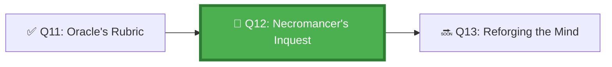

*The Necromancer's Catacombs are filled with the remains of failed agents. Each one preserved in amber, execution trace intact. The Necromancer raises them one by one and asks: why did you fail? What was the first wrong step? What could have prevented this? She has learned more from failure than from success — and she insists her students do the same.*

## 🗺️ Quest Network Position



## 🎯 Quest Objectives

- [ ] **Build a failure taxonomy** — classify agent failures by layer (tool, planning, execution, environment)
- [ ] **Practice trace reading** — extract the failure point from a real GitHub Actions log
- [ ] **Apply the 5-Why framework** — trace a failure back to its root cause
- [ ] **Produce an RCA report** — document the investigation and recommendations
- [ ] **Implement a prevention** — change instructions or workflow to prevent recurrence

## ⚔️ The Quest Begins

### Chapter 1 — Agent Failure Taxonomy

Before you can diagnose a failure, you need a classification system:

| Layer | Example Failure | Primary Evidence Source |
|---|---|---|
| **Planning** | Agent creates an unrelated branch | Issue body + first commit message |
| **Tool invocation** | MCP server returns error | Actions step logs |
| **Permissions** | Agent attempts to push to protected branch | GitHub API error response |
| **Context** | Agent modifies wrong file (context drift) | `git diff` vs acceptance criteria |
| **Dependency** | Required file doesn't exist | File system error in logs |
| **Communication** | Agent PR comment is empty or malformed | PR timeline |
| **Completion** | Agent declares success before tests pass | Actions run status |

---

### Chapter 2 — Reading the Execution Trace

> **Exercise 12.1:** Download a failed Actions run artifact and extract the key failure signals.

```bash
# Step 1: Find the failed run
gh run list --workflow=agent-task.yml --status=failure --limit=5

# Step 2: Download the logs from the most recent failure
gh run download <RUN_ID> --dir ./work/gh-600/forensics/run-<RUN_ID>

# Step 3: Find the failure point
grep -n "ERROR\|FAIL\|error:\|::error" ./work/gh-600/forensics/run-<RUN_ID>/**/*.txt | head -50

# Step 4: Extract the agent's last action before failure
grep -n "Agent\|copilot\|Plan\|Step" ./work/gh-600/forensics/run-<RUN_ID>/**/*.txt | tail -30
```

The failure point is usually one of:
1. The last successful step followed by a non-zero exit
2. An `::error::` annotation injected into the log
3. A `timeout` signal

---

### Chapter 3 — The 5-Why RCA Framework

> **Exercise 12.2:** Apply 5-Why analysis to a real or simulated agent failure.

```markdown
# RCA Report Template
# work/gh-600/forensics/rca-YYYY-MM-DD.md

## Incident Summary
- **Date:** YYYY-MM-DD
- **Run ID:** GitHub Actions Run URL
- **Task:** Issue #N — what was the agent trying to do?
- **Failure Mode:** One sentence: what went wrong?

## 5-Why Analysis

**Why did the agent fail?**
> The agent tried to push to `main` but was rejected by branch protection.

**Why did it try to push to main?**
> The agent didn't create a feature branch — it committed directly to main.

**Why didn't it create a feature branch?**
> `AGENTS.md` says "create a branch" but doesn't specify the naming format or creation command.

**Why wasn't the naming format specified?**
> The original AGENTS.md was written without testing by a real agent.

**Why was it not tested?**
> No agent dry-run process existed before deployment.

## Root Cause
> Insufficient specificity in AGENTS.md regarding branch creation protocol.

## Contributing Factors
- No dry-run testing of agent instructions
- Branch protection rules not documented in AGENTS.md

## Prevention Recommendations
1. Update AGENTS.md with explicit branch creation command and naming format
2. Add a dry-run mode to the agent workflow (`--dry-run` flag)
3. Test AGENTS.md changes with a low-stakes task before deploying

## Implementation Status
- [x] AGENTS.md updated (PR #47)
- [ ] Dry-run mode added to workflow
- [ ] Post-implementation test completed
```

---

### Chapter 4 — Implementing a Prevention

> **Exercise 12.3:** Update your AGENTS.md based on your RCA recommendation.

````markdown
# In AGENTS.md — add explicit branch creation protocol

## Branch Creation Protocol

ALWAYS create a feature branch before modifying any files. Use this exact sequence:

```bash
# Branch naming format
BRANCH_NAME="copilot/issue-{ISSUE_NUMBER}-{SLUG}"

# Example
BRANCH_NAME="copilot/issue-42-add-input-validation"

# Create and switch
git checkout -b "$BRANCH_NAME"
git push -u origin "$BRANCH_NAME"
```bash

Never commit directly to `main` or any protected branch.
If a push to a protected branch is rejected, STOP immediately and escalate.
````

---

## ✅ Quest Validation

```bash
python3 scripts/validate_quest.py --quest q12
# ✅ Failure taxonomy: documented
# ✅ RCA template: work/gh-600/forensics/rca-template.md present
# ✅ Prevention implemented: AGENTS.md updated
# 🏆 Quest Q12 complete!
```

## 🏆 Quest Rewards

| Reward | Details |
|---|---|
| 💀 Inquest Master Badge | Earned on completion |
| 🔍 Agent Forensics | Skill unlocked |
| 100 XP | Added to Level 1010 total |
| Unlocks | [Q13: Reforging the Agent's Mind](/quests/1011/agentic-behavior-tuning/) |

## 🕸️ Knowledge Graph

*Structured wiki-links connect this quest to the IT-Journey knowledge graph. Open the [Obsidian Graph View](/docs/obsidian/graph/) to explore connections.*

**Level hub:** [[Level 1010 - Automation & Testing]]
**Overworld:** [[🏰 Overworld - Master Quest Map]]
**Study track:** [[The Agentic Codex: GH-600 Study Hub]] · [[GH-600 Agentic AI Quick-Reference Notes]]
**Prerequisites:** [[The Oracle's Rubric: Defining Agent Success Criteria and Signals]]
**Unlocks:** [[Reforging the Agent's Mind: Behavior Tuning Through Instructions]]
**Sequel quests:** [[Reforging the Agent's Mind: Behavior Tuning Through Instructions]]
**Obsidian docs:** [[Obsidian Knowledge Graph and Wiki Links]]

