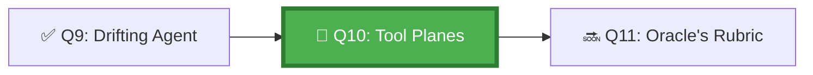

*The Plane Walkers carry a single burning thread — the Context Thread — through every dimension they traverse. When they enter the Issue Plane, they attach the thread to the issue. When they cross to the Actions Plane, the thread follows. When they emerge in the PR Plane, the thread is still there, connecting every decision back to the original intent. Without the thread, they are lost between planes.*

## 🗺️ Quest Network Position



## 🎯 Quest Objectives

- [ ] **Map the GitHub context surfaces** — document which state lives where across issue/branch/PR/Actions
- [ ] **Define a handoff schema** — standardise how state is transferred between surfaces
- [ ] **Implement cross-surface context injection** — agent reads previous surface state before acting
- [ ] **Test the full pipeline** — run an end-to-end scenario from issue creation to PR merge
- [ ] **Verify no context loss** — confirm the PR body references the original issue and plan

## ⚔️ The Quest Begins

### Chapter 1 — The GitHub Context Surface Map

Each GitHub surface stores different kinds of context. An agent crossing between them must know what to look for:

| Surface | Context Available | How to Read It |
|---|---|---|
| **Issue** | Task description, acceptance criteria, labels, comments | GitHub API: `GET /issues/{n}` |
| **Branch name** | Task ID, type indicator | `git branch --show-current` |
| **Commit messages** | Step-by-step execution log | `git log --oneline` |
| **PR description** | Plan summary, references to issue, test results | GitHub API: `GET /pulls/{n}` |
| **PR comments** | Review feedback, approval/rejection | GitHub API: `GET /pulls/{n}/comments` |
| **Actions run** | Execution trace, test results, artifacts | GitHub API: `GET /actions/runs/{n}` |
| **Actions artifacts** | Checkpoints, execution logs, schemas | Download via Actions API |

---

### Chapter 2 — Designing the Handoff Schema

> **Exercise 10.1:** Define the standard handoff object that travels between surfaces.

```json
// work/gh-600/schemas/context-handoff.json
{
  "$schema": "http://json-schema.org/draft-07/schema#",
  "title": "AgentContextHandoff",
  "description": "Standard object for preserving agent context across GitHub surfaces",
  "type": "object",
  "required": ["task_id", "original_intent", "current_stage", "history"],
  "properties": {
    "task_id": {
      "type": "string",
      "description": "GitHub issue number or task identifier"
    },
    "original_intent": {
      "type": "string",
      "description": "Verbatim task description from the original trigger"
    },
    "current_stage": {
      "type": "string",
      "enum": ["issue", "planning", "branch", "implementation", "pr-open", "pr-review", "merged"]
    },
    "history": {
      "type": "array",
      "description": "Ordered list of surfaces visited with timestamps and outcomes",
      "items": {
        "type": "object",
        "required": ["surface", "timestamp", "outcome"],
        "properties": {
          "surface": { "type": "string" },
          "timestamp": { "type": "string", "format": "date-time" },
          "outcome": { "type": "string" },
          "artifact_url": { "type": "string" }
        }
      }
    },
    "next_expected_surface": {
      "type": "string",
      "description": "Where the agent expects to work next"
    }
  }
}
```

---

### Chapter 3 — Implementing Cross-Surface Context Injection

> **Exercise 10.2:** Create a script that reads context from the current surface and injects it into the next agent session.

```python
# work/gh-600/scripts/inject_cross_surface_context.py
"""
Reads context from the current GitHub surface (issue, PR, or Actions run)
and generates a context injection prompt for the next agent session.
"""

import os
import json
import sys
import subprocess
from datetime import datetime, timezone


def get_github_context() -> dict:
    """Read current GitHub environment context."""
    return {
        "repository": os.environ.get("GITHUB_REPOSITORY", ""),
        "run_id": os.environ.get("GITHUB_RUN_ID", ""),
        "event_name": os.environ.get("GITHUB_EVENT_NAME", ""),
        "sha": os.environ.get("GITHUB_SHA", ""),
        "ref": os.environ.get("GITHUB_REF", ""),
        "actor": os.environ.get("GITHUB_ACTOR", ""),
    }


def load_handoff(path: str) -> dict:
    """Load existing handoff object or create a new one."""
    if os.path.exists(path):
        with open(path) as f:
            return json.load(f)
    return {
        "task_id": "unknown",
        "original_intent": "",
        "current_stage": "issue",
        "history": []
    }


def update_handoff(handoff: dict, stage: str, outcome: str) -> dict:
    """Add current surface visit to history."""
    ctx = get_github_context()
    handoff["current_stage"] = stage
    handoff["history"].append({
        "surface": stage,
        "timestamp": datetime.now(timezone.utc).isoformat(),
        "outcome": outcome,
        "run_id": ctx.get("run_id", ""),
        "sha": ctx.get("sha", "")
    })
    return handoff


def generate_injection_prompt(handoff: dict) -> str:
    """Generate a context injection prompt for the next agent session."""
    history_summary = "\n".join([
        f"  - {h['surface']} ({h['timestamp'][:10]}): {h['outcome']}"
        for h in handoff["history"]
    ])
    
    return f"""# Cross-Surface Context Injection

You are continuing a task that was started in a previous session/surface.

## Original Task
{handoff['original_intent']}

## Task ID
{handoff['task_id']}

## Current Stage
{handoff['current_stage']}

## History (what has been done)
{history_summary or '  (no prior history)'}

## Instructions
- Do NOT re-do any work listed in the history above
- Continue from where the previous session left off
- If unclear what was completed, read the linked artifacts/commits
- Maintain the original task scope — do not expand it
"""


if __name__ == "__main__":
    handoff_path = sys.argv[1] if len(sys.argv) > 1 else ".agent-memory/handoff.json"
    stage = sys.argv[2] if len(sys.argv) > 2 else "unknown"
    outcome = sys.argv[3] if len(sys.argv) > 3 else "in-progress"

    handoff = load_handoff(handoff_path)
    handoff = update_handoff(handoff, stage, outcome)
    
    with open(handoff_path, "w") as f:
        json.dump(handoff, f, indent=2)
    
    prompt = generate_injection_prompt(handoff)
    print(prompt)
    
    with open(".agent-memory/injection-prompt.md", "w") as f:
        f.write(prompt)
    
    print(f"\n✅ Context handoff updated and injection prompt written")
```

---

### Chapter 4 — The Full End-to-End Scenario

> **Exercise 10.3:** Run this scenario and verify context is preserved at every stage.

```bash
# Stage 1: Issue → Planning
export TASK_ID="42"
export ORIGINAL_INTENT="Add input validation to the user registration endpoint"

python3 work/gh-600/scripts/inject_cross_surface_context.py \
  .agent-memory/handoff.json planning "Structured plan created and approved"

# Stage 2: Planning → Branch
python3 work/gh-600/scripts/inject_cross_surface_context.py \
  .agent-memory/handoff.json branch "Files modified: src/api/register.js"

# Stage 3: Branch → PR
python3 work/gh-600/scripts/inject_cross_surface_context.py \
  .agent-memory/handoff.json pr-open "Draft PR opened with trace linking to issue #42"

# Verify: does the injection prompt contain the full history?
cat .agent-memory/injection-prompt.md
```

---

## ✅ Quest Validation

```bash
python3 scripts/validate_quest.py --quest q10
# ✅ Handoff schema: context-handoff.json present
# ✅ Context injector: inject_cross_surface_context.py present
# ✅ End-to-end scenario: handoff.json has multi-stage history
# 🏆 Quest Q10 complete!
```

## 🏆 Quest Rewards

| Reward | Details |
|---|---|
| 🌀 Plane Walker Badge | Earned on completion |
| 🧵 Cross-Tool Context Weaving | Skill unlocked |
| 100 XP | Added to Level 1010 total |
| Unlocks | [Q11: The Oracle's Rubric](/quests/1010/agentic-success-criteria-and-signals/) |

## 🕸️ Knowledge Graph

*Structured wiki-links connect this quest to the IT-Journey knowledge graph. Open the [Obsidian Graph View](/docs/obsidian/graph/) to explore connections.*

**Level hub:** [[Level 1010 - Automation & Testing]]
**Overworld:** [[🏰 Overworld - Master Quest Map]]
**Study track:** [[The Agentic Codex: GH-600 Study Hub]] · [[GH-600 Agentic AI Quick-Reference Notes]]
**Prerequisites:** [[Anchoring the Drifting Agent: State Persistence and Drift Prevention]]
**Unlocks:** [[The Oracle's Rubric: Defining Agent Success Criteria and Signals]]
**Sequel quests:** [[The Oracle's Rubric: Defining Agent Success Criteria and Signals]]
**Obsidian docs:** [[Obsidian Knowledge Graph and Wiki Links]]

