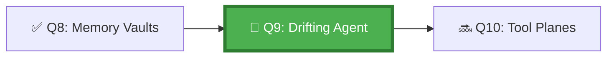

*The Tide Fields south of the Citadel are treacherous — the currents shift without warning, and many agents sent to cross them have returned to shore hundreds of leagues from their intended destination. They set off correctly, but drift, session by session, until they no longer remember the original shore.*

## 🗺️ Quest Network Position



## 🎯 Quest Objectives

- [ ] **Define context drift** — identify signals that indicate an agent has lost its original task context
- [ ] **Implement state checkpointing** — save agent state at defined intervals during long-running tasks
- [ ] **Build a drift detector** — script that compares current agent output against original task intent
- [ ] **Test recovery from drift** — simulate a drifted agent and restore it using a checkpoint
- [ ] **Document intervention triggers** — define exactly when drift causes automatic escalation to a human

## ⚔️ The Quest Begins

### Chapter 1 — Recognising Context Drift

Context drift occurs when an agent's understanding of its task shifts as its context window fills with intermediate results, tool outputs, and accumulated messages.

**Drift signals to watch for:**

| Signal | Example | Severity |
|---|---|---|
| Task scope creep | Agent starts modifying files not in the original plan | 🔴 High |
| Original task forgotten | Agent's PR description no longer references the original issue | 🔴 High |
| Contradictory decisions | Agent reverses an earlier decision without noting it | 🟡 Medium |
| Excessive sub-tasks | Agent creates 10+ sub-issues for a 2-step task | 🟡 Medium |
| Repeated actions | Agent rewrites the same file multiple times | 🟡 Medium |

---

### Chapter 2 — Implementing State Checkpoints

> **Exercise 9.1:** Add periodic checkpointing to your agent workflow.


```yaml
# .github/workflows/agent-with-checkpointing.yml
name: Agent with State Checkpointing

on:
  issues:
    types: [labeled]

jobs:
  agent-run:
    runs-on: ubuntu-latest
    timeout-minutes: 45
    steps:
      - uses: actions/checkout@v4

      - name: Record initial task intent
        id: initial_intent
        run: |
          # Save the original task as the anchor — never overwrite this
          cat > .agent-memory/initial-intent.json << EOF
          {
            "original_task": $(echo '${{ toJSON(github.event.issue.body) }}'),
            "issue_number": ${{ github.event.issue.number }},
            "recorded_at": "$(date -u +%Y-%m-%dT%H:%M:%SZ)",
            "anchor_hash": "$(echo '${{ github.event.issue.body }}' | sha256sum | cut -d' ' -f1)"
          }
          EOF
          echo "✅ Initial task intent anchored"

      - name: Checkpoint 1 — after planning
        run: |
          python3 work/gh-600/scripts/save_checkpoint.py \
            --stage planning \
            --state-file .agent-memory/checkpoint-planning.json

      - name: Validate drift (planning vs intent)
        run: |
          python3 work/gh-600/scripts/detect_drift.py \
            --intent .agent-memory/initial-intent.json \
            --checkpoint .agent-memory/checkpoint-planning.json \
            --threshold 0.7

      - name: Checkpoint 2 — after execution
        run: |
          python3 work/gh-600/scripts/save_checkpoint.py \
            --stage execution \
            --state-file .agent-memory/checkpoint-execution.json

      - name: Upload checkpoints
        if: always()
        uses: actions/upload-artifact@v4
        with:
          name: agent-checkpoints-${{ github.run_id }}
          path: .agent-memory/
          retention-days: 30
```


---

### Chapter 3 — Building the Drift Detector

> **Exercise 9.2:** Create a drift detection script.

```python
# work/gh-600/scripts/detect_drift.py
"""Detects context drift by comparing checkpoint against original task intent."""

import argparse
import json
import sys
from difflib import SequenceMatcher


def similarity(a: str, b: str) -> float:
    return SequenceMatcher(None, a, b).ratio()


def detect_drift(intent_file: str, checkpoint_file: str, threshold: float) -> bool:
    with open(intent_file) as f:
        intent = json.load(f)
    with open(checkpoint_file) as f:
        checkpoint = json.load(f)

    original_task = intent.get("original_task", "")
    current_task_summary = checkpoint.get("task_summary", "")

    score = similarity(original_task, current_task_summary)
    
    print(f"Drift detection report:")
    print(f"  Original task length: {len(original_task)} chars")
    print(f"  Current summary length: {len(current_task_summary)} chars")
    print(f"  Similarity score: {score:.2f} (threshold: {threshold})")

    if score < threshold:
        print(f"⚠️  DRIFT DETECTED — similarity {score:.2f} below threshold {threshold}")
        print("    Recommended action: Stop agent, restore from last good checkpoint")
        return True
    else:
        print(f"✅ No significant drift detected ({score:.2f} >= {threshold})")
        return False


if __name__ == "__main__":
    parser = argparse.ArgumentParser()
    parser.add_argument("--intent", required=True)
    parser.add_argument("--checkpoint", required=True)
    parser.add_argument("--threshold", type=float, default=0.7)
    args = parser.parse_args()

    drifted = detect_drift(args.intent, args.checkpoint, args.threshold)
    sys.exit(1 if drifted else 0)
```

---

### Chapter 4 — Recovery from Drift

When drift is detected, the recovery procedure is:

1. **Stop the agent** — do not allow further execution
2. **Identify the last good checkpoint** — find the checkpoint before drift began
3. **Restore context** — inject the original intent + last good checkpoint into a new agent session
4. **Re-plan** — have the agent create a new plan from the restored state
5. **Human approval required** — a drifted agent must get explicit plan approval before resuming

```bash
# Recovery script
# work/gh-600/scripts/recover_from_drift.sh
#!/usr/bin/env bash
set -euo pipefail

CHECKPOINT_DIR=".agent-memory"
RECOVERY_PROMPT_FILE="$CHECKPOINT_DIR/recovery-prompt.md"

echo "=== Agent Drift Recovery Procedure ==="

# Read original intent
ORIGINAL_TASK=$(jq -r '.original_task' "$CHECKPOINT_DIR/initial-intent.json")

cat > "$RECOVERY_PROMPT_FILE" << EOF
# Agent Recovery Context

Your previous session experienced context drift. You are resuming from a clean state.

## Original Task (Anchor)
$ORIGINAL_TASK

## Recovery Instructions
1. Read the original task above carefully
2. Produce a NEW structured plan from scratch — do not reference any previous plans
3. The plan must address ONLY the original task, nothing else
4. Submit the plan for human review before taking any action

## What NOT to Do
- Do not reference prior incomplete work
- Do not continue from where you left off
- Do not assume any previous files are correct
EOF

echo "✅ Recovery prompt written to $RECOVERY_PROMPT_FILE"
echo "Next step: inject this prompt as the first message in a new Copilot session"
```

---

## ✅ Quest Validation

```bash
python3 scripts/validate_quest.py --quest q9
# ✅ Checkpointing workflow: agent-with-checkpointing.yml present
# ✅ Drift detector: detect_drift.py present and executable
# ✅ Recovery script: recover_from_drift.sh present
# ✅ Initial intent anchoring: implemented
# 🏆 Quest Q9 complete!
```

## 🏆 Quest Rewards

| Reward | Details |
|---|---|
| ⚓ Anchor Master Badge | Earned on completion |
| 🔍 Drift Detection | Skill unlocked |
| 100 XP | Added to Level 1010 total |
| Unlocks | [Q10: Crossing the Tool Planes](/quests/1010/agentic-state-continuity-cross-tools/) |

## 🕸️ Knowledge Graph

*Structured wiki-links connect this quest to the IT-Journey knowledge graph. Open the [Obsidian Graph View](/docs/obsidian/graph/) to explore connections.*

**Level hub:** [[Level 1010 - Automation & Testing]]
**Overworld:** [[🏰 Overworld - Master Quest Map]]
**Study track:** [[The Agentic Codex: GH-600 Study Hub]] · [[GH-600 Agentic AI Quick-Reference Notes]]
**Prerequisites:** [[Vaults of Recollection: Agent Memory Strategies]]
**Unlocks:** [[Crossing the Tool Planes: State Continuity Across Tools]]
**Sequel quests:** [[Crossing the Tool Planes: State Continuity Across Tools]]
**Obsidian docs:** [[Obsidian Knowledge Graph and Wiki Links]]

