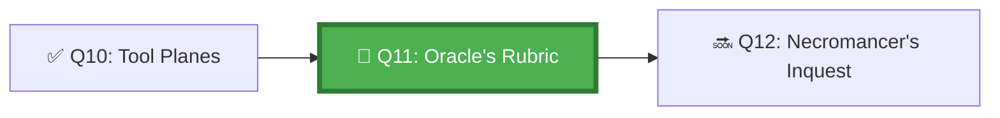

*The Oracle of the Chamber does not speak in poetry — she speaks in rubrics. Each rubric is a list of verifiable truths that must all be true before a task is complete. No rubric, no completion. She has seen too many agents return claiming victory when the ramparts were still un-built.*

## 🗺️ Quest Network Position



## 🎯 Quest Objectives

- [ ] **Define an acceptance criteria schema** — machine-verifiable completion conditions embedded in issues
- [ ] **Map GitHub signals to success** — identify which Actions outcomes, PR states, and labels indicate task completion
- [ ] **Implement auto-detection** — workflow that checks all success signals and marks a task complete
- [ ] **Test a passing and failing scenario** — verify the detector correctly identifies both
- [ ] **Document signal coverage** — confirm every acceptance criterion has a corresponding GitHub signal

## ⚔️ The Quest Begins

### Chapter 1 — The Acceptance Criteria Schema

Success criteria must be machine-verifiable. Vague criteria like "it works" cannot be automatically checked.

> **Exercise 11.1:** Add a structured acceptance criteria block to your issue template.

```markdown
<!-- .github/ISSUE_TEMPLATE/agent-task.md -->
---
name: Agent Task
about: Task for GitHub Copilot coding agent
labels: ['copilot', 'agent-task']
---

## Task Description
<!-- What should the agent do? Be specific. -->

## Acceptance Criteria
<!-- Each item must be verifiable by the agent or an automated check. -->
- [ ] **Files changed**: <!-- List exact files that should be modified -->
- [ ] **Tests pass**: All tests in `test/` pass without modification
- [ ] **No regressions**: Existing test suite still passes
- [ ] **PR opens**: A draft PR is created referencing this issue
- [ ] **Code review ready**: PR is marked ready for review (not draft) when complete
- [ ] **Documentation updated**: `docs/` updated if API or behaviour changed

## Out of Scope
<!-- Explicitly state what the agent should NOT do. -->
- Do not modify files outside the listed scope
- Do not merge the PR — only open it
```

---

### Chapter 2 — Mapping GitHub Signals to Success

Every acceptance criterion needs a corresponding GitHub signal:

| Acceptance Criterion | GitHub Signal | How to Check |
|---|---|---|
| Tests pass | Actions check `test` = `success` | Branch protection check |
| PR opened | `pull_request` event with `opened` action | Actions trigger |
| PR references issue | PR body contains `Closes #N` | String match in PR body |
| No extra files modified | `git diff --name-only` matches expected list | Script comparison |
| Lint passes | Actions check `lint` = `success` | Branch protection check |
| Draft removed | PR `draft = false` | GitHub API |

---

### Chapter 3 — Implementing the Success Signal Detector

> **Exercise 11.2:** Create a workflow that checks all success signals.

```yaml
# .github/workflows/check-task-completion.yml
name: Check Agent Task Completion

on:
  pull_request:
    types: [opened, edited, ready_for_review, synchronize]
  workflow_run:
    workflows: ["Run Tests"]
    types: [completed]

jobs:
  check-completion:
    runs-on: ubuntu-latest
    steps:
      - uses: actions/checkout@v4

      - name: Check all success signals
        id: check_signals
        uses: actions/github-script@v7
        with:
          script: |
            // Resolve the PR for both 'pull_request' and 'workflow_run' triggers.
            // workflow_run fires after a workflow completes; payload.pull_request is
            // null, but workflow_run.pull_requests carries the associated PR(s).
            let pr = context.payload.pull_request;
            if (!pr && context.payload.workflow_run) {
              pr = context.payload.workflow_run.pull_requests?.[0];
            }
            if (!pr) {
              console.log('No PR associated with this event — skipping');
              return;
            }
            
            const signals = [];
            let allPassed = true;
            
            // Signal 1: PR body references an issue
            const closesPattern = /closes\s+#\d+/i;
            const refersPattern = /issue\s+#\d+/i;
            const hasRef = closesPattern.test(pr.body || '') || refersPattern.test(pr.body || '');
            signals.push({ name: 'Issue reference in PR body', passed: hasRef });
            if (!hasRef) allPassed = false;
            
            // Signal 2: PR is not a draft
            const notDraft = !pr.draft;
            signals.push({ name: 'PR is ready for review (not draft)', passed: notDraft });
            if (!notDraft) allPassed = false;
            
            // Signal 3: Check required status checks
            const { data: checks } = await github.rest.checks.listForRef({
              owner: context.repo.owner,
              repo: context.repo.repo,
              ref: pr.head.sha,
            });
            
            const testCheck = checks.check_runs.find(c => c.name === 'test');
            const testPassed = testCheck?.conclusion === 'success';
            signals.push({ name: 'Test suite passes', passed: testPassed ?? false });
            if (!testPassed) allPassed = false;
            
            // Report results
            const statusLines = signals.map(s => 
              `${s.passed ? '✅' : '❌'} ${s.name}`
            ).join('\n');
            
            const comment = allPassed
              ? `## 🎉 Task Complete\n\nAll success signals verified:\n${statusLines}`
              : `## ⏳ Task In Progress\n\nSuccess signal status:\n${statusLines}\n\n_Checks will re-run automatically as the task progresses._`;
            
            // Add or update completion comment
            const comments = await github.rest.issues.listComments({
              owner: context.repo.owner,
              repo: context.repo.repo,
              issue_number: pr.number,
            });
            
            const existing = comments.data.find(c => 
              c.body.includes('Task Complete') || c.body.includes('Task In Progress')
            );
            
            if (existing) {
              await github.rest.issues.updateComment({
                owner: context.repo.owner,
                repo: context.repo.repo,
                comment_id: existing.id,
                body: comment,
              });
            } else {
              await github.rest.issues.createComment({
                owner: context.repo.owner,
                repo: context.repo.repo,
                issue_number: pr.number,
                body: comment,
              });
            }
            
            core.setOutput('all_passed', allPassed);
```

---

## ✅ Quest Validation

```bash
python3 scripts/validate_quest.py --quest q11
# ✅ Issue template: agent-task.md with acceptance criteria block present
# ✅ Signal detector: check-task-completion.yml present
# ✅ Signal table: documented in quest and in docs/agent-eval/
# 🏆 Quest Q11 complete!
```

## 🏆 Quest Rewards

| Reward | Details |
|---|---|
| 🔮 Oracle's Scribe Badge | Earned on completion |
| 📋 Success Signal Configuration | Skill unlocked |
| 100 XP | Added to Level 1010 total |
| Unlocks | [Q12: The Necromancer's Inquest](/quests/1010/agentic-failure-root-cause-analysis/) |

## 🕸️ Knowledge Graph

*Structured wiki-links connect this quest to the IT-Journey knowledge graph. Open the [Obsidian Graph View](/docs/obsidian/graph/) to explore connections.*

**Level hub:** [[Level 1010 - Automation & Testing]]
**Overworld:** [[🏰 Overworld - Master Quest Map]]
**Study track:** [[The Agentic Codex: GH-600 Study Hub]] · [[GH-600 Agentic AI Quick-Reference Notes]] · [[Evaluation Signals Table]]
**Prerequisites:** [[Crossing the Tool Planes: State Continuity Across Tools]]
**Unlocks:** [[The Necromancer's Inquest: Agent Failure Root Cause Analysis]]
**Sequel quests:** [[The Necromancer's Inquest: Agent Failure Root Cause Analysis]]
**Obsidian docs:** [[Obsidian Knowledge Graph and Wiki Links]]

