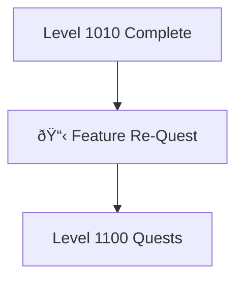

---

title: Level 1011 - Feature Development
description: Advanced feature development patterns and project management workflows
preview: images/previews/level-1011-feature-development.png
permalink: /quests/level-1011/
lastmod: 2025-11-29T23:41:31.773Z

layout: quest-collection
level: 1011
categories: quests
---

# Level 1011: Feature Development

*Building features is an art that combines creativity, technical skill, and project management. Level 1011 teaches you to develop complex features from conception to completion using structured methodologies.*

## Quest Overview

Level 1011 quests focus on:
- **Feature Planning** - Structured feature development workflows
- **Project Management** - Issue tracking and progress management
- **Development Patterns** - Best practices for feature implementation
- **Documentation** - Feature documentation and changelog maintenance

## Available Quests

### 📋 Feature Workflows

#### [Feature Re-Quest](feature-re-quest-.md)
**Quest Type**: Main 🏰 | **Difficulty**: 🟡 Medium | **Estimated Time**: 60-90 minutes

Master the art of feature development with structured workflows. Learn to plan, implement, test, and document features effectively.

**Skills You'll Master:**
- Feature specification and planning
- GitHub Issues and project boards
- Branch-based feature development
- Pull request workflows

**Prerequisites:** Git workflows, Basic project management

## Learning Path Recommendations

### For Project Managers
1. [Feature Re-Quest](feature-re-quest-.md) - Core workflow patterns
2. Combine with Level 1010 automation
3. Apply to team projects

### For Developers
1. [Feature Re-Quest](feature-re-quest-.md)
2. Progress to Level 1100 for advanced patterns
3. Implement in real projects

## Quest Dependencies & Progression

## Quest Completion Benefits

Upon completing Level 1011 quests, you'll unlock:
- **Feature Development** - Structured development workflows
- **Project Management** - Issue and project tracking
- **Documentation Skills** - Feature documentation
- **Team Collaboration** - Pull request workflows

## Next Level: Level 1100

After Level 1011, advance to [Level 1100 - Data & Templates](../1100/README.md) where you'll:
- Work with financial data (SEC EDGAR)
- Master template systems
- Build data pipelines

---

*Great features start with great planning.* 📋✨
