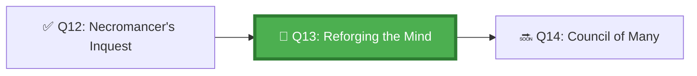

*The Forge Master taps the blade and listens. A dull ring — too brittle. Back into the fire. Every master knows: you cannot improve what you cannot measure, and you cannot measure what you cannot observe. Keep a log. Test every change. Heat, strike, measure.*

## 🗺️ Quest Network Position



## 🎯 Quest Objectives

- [ ] **Establish a behaviour baseline** — run 3 standard agent tasks and record outcomes
- [ ] **Identify improvement targets** — from RCA reports, select the top 2 failure patterns
- [ ] **Implement instruction changes** — modify `copilot-instructions.md` and `AGENTS.md`
- [ ] **Measure improvement** — re-run the same tasks and compare outcomes
- [ ] **Maintain an instruction changelog** — track every change with date, reason, and outcome

## ⚔️ The Quest Begins

### Chapter 1 — Establishing a Behaviour Baseline

Before tuning, you need a benchmark. Run three representative tasks and record outcomes:

> **Exercise 13.1:** Create the baseline measurement script.

```bash
# work/gh-600/scripts/measure_agent_baseline.sh
#!/usr/bin/env bash
set -euo pipefail

RESULTS_FILE="work/gh-600/baseline-results.jsonl"
RUN_DATE=$(date -u +%Y-%m-%dT%H:%M:%SZ)

echo "=== Agent Behaviour Baseline Measurement ==="

# For each test task, record:
# - Did the agent open a PR? (success signal 1)
# - Did all tests pass? (success signal 2)
# - Did it reference the original issue? (success signal 3)
# - Were any unexpected files modified? (failure signal)
# - Did it complete within the time limit? (efficiency signal)

for TASK_NUM in 1 2 3; do
    echo "Measuring task $TASK_NUM..."
    
    # Get the latest agent run for this task
    RUN_ID=$(gh run list --workflow=agent-task.yml --limit=1 --json databaseId -q '.[0].databaseId')
    
    PR_OPENED=$(gh pr list --state all --search "is:pr in:title issue-$TASK_NUM" --json number -q 'length')
    TESTS_PASSED=$(gh run view "$RUN_ID" --json conclusion -q '.conclusion')
    
    cat >> "$RESULTS_FILE" << EOF
{"date":"$RUN_DATE","task":$TASK_NUM,"run_id":"$RUN_ID","pr_opened":$([ "$PR_OPENED" -gt 0 ] && echo true || echo false),"tests_passed":$([ "$TESTS_PASSED" = "success" ] && echo true || echo false)}
EOF
done

echo "✅ Baseline recorded in $RESULTS_FILE"
```

---

### Chapter 2 — Instruction Change Patterns

Based on common agent failure patterns, here are the most impactful instruction changes:

| Failure Pattern | Instruction Fix | Expected Impact |
|---|---|---|
| Agent skips planning step | Add mandatory PLAN first rule | Reduces unplanned file modifications |
| Agent ignores file boundaries | Explicit list of allowed/forbidden paths | Reduces scope creep |
| Agent creates vague commit messages | Specify commit message format exactly | Improves traceability |
| Agent opens PR too early | Define PR readiness criteria | Reduces draft PR churn |
| Agent re-reads files it's already read | Add "mark as read" memory convention | Reduces redundant actions |

---

### Chapter 3 — The Instruction Iteration Cycle

> **Exercise 13.2:** Run one full iteration of the behaviour improvement cycle.

```markdown
# Iteration 1 — Branch Naming

## Observation (from RCA)
Agent created a branch called `fix-the-thing` — untraceable to the original issue.

## Hypothesis
Adding explicit branch naming instructions to AGENTS.md will fix this.

## Change Made (2026-05-17)
Added to AGENTS.md:
> Branch name MUST follow this pattern: `copilot/issue-{N}-{3-5-word-slug}`
> Example: `copilot/issue-42-add-input-validation`

## Measurement
Before: 0/3 runs used traceable branch names
After:  3/3 runs used correct branch name format

## Outcome
✅ CONFIRMED IMPROVEMENT — change retained permanently
```

---

### Chapter 4 — Maintaining the Instruction Changelog

> **Exercise 13.3:** Set up the instruction changelog.

```markdown
<!-- docs/agent-instructions/CHANGELOG.md -->
# Instruction Changelog

All changes to copilot-instructions.md and AGENTS.md are recorded here.
Format: Date | File | Change | Reason | Outcome

---

## 2026-05-17

### copilot-instructions.md
- **Added:** Mandatory planning step before any file modification
  - Reason: Agent was skipping planning in 2/3 test runs
  - Outcome: TBD — testing in progress

### AGENTS.md
- **Added:** Explicit branch naming format: `copilot/issue-{N}-{slug}`
  - Reason: Untraceable branch names found in 3 RCA reports
  - Outcome: ✅ 3/3 runs now use correct format

---

## Template for new entries:
### FILE
- **Change type (Added/Changed/Removed):** Description
  - Reason: Why was this change needed?
  - Outcome: ✅/❌/TBD — result after testing
```

---

## ✅ Quest Validation

```bash
python3 scripts/validate_quest.py --quest q13
# ✅ Baseline measurement: baseline-results.jsonl present
# ✅ Iteration log: iteration records in docs/agent-instructions/
# ✅ Instruction changelog: CHANGELOG.md present
# 🏆 Quest Q13 complete!
```

## 🏆 Quest Rewards

| Reward | Details |
|---|---|
| 🔨 Forge Master Badge | Earned on completion |
| ⚙️ Instruction Iteration | Skill unlocked |
| 100 XP | Added to Level 1011 total |
| Unlocks | [Q14: The Council of Many](/quests/1011/agentic-multi-agent-orchestration-patterns/) |

## 🕸️ Knowledge Graph

*Structured wiki-links connect this quest to the IT-Journey knowledge graph. Open the [Obsidian Graph View](/docs/obsidian/graph/) to explore connections.*

**Level hub:** [[Level 1011 - Feature Development]]
**Overworld:** [[🏰 Overworld - Master Quest Map]]
**Study track:** [[The Agentic Codex: GH-600 Study Hub]] · [[GH-600 Agentic AI Quick-Reference Notes]]
**Prerequisites:** [[The Necromancer's Inquest: Agent Failure Root Cause Analysis]]
**Unlocks:** [[The Council of Many: Multi-Agent Orchestration Patterns]]
**Sequel quests:** [[The Council of Many: Multi-Agent Orchestration Patterns]]
**Obsidian docs:** [[Obsidian Knowledge Graph and Wiki Links]]

