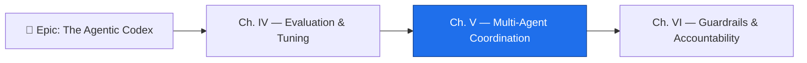

*The trials of the single familiar are behind you. You taught one agent to plan, to act, to be measured and reforged. But the great works of the realm are never raised by one pair of hands — they are raised by a **council**. Summon many familiars at once and the realm's work multiplies; summon them carelessly and they trip over one another in the dark, each undoing the next's labor, no scribe able to say which one broke the bridge. This chapter is the law of the council: how to convene many agents, keep a record every one of them signs, and know exactly which to blame when a wall falls.*

*The real-world skill beneath the spellcraft is multi-agent system design — and on GitHub it is, almost entirely, a **GitHub Actions design problem**. The primitives are not exotic: workflow triggers, job dependencies, job outputs, artifacts, and environments. Master orchestration patterns, distributed tracing, failure recovery, and lifecycle management and you have the whole of GH-600 Domain 5 — 17% of the exam, and the moment the certification stops asking "can you build one agent?" and starts asking "can you run a system of them that works reliably together?"*

## 📖 The Legend Behind This Quest

Every guild that scaled past a single craftsperson faced the same reckoning: coordination is harder than craft. One smith is judged by their own hammer. A forge of twenty smiths is judged by whether the swords come out matching, whether two of them reach for the same anvil, and whether the foreman can trace a cracked blade back to the hand that quenched it wrong. Multi-agent systems are that forge. The failure modes are *emergent* — they live in the seams between agents, not inside any one of them. Agent C fails not because agent C is broken, but because agent B handed it garbage, because agent A drew an ambiguous plan. The council that cannot trace a handoff cannot debug itself, and a system that cannot debug itself cannot be trusted with autonomy. This chapter teaches you to convene the council *and* to hold it accountable.

## 🎯 Quest Objectives

### Primary Objectives

- [ ] Apply the **fan-out** and **chain** orchestration patterns to coordinate multiple agents on GitHub Actions
- [ ] Configure **agent isolation** so parallel agents do not collide, and detect/resolve overlapping or contradictory outputs
- [ ] Thread a **correlation ID** through every job so the whole run is one auditable trace
- [ ] Choose and encode a **failure-recovery strategy** (abort, continue, retry, escalate) for a degraded sub-agent
- [ ] Maintain an **agent registry** that governs provisioning, health checks, and graceful deprecation

### Mastery Indicators

- [ ] You can distinguish **sequential**, **parallel**, and **hierarchical** orchestration and justify which fits a given task
- [ ] You can read a multi-agent trace and name the agent that introduced a fault, not just the one that crashed
- [ ] You can tell a *stalled* sub-agent from a *conflicting* one by its signal, and respond to each differently
- [ ] You can add, reconfigure, or retire an agent without disrupting an active workflow

## 🗺️ Quest Prerequisites

Convening a council assumes you can already command a single familiar. Gather these before you draw the larger circle:

- **A tuned single agent (Domain 4)** — finish [Chapter IV — Evaluation & Tuning](/quests/1010/agentic-codex-04-evaluation-and-tuning/) so you know how to measure one agent before you measure many.
- **Fluency in GitHub Actions YAML** — you will write `jobs`, `needs`, `outputs`, and `if` conditions by hand. Know where `.github/workflows/` lives and how a workflow is triggered.
- **A GitHub repository with Actions enabled** — the arena where your council runs. Settings → Actions → General → allow workflows to run.
- **GitHub Copilot coding-agent access** — the agent that actually does the sub-tasks. You orchestrate it; Actions schedules it.
- **Git + an editor** — to author workflows and the `_data/agents.yml` registry and ship them as small PRs.

## 🧙‍♂️ Chapter 1: Convening the Council — Fan-Out, Chain, and Hierarchy

### ⚔️ Skills You'll Forge

- Reasoning about **when** to parallelize agents versus pipe them in sequence
- Wiring a **fan-out** orchestrator with `needs` and job outputs on GitHub Actions
- Building a **chain** where each agent's output is the next agent's input
- Isolating parallel agents so they cannot corrupt one another's work

Two patterns cover most multi-agent work, and the exam wants you to tell them apart on sight.

**Fan-out (parallel).** An orchestrator job triggers several sub-agents *simultaneously*, each owning a different slice of the work — frontend tests, backend tests, a security scan. A final job waits for all of them (`needs: [agent_a, agent_b]`) and evaluates the collected results. Fan-out is for **independent** subtasks: when no agent needs another's output, run them at once and reclaim the wall-clock time.

**Chain (sequential).** Each sub-agent's output is the next one's input. A planning agent produces a plan; an implementation agent implements it; a review agent reviews the result. Chain is for **dependent** subtasks — when agent B genuinely cannot start until agent A finishes.

A third shape, **hierarchical**, nests the two: an orchestrator fans out to several *sub-orchestrators*, each of which runs its own chain. The exam tests whether you can name which shape a scenario describes, so anchor the rule: *independent → parallel, dependent → sequential, both-at-scale → hierarchical.*

Here is fan-out expressed in the real primitives. The orchestrator emits an output every downstream job can read; two agents run in parallel; a collector waits for both with `if: always()` so it runs even when one agent fails.


```yaml
# .github/workflows/council-fanout.yml
name: Council — Fan-Out
on:
  workflow_dispatch:
jobs:
  orchestrate:
    runs-on: ubuntu-latest
    outputs:
      run_id: ${{ steps.plan.outputs.run_id }}
    steps:
      - id: plan
        run: echo "run_id=council-${{ github.run_id }}-${{ github.run_attempt }}" >> "$GITHUB_OUTPUT"

  agent_frontend:
    needs: orchestrate
    runs-on: ubuntu-latest
    steps:
      - run: echo "Frontend agent for ${{ needs.orchestrate.outputs.run_id }}"
      # ... invoke the Copilot coding agent against the frontend slice

  agent_backend:
    needs: orchestrate
    runs-on: ubuntu-latest
    steps:
      - run: echo "Backend agent for ${{ needs.orchestrate.outputs.run_id }}"
      # ... invoke the Copilot coding agent against the backend slice

  collect:
    needs: [agent_frontend, agent_backend]
    if: always()            # run even if a sub-agent failed
    runs-on: ubuntu-latest
    steps:
      - run: echo "Collecting results for ${{ needs.orchestrate.outputs.run_id }}"
      # ... reconcile outputs, detect conflicts, decide pass/fail
```


**Isolation is the discipline that makes parallelism safe.** Two agents editing the same files at once will produce overlapping diffs, duplicated effort, or contradictory outputs. Give each parallel agent its own **branch** (Copilot's coding agent opens a PR from its own branch by design), scope each to a **non-overlapping path** of the repo, and reconcile in the `collect` job — never inside a racing agent. When two agents *do* touch the same surface, that is a conflict to detect and resolve at the join, exactly the sub-skill the exam tests under "detect and resolve agent conflicts."

### 🔍 Knowledge Check

- [ ] Given three subtasks where each depends on the previous one's output, is fan-out or chain correct — and why?
- [ ] Why does the `collect` job use `if: always()` instead of the default behavior?
- [ ] What single technique keeps two parallel agents from corrupting each other's file changes?

## 🧙‍♂️ Chapter 2: The Scribe of the Council — Correlation IDs and Distributed Tracing

### ⚔️ Skills You'll Forge

- Generating a **correlation ID** that names one entire multi-agent run
- Threading that ID through job outputs, step summaries, and artifact filenames
- Producing review-and-audit artifacts that document handoffs and decisions
- Reading a unified trace to find the agent that *caused* a fault, not the one that crashed

The defining challenge of a multi-agent system is **debugging it**. When agent C fails, the cause may be faulty output from B, which traces to an ambiguous plan from A. If each agent logs in isolation, you are left correlating timestamps by hand across three job logs at three in the morning. The cure is **distributed tracing**: every agent writes structured log entries carrying a shared **correlation ID** — one unique identifier for the entire run — so you can query *every* entry for that run, across *all* agents, in order.

On GitHub Actions the correlation ID is born in the orchestrator and travels as a **job output**, then gets injected into **artifact filenames** and **step-summary headers** so the trace reassembles itself from the run's own evidence.


```yaml
# excerpt — every agent stamps the shared correlation ID
  agent_backend:
    needs: orchestrate
    runs-on: ubuntu-latest
    env:
      CORRELATION_ID: ${{ needs.orchestrate.outputs.run_id }}
    steps:
      - name: Run agent and emit a traced log line
        run: |
          echo "{\"ts\":\"$(date -u +%s.%N)\",\"cid\":\"$CORRELATION_ID\",\"agent\":\"backend\",\"event\":\"start\"}" \
            | tee -a "trace-$CORRELATION_ID.jsonl"
          # ... agent work ...
          echo "{\"ts\":\"$(date -u +%s.%N)\",\"cid\":\"$CORRELATION_ID\",\"agent\":\"backend\",\"event\":\"done\"}" \
            | tee -a "trace-$CORRELATION_ID.jsonl"
      - name: Write to the run summary
        run: echo "### backend agent — run \`$CORRELATION_ID\`" >> "$GITHUB_STEP_SUMMARY"
      - uses: actions/upload-artifact@v4
        with:
          name: trace-backend-${{ env.CORRELATION_ID }}
          path: trace-${{ env.CORRELATION_ID }}.jsonl
```


Because every agent stamps the same `cid` **and a monotonic `ts` timestamp**, the `collect` job can download all the trace artifacts, concatenate them, and sort by `ts` to reconstruct true chronological order — producing one human-readable narrative of the whole council's work: who started, what each handed off, where the chain broke. (Sorting by `event` name alone would sort alphabetically — `done` before `start` — and scramble the timeline, which is why an explicit ordering field is required.) That artifact is the **audit record** — Domain 5 explicitly asks you to "document key decisions, handoffs, and outcomes across agents" and to enable "post-hoc analysis." A correlation-ID trace is how you satisfy both. The exam's classic stem — *"a trace excerpt is shown; which agent introduced the fault?"* — is answerable only because the trace is unified; without the shared ID you can name the agent that *crashed* but never the one that *caused* it.

You can collapse all three agents' artifacts in the orchestrator with the Models API or a small script, but the primitive is the same: shared ID in, unified trace out.

```bash
# collect step — stitch every agent's trace into one ordered narrative
cid="$1"                                  # the run's correlation ID
cat trace-*-"$cid"/*.jsonl 2>/dev/null \
  | jq -s 'sort_by(.ts) | .[] | "\(.ts) \(.agent) \(.event)"' -r \
  > "council-trace-$cid.md"
echo "Wrote council-trace-$cid.md"
```

### 🔍 Knowledge Check

- [ ] What is a correlation ID, and what is the one property it must have across a multi-agent run?
- [ ] Where does the correlation ID get injected on GitHub Actions so the trace can be reassembled?
- [ ] Why can a unified trace name the agent that *caused* a failure when isolated logs only name the one that crashed?

## 🧙‍♂️ Chapter 3: When a Familiar Falters — Recovery and the Living Roster

### ⚔️ Skills You'll Forge

- Choosing among **abort, continue, retry, escalate** when one sub-agent fails
- Encoding each strategy with `continue-on-error`, `if:` conditions, and `needs`
- Telling a **stalled** sub-agent from a **conflicting** one by its signal
- Running an **agent registry** to provision, health-check, and deprecate agents

A single agent that fails simply fails. A council is subtler: when one sub-agent falls, the orchestrator must *decide* what the failure means for the rest. Four strategies cover the field, and the exam wants you to match the strategy to the scenario:

1. **Abort** — stop all agents and mark the whole run failed. Right when subtasks are interdependent and a partial result is worthless or unsafe.
2. **Continue** — mark the failing agent's subtask failed, let the others finish. Right when subtasks are independent and partial progress has value.
3. **Retry** — re-run the failing agent, often with modified inputs. Right for *transient* faults (a flaky network, a rate limit) — not for logic errors, which will fail identically.
4. **Escalate** — open a human-review issue and pause. Right when the failure is ambiguous, irreversible-adjacent, or beyond the agents' authority to resolve.

The signal tells you which fault you have. A **stalled** agent produces no progress and eventually times out — recover with a retry or a timeout-and-continue. A **conflicting** agent produces output that contradicts a peer's — recover at the join with a rollback or a human-in-the-loop decision, never a blind retry (re-running it just reproduces the conflict). Knowing *stalled vs conflicting* is exactly what Domain 5 sub-skill 5.3 tests.

On GitHub Actions, `continue-on-error: true` lets the orchestrator survive a sub-agent's failure, and `if: always()` / `if: failure()` route the recovery:


```yaml
  agent_security:
    needs: orchestrate
    runs-on: ubuntu-latest
    continue-on-error: true          # CONTINUE strategy: a fail here won't abort the run
    steps:
      - run: ./run-security-agent.sh

  recover:
    needs: [agent_frontend, agent_backend, agent_security]
    if: failure()                    # only when a sub-agent failed
    runs-on: ubuntu-latest
    steps:
      - name: Escalate to a human
        run: |
          gh issue create \
            --title "Council run ${{ needs.orchestrate.outputs.run_id }} needs review" \
            --body "A sub-agent failed. Trace artifact attached to the run."
        env:
          GH_TOKEN: ${{ github.token }}
```


**Lifecycle management** is the standing-army version of all this. Multi-agent systems have operational demands a lone agent never does: **provisioning** a new agent and registering it; **health monitoring** to confirm each agent is responsive and producing expected output; and **deprecation** — gracefully retiring an agent being replaced *without* disrupting an active workflow. The Agentic Codex governs this with an **agent registry**: a single `_data/agents.yml` that records every agent's name, role, owner, status, and review date. The registry is the source of truth — you add an agent by adding a row, retire one by flipping its `status`, and a scheduled health-check workflow reads the file to know who to ping.

```yaml
# _data/agents.yml — the council's roster (source of truth for lifecycle)
- name: frontend-agent
  role: Runs and repairs frontend tests
  owner: web-platform
  status: active        # active | deprecated | retired
  review_date: 2026-09-01
- name: security-agent
  role: Static + dependency scanning
  owner: appsec
  status: active
  review_date: 2026-09-01
- name: legacy-linter
  role: Old style checks — superseded by security-agent
  owner: appsec
  status: deprecated    # still runs, slated for retirement; do not add new deps on it
  review_date: 2026-07-15
```

Adding an agent to an existing workflow is a new roster row plus a new job; *replacing* one is a status flip and a job swap behind the same correlation-ID contract; *retiring* one preserves auditability because its past traces still carry the shared `cid`. That is how a council grows and sheds members without ever losing its memory.

### 🔍 Knowledge Check

- [ ] Which recovery strategy fits a *transient* network failure, and which fits a *logic* error — and why are they different?
- [ ] What signal distinguishes a stalled sub-agent from a conflicting one, and why is a blind retry wrong for the conflicting case?
- [ ] What three lifecycle operations does `_data/agents.yml` govern, and what does flipping a `status` to `deprecated` communicate?

## 🧪 Hands-On Lab: Convene a Council at Your Own Table

*The exam's hardest Domain 5 question hands you a trace and asks which agent caused the fault. Answer it once with your own hands and you will never miss it.* This lab runs a three-agent council locally — one of them sabotaged — then stitches the unified trace and finds the culprit. Pure shell and `jq`, five minutes.

### Step 1 — Mint the correlation ID and the trace writer

```bash
mkdir -p ~/codex-council-lab && cd ~/codex-council-lab
export CID="council-$(date +%s)"

trace() {  # seq, agent, event, detail — one JSONL line, stamped with the shared CID
  printf '{"cid":"%s","seq":%s,"agent":"%s","event":"%s","detail":"%s"}\n' \
    "$CID" "$1" "$2" "$3" "$4" >> "trace-$2-$CID.jsonl"
}
```

### Step 2 — Run the council (one member is subtly broken)

The planner hands off cleanly; the frontend agent finishes its slice but hands the backend an **empty payload** — the seeded fault; the backend then crashes on it:

```bash
# planner: draws the plan, hands off to both agents
trace 1 planner start   "drawing the plan"
trace 2 planner handoff "frontend:build-ui backend:build-api"
trace 3 planner done    "plan issued"

# frontend agent: succeeds, but its handoff payload is empty — the real fault
trace 4 frontend start   "building ui slice"
trace 5 frontend handoff ""
trace 6 frontend done    "ui slice green"

# backend agent: crashes on the empty handoff — the visible failure
trace 7 backend start "building api slice"
trace 8 backend error "empty payload received from upstream handoff"
```

### Step 3 — The collect job: stitch one narrative from three logs

```bash
cat trace-*-"$CID".jsonl \
  | jq -s 'sort_by(.seq) | .[] | "\(.seq)  \(.agent)\t\(.event)\t\(.detail)"' -r \
  | tee "council-trace-$CID.txt"
```

Expected — the whole council's work in one ordered record:

```text
1  planner   start    drawing the plan
2  planner   handoff  frontend:build-ui backend:build-api
3  planner   done     plan issued
4  frontend  start    building ui slice
5  frontend  handoff
6  frontend  done     ui slice green
7  backend   start    building api slice
8  backend   error    empty payload received from upstream handoff
```

### Step 4 — Name the culprit

Answer the exam's question from the trace alone: **which agent introduced the fault?** The backend *crashed* (seq 8) — but read upstream: the frontend's handoff at seq 5 is empty while its own status reports `done … green`. The fault was **introduced by the frontend agent** and merely *surfaced* by the backend. Now prove why the correlation ID mattered: imagine the same three log files with no shared key — you could still see the backend crash, but you could never join seq 5 to seq 8 across files with confidence. The shared `cid` is what turns three alibis into one testimony.

### Step 5 — Promote it to the real arena (optional)

Everything above maps one-to-one onto the `council-fanout.yml` workflow from Chapter 1: the `trace` function becomes the traced step in each job, `$CID` becomes `needs.orchestrate.outputs.run_id`, the local files become uploaded artifacts, and Step 3 becomes the `collect` job. Ship it to a scratch repo and confirm the stitched narrative appears as a run artifact — the same forensics, now surviving in CI where your future councils will actually fail.

## ⚔️ The Quests of This Domain

Domain 5 splits into four trials, each a standalone quest that drills one sub-skill to mastery. Play them in order to convert this chapter's overview into hands-on command:

- **[The Council of Many: Multi-Agent Orchestration Patterns](/quests/1011/agentic-multi-agent-orchestration-patterns/)** — build the full fan-out and chain workflows by hand, configure parallel isolation, and resolve agent conflicts at the join (Sub-skill 5.1).
- **[The Scribe's Codex: Observability in Multi-Agent Systems](/quests/1011/agentic-multi-agent-observability/)** — implement the correlation-ID trace writer and produce the review-and-audit artifact that documents every handoff (Sub-skill 5.2).
- **[When Familiars Fall: Multi-Agent Failure Recovery](/quests/1011/agentic-multi-agent-failure-recovery/)** — build the recovery coordinator that detects stalled versus conflicting agents and routes abort/continue/retry/escalate (Sub-skill 5.3).
- **[The Agent Pantheon: Multi-Agent Lifecycle Management](/quests/1100/agentic-multi-agent-lifecycle-management/)** — author the `agents.yml` registry schema and the scheduled health-monitoring workflow that provisions, watches, and retires agents (Sub-skill 5.4).

## 🎮 Mastery Challenge

**Objective:** Convene a real council on your own repository and prove it can both coordinate and account for itself.

- [ ] A `workflow_dispatch` workflow fans out to **two** sub-agent jobs that run in parallel, each on its own branch/path scope, with a `collect` job that runs `if: always()`
- [ ] A **correlation ID** minted in the orchestrator reaches every job, every step summary, and every uploaded trace artifact — and the `collect` job stitches them into one ordered `council-trace-<cid>.md`
- [ ] One sub-agent is marked `continue-on-error: true`, and a `recover` job with `if: failure()` **escalates** by opening an issue tagged with the run's correlation ID
- [ ] A `_data/agents.yml` registry lists both agents with `status` and `review_date`, and you can describe how you would retire one without breaking the run

## 🎁 Rewards & Progression

- 🏛️ **Council Convener** — orchestrated your first multi-agent workflow with fan-out and a collector
- 🧵 **Trace Weaver** — threaded a single correlation ID through an entire agent run
- 🗂️ **Skill unlocked:** Fan-out, chain, and hierarchical orchestration on GitHub Actions
- 🔭 **Skill unlocked:** Distributed tracing across agents with correlation IDs
- 🛟 **Skill unlocked:** Multi-agent failure recovery and lifecycle management
- **+90 XP**

## 🗺️ Quest Network



## 🔮 Next Adventures

The council convenes, traces its own work, and survives a fallen familiar. But a council that can act in parallel can also do harm in parallel — many hands moving at once need many brakes. The next chapter teaches the law that binds them: autonomy levels, least-privilege scope, and the human-in-the-loop gate that keeps a fast council from becoming a runaway one.

- ➡️ **Next chapter:** [Chapter VI — Guardrails & Accountability](/quests/1100/agentic-codex-06-guardrails-and-accountability/)
- ⬅️ **Previous chapter:** [Chapter IV — Evaluation & Tuning](/quests/1010/agentic-codex-04-evaluation-and-tuning/)
- 🏰 **Campaign hub:** [Epic Quest: The Agentic Codex](/quests/codex/agentic-codex/)

## 📚 Resource Codex

- [GH-600 Study Guide — Skills Measured](https://learn.microsoft.com/en-us/credentials/certifications/resources/study-guides/gh-600) — the official Domain 5 breakdown on Microsoft Learn
- [GitHub Copilot coding agent](https://docs.github.com/en/copilot/using-github-copilot/coding-agent) — the agent each council member runs, branching and opening PRs autonomously
- [GitHub Actions — workflow syntax](https://docs.github.com/en/actions/using-workflows/workflow-syntax-for-github-actions) — `jobs`, `needs`, `outputs`, `continue-on-error`, and `if` conditions
- [Job dependencies with `needs`](https://docs.github.com/en/actions/using-jobs/using-jobs-in-a-workflow) — how fan-out and chain are expressed in Actions
- [Storing and sharing workflow data with artifacts](https://docs.github.com/en/actions/using-workflows/storing-workflow-data-as-artifacts) — where the correlation-ID traces live
- [Model Context Protocol (MCP)](https://modelcontextprotocol.io/) — the tool-integration standard agents share across a council
- [GitHub Models](https://docs.github.com/en/github-models) — the Models API for reconciling agent outputs in the collector
- 🏰 **In the wild (this repo):** [`_data/agents/registry.yml`](https://github.com/bamr87/it-journey/blob/main/_data/agents/registry.yml) is the living roster (nine agents, lanes, kill switches, review dates), [`quest-perfection.yml`](https://github.com/bamr87/it-journey/blob/main/.github/workflows/quest-perfection.yml) chains walk → fix per slice, and the weekly [`agent-audit.yml`](https://github.com/bamr87/it-journey/blob/main/.github/workflows/agent-audit.yml) is lifecycle management running on a schedule. Full domain map: [GH-600 in the Wild](/notes/gh-600/implemented-in-it-journey/)

## 🕸️ Knowledge Graph

*Structured wiki-links connect this quest to the IT-Journey knowledge graph. Open the [Obsidian Graph View](/notes/obsidian/graph/) to explore connections.*

**Campaign hub:** [[Epic Quest: The Agentic Codex]]
**Previous:** [[Evaluation and Tuning: Reforging the Agent's Mind]]
**Next:** [[Guardrails and Accountability: The Warden's Pact]]
**Domain quests:** [[The Council of Many: Multi-Agent Orchestration Patterns]] · [[The Scribe's Codex: Observability in Multi-Agent Systems]] · [[When Familiars Fall: Multi-Agent Failure Recovery]] · [[The Agent Pantheon: Multi-Agent Lifecycle Management]]
**Obsidian docs:** [[Obsidian Knowledge Graph and Wiki Links]]
