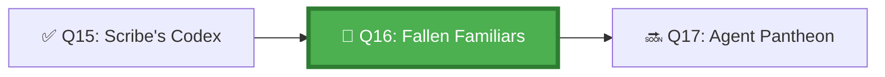

*The Proving Grounds are where the Council sends candidates who believe their systems are perfect. The Trials of the Fallen Familiar begin simply: one sub-agent fails. Does the system collapse? Does it recover? Does it preserve what was already done? Only those who plan for failure earn the right to deploy to production.*

## 🗺️ Quest Network Position



## 🎯 Quest Objectives

- [ ] **Classify sub-agent failure types** — categorise by recoverability and blast radius
- [ ] **Implement failure detection** — orchestrator detects when a sub-agent has failed
- [ ] **Apply a retry strategy** — retry idempotent failures with exponential backoff
- [ ] **Implement re-delegation** — on permanent failure, reassign task to a different agent
- [ ] **Preserve partial progress** — ensure work done before failure is not lost

## ⚔️ The Quest Begins

### Chapter 1 — Sub-Agent Failure Classification

| Failure Type | Example | Recovery Strategy |
|---|---|---|
| **Transient** | Network timeout, rate limit | Retry with backoff |
| **Idempotent but failed** | Duplicate action, safe to re-run | Retry from checkpoint |
| **Non-idempotent failure** | Partial file write | Rollback + re-delegate |
| **Permanent** | Invalid input, missing permission | Escalate to human |
| **Cascade** | Sub-agent A failure blocks sub-agent B | Compensate + continue with partial |

---

### Chapter 2 — Detecting Sub-Agent Failure in the Orchestrator

> **Exercise 16.1:** Configure the orchestrator to continue after sub-agent failure and assess damage.

```yaml
# .github/workflows/orchestrator-with-recovery.yml
name: Multi-Agent with Failure Recovery

on:
  workflow_dispatch:
    inputs:
      task_id:
        description: "Task identifier"
        required: true

jobs:
  sub-agent-1:
    runs-on: ubuntu-latest
    continue-on-error: true      # Orchestrator must see all outcomes
    outputs:
      status: ${{ steps.run.outputs.status }}
    steps:
      - uses: actions/checkout@v4
      - name: Execute sub-task 1
        id: run
        run: |
          set +e  # Don't fail immediately — capture outcome
          python3 work/gh-600/scripts/subtask.py --task analysis
          EXIT_CODE=$?
          
          if [ $EXIT_CODE -eq 0 ]; then
            echo "status=success" >> "$GITHUB_OUTPUT"
          else
            echo "status=failed" >> "$GITHUB_OUTPUT"
            # Save partial results before exiting
            python3 work/gh-600/scripts/save_checkpoint.py --task analysis
            exit $EXIT_CODE
          fi

      - name: Upload partial/full results
        if: always()   # Upload even on failure
        uses: actions/upload-artifact@v4
        with:
          name: subtask1-result
          path: subtask1-*.json

  sub-agent-2:
    runs-on: ubuntu-latest
    needs: sub-agent-1
    continue-on-error: true
    if: always()     # Run even if sub-agent-1 failed
    steps:
      - uses: actions/checkout@v4
      - name: Run with awareness of upstream status
        run: |
          UPSTREAM_STATUS="${{ needs.sub-agent-1.outputs.status }}"
          
          if [ "$UPSTREAM_STATUS" = "failed" ]; then
            echo "⚠️ Sub-agent 1 failed — running in degraded mode"
            python3 work/gh-600/scripts/subtask.py \
              --task synthesis \
              --degraded-mode \
              --skip-analysis
          else
            python3 work/gh-600/scripts/subtask.py --task synthesis
          fi

  recover-and-report:
    runs-on: ubuntu-latest
    needs: [sub-agent-1, sub-agent-2]
    if: always()
    steps:
      - uses: actions/checkout@v4

      - name: Download all results
        uses: actions/download-artifact@v4
        with:
          pattern: subtask*-result
          path: ./results/

      - name: Assess and recover
        id: assess
        run: |
          python3 work/gh-600/scripts/recovery_coordinator.py \
            --results-dir ./results/ \
            --task-id "${{ github.event.inputs.task_id }}" \
            --agent1-status "${{ needs.sub-agent-1.result }}" \
            --agent2-status "${{ needs.sub-agent-2.result }}" \
            --output recovery-plan.json

      - name: Re-delegate failed tasks
        if: fromJSON(steps.assess.outputs.needs_redelegation)
        run: |
          python3 work/gh-600/scripts/redelegate_tasks.py \
            --failed-tasks "${{ steps.assess.outputs.failed_tasks }}"
```

---

### Chapter 3 — Compensation Strategy Implementation

> **Exercise 16.2:** Implement the recovery coordinator.

```python
# work/gh-600/scripts/recovery_coordinator.py
"""Coordinates recovery from sub-agent failures in multi-agent workflows."""

import argparse
import json
import os
from pathlib import Path


def assess_and_recover(
    results_dir: str,
    task_id: str,
    agent_statuses: dict[str, str],
    output_file: str
) -> dict:
    """Assess the state of a multi-agent run and produce a recovery plan."""
    
    results = {}
    for result_file in Path(results_dir).rglob("*.json"):
        with open(result_file) as f:
            results[result_file.stem] = json.load(f)
    
    failed_agents = [k for k, v in agent_statuses.items() if v == "failure"]
    succeeded_agents = [k for k, v in agent_statuses.items() if v == "success"]
    
    recovery_plan = {
        "task_id": task_id,
        "failed_agents": failed_agents,
        "succeeded_agents": succeeded_agents,
        "partial_results_preserved": len(results),
        "recovery_actions": []
    }
    
    for agent_id in failed_agents:
        # Determine recovery strategy based on what's available
        agent_result = results.get(f"{agent_id}-result")
        
        if agent_result and agent_result.get("checkpoint_available"):
            recovery_plan["recovery_actions"].append({
                "agent": agent_id,
                "strategy": "retry_from_checkpoint",
                "checkpoint": agent_result["checkpoint_path"]
            })
        else:
            recovery_plan["recovery_actions"].append({
                "agent": agent_id,
                "strategy": "redelegate",
                "task": agent_result.get("original_task") if agent_result else "unknown"
            })
    
    with open(output_file, "w") as f:
        json.dump(recovery_plan, f, indent=2)
    
    print(f"Recovery plan: {len(failed_agents)} failed, {len(succeeded_agents)} succeeded")
    print(f"Recovery actions: {len(recovery_plan['recovery_actions'])}")
    
    # Set GitHub Actions outputs
    needs_redelegation = any(
        a["strategy"] == "redelegate"
        for a in recovery_plan["recovery_actions"]
    )
    print(f"::set-output name=needs_redelegation::{str(needs_redelegation).lower()}")
    
    return recovery_plan


if __name__ == "__main__":
    parser = argparse.ArgumentParser()
    parser.add_argument("--results-dir", required=True)
    parser.add_argument("--task-id", required=True)
    parser.add_argument("--agent1-status", required=True)
    parser.add_argument("--agent2-status", required=True)
    parser.add_argument("--output", required=True)
    args = parser.parse_args()
    
    statuses = {
        "sub-agent-1": args.agent1_status,
        "sub-agent-2": args.agent2_status
    }
    assess_and_recover(args.results_dir, args.task_id, statuses, args.output)
```

---

## ✅ Quest Validation

```bash
python3 scripts/validate_quest.py --quest q16
# ✅ Recovery workflow: orchestrator-with-recovery.yml present
# ✅ Recovery coordinator: recovery_coordinator.py present
# ✅ Compensation strategies: all 5 types documented
# 🏆 Quest Q16 complete!
```

## 🏆 Quest Rewards

| Reward | Details |
|---|---|
| 🛡️ Battle-Tested Architect Badge | Earned on completion |
| 🔄 Compensation Strategies | Skill unlocked |
| 100 XP | Added to Level 1011 total |
| Unlocks | [Q17: The Agent Pantheon](/quests/1100/agentic-multi-agent-lifecycle-management/) |

## 🕸️ Knowledge Graph

*Structured wiki-links connect this quest to the IT-Journey knowledge graph. Open the [Obsidian Graph View](/docs/obsidian/graph/) to explore connections.*

**Level hub:** [[Level 1011 - Feature Development]]
**Overworld:** [[🏰 Overworld - Master Quest Map]]
**Study track:** [[The Agentic Codex: GH-600 Study Hub]] · [[GH-600 Agentic AI Quick-Reference Notes]]
**Prerequisites:** [[The Scribe's Codex: Observability in Multi-Agent Systems]]
**Unlocks:** [[The Agent Pantheon: Multi-Agent Lifecycle Management]]
**Sequel quests:** [[The Agent Pantheon: Multi-Agent Lifecycle Management]]
**Obsidian docs:** [[Obsidian Knowledge Graph and Wiki Links]]

