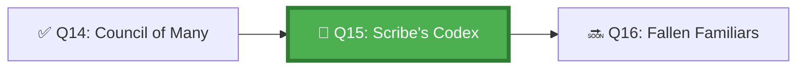

*The Scribes of the Codex inscribe every action, every decision, every message that passes through the Council Chambers. Not to judge — but to know. When something goes wrong and three agents point at each other, the Scribe opens the Codex, finds the exact message where the failure began, and settles the matter in moments.*

## 🗺️ Quest Network Position



## 🎯 Quest Objectives

- [ ] **Design a correlation ID scheme** — propagate a single trace ID across all agents in a workflow
- [ ] **Instrument sub-agents** — each agent writes structured trace entries with the correlation ID
- [ ] **Aggregate traces** — orchestrator collects all sub-agent traces into a unified audit log
- [ ] **Query the audit log** — extract the sequence of events for a specific task
- [ ] **Detect inter-agent failure** — use the audit log to find where a multi-agent chain broke

## ⚔️ The Quest Begins

### Chapter 1 — Correlation IDs: The Thread Through the Maze

Every multi-agent operation needs a single identifier that travels through every agent:

```yaml
# .github/workflows/orchestrator-with-tracing.yml
name: Multi-Agent with Observability

on:
  issues:
    types: [labeled]

jobs:
  orchestrate:
    runs-on: ubuntu-latest
    outputs:
      correlation_id: ${{ steps.init_trace.outputs.correlation_id }}
    steps:
      - name: Initialise correlation ID
        id: init_trace
        run: |
          # Create a unique correlation ID for this entire multi-agent operation
          CORRELATION_ID="task-${{ github.event.issue.number }}-${{ github.run_id }}"
          echo "correlation_id=$CORRELATION_ID" >> "$GITHUB_OUTPUT"
          echo "🔗 Correlation ID: $CORRELATION_ID"

  sub-agent-1:
    needs: orchestrate
    runs-on: ubuntu-latest
    env:
      CORRELATION_ID: ${{ needs.orchestrate.outputs.correlation_id }}
    steps:
      - name: Execute with tracing
        run: |
          echo "=== Sub-Agent 1 | $CORRELATION_ID ==="
          # All log lines include the correlation ID
          python3 work/gh-600/scripts/traced_subtask.py \
            --correlation-id "$CORRELATION_ID" \
            --subtask "analysis" \
            --output "trace-analysis-$CORRELATION_ID.json"

      - uses: actions/upload-artifact@v4
        with:
          name: trace-${{ env.CORRELATION_ID }}-analysis
          path: "trace-analysis-${{ env.CORRELATION_ID }}.json"
```

---

### Chapter 2 — Structured Trace Entry Format

Every agent action should emit a structured trace entry:

```python
# work/gh-600/scripts/trace_writer.py
"""Writes structured trace entries for agent observability."""

import json
import os
from datetime import datetime, timezone
from typing import Any


def write_trace(
    correlation_id: str,
    agent_id: str,
    action: str,
    status: str,
    details: dict[str, Any] | None = None,
    output_file: str | None = None
) -> dict:
    """Write a single trace entry."""
    entry = {
        "correlation_id": correlation_id,
        "agent_id": agent_id,
        "action": action,
        "status": status,          # started | completed | failed | skipped
        "timestamp": datetime.now(timezone.utc).isoformat(),
        "run_id": os.environ.get("GITHUB_RUN_ID", "local"),
        "details": details or {}
    }
    
    print(f"[TRACE] {correlation_id} | {agent_id} | {action} | {status}")
    
    if output_file:
        # Append to JSONL trace file
        with open(output_file, "a") as f:
            f.write(json.dumps(entry) + "\n")
    
    return entry


# Usage example
if __name__ == "__main__":
    cid = os.environ.get("CORRELATION_ID", "local-test")
    
    write_trace(cid, "analysis-agent", "read-issue", "completed",
                {"issue_number": 42, "files_found": 5},
                f"trace-{cid}.jsonl")
    
    write_trace(cid, "analysis-agent", "write-report", "completed",
                {"report_path": "analysis-report.json"},
                f"trace-{cid}.jsonl")
```

---

### Chapter 3 — Aggregating the Unified Audit Log

> **Exercise 15.1:** Create the aggregator that combines all sub-agent traces.

```python
# work/gh-600/scripts/aggregate_traces.py
"""Aggregates trace files from all sub-agents into a unified audit log."""

import argparse
import json
import os
from pathlib import Path


def aggregate_traces(traces_dir: str, output_file: str, correlation_id: str) -> None:
    """Read all trace files and produce a unified, time-sorted audit log."""
    all_entries = []
    
    trace_files = list(Path(traces_dir).rglob("*.jsonl"))
    print(f"Found {len(trace_files)} trace files")
    
    for trace_file in trace_files:
        with open(trace_file) as f:
            for line in f:
                line = line.strip()
                if not line:
                    continue
                try:
                    entry = json.loads(line)
                    if entry.get("correlation_id") == correlation_id:
                        all_entries.append(entry)
                except json.JSONDecodeError:
                    print(f"Warning: Could not parse trace entry: {line[:100]}")
    
    # Sort by timestamp
    all_entries.sort(key=lambda x: x.get("timestamp", ""))
    
    audit_log = {
        "correlation_id": correlation_id,
        "total_events": len(all_entries),
        "agents_involved": list({e["agent_id"] for e in all_entries}),
        "timeline": all_entries
    }
    
    with open(output_file, "w") as f:
        json.dump(audit_log, f, indent=2)
    
    print(f"✅ Unified audit log written: {len(all_entries)} events across {len(audit_log['agents_involved'])} agents")
    
    # Check for failures
    failures = [e for e in all_entries if e["status"] == "failed"]
    if failures:
        print(f"\n⚠️  {len(failures)} failure events detected:")
        for f in failures:
            print(f"  - {f['agent_id']} | {f['action']} | {f['timestamp']}")
    else:
        print("✅ No failures detected in trace")


if __name__ == "__main__":
    parser = argparse.ArgumentParser()
    parser.add_argument("--traces-dir", required=True)
    parser.add_argument("--output", required=True)
    parser.add_argument("--correlation-id", required=True)
    args = parser.parse_args()
    
    aggregate_traces(args.traces_dir, args.output, args.correlation_id)
```

---

### Chapter 4 — Querying the Audit Log

> **Exercise 15.2:** Query the audit log to reconstruct the event sequence for a task.

```bash
# Find all events for a specific agent
jq '.timeline[] | select(.agent_id == "analysis-agent")' audit-log.json

# Find all failures
jq '.timeline[] | select(.status == "failed")' audit-log.json

# Reconstruct the event sequence in human-readable form
jq -r '.timeline[] | "\(.timestamp | split("T")[1][:8]) [\(.agent_id)] \(.action) → \(.status)"' audit-log.json
```

---

## ✅ Quest Validation

```bash
python3 scripts/validate_quest.py --quest q15
# ✅ Correlation ID: propagated in orchestrator workflow
# ✅ Trace writer: trace_writer.py present
# ✅ Aggregator: aggregate_traces.py present
# ✅ Audit log: sample audit-log.json with multi-agent events
# 🏆 Quest Q15 complete!
```

## 🏆 Quest Rewards

| Reward | Details |
|---|---|
| 📜 The Scribe Badge | Earned on completion |
| 🔗 Correlation Tracing | Skill unlocked |
| 100 XP | Added to Level 1011 total |
| Unlocks | [Q16: When Familiars Fall](/quests/1011/agentic-multi-agent-failure-recovery/) |

## 🕸️ Knowledge Graph

*Structured wiki-links connect this quest to the IT-Journey knowledge graph. Open the [Obsidian Graph View](/docs/obsidian/graph/) to explore connections.*

**Level hub:** [[Level 1011 - Feature Development]]
**Overworld:** [[🏰 Overworld - Master Quest Map]]
**Study track:** [[The Agentic Codex: GH-600 Study Hub]] · [[GH-600 Agentic AI Quick-Reference Notes]]
**Prerequisites:** [[The Council of Many: Multi-Agent Orchestration Patterns]]
**Unlocks:** [[When Familiars Fall: Multi-Agent Failure Recovery]]
**Sequel quests:** [[When Familiars Fall: Multi-Agent Failure Recovery]]
**Obsidian docs:** [[Obsidian Knowledge Graph and Wiki Links]]

