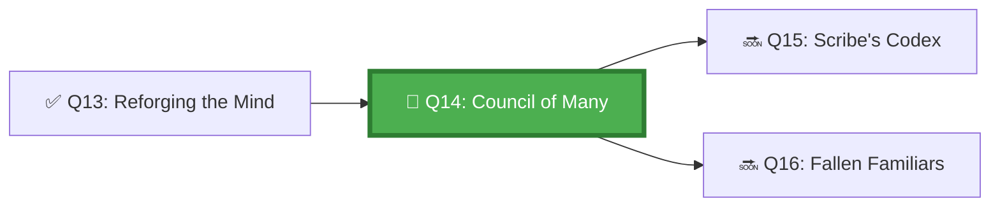

*The Council Chambers were built when the first great task arrived — too large for any single agent, too complex for parallelism alone. The architects designed three chambers: the Orchestration Chamber, where tasks are divided; the Sub-Agent Halls, where the work is done; and the Aggregation Room, where the pieces are assembled. An agent that understands all three rooms commands an army.*

## 🗺️ Quest Network Position



## 🎯 Quest Objectives

- [ ] **Map three orchestration patterns** — fan-out, sequential chain, and event-driven
- [ ] **Implement a fan-out orchestrator** — orchestrator dispatches sub-tasks as parallel GitHub Actions jobs
- [ ] **Implement a chain orchestrator** — output of one agent job feeds into the next
- [ ] **Test aggregation** — orchestrator collects sub-agent results into a unified report
- [ ] **Define sub-agent contracts** — standardise inputs and outputs for reusable sub-agents

## ⚔️ The Quest Begins

### Chapter 1 — Three Orchestration Patterns

| Pattern | When to Use | GitHub Implementation |
|---|---|---|
| **Fan-Out** | Independent parallel tasks | Actions matrix strategy |
| **Sequential Chain** | Output of step N feeds step N+1 | `needs:` dependency + artifact handoff |
| **Event-Driven** | Tasks triggered by outcomes | `workflow_run`, `repository_dispatch` |

---

### Chapter 2 — Fan-Out Pattern: Parallel Sub-Agent Dispatch

> **Exercise 14.1:** Create an orchestrator workflow that fans out to parallel sub-agents.


```yaml
# .github/workflows/orchestrator-fan-out.yml
name: Multi-Agent Orchestrator (Fan-Out)

on:
  issues:
    types: [labeled]

jobs:
  orchestrate:
    if: contains(github.event.label.name, 'multi-agent-task')
    runs-on: ubuntu-latest
    outputs:
      subtasks: ${{ steps.plan.outputs.subtasks }}
    steps:
      - uses: actions/checkout@v4

      - name: Plan and partition task
        id: plan
        run: |
          # Orchestrator determines how to split the task
          python3 work/gh-600/scripts/partition_task.py \
            --issue "${{ github.event.issue.number }}" \
            --max-subtasks 4 \
            --output partition.json
          
          SUBTASKS=$(cat partition.json | jq -c '.subtasks')
          echo "subtasks=$SUBTASKS" >> "$GITHUB_OUTPUT"

  sub-agents:
    needs: orchestrate
    if: needs.orchestrate.outputs.subtasks != '[]'
    runs-on: ubuntu-latest
    strategy:
      matrix:
        subtask: ${{ fromJSON(needs.orchestrate.outputs.subtasks) }}
      max-parallel: 4
    steps:
      - uses: actions/checkout@v4

      - name: Execute sub-task
        run: |
          echo "=== Sub-Agent executing: ${{ matrix.subtask.id }} ==="
          echo "Task: ${{ matrix.subtask.description }}"
          
          python3 work/gh-600/scripts/run_subtask.py \
            --subtask-id "${{ matrix.subtask.id }}" \
            --description "${{ matrix.subtask.description }}" \
            --output "subtask-${{ matrix.subtask.id }}-result.json"

      - name: Upload sub-task result
        uses: actions/upload-artifact@v4
        with:
          name: subtask-result-${{ matrix.subtask.id }}
          path: "subtask-${{ matrix.subtask.id }}-result.json"

  aggregate:
    needs: sub-agents
    runs-on: ubuntu-latest
    steps:
      - uses: actions/checkout@v4

      - name: Download all sub-task results
        uses: actions/download-artifact@v4
        with:
          pattern: subtask-result-*
          path: ./subtask-results/

      - name: Aggregate results
        id: aggregate
        run: |
          python3 work/gh-600/scripts/aggregate_results.py \
            --results-dir ./subtask-results/ \
            --issue "${{ github.event.issue.number }}" \
            --output final-report.json

      - name: Post aggregated report
        uses: actions/github-script@v7
        with:
          script: |
            const report = require('./final-report.json');
            await github.rest.issues.createComment({
              owner: context.repo.owner,
              repo: context.repo.repo,
              issue_number: context.issue.number,
              body: `## Multi-Agent Task Complete\n\n${report.summary}\n\n${report.details}`
            });
```


---

### Chapter 3 — Sequential Chain Pattern

> **Exercise 14.2:** Create a sequential chain where research feeds into implementation.

```yaml
# .github/workflows/orchestrator-chain.yml
name: Multi-Agent Chain (Research → Plan → Implement)

on:
  workflow_dispatch:
    inputs:
      task_description:
        description: "Task for the agent chain"
        required: true

jobs:
  research-agent:
    runs-on: ubuntu-latest
    outputs:
      findings: ${{ steps.research.outputs.findings }}
    steps:
      - uses: actions/checkout@v4
      - name: Research phase
        id: research
        run: |
          echo "Research agent: gathering context for task"
          # Agent reads existing code, docs, issues
          # Produces structured findings
          FINDINGS=$(echo '{"files_to_modify": ["src/api.js"], "patterns": ["REST"]}')
          echo "findings=$FINDINGS" >> "$GITHUB_OUTPUT"

  planning-agent:
    needs: research-agent
    runs-on: ubuntu-latest
    outputs:
      plan: ${{ steps.plan.outputs.plan }}
    steps:
      - uses: actions/checkout@v4
      - name: Planning phase
        id: plan
        run: |
          # Plan agent uses research findings to create implementation plan
          FINDINGS='${{ needs.research-agent.outputs.findings }}'
          echo "Planning agent working from research: $FINDINGS"
          PLAN=$(echo '{"steps": [{"action": "modify", "file": "src/api.js"}]}')
          echo "plan=$PLAN" >> "$GITHUB_OUTPUT"

  implementation-agent:
    needs: planning-agent
    runs-on: ubuntu-latest
    steps:
      - uses: actions/checkout@v4
      - name: Implementation phase
        run: |
          PLAN='${{ needs.planning-agent.outputs.plan }}'
          echo "Implementation agent executing plan: $PLAN"
          # Agent modifies the specified files
```

---

### Chapter 4 — Sub-Agent Contracts

Every sub-agent in a multi-agent system needs a well-defined contract — standard inputs and outputs:

```json
// work/gh-600/schemas/sub-agent-contract.json
{
  "$schema": "http://json-schema.org/draft-07/schema#",
  "title": "SubAgentContract",
  "type": "object",
  "required": ["input", "output"],
  "properties": {
    "input": {
      "type": "object",
      "required": ["subtask_id", "description", "context"],
      "properties": {
        "subtask_id": { "type": "string" },
        "description": { "type": "string" },
        "context": { "type": "object" },
        "constraints": {
          "type": "array",
          "items": { "type": "string" }
        }
      }
    },
    "output": {
      "type": "object",
      "required": ["subtask_id", "status", "result"],
      "properties": {
        "subtask_id": { "type": "string" },
        "status": { "type": "string", "enum": ["success", "failure", "partial"] },
        "result": { "type": "object" },
        "error_code": { "type": "string" },
        "files_modified": { "type": "array", "items": { "type": "string" } }
      }
    }
  }
}
```

---

## ✅ Quest Validation

```bash
python3 scripts/validate_quest.py --quest q14
# ✅ Fan-out workflow: orchestrator-fan-out.yml present
# ✅ Chain workflow: orchestrator-chain.yml present
# ✅ Sub-agent contract: sub-agent-contract.json present
# 🏆 Quest Q14 complete!
```

## 🏆 Quest Rewards

| Reward | Details |
|---|---|
| 👑 Council Commander Badge | Earned on completion |
| 🕸️ Multi-Agent Architecture | Skill unlocked |
| 100 XP | Added to Level 1011 total |
| Unlocks | [Q15: The Scribe's Codex](/quests/1011/agentic-multi-agent-observability/) |

## 🕸️ Knowledge Graph

*Structured wiki-links connect this quest to the IT-Journey knowledge graph. Open the [Obsidian Graph View](/docs/obsidian/graph/) to explore connections.*

**Level hub:** [[Level 1011 - Feature Development]]
**Overworld:** [[🏰 Overworld - Master Quest Map]]
**Study track:** [[The Agentic Codex: GH-600 Study Hub]] · [[GH-600 Agentic AI Quick-Reference Notes]]
**Prerequisites:** [[Reforging the Agent's Mind: Behavior Tuning Through Instructions]]
**Unlocks:** [[The Scribe's Codex: Observability in Multi-Agent Systems]]
**Sequel quests:** [[The Scribe's Codex: Observability in Multi-Agent Systems]]
**Obsidian docs:** [[Obsidian Knowledge Graph and Wiki Links]]

