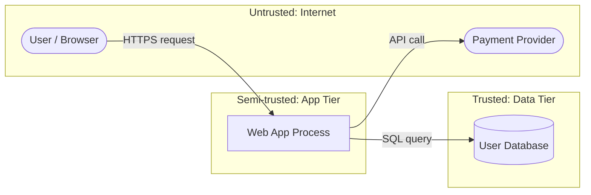

*Greetings, brave adventurer! A wise defender never waits for the siege to discover where the walls are weak. In this quest, **Threat Modeling**, you learn the cartographer's art: to draw your system as it truly is, mark every gate and trust boundary, and ask of each one - "How would I, the attacker, break in here?" You will wield **STRIDE**, the six-fold lens of threats, and the branching logic of **attack trees**.*

*Threat modeling is the cheapest security work you will ever do, because it happens on paper, before the code is written. A flaw found in a diagram costs a meeting; the same flaw found in production costs a breach.*

## 📖 The Legend Behind This Quest

*Long ago, the architects of Microsoft's great codebases faced an impossible question: how do you secure a system too large for any one mind to hold? Their answer was STRIDE - a checklist of six threat categories applied methodically to every part of a design. Where intuition missed flaws, the method caught them. Today STRIDE, data-flow diagrams, and attack trees remain the backbone of how serious teams reason about security before disaster strikes.*

## 🎯 Quest Objectives

By the time you complete this journey, you will have mastered:

### Primary Objectives (Required for Quest Completion)
- [ ] **Data-Flow Diagrams (DFDs)** - Draw your system's processes, data stores, and flows
- [ ] **Trust Boundaries** - Mark where data crosses from less-trusted to more-trusted zones
- [ ] **STRIDE Enumeration** - Apply the six threat categories to every element of the design
- [ ] **Attack Trees** - Decompose an attacker's goal into concrete, rankable steps

### Secondary Objectives (Bonus Achievements)
- [ ] **Risk Ranking** - Prioritize threats using likelihood and impact (e.g., DREAD-style scoring)
- [ ] **Mitigation Mapping** - Pair each significant threat with a control
- [ ] **Living Threat Models** - Keep the model current as the design evolves

### Mastery Indicators
You'll know you've truly mastered this quest when you can:
- [ ] Map each STRIDE letter to the security property it violates
- [ ] Place trust boundaries correctly on a DFD
- [ ] Build an attack tree for a goal and identify its cheapest leaf
- [ ] Hand a developer a prioritized list of threats and mitigations

## 🗺️ Quest Prerequisites

### 📋 Knowledge Requirements
- [ ] Completion of [Security Fundamentals](/quests/1011/security-fundamentals/) (recommended)
- [ ] Ability to describe how a system's components talk to each other
- [ ] Familiarity with the CIA triad

### 🛠️ System Requirements
- [ ] Modern operating system (Windows 10+, macOS 10.14+, or Linux)
- [ ] A diagramming tool, or pen and paper (Mermaid examples render on GitHub)
- [ ] A text editor or IDE (VS Code recommended)

### 🧠 Skill Level Indicators
This **🔴 Hard** quest expects:
- [ ] You can reason about system architecture and component interactions
- [ ] You are ready to adopt the attacker's perspective
- [ ] Ready for 90-120 minutes of focused analysis

## 🌍 Choose Your Adventure Platform

*Threat modeling is mostly thinking and drawing. Set up a diagramming workflow you enjoy.*

### 🍎 macOS Kingdom Path

<details>
<summary>Click to expand macOS instructions</summary>

```bash
# Use VS Code with a Mermaid preview extension to diagram in plain text
brew install --cask visual-studio-code
code --install-extension bierner.markdown-mermaid

# Optionally try the Microsoft Threat Modeling Tool in a Windows VM,
# or the cross-platform OWASP Threat Dragon (web/desktop).
```

</details>

### 🪟 Windows Empire Path

<details>
<summary>Click to expand Windows instructions</summary>

```powershell
# The Microsoft Threat Modeling Tool is free and STRIDE-native on Windows
winget install Microsoft.ThreatModelingTool

# Or use VS Code + Mermaid like every other platform
winget install Microsoft.VisualStudioCode
```

</details>

### 🐧 Linux Territory Path

<details>
<summary>Click to expand Linux instructions</summary>

```bash
# OWASP Threat Dragon runs as a desktop app or in the browser
# Install VS Code for text-based Mermaid diagrams
sudo snap install code --classic
code --install-extension bierner.markdown-mermaid
```

</details>

### ☁️ Cloud Realms Path

<details>
<summary>Click to expand Cloud/Container instructions</summary>

```bash
# OWASP Threat Dragon has a hosted web version — no install needed.
# Open https://www.threatdragon.com/ in any browser and start a model.
echo "Open https://www.threatdragon.com/ to model in the cloud"
```

</details>

## 🧙‍♂️ Chapter 1: Map the Terrain - Data-Flow Diagrams and Trust Boundaries

*You cannot defend what you cannot see. The first act of threat modeling is to draw the system as a data-flow diagram: the processes that act, the data stores that hold, the external entities that interact, and the flows between them.*

### ⚔️ Skills You'll Forge in This Chapter
- The four DFD element types
- Where and why to place trust boundaries

### 🏗️ The Four Elements of a DFD

- **External entity** (a user, a third-party API) - outside your control
- **Process** (a service, a function) - transforms data
- **Data store** (a database, a file, a cache) - holds data
- **Data flow** (an arrow) - moves data between the above

A **trust boundary** is a line the data crosses where the level of trust changes - for example, between the public internet and your application, or between your app and the database. Threats cluster on these boundaries.



The two boundaries here - Internet→App and App→Data - are exactly where you will hunt for threats in the next chapter.

### 🔍 Knowledge Check: DFDs
- [ ] Name the four DFD element types
- [ ] What changes when data crosses a trust boundary?
- [ ] Why is the payment provider an external entity rather than a process?

## 🧙‍♂️ Chapter 2: STRIDE - The Six-Fold Lens

*STRIDE is a mnemonic for six categories of threat. Apply each one to every element and flow in your DFD, and you systematically surface the threats intuition would miss.*

### ⚔️ Skills You'll Forge in This Chapter
- The meaning of each STRIDE letter
- Mapping threats to the security property they violate

### 🏗️ The Six Categories

| Letter | Threat | Violates | Example | Mitigation |
| --- | --- | --- | --- | --- |
| **S** | **Spoofing** | Authentication | Pretending to be another user | Strong auth, MFA |
| **T** | **Tampering** | Integrity | Modifying data in transit or at rest | Hashing, signatures, input validation |
| **R** | **Repudiation** | Non-repudiation | Denying an action was performed | Audit logs, signed records |
| **I** | **Information Disclosure** | Confidentiality | Leaking data | Encryption, access control |
| **D** | **Denial of Service** | Availability | Exhausting resources | Rate limiting, redundancy |
| **E** | **Elevation of Privilege** | Authorization | Gaining unauthorized rights | Least privilege, authorization checks |

Walk the diagram element by element. For the `Web App → User Database` flow above, STRIDE prompts you to ask:

```text
Spoofing:               Can someone forge the app's identity to the DB?      -> mutual TLS / credentials
Tampering:              Can the query or response be altered?                 -> TLS, parameterized queries
Repudiation:            Are sensitive DB writes logged?                       -> audit table
Information Disclosure: Is the connection and data at rest encrypted?         -> TLS + encryption at rest
Denial of Service:      Can a flood of queries exhaust the DB?               -> connection pooling, rate limits
Elevation of Privilege: Does the app login have more rights than it needs?    -> least-privilege grants
```

This single flow already yielded six concrete questions - and several real mitigations.

### 🔍 Knowledge Check: STRIDE
- [ ] Which STRIDE category violates authorization?
- [ ] Match Tampering and Information Disclosure to their CIA pillars
- [ ] Why is repudiation about logging more than prevention?

## 🧙‍♂️ Chapter 3: Attack Trees and Prioritization

*Where STRIDE is breadth, an attack tree is depth. You start from a single attacker goal at the root and branch downward into the steps required to achieve it, until you reach concrete leaves you can defend.*

### ⚔️ Skills You'll Forge in This Chapter
- Decomposing a goal into AND/OR sub-goals
- Finding the cheapest path for an attacker
- Ranking threats by likelihood and impact

### 🏗️ A Simple Attack Tree

```text
GOAL: Read another user's private messages
├── OR: Steal their session
│   ├── XSS to exfiltrate the session cookie        (mitigated by: HttpOnly + CSP)
│   └── Network sniffing on an open Wi-Fi           (mitigated by: TLS everywhere)
├── OR: Bypass access control
│   └── Change the user_id in the API URL (IDOR)    (mitigated by: server-side authz check)
└── OR: Compromise the database directly
    ├── SQL injection                               (mitigated by: parameterized queries)
    └── Stolen DB credentials from a leaked .env    (mitigated by: secrets manager + rotation)
```

OR-nodes mean *any one* child suffices; AND-nodes mean *all* children are required. The attacker takes the cheapest viable leaf - so you defend the cheapest leaves first.

### 🏗️ Prioritize What to Fix

Rank each threat by **likelihood × impact**. A lightweight scoring model such as DREAD (Damage, Reproducibility, Exploitability, Affected users, Discoverability) works, but even a simple High/Medium/Low matrix beats fixing things at random:

```text
Threat                         Likelihood   Impact   Priority
IDOR on messages API           High         High     P0 — fix first
SQL injection                  Medium       High     P1
Session theft via open Wi-Fi   Low          High     P2
DoS via query flood            Low          Medium   P3
```

### 🔍 Knowledge Check: Attack Trees
- [ ] What is the difference between an AND-node and an OR-node?
- [ ] Why fix the cheapest attacker leaf first?
- [ ] How does likelihood × impact change your fix order?

## 🎮 Mastery Challenges

### 🟢 Novice Challenge: Draw a DFD
**Objective**: Pick a small app you know and draw its data-flow diagram with at least two trust boundaries.

**Requirements**:
- [ ] All four element types appear
- [ ] At least two trust boundaries are marked
- [ ] Every flow has a direction

**Validation**: A peer can identify the boundaries without your explanation.

### 🟡 Intermediate Challenge: Run STRIDE
**Objective**: For one flow that crosses a trust boundary, enumerate threats across all six STRIDE categories.

**Requirements**:
- [ ] One concrete threat per applicable STRIDE letter
- [ ] A proposed mitigation for each
- [ ] Note any categories that do not apply and why

**Validation**: Each threat ties to a CIA/AAA property.

### 🔴 Advanced Challenge: Build and Rank an Attack Tree
**Objective**: Choose an attacker goal for your app, build an attack tree, and produce a prioritized fix list.

**Requirements**:
- [ ] Root goal with at least two OR-branches
- [ ] Concrete leaves with mitigations
- [ ] A priority table using likelihood × impact

**Validation**: Your P0 item is genuinely the cheapest, highest-impact path.

## 🏆 Quest Rewards & Achievements

**🎖️ Badges Earned**:
- 🏆 **Cartographer of Threats** - You mapped a system's full attack surface
- 🛡️ **Seer of Weakness** - You predicted attacks before they happened

**🛠️ Skills Unlocked**:
- **STRIDE Threat Enumeration** - Systematic, repeatable threat discovery
- **Attack Tree Construction** - Goal-driven adversarial analysis

**🔓 Unlocked Quests**:
- Penetration Testing - Prove your threat model by attacking the system
- Compliance Standards - Use the model as audit evidence of risk assessment

**📊 Progression Points**: +90 XP

## 🗺️ Next Steps in Your Journey

**Continue the Main Story**:
- 🎯 [Penetration Testing](/quests/1011/penetration-testing/) - Validate threats with real testing

**Explore Side Adventures**:
- ⚔️ [Secure Coding Practices](/quests/1011/secure-coding/) - Mitigate the threats you found
- ⚔️ [Compliance Standards](/quests/1011/compliance-standards/) - Turn the model into evidence

### Character Class Recommendations

**💻 Software Developer**: Continue to [Secure Coding Practices](/quests/1011/secure-coding/)  
**🏗️ System Engineer**: Explore [Penetration Testing](/quests/1011/penetration-testing/)  
**🛡️ Security Specialist**: Advance to [Compliance Standards](/quests/1011/compliance-standards/)

## 📚 Resources

### Official Documentation
- [Microsoft Threat Modeling (STRIDE)](https://learn.microsoft.com/en-us/azure/security/develop/threat-modeling-tool-threats) - The canonical STRIDE reference
- [OWASP Threat Modeling](https://owasp.org/www-community/Threat_Modeling) - Process and techniques
- [OWASP Threat Modeling Cheat Sheet](https://cheatsheetseries.owasp.org/cheatsheets/Threat_Modeling_Cheat_Sheet.html)

### Community Resources
- [OWASP Threat Dragon](https://owasp.org/www-project-threat-dragon/) - Open-source modeling tool
- [Microsoft Threat Modeling Tool](https://learn.microsoft.com/en-us/azure/security/develop/threat-modeling-tool) - STRIDE-native, free
- [Threat Modeling Manifesto](https://www.threatmodelingmanifesto.org/) - Principles and values

### Learning Materials
- [Attack Trees (Bruce Schneier)](https://www.schneier.com/academic/archives/1999/12/attack_trees.html) - The original essay
- [MITRE ATT&CK](https://attack.mitre.org/) - Real adversary techniques to inform your trees

## 🤝 Quest Completion Checklist

- [ ] ✅ Completed all primary objectives
- [ ] ✅ Produced a STRIDE threat model for a real system
- [ ] ✅ Answered all knowledge check questions
- [ ] ✅ Completed at least one mastery challenge
- [ ] ✅ Explored the resource library
- [ ] ✅ Identified your next quest in the journey

## 🕸️ Knowledge Graph

*Structured wiki-links connect this quest to the IT-Journey knowledge graph. Open the [Obsidian Graph View](/docs/obsidian/graph/) to explore connections.*

**Level hub:** [[Level 1011 - Security & Compliance]]
**Overworld:** [[🏰 Overworld - Master Quest Map]]
**Prerequisites:** [[Security Fundamentals: CIA Triad and Defense in Depth Strategies]]
**Unlocks:** [[Penetration Testing: Tools and Ethical Hacking Methodologies]]
**Related quests:** [[Secure Coding Practices: OWASP Top 10 Vulnerability Prevention]]
**Obsidian docs:** [[Obsidian Knowledge Graph and Wiki Links]]
