# Level 1100: Data & Templates

*Data is the lifeblood of modern applications. Level 1100 teaches you to work with real-world data sources like SEC EDGAR, build reusable template systems, and create data-driven applications.*

## Quest Overview

Level 1100 quests focus on:
- **Financial Data** - SEC EDGAR API and financial reporting
- **Template Systems** - Reusable code and document templates
- **Data Integration** - External API consumption and processing
- **Professional Applications** - Real-world data-driven projects

## Available Quests

| Quest | Difficulty | Time | Type | Status |
|-------|------------|------|------|--------|
| [Apache Spark Mastery: Big Data Processing with PySpark & Scala](/quests/level-1100-apache-spark/) | ⚔️ Epic | 6-8 hours | main_quest | 🔮 Placeholder |
| [Quest to Conquer King EDGAR: The Epic Siege of the SEC Data Castle](/quests/level-1100-conquer-king-edgar/) | 🟡 Medium | 60-180 minutes | main_quest | ✅ Complete |
| [Data Quality Engineering: Testing, Validation & Monitoring Frameworks](/quests/level-1100-data-quality/) | 🔴 Hard | 3-4 hours | main_quest | 🔮 Placeholder |
| [Data Warehousing: Design Star Schema & Build Modern Analytics Architecture](/quests/level-1100-data-warehousing/) | 🔴 Hard | 5-6 hours | main_quest | 🔮 Placeholder |
| [ETL Pipeline Design: Build Scalable Data Pipelines with Python](/quests/level-1100-etl-pipeline-design/) | 🔴 Hard | 4-5 hours | main_quest | 🔮 Placeholder |
| [The Siege of King EDGAR: Storming the SEC Data Castle](/quests/level-1100-sec-edgar-siege/) | 🟡 Medium | 90-150 minutes | main_quest | 🔮 Placeholder |
| [Stream Processing: Real-Time Data with Apache Kafka & Flink](/quests/level-1100-stream-processing/) | 🔴 Hard | 4-5 hours | main_quest | 🔮 Placeholder |
| [The Temple of Templates: Binary Abstractions and Reusable Realms](/quests/level-1100-temple-of-templates/) | 🟡 Medium | 60-90 minutes | main_quest | 🔮 Placeholder |

### 📊 Financial Data

#### [EDGAR API Integration](edgar.md)
**Quest Type**: Main 🏰 | **Difficulty**: 🔴 Hard | **Estimated Time**: 90-120 minutes

Learn to access and process SEC EDGAR data. Build applications that consume financial filings and corporate data.

**Skills You'll Master:**
- SEC EDGAR API navigation
- Financial data parsing and analysis
- Rate limiting and API best practices
- Data storage and caching strategies

**Prerequisites:** Python basics, API fundamentals

---

#### [SEC EDGAR Deep Dive](sec-edgar.md)
**Quest Type**: Side ⚔️ | **Difficulty**: 🔴 Hard | **Estimated Time**: 120-180 minutes

Advanced SEC EDGAR techniques including bulk downloads, filing analysis, and financial statement extraction.

**Skills You'll Master:**
- Bulk data access strategies
- XBRL parsing fundamentals
- Financial statement analysis
- Regulatory data compliance

**Prerequisites:** [EDGAR API Integration](edgar.md)

### 📋 Template Systems

#### [The Temple of Templates](the-temple-of-templates.md)
**Quest Type**: Main 🏰 | **Difficulty**: 🟡 Medium | **Estimated Time**: 60-90 minutes

Master the art of creating reusable templates. Build template systems that scale across projects and teams.

**Skills You'll Master:**
- Template design patterns
- Jinja2/Liquid templating
- Configuration-driven templates
- Template inheritance and composition

**Prerequisites:** HTML basics, Programming fundamentals

## Learning Path Recommendations

### For Financial Developers
1. [EDGAR API Integration](edgar.md) - Foundation
2. [SEC EDGAR Deep Dive](sec-edgar.md) - Advanced patterns
3. Build financial applications

### For Platform Developers
1. [The Temple of Templates](the-temple-of-templates.md) - Template systems
2. Apply to existing projects
3. Create template libraries

### For Data Engineers
1. [EDGAR API Integration](edgar.md)
2. [The Temple of Templates](the-temple-of-templates.md)
3. Build data pipelines with templates

## Quest Dependencies & Progression

```mermaid
graph TD
    A[Level 1011 Complete] --> B[📊 EDGAR API Integration]
    B --> C[📊 SEC EDGAR Deep Dive]
    A --> D[📋 Temple of Templates]
    C --> E[Level 1110 Quests]
    D --> E
```

## Quest Completion Benefits

Upon completing Level 1100 quests, you'll unlock:
- **Financial Data Skills** - SEC EDGAR mastery
- **Template Engineering** - Reusable system design
- **API Integration** - Professional data consumption
- **Data Pipeline** - End-to-end data workflows

## Next Level: Level 1110

After Level 1100, advance to [Level 1110 - Quality Assurance](../1110/README.md) where you'll:
- Build comprehensive testing systems
- Handle error scenarios gracefully
- Create robust applications

---

*Data drives decisions. Master your data sources.* 📊✨
