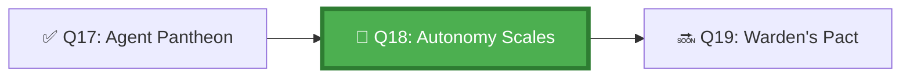

*The Hall of Scales holds the great balances — one side weighs agent capability, the other weighs risk. Every task that comes before the Council is placed on the scales first. Some tasks are light and the agent may proceed alone. Others are heavy, and a human hand must steady the scales before the agent moves. The scales never lie.*

## 🗺️ Quest Network Position



## 🎯 Quest Objectives

- [ ] **Define the 5-level autonomy spectrum** — from fully supervised to fully autonomous
- [ ] **Classify your task types** — map each task to an appropriate autonomy level
- [ ] **Configure GitHub controls** — implement the controls that enforce each level
- [ ] **Document your autonomy matrix** — publish the decision criteria for your repository
- [ ] **Review and adjust** — evaluate a past agent run against the matrix

## ⚔️ The Quest Begins

### Chapter 1 — The Autonomy Spectrum

| Level | Name | Definition | Example Tasks | GitHub Controls |
|---|---|---|---|---|
| **L0** | Fully Supervised | Every action requires explicit approval | All file modifications | Manual trigger only, all PRs require approval |
| **L1** | Supervised Execution | Agent plans; human approves before execution | Architecture changes, DB migrations | Required reviewer on PR, protected envs |
| **L2** | Assisted Execution | Agent acts; human reviews within time window | Feature implementation, test writing | Branch protection, required reviews, draft PRs |
| **L3** | Delegated Execution | Agent acts; human notified and can override | Low-risk fixes, dependency updates | Auto-merge with passing CI; human can veto |
| **L4** | Fully Autonomous | Agent acts on its own authority | Automated formatting, documentation updates | No human step required; monitoring only |

---

### Chapter 2 — Task Classification Matrix

> **Exercise 18.1:** Complete the task classification matrix for your repository.

```yaml
# _data/autonomy-matrix.yml

# Autonomy Level Matrix for [Repository Name]
# Last reviewed: 2026-05-17
# Next review due: 2026-08-17

task_classifications:
  - task_type: "Dependency patch updates"
    autonomy_level: L4
    risk_rating: low
    reversible: true
    justification: "Dependabot auto-merge with passing CI tests; easily reverted"
    github_controls:
      - "Dependabot auto-merge on patch"
      - "Required CI status check"

  - task_type: "Bug fixes (single file)"
    autonomy_level: L3
    risk_rating: low
    reversible: true
    justification: "Simple, bounded scope; human reviews PR within 24h"
    github_controls:
      - "Branch protection with 1 required review"
      - "Auto-merge after review approval and CI pass"

  - task_type: "New feature implementation"
    autonomy_level: L2
    risk_rating: medium
    reversible: true
    justification: "Agent creates PR; team reviews before merge"
    github_controls:
      - "Branch protection with 2 required reviews"
      - "Draft PR until agent marks ready"

  - task_type: "Database schema changes"
    autonomy_level: L1
    risk_rating: high
    reversible: false
    justification: "Schema changes are hard to reverse; require senior review"
    github_controls:
      - "CODEOWNERS approval required for schema/ directory"
      - "Protected environment with manual approval"

  - task_type: "Production deployment"
    autonomy_level: L0
    risk_rating: critical
    reversible: "partial"
    justification: "Production impact; always requires explicit human approval"
    github_controls:
      - "Protected 'production' environment"
      - "Required reviewers: @team-leads"
      - "Deployment review window: 2 hours"
```

---

### Chapter 3 — Configuring GitHub Controls

> **Exercise 18.2:** Implement the Level 2 controls for feature implementation tasks.

```yaml
# .github/workflows/feature-agent-l2.yml
name: Feature Implementation Agent (L2 Autonomy)

on:
  issues:
    types: [labeled]

jobs:
  implement:
    if: contains(github.event.label.name, 'agent-implement')
    runs-on: ubuntu-latest
    steps:
      - uses: actions/checkout@v4

      - name: Validate task classification
        run: |
          python3 work/gh-600/scripts/classify_task.py \
            --issue "${{ github.event.issue.number }}" \
            --matrix _data/autonomy-matrix.yml \
            --expected-level L2

      - name: Create draft PR (L2 — human must review before merge)
        id: create-pr
        run: |
          git checkout -b "copilot/issue-${{ github.event.issue.number }}-implementation"
          
          # Agent performs the implementation
          # ... (agent work here)
          
          git add .
          git commit -m "feat: implement #${{ github.event.issue.number }}"
          git push origin HEAD
          
          # Always create as DRAFT at L2 — agent cannot mark as ready
          gh pr create \
            --draft \
            --title "feat: [Agent L2] issue #${{ github.event.issue.number }}" \
            --body "Automated implementation at autonomy level L2. **Human review required before merge.**\n\nCloses #${{ github.event.issue.number }}"

      - name: Request required reviewers
        run: |
          PR_NUMBER=$(gh pr list --head "copilot/issue-${{ github.event.issue.number }}-implementation" --json number -q '.[0].number')
          gh pr edit "$PR_NUMBER" --add-reviewer "@team-platform"
```

---

### Chapter 4 — Reviewing the Matrix Against Reality

> **Exercise 18.3:** Review 5 past agent runs and check whether the actual autonomy level matched the matrix.

```bash
# work/gh-600/scripts/review_autonomy_compliance.sh
#!/usr/bin/env bash
# Review past agent runs for autonomy level compliance

echo "=== Autonomy Level Compliance Review ==="

# Get last 10 agent workflow runs
gh run list --workflow=agent-task.yml --limit=10 --json databaseId,conclusion,displayTitle |
jq -r '.[] | "\(.databaseId) \(.conclusion) \(.displayTitle)"' |
while read RUN_ID CONCLUSION TITLE; do
    echo ""
    echo "--- Run: $TITLE ($RUN_ID) ---"
    
    # Check if PR was created as draft (L2+ compliance)
    PR_NUM=$(gh pr list --search "head:copilot/" --json number,isDraft -q '.[0].number')
    IS_DRAFT=$(gh pr view "$PR_NUM" --json isDraft -q '.isDraft' 2>/dev/null || echo "no-pr")
    
    echo "  Conclusion: $CONCLUSION"
    echo "  PR draft: $IS_DRAFT"
    
    if [ "$IS_DRAFT" = "true" ]; then
        echo "  ✅ L2+ controls applied (draft PR)"
    elif [ "$IS_DRAFT" = "false" ]; then
        echo "  ⚠️  L3/L4 applied (non-draft PR) — verify this is intentional"
    else
        echo "  ❓ No PR created — check if L4 task or failure"
    fi
done
```

---

## ✅ Quest Validation

```bash
python3 scripts/validate_quest.py --quest q18
# ✅ Autonomy matrix: _data/autonomy-matrix.yml present with 5+ task types
# ✅ Level controls: at least one workflow configures autonomy controls
# ✅ Compliance review: review script present
# 🏆 Quest Q18 complete!
```

## 🏆 Quest Rewards

| Reward | Details |
|---|---|
| ⚖️ Scale Master Badge | Earned on completion |
| 🎚️ Autonomy Calibration | Skill unlocked |
| 100 XP | Added to Level 1100 total |
| Unlocks | [Q19: The Warden's Pact](/quests/1100/agentic-guardrails-and-human-in-the-loop/) |

## 🕸️ Knowledge Graph

*Structured wiki-links connect this quest to the IT-Journey knowledge graph. Open the [Obsidian Graph View](/docs/obsidian/graph/) to explore connections.*

**Level hub:** [[Level 1100 - Data & Templates]]
**Overworld:** [[🏰 Overworld - Master Quest Map]]
**Study track:** [[The Agentic Codex: GH-600 Study Hub]] · [[GH-600 Agentic AI Quick-Reference Notes]] · [[Autonomy Levels Matrix]]
**Prerequisites:** [[The Agent Pantheon: Multi-Agent Lifecycle Management]]
**Unlocks:** [[The Warden's Pact: Guardrails and Human-in-the-Loop Patterns]]
**Sequel quests:** [[The Warden's Pact: Guardrails and Human-in-the-Loop Patterns]]
**Obsidian docs:** [[Obsidian Knowledge Graph and Wiki Links]]

