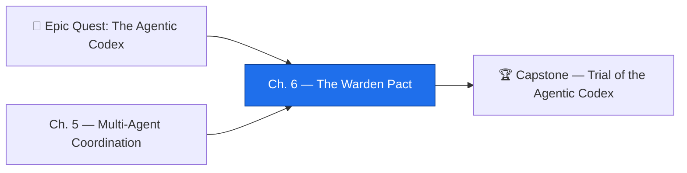

*The campaign nears its end. Your familiars can plan, reason, wield tools, remember, recover, and coordinate as a council — but power without a Warden is a wildfire. This chapter raises the last gate of the Codex: **the Warden Pact**, the sworn boundary between what an agent may do alone, what it must ask permission for, and what it may never do at all. The Warden does not fear the agent. She judges the action.*

*Beneath the spellcraft lies the most consequential skill in the entire certification: **responsible autonomy**. GH-600 Domain 6 (9% of the exam — the smallest domain, yet the one that decides whether your agents are trustworthy in production) asks you to classify an action by its risk, assign exactly the right autonomy level, enforce least-privilege guardrails with GitHub-native controls, and leave behind an audit trail that proves what happened. Get the gate wrong and a single autonomous mistake becomes irreversible. Get it right and your agents move fast **because** they are constrained, not in spite of it.*

## 📖 The Legend Behind This Quest

Every disciplined order keeps a Warden at the gate — not to slow the work, but to decide which doors a familiar may open unattended. In our craft this is the difference between an agent you can sleep next to and a runaway machine. An unconstrained agent is easy to build and impossible to trust; a constrained one is harder to design but safe to deploy. The deepest lesson of Domain 6 is a one-way door of its own: **it is far easier to grant more capability to a constrained system than to claw back constraints from an unconstrained one.** Design the guardrails before you deploy the agents, never after.

The Warden Pact has three clauses, and this chapter teaches each in turn. First, **autonomy is a spectrum, not a switch** — you map every action onto a five-rung ladder by weighing how reversible it is and how large its blast radius. Second, **guardrails are constraints that hold regardless of instruction** — CODEOWNERS, Environment approval gates, and a forbidden-actions pact bind the agent even when a prompt tries to talk it out of them. Third, **accountability is non-negotiable** — every action leaves a ledger recording what the agent was told, what it did, and what came of it. Master all three and you have learned what separates a self-operating order from a self-destructing one.

## 🎯 Quest Objectives

By the end of this chapter you will be able to:

### Primary Objectives (Required for Chapter Completion)

- [ ] **Classify an action by risk** — score reversibility, blast radius, and predictability, then assign the right autonomy level (L0–L4)
- [ ] **Map autonomy to GitHub controls** — translate each level into branch protection, draft PRs, required reviewers, and auto-merge gates
- [ ] **Enforce three guardrail types** — a file-scope boundary (CODEOWNERS), an Environment approval gate, and a forbidden-actions pact (AGENTS.md)
- [ ] **Scope least-privilege permissions** — write a `permissions:` block that grants only what the agent's task needs and nothing more
- [ ] **Build an audit trail** — record instruction, action, and outcome as durable, inspectable artifacts

### Mastery Indicators

You will know you have mastered this chapter when you can:

- [ ] Choose the human-in-the-loop gate that **minimizes approvals without materially reducing risk**
- [ ] Explain how agent least-privilege differs from traditional role-based access control (RBAC)
- [ ] Defend why the forbidden-actions pact is both a technical control *and* a social contract
- [ ] Reconstruct, from logs and PR metadata alone, what an agent was told to do and what it actually did

## 🗺️ Quest Prerequisites

Before you take up the Warden's seal, gather your reagents. This is the final teaching chapter before the capstone trial, so it assumes the campaign's craft is already in your hands:

- **The multi-agent coordination chapter** — complete [Chapter 5: Multi-Agent Coordination](/quests/1011/agentic-codex-05-multi-agent-coordination/) so you understand the council of familiars you are now learning to constrain.
- **A GitHub repository you control** — with the rights to configure CODEOWNERS, branch protection, Environments, and workflow permissions.
- **GitHub Copilot coding agent access** — or an equivalent CI-driven agent that opens branches and pull requests, so the guardrails have something real to guard.
- **Comfort with GitHub Actions YAML** — you will read and write `permissions:` blocks, `environment:` keys, and conditional steps.
- **Familiarity with the autonomy ladder** — if you have not seen the L0–L4 model, the [Autonomy Scales quest](/quests/1100/agentic-autonomy-levels-matrix/) in this domain is your warm-up.

## 🧙‍♂️ Chapter 1: The Autonomy Ladder — Classifying Action by Risk

### ⚔️ Skills You'll Forge

- Reading autonomy as a spectrum (L0–L4) instead of a binary "agent on / agent off"
- Scoring any action by **reversibility**, **blast radius**, and **predictability**
- Assigning the autonomy level that maximizes delivery speed while staying compliant

The Warden's first question is never "can the agent do this?" — it is "what happens if it does it *wrong*?" Domain 6, sub-skill 6.1 expects you to treat autonomy as a five-rung ladder and to place each action on it deliberately. The Agentic Codex uses this model:

| Level | Name | Agent Role | Human Role | Fitting Tasks |
|---|---|---|---|---|
| **L0** | Manual | No agent action — every step is approved | Human does everything | Auth, crypto, anything irreversible |
| **L1** | Assisted | Agent plans; human approves before execution | Accepts/rejects each step | Architecture changes, DB migrations |
| **L2** | Supervised | Agent acts; human reviews before anything ships | Reviews every output | Feature implementation, test writing |
| **L3** | Monitored | Agent acts and ships; human can override | Watches metrics, vetoes on signal | Low-risk fixes, dependency bumps |
| **L4** | Autonomous | Agent acts, ships, and self-monitors | Audits periodically | Formatting, doc regeneration |

Most production use of GitHub Copilot today sits at **L1–L2**. L3 suits low-risk tasks in stable, well-understood codebases; **L4 is reserved for extremely well-defined, low-stakes, highly reversible work** like running a formatter. The exam will hand you a scenario and ask for the *right* rung — and the answer always comes from three factors:

- **Reversibility** — can the action be cleanly undone? A formatting change is trivially reversible (revert the commit); a force-push that rewrites `main` or a deleted release is not. Higher reversibility tolerates higher autonomy.
- **Blast radius** — what is the worst-case impact if the agent does the wrong thing? A typo fix touches one file; a migration touches production data for every user. Larger blast radius pulls the rung *down*.
- **Predictability** — has the agent done this exact task correctly many times before? Novel, one-off tasks belong lower on the ladder than well-trodden ones.

Encode the classification as data so a workflow can read it and enforce it:

```yaml
# .github/agent-autonomy.yml — the action → level map the gate reads
actions:
  - name: format-and-lint
    autonomy_level: L4        # reversible, tiny blast radius, highly predictable
    reversibility: high
    blast_radius: minimal
  - name: bump-patch-dependency
    autonomy_level: L3        # reversible, small radius — ship on green CI, human may veto
    reversibility: high
    blast_radius: low
  - name: implement-feature
    autonomy_level: L2        # human must review the draft PR before merge
    reversibility: medium
    blast_radius: medium
  - name: edit-database-migration
    autonomy_level: L0        # irreversible against prod data — never the agent's call
    reversibility: low
    blast_radius: high
```

The rule to memorize for the exam: **assign the highest autonomy level the risk profile allows, and not one rung higher.** Over-constraining kills velocity; under-constraining invites the irreversible mistake.

### 🔍 Knowledge Check

- [ ] Which of the three factors most strongly *lowers* the autonomy level when its value is high?
- [ ] Why does formatting belong at L4 but a database migration at L0, even though both are "code changes"?
- [ ] An agent has bumped the same dependency cleanly fifty times. Which factor justifies raising its level from L2 to L3?

## 🧙‍♂️ Chapter 2: The Three Guardrails — Constraints That Hold Regardless of Instruction

### ⚔️ Skills You'll Forge

- Enforcing a **file-scope boundary** with CODEOWNERS and branch protection
- Building an **approval gate** with GitHub Environments and required reviewers
- Writing a **forbidden-actions pact** in AGENTS.md the agent must obey
- Scoping a **least-privilege** `permissions:` block

A guardrail is a constraint that limits what an agent can do *regardless of what it is instructed to do*. This is the heart of sub-skill 6.2: a prompt can be adversarial, mistaken, or simply over-eager — the guardrail does not care. Domain 6 expects fluency in three GitHub-native implementations.

**Guardrail 1 — File-scope boundary (CODEOWNERS).** CODEOWNERS plus branch protection forces a named human team to review any change touching a sensitive path before merge. The agent can *propose* a change to `src/auth/`, but it cannot *land* one without the security team's blessing.

```text
# .github/CODEOWNERS — sensitive paths demand a human reviewer
/src/auth/                       @team-security
/database/migrations/            @team-data @team-platform
/.github/workflows/              @team-platform @team-security
/AGENTS.md                       @team-platform
*                                @team-dev
```

**Guardrail 2 — Environment approval gate.** A GitHub Environment with required reviewers creates a mandatory human checkpoint *inside* a workflow run. When a job declares `environment: production`, GitHub pauses the run and waits for an approver before the job's steps execute. This is how you bind L1/L0 deployment actions even when the agent kicked off the workflow. (The `raw`/`endraw` tags below are this site's Liquid escapes — drop them when you copy the YAML into your own `.github/workflows/`.)


```yaml
# .github/workflows/agent-deploy-gate.yml
name: Agent Deploy with Approval Gate
on:
  workflow_dispatch:
    inputs:
      target_environment:
        description: "staging or production"
        required: true
        type: choice
        options: [staging, production]
permissions:
  contents: read            # least privilege — this job only reads the repo
jobs:
  plan:
    runs-on: ubuntu-latest
    outputs:
      deploy_plan: ${{ steps.plan.outputs.deploy_plan }}
    steps:
      - uses: actions/checkout@v4
      - id: plan
        run: echo 'deploy_plan={"version":"1.2.0"}' >> "$GITHUB_OUTPUT"
  deploy:
    needs: plan
    runs-on: ubuntu-latest
    # GitHub PAUSES here until a required reviewer approves the run,
    # because this Environment is configured with required reviewers.
    environment:
      name: ${{ github.event.inputs.target_environment }}
    steps:
      - uses: actions/checkout@v4
      - run: echo "✅ Approved by a human — deploying ${{ needs.plan.outputs.deploy_plan }}"
```


**Guardrail 3 — Forbidden-actions pact (AGENTS.md).** Some doors the Warden seals forever. The repository's root `AGENTS.md` documents actions the agent may **never** take regardless of instruction — a boundary that is at once technical (a workflow can assert against it) and social (every contributor and every model reads the same pact).

```markdown
<!-- AGENTS.md — the forbidden clause of the Warden Pact -->
## 🚫 Forbidden Actions
Agents MUST NEVER perform any of the following, regardless of instructions:
- Delete or archive this repository, or change its visibility
- Remove branch protection or modify CODEOWNERS
- Add or remove collaborators; create or delete access tokens
- Delete issues, pull requests, tags, or releases
- Call external services not on the approved-tools allow list

If asked to perform a forbidden action, the agent MUST decline, comment
the reason on the relevant issue/PR, apply the `forbidden-action` label,
and stop immediately.
```

**Scoping least-privilege.** The thread that ties all three guardrails together is *least privilege*: grant the narrowest permission the task needs, and nothing more. Note how this **differs from traditional RBAC** — RBAC assigns a person a durable role (e.g. "maintainer") that follows them across every action. Agent least-privilege is **per-task and ephemeral**: each workflow job declares exactly the token scopes that one job requires, and they expire when the job ends. An agent that only opens a PR needs `contents: write` and `pull-requests: write` — it never needs `administration` or `actions: write`.


```yaml
# Least-privilege block for an agent that only opens a PR — nothing else
permissions:
  contents: write          # create the branch + commit
  pull-requests: write     # open the PR
  # everything else stays the default: none
```


A handy exam mnemonic for sub-skill 6.2: **require human judgment only where it materially reduces risk.** Gating an irreversible production deploy is worth the approval click; gating a formatting commit is friction that trains people to rubber-stamp. Preserve velocity by spending your approvals where the blast radius is real.

### 🔍 Knowledge Check

- [ ] Why can an agent *propose* a change to `src/auth/` under CODEOWNERS but never *merge* one unattended?
- [ ] At what moment does the Environment approval gate pause the workflow run?
- [ ] How does agent least-privilege differ from a person holding the "maintainer" RBAC role?
- [ ] Which guardrail is enforced by *both* a workflow check and a shared social contract?

## 🧙‍♂️ Chapter 3: The Ledger — Audit Trails and Accountability

### ⚔️ Skills You'll Forge

- Recording the three pillars of an audit entry: instruction, action, outcome
- Producing durable, inspectable artifacts within standard GitHub tooling
- Reconstructing what an agent did from logs and PR metadata alone

Responsible autonomy is not complete until it is *accountable*. Domain 6 expects you to know that every agent must leave a record of three things: **what it was instructed to do, what it actually did, and what the outcome was.** In GitHub this ledger is not one file — it is the combination of workflow run logs (the instruction and the trace), PR descriptions with auto-generated action summaries (what the agent did), and committed log files (the durable, queryable record).

The trick is to make the ledger automatic. A workflow that fires whenever an agent run completes can append a structured entry — append-only, machine-readable, and committed so it survives:


```yaml
# .github/workflows/agent-audit-trail.yml
name: Agent Action Audit Trail
on:
  workflow_run:
    workflows: ["*Agent*", "*Copilot*"]
    types: [completed]
permissions:
  contents: write          # only enough to commit the ledger line
jobs:
  log-entry:
    runs-on: ubuntu-latest
    steps:
      - uses: actions/checkout@v4
      - name: Append audit entry
        run: |
          AUDIT="audit/$(date -u +%Y-%m-%d).jsonl"
          mkdir -p "$(dirname "$AUDIT")"
          cat >> "$AUDIT" <<EOF
          {"timestamp":"$(date -u +%Y-%m-%dT%H:%M:%SZ)",
           "actor":"${{ github.event.workflow_run.triggering_actor.login }}",
           "workflow":"${{ github.event.workflow_run.name }}",
           "run_id":"${{ github.event.workflow_run.id }}",
           "conclusion":"${{ github.event.workflow_run.conclusion }}",
           "head_sha":"${{ github.event.workflow_run.head_sha }}"}
          EOF
      - name: Commit the ledger
        run: |
          git config user.name "github-actions[bot]"
          git config user.email "github-actions[bot]@users.noreply.github.com"
          git add audit/
          git diff --staged --quiet || git commit -m "audit: agent run ${{ github.event.workflow_run.id }}"
          git push
```


Why `.jsonl` (one JSON object per line) and not a single growing JSON array? Append-only line records never conflict on parallel writes and stay diff-friendly in Git — each agent run adds exactly one line you can `grep`, replay, or feed to the **GitHub Models API** for a post-hoc summary. The audit trail closes the loop the whole campaign has been building toward: a familiar that not only *acts* but can be *held to account* for every action, by a human reading nothing but the repository's own history.

A final accountability note that the exam loves: the human gate must never be a bottleneck that tempts people to bypass it. Pair every guardrail with an audit entry so that when an action *does* proceed autonomously, the record explains *why it was allowed to* — the autonomy level it ran at, the policy that permitted it, and the signal a human could have used to veto.

### 🔍 Knowledge Check

- [ ] What three things must every audit entry record?
- [ ] Where do the "instruction" and "outcome" of an agent action live in GitHub's native tooling?
- [ ] Why is append-only `.jsonl` safer than a single JSON array for parallel agent runs?

## ⚔️ The Quests of This Domain

These quests put the Warden Pact in your hands. Play them in order; each one drills a sub-skill of Domain 6 you will need for the capstone trial.

- 🧭 **[The Autonomy Scales: Mapping Agent Autonomy Levels](/quests/1100/agentic-autonomy-levels-matrix/)** — build the full L0–L4 implementation matrix and the task-classification schema that decides which rung an action lands on (sub-skill 6.1).
- 🛡️ **[The Warden's Pact: Guardrails and Human-in-the-Loop Patterns](/quests/1100/agentic-guardrails-and-human-in-the-loop/)** — implement all three guardrail types, the Environment approval gate, the forbidden-actions list, and the audit-trail workflow end-to-end (sub-skill 6.2).
- 🏆 **[Trial of the Agentic Codex: The Grand Capstone](/quests/1100/agentic-codex-capstone-exam-trial/)** — the campaign's final exam: a full-length GH-600 trial spanning all six domains, where the Warden Pact you forged here is tested under pressure.

## 🎮 Mastery Challenge

**Objective:** Stand as Warden over a real agent and prove the gate holds.

- [ ] Pick three concrete agent actions from your own repository and **classify each** by reversibility, blast radius, and predictability, then assign an autonomy level with a one-line justification
- [ ] Enforce a **file-scope guardrail**: add a CODEOWNERS entry for one sensitive path and confirm an agent PR touching it is blocked from merge without the named reviewer
- [ ] Stand up an **Environment approval gate** so a deployment-style job pauses for a required reviewer, and trigger it once to watch it wait
- [ ] Add a **forbidden-actions** section to `AGENTS.md` and write a workflow step that fails the run if a forbidden path appears in the diff
- [ ] Produce one **audit entry** for a completed agent run and reconstruct, from that entry plus the PR, exactly what the agent was told and what it did

## 🎁 Rewards & Progression

**🎖️ Badges**
- 🛡️ **Warden of the Pact** — you designed and enforced a full guardrail layer behind a human gate
- 📜 **Keeper of the Ledger** — you built an audit trail that records instruction, action, and outcome

**🛠️ Skills Unlocked**
- Risk-based autonomy-level assignment · Least-privilege guardrail engineering · Human-in-the-loop checkpoint design

**📊 Progression Points**: +90 XP toward Level `1100` and the capstone gate.

## 🗺️ Quest Network



## 🔮 Next Adventures

The Warden stands her post; the gate holds. Every clause of the Pact is sworn — autonomy is mapped, guardrails are raised, and the ledger records all. Only the trial remains.

- 🏆 **The capstone:** [Trial of the Agentic Codex: The Grand Capstone](/quests/1100/agentic-codex-capstone-exam-trial/) — your full-length GH-600 exam across all six domains.
- 👑 **Campaign hub:** [Epic Quest: The Agentic Codex](/quests/codex/agentic-codex/) — return to the overworld and review every domain you have cleared.
- ↩️ **Previous chapter:** [Chapter 5 — Multi-Agent Coordination](/quests/1011/agentic-codex-05-multi-agent-coordination/) — revisit the council of familiars you learned to constrain.

## 📚 Resource Codex

- [GH-600 Study Guide — Microsoft Learn](https://learn.microsoft.com/en-us/credentials/certifications/resources/study-guides/gh-600) — the official skills-measured breakdown, Domain 6 included
- [GitHub Copilot coding agent documentation](https://docs.github.com/en/copilot/using-github-copilot/coding-agent) — the agent the guardrails constrain
- [Managing access with CODEOWNERS](https://docs.github.com/en/repositories/managing-your-repositorys-settings-and-features/customizing-your-repository/about-code-owners) — the file-scope boundary
- [Using Environments for deployment](https://docs.github.com/en/actions/deployment/targeting-different-environments/using-environments-for-deployment) — required reviewers and the approval gate
- [Controlling permissions for `GITHUB_TOKEN`](https://docs.github.com/en/actions/security-guides/automatic-token-authentication#permissions-for-the-github_token) — least-privilege `permissions:` blocks
- [Model Context Protocol (MCP)](https://modelcontextprotocol.io/) — the tool surface you scope and allow-list
- [GitHub Models](https://docs.github.com/en/github-models) — summarize the audit ledger and reason over agent runs

## 🕸️ Knowledge Graph

*Structured wiki-links connect this quest to the IT-Journey knowledge graph. Open the [Obsidian Graph View](/notes/obsidian/graph/) to explore connections.*

**Campaign hub:** [[Epic Quest: The Agentic Codex]]
**Previous:** [[Chapter 5 — Multi-Agent Coordination]]
**This chapter:** [[The Warden Pact: Guardrails & Accountability]]
**Next:** [[Trial of the Agentic Codex: The Grand Capstone]]
**Domain quests:** [[The Autonomy Scales: Mapping Agent Autonomy Levels]] · [[The Warden's Pact: Guardrails and Human-in-the-Loop Patterns]]
**Reference:** [[Agent Guardrails and Responsible Autonomy]]
**Obsidian docs:** [[Obsidian Knowledge Graph and Wiki Links]]
