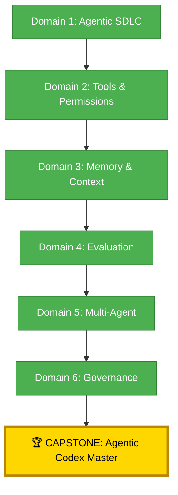

*The Hall of Mastery stands silent. The six seals of the Codex glow on the walls — one for each domain, one for each truth the candidate has learned on the journey from initiate to master. The Codex Master who placed the seals speaks: "Show me that you did not only read the Codex. Show me that you understand why it was written."*

## 🗺️ The Arc Complete



## 🎯 Capstone Objectives

- [ ] **Seal 1 (Domain 1 — 18%)**: Implement agent-in-SDLC and define boundaries
- [ ] **Seal 2 (Domain 2 — 18%)**: Configure tools, permissions, MCP, environment integration
- [ ] **Seal 3 (Domain 3 — 19%)**: Implement memory strategy and context continuity
- [ ] **Seal 4 (Domain 4 — 19%)**: Evaluate agent performance and iterate on instructions
- [ ] **Seal 5 (Domain 5 — 17%)**: Build and manage a multi-agent system
- [ ] **Seal 6 (Domain 6 — 9%)**: Implement responsible autonomy, guardrails, and HITL

---

## 🏛️ The Grand Trial Scenario

*The Scribe presents the scenario:*

> You are the lead AI engineer at a software team that has decided to adopt agentic AI development using GitHub. You have been given an empty repository, a GitHub account with Copilot, Actions, and Environments, and a mandate: build a working agentic SDLC in the next 6 hours and demonstrate competency in every domain.

The following 6 chapters map directly to the GH-600 exam domains.

---

## ⚔️ Seal 1: The Agentic SDLC (Domain 1 — 18%)

*Related quests: Q1 (SDLC Integration), Q2 (Plan vs Action), Q3 (Observability)*

### Challenge 1.1: Describe where agents live in your SDLC

> **Task:** Document where in your software development lifecycle agents operate. Produce a diagram.

```markdown
<!-- work/gh-600/capstone/sdlc-diagram.md -->
# Our Agentic SDLC

## 🎯 Quest Objectives

By the end of this quest, you will be able to:

- [ ] Understand the core concepts introduced in this quest
- [ ] Complete the hands-on exercises and verify the results
- [ ] Apply what you learned to a follow-up scenario of your own design

> *Note: objectives auto-seeded during framework alignment — authors should refine these to reflect this quest's specific skills.*

## Agent Integration Points

| Phase | Agent Role | Trigger | Human Touchpoint |
|---|---|---|---|
| Planning | Requirements analysis | Issue created | Human approves specification |
| Implementation | Code writing | `agent-implement` label | Human reviews PR |
| Review | Code review comments | PR opened | Human accepts/rejects suggestions |
| Testing | Test execution | PR opened | Human reviews failures |
| Deployment | Deploy staging | PR merged to main | Human approves production |

## Architecture Diagram
[Include Mermaid diagram here]
```

### Challenge 1.2: Demonstrate planning vs. action separation

> **Task:** Show a GitHub Actions workflow that separates the plan step from the execute step with a mandatory break between them.

```yaml
# .github/workflows/plan-then-execute.yml
name: Plan-Then-Execute (Sealed Capstone)

on:
  issues:
    types: [labeled]

jobs:
  plan:
    if: contains(github.event.label.name, 'agent-implement')
    runs-on: ubuntu-latest
    outputs:
      plan_approved: ${{ steps.plan.outputs.approved }}
    steps:
      - name: Generate plan
        id: plan
        run: |
          echo "Generating implementation plan..."
          # Agent generates plan here — does NOT execute
          echo "approved=pending" >> "$GITHUB_OUTPUT"

      - name: Post plan for approval
        uses: actions/github-script@v7
        with:
          script: |
            await github.rest.issues.createComment({
              owner: context.repo.owner,
              repo: context.repo.repo,
              issue_number: context.payload.issue.number,
              body: '**Agent Plan Generated** ✅\n\nReact with 👍 to approve execution, or 👎 to reject.\n\n_No changes have been made yet._'
            });

  execute:
    needs: plan
    runs-on: ubuntu-latest
    environment: agent-approval    # Human must approve in GitHub UI before this runs
    steps:
      - name: Execute approved plan
        run: echo "Executing plan after human approval..."
```

### Challenge 1.3: Configure an observability workflow

> **Task:** Ensure every agent run emits structured logs that can be queried.

*Refer to Q3 ([Observability & Control](/quests/1000/agentic-observability-and-control/)) for the full pattern.*

---

## ⚔️ Seal 2: Tools, Permissions, and Environment (Domain 2 — 18%)

*Related quests: Q4 (Tool Selection), Q5 (MCP), Q6 (Dev Env), Q7 (Safe Execution)*

### Challenge 2.1: Configure a scoped GitHub token

> **Task:** Set the minimum permissions needed for an implementation agent.

```yaml
# In your workflow:
permissions:
  contents: write        # Write files to repository
  pull-requests: write   # Create and update PRs
  issues: write          # Comment on issues
  # Explicitly deny everything else:
  # actions: none (default)
  # security-events: none (default)
```

### Challenge 2.2: Configure an MCP server

> **Task:** Add a GitHub MCP server to Copilot and demonstrate its use.

```json
// .vscode/mcp.json (workspace-level MCP configuration)
{
  "servers": {
    "github": {
      "command": "npx",
      "args": ["@modelcontextprotocol/server-github"],
      "env": {
        "GITHUB_PERSONAL_ACCESS_TOKEN": "${input:github-token}"
      }
    }
  }
}
```

### Challenge 2.3: Document error handling and escalation

> **Task:** Add a failure escalation workflow that creates an issue when an agent fails.

*Refer to Q7 ([Safe Execution & Error Handling](/quests/1001/agentic-safe-execution-and-error-handling/)) for the full pattern.*

---

## ⚔️ Seal 3: Memory and Context (Domain 3 — 19%)

*Related quests: Q8 (Memory Strategies), Q9 (State Persistence), Q10 (Cross-tool Continuity)*

### Challenge 3.1: Implement all three memory tiers

> **Task:** Create artifacts demonstrating ephemeral, session, and persistent memory.

```markdown
## Memory Tier Implementation Checklist

- [ ] **Ephemeral**: Variables in workflow `env:` block used within a job
- [ ] **Session**: Artifact uploaded in step A, downloaded in step B
- [ ] **Persistent**: Repository file updated by agent, committed and pushed
```

### Challenge 3.2: Implement drift detection

> **Task:** Produce a drift check that compares current agent state to expected state.

*Refer to Q9 ([State Persistence & Drift](/quests/1010/agentic-state-persistence-and-drift/)) for `detect_drift.py`.*

### Challenge 3.3: Implement cross-surface context handoff

> **Task:** Show a `context-handoff.json` passed between an issue → PR → branch context.

*Refer to Q10 ([State Continuity Cross-Tools](/quests/1010/agentic-state-continuity-cross-tools/)) for the schema and `inject_cross_surface_context.py`.*

---

## ⚔️ Seal 4: Evaluation and Performance (Domain 4 — 19%)

*Related quests: Q11 (Success Criteria), Q12 (Root Cause Analysis), Q13 (Behavior Tuning)*

### Challenge 4.1: Define machine-verifiable acceptance criteria

> **Task:** Write 3 acceptance criteria for an agent task that can be verified programmatically.

```json
// work/gh-600/capstone/acceptance-criteria.json
{
  "task": "Implement authentication feature",
  "criteria": [
    {
      "id": "AC-01",
      "description": "Unit tests pass",
      "signal": "ci-pass",
      "check_command": "gh run list --workflow=test.yml --branch=feature/auth --status=success --limit=1"
    },
    {
      "id": "AC-02",
      "description": "No new security vulnerabilities",
      "signal": "security-scan-pass",
      "check_command": "gh api /repos/{owner}/{repo}/code-scanning/alerts?state=open | jq 'length == 0'"
    },
    {
      "id": "AC-03",
      "description": "Code review approved",
      "signal": "pr-approved",
      "check_command": "gh pr view {pr_number} --json reviewDecision -q '.reviewDecision == \"APPROVED\"'"
    }
  ]
}
```

### Challenge 4.2: Perform an RCA on a failed run

> **Task:** Take a failed workflow run and produce a 5-Why RCA document.

*Refer to Q12 ([Failure Root Cause Analysis](/quests/1010/agentic-failure-root-cause-analysis/)) for the full RCA template.*

### Challenge 4.3: Iterate on agent instructions

> **Task:** Make one instruction change, measure the before/after difference.

*Refer to Q13 ([Behavior Tuning](/quests/1011/agentic-behavior-tuning/)) for the instruction changelog template.*

---

## ⚔️ Seal 5: Multi-Agent Systems (Domain 5 — 17%)

*Related quests: Q14 (Orchestration), Q15 (Observability), Q16 (Recovery), Q17 (Lifecycle)*

### Challenge 5.1: Design a 3-agent orchestration workflow

> **Task:** Create a fan-out or chain orchestration with 3 sub-agents.

*Refer to Q14 ([Multi-Agent Orchestration Patterns](/quests/1011/agentic-multi-agent-orchestration-patterns/)) for the fan-out and chain patterns.*

### Challenge 5.2: Add tracing to the multi-agent run

> **Task:** Each sub-agent emits a trace entry with a shared correlation ID.

*Refer to Q15 ([Multi-Agent Observability](/quests/1011/agentic-multi-agent-observability/)) for `trace_writer.py`.*

### Challenge 5.3: Add failure recovery to the orchestrator

> **Task:** Orchestrator continues after one sub-agent fails and produces a recovery plan.

*Refer to Q16 ([Multi-Agent Failure Recovery](/quests/1011/agentic-multi-agent-failure-recovery/)) for `recovery_coordinator.py`.*

### Challenge 5.4: Register all agents in the agent registry

> **Task:** Publish `_data/agents.yml` with all 3 agents registered.

*Refer to Q17 ([Multi-Agent Lifecycle Management](/quests/1100/agentic-multi-agent-lifecycle-management/)) for the registry schema.*

---

## ⚔️ Seal 6: Responsible Agentic AI (Domain 6 — 9%)

*Related quests: Q18 (Autonomy Levels), Q19 (Guardrails & HITL)*

### Challenge 6.1: Produce your autonomy matrix

> **Task:** Complete `_data/autonomy-matrix.yml` with 5 task types at appropriate levels.

*Refer to Q18 ([Autonomy Levels Matrix](/quests/1100/agentic-autonomy-levels-matrix/)) for the matrix schema.*

### Challenge 6.2: Implement 3 guardrails

> **Task:** CODEOWNERS file-scope boundary, approval gate environment, forbidden actions list.

*Refer to Q19 ([Guardrails & Human-in-the-Loop](/quests/1100/agentic-guardrails-and-human-in-the-loop/)) for each guardrail.*

---

## 📋 Domain Coverage Rubric (GH-600 Exam Alignment)

| Domain | Weight | Your Score | Pass Threshold |
|---|---|---|---|
| D1: Agentic SDLC | 18% | /18 | ≥ 14 |
| D2: Tools & Environment | 18% | /18 | ≥ 14 |
| D3: Memory & Context | 19% | /19 | ≥ 15 |
| D4: Evaluation | 19% | /19 | ≥ 15 |
| D5: Multi-Agent | 17% | /17 | ≥ 13 |
| D6: Governance | 9% | /9 | ≥ 7 |
| **Total** | **100%** | **/100** | **≥ 70** |

---

## 🪞 The Grand Reflection

After completing all 6 seals, publish your reflection:

```markdown
<!-- work/gh-600/capstone/grand-reflection.md -->
# Grand Reflection: Agentic Codex Trial

## What I Built
[Summary of the agentic system you designed and implemented]

## Most Challenging Domain
[Which domain was hardest and why?]

## Key Architectural Decision
[The most important decision you made and why]

## What I Would Do Differently
[Honest reflection on what could be improved]

## Exam Readiness Self-Assessment
[Domain-by-domain confidence rating 1-5]

## Resources I Would Review Again
[Links back to quests or docs that were most valuable]
```

---

## ✅ Capstone Validation

```bash
# Validate all 20 quests in the arc
python3 test/quest-validator/quest_validator.py -d pages/_quests/

# Check all 6 seals are present
python3 work/gh-600/scripts/validate_capstone.py \
  --registry _data/agents.yml \
  --matrix _data/autonomy-matrix.yml \
  --reflection work/gh-600/capstone/grand-reflection.md

# Build site
docker-compose exec jekyll bundle exec jekyll build
```

---

## 🏆 The Agentic Codex — Complete Arc Links

| Quest | Domain | Link |
|---|---|---|
| Q1 | D1 | [Agentic SDLC Integration](/quests/0111/agentic-sdlc-integration/) |
| Q2 | D1 | [Plan vs Action Boundaries](/quests/0111/agentic-plan-vs-action-boundaries/) |
| Q3 | D1 | [Observability & Control](/quests/1000/agentic-observability-and-control/) |
| Q4 | D2 | [Tool Selection & Permissions](/quests/1000/agentic-tool-selection-and-permissions/) |
| Q5 | D2 | [MCP Server Mastery](/quests/1000/agentic-mcp-server-mastery/) |
| Q6 | D2 | [Dev Environment Integration](/quests/1001/agentic-dev-environment-integration/) |
| Q7 | D2 | [Safe Execution & Error Handling](/quests/1001/agentic-safe-execution-and-error-handling/) |
| Q8 | D3 | [Memory Strategies](/quests/1001/agentic-memory-strategies/) |
| Q9 | D3 | [State Persistence & Drift](/quests/1010/agentic-state-persistence-and-drift/) |
| Q10 | D3 | [State Continuity Cross-Tools](/quests/1010/agentic-state-continuity-cross-tools/) |
| Q11 | D4 | [Success Criteria & Signals](/quests/1010/agentic-success-criteria-and-signals/) |
| Q12 | D4 | [Failure Root Cause Analysis](/quests/1010/agentic-failure-root-cause-analysis/) |
| Q13 | D4 | [Behavior Tuning](/quests/1011/agentic-behavior-tuning/) |
| Q14 | D5 | [Multi-Agent Orchestration Patterns](/quests/1011/agentic-multi-agent-orchestration-patterns/) |
| Q15 | D5 | [Multi-Agent Observability](/quests/1011/agentic-multi-agent-observability/) |
| Q16 | D5 | [Multi-Agent Failure Recovery](/quests/1011/agentic-multi-agent-failure-recovery/) |
| Q17 | D5 | [Multi-Agent Lifecycle Management](/quests/1100/agentic-multi-agent-lifecycle-management/) |
| Q18 | D6 | [Autonomy Levels Matrix](/quests/1100/agentic-autonomy-levels-matrix/) |
| Q19 | D6 | [Guardrails & HITL](/quests/1100/agentic-guardrails-and-human-in-the-loop/) |
| CAP | All | **You are here** |

## 🏆 Capstone Rewards

| Reward | Details |
|---|---|
| 🏆 Agentic Codex Master Badge | Earned on full completion |
| 🎓 GH-600 Ready Certificate | Published to your IT-Journey profile |
| 200 XP | Arc total: 2,020 XP |
| Arc Complete | The Agentic Codex arc is sealed |

*The Codex Master speaks: "The seals are broken. The knowledge is yours. Go now and build systems worthy of the Codex."*

## 🕸️ Knowledge Graph

*Structured wiki-links connect this quest to the IT-Journey knowledge graph. Open the [Obsidian Graph View](/docs/obsidian/graph/) to explore connections.*

**Level hub:** [[Level 1100 - Data & Templates]]
**Overworld:** [[🏰 Overworld - Master Quest Map]]
**Study track:** [[The Agentic Codex: GH-600 Study Hub]] · [[GH-600 Agentic AI Quick-Reference Notes]] · [[GH-600 Skills Checklist]]
**Prerequisites:** [[Initiation Rites: Embedding Agents in the SDLC]] · [[The Three Sigils: Plan, Reason, Act]] · [[The All-Seeing Eye: Observability & Control for Autonomous Agents]] · [[Forging the Agent's Arsenal: Tool Selection & Permissions]] · [[The MCP Conclave: Mastering Model Context Protocol Servers]] · [[Bind the Agent to the Realm: Dev Environment Integration]] · [[The Shield of Retries: Safe Execution and Error Handling]] · [[Vaults of Recollection: Agent Memory Strategies]] · [[Anchoring the Drifting Agent: State Persistence and Drift Prevention]] · [[Crossing the Tool Planes: State Continuity Across Tools]] · [[The Oracle's Rubric: Defining Agent Success Criteria and Signals]] · [[The Necromancer's Inquest: Agent Failure Root Cause Analysis]] · [[Reforging the Agent's Mind: Behavior Tuning Through Instructions]] · [[The Council of Many: Multi-Agent Orchestration Patterns]] · [[The Scribe's Codex: Observability in Multi-Agent Systems]] · [[When Familiars Fall: Multi-Agent Failure Recovery]] · [[The Agent Pantheon: Multi-Agent Lifecycle Management]] · [[The Autonomy Scales: Mapping Agent Autonomy Levels]] · [[The Warden's Pact: Guardrails and Human-in-the-Loop Patterns]]
**Obsidian docs:** [[Obsidian Knowledge Graph and Wiki Links]]

