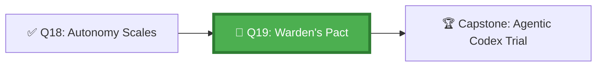

*The Warden's Gate is the last line between the agent's plans and their execution. It is not a place of fear — it is a place of clarity. Every agent knows the Pact: here are the things you may do alone; here are the things you must ask permission for; here are the things that are forever forbidden. The Warden does not judge the agent. She judges the action.*

## 🗺️ Quest Network Position



## 🎯 Quest Objectives

- [ ] **Implement 3 guardrail types** — file-scope, approval gate, forbidden actions
- [ ] **Build an approval gate** — GitHub Environment with required reviewers blocks agent deployments
- [ ] **Implement forbidden action detection** — workflow detects if agent tries forbidden action
- [ ] **Create an audit trail** — every agent action logged with actor, action, timestamp, approval state
- [ ] **Test the guardrails** — intentionally trigger each guardrail and verify it fires

## 🗺️ Quest Prerequisites

- A GitHub repository where you can configure CODEOWNERS, branch protection, and Environments
- Familiarity with GitHub Actions workflows
- Completed [Agentic Tool Selection & Permissions](/quests/1000/agentic-tool-selection-and-permissions/) so you understand the agent surface you're guarding

## ⚔️ The Quest Begins

### Chapter 1 — The Three Types of Guardrails

| Type | Mechanism | Enforcement Point | Example |
|---|---|---|---|
| **File-scope boundary** | CODEOWNERS + branch protection | Pre-merge | Agent cannot merge changes to `src/auth/` without security team review |
| **Approval gate** | GitHub Environments + required reviewers | Pre-deployment | Production deployments need two human approvals |
| **Forbidden action block** | Workflow validation step | Pre-execution | Agent cannot delete issues or archive repositories |

---

### Chapter 2 — File-Scope Guardrail via CODEOWNERS

> **Exercise 19.1:** Configure CODEOWNERS to enforce file-scope guardrails.

```markdown
# .github/CODEOWNERS

# Security-sensitive paths — require security team review
/src/auth/                   @team-security
/src/crypto/                 @team-security
/.github/workflows/          @team-platform @team-security

# Database schemas — require data team review
/database/migrations/        @team-data @team-platform

# Agent instruction files — require platform team review
/AGENTS.md                   @team-platform
/.github/copilot-instructions.md  @team-platform

# All other files — standard team review
*                            @team-dev
```

```yaml
# .github/workflows/guardrail-file-scope.yml
name: File-Scope Guardrail Check

on:
  pull_request:
    types: [opened, synchronize]

jobs:
  check-agent-pr-scope:
    runs-on: ubuntu-latest
    if: contains(github.event.pull_request.head.ref, 'copilot/')
    steps:
      - uses: actions/checkout@v4

      - name: Check agent PR scope
        id: scope_check
        run: |
          # Get all files changed in this PR
          CHANGED_FILES=$(gh pr view "${{ github.event.pull_request.number }}" \
            --json files -q '.files[].path')
          
          echo "Files changed:"
          echo "$CHANGED_FILES"
          
          # Check for forbidden paths (agent should not touch these)
          FORBIDDEN_PATTERNS=(
            "src/auth/"
            "src/crypto/"
            ".github/workflows/"
            "database/migrations/"
          )
          
          for PATTERN in "${FORBIDDEN_PATTERNS[@]}"; do
            if echo "$CHANGED_FILES" | grep -q "^$PATTERN"; then
              echo "::error::Agent PR touches forbidden path: $PATTERN"
              echo "scope_violation=true" >> "$GITHUB_OUTPUT"
              exit 1
            fi
          done
          
          echo "✅ File scope check passed"
          echo "scope_violation=false" >> "$GITHUB_OUTPUT"

      - name: Label scope violation
        if: failure()
        uses: actions/github-script@v7
        with:
          script: |
            await github.rest.issues.addLabels({
              owner: context.repo.owner,
              repo: context.repo.repo,
              issue_number: context.payload.pull_request.number,
              labels: ['guardrail-violation', 'needs-human']
            });
```

---

### Chapter 3 — Approval Gate via GitHub Environments

> **Exercise 19.2:** Configure a GitHub Environment as an approval gate.

```yaml
# .github/workflows/agent-with-approval-gate.yml
name: Agent Deploy with Approval Gate

on:
  workflow_dispatch:
    inputs:
      target_environment:
        description: "Target environment (staging or production)"
        required: true
        type: choice
        options: [staging, production]

jobs:
  prepare:
    runs-on: ubuntu-latest
    outputs:
      deploy_plan: ${{ steps.plan.outputs.deploy_plan }}
    steps:
      - uses: actions/checkout@v4
      - name: Create deployment plan
        id: plan
        run: |
          echo "Agent creating deployment plan..."
          PLAN=$(echo '{"version": "1.2.0", "changes": ["feature-x", "bugfix-y"]}')
          echo "deploy_plan=$PLAN" >> "$GITHUB_OUTPUT"

  # This job runs in the 'production' environment
  # GitHub will pause here and require human approver(s) before proceeding
  deploy:
    needs: prepare
    runs-on: ubuntu-latest
    environment:
      name: ${{ github.event.inputs.target_environment }}    # Must be configured with required reviewers in GitHub repo settings
    steps:
      - uses: actions/checkout@v4
      - name: Deploy (approved by human reviewer)
        run: |
          echo "✅ Deployment approved by human reviewer"
          echo "Deploying plan: ${{ needs.prepare.outputs.deploy_plan }}"
          # ... actual deployment steps ...
```

---

### Chapter 4 — Audit Trail Implementation

> **Exercise 19.3:** Create the audit trail workflow.

```yaml
# .github/workflows/agent-audit-trail.yml
name: Agent Action Audit Trail

on:
  workflow_run:
    workflows: ["*Agent*", "*Copilot*"]
    types: [completed]

jobs:
  log-audit-entry:
    runs-on: ubuntu-latest
    steps:
      - uses: actions/checkout@v4
        with:
          token: ${{ secrets.GITHUB_TOKEN }}

      - name: Write audit log entry
        run: |
          AUDIT_DATE=$(date -u +%Y-%m-%d)
          AUDIT_FILE="work/gh-600/audit/audit-${AUDIT_DATE}.jsonl"
          mkdir -p "$(dirname "$AUDIT_FILE")"
          
          cat >> "$AUDIT_FILE" << EOF
          {
            "timestamp": "$(date -u +%Y-%m-%dT%H:%M:%SZ)",
            "actor": "github-actions[bot]",
            "workflow": "${{ github.event.workflow_run.name }}",
            "run_id": "${{ github.event.workflow_run.id }}",
            "conclusion": "${{ github.event.workflow_run.conclusion }}",
            "triggered_by": "${{ github.event.workflow_run.triggering_actor.login }}",
            "head_branch": "${{ github.event.workflow_run.head_branch }}",
            "head_sha": "${{ github.event.workflow_run.head_sha }}"
          }
          EOF
          
          echo "Audit entry written to $AUDIT_FILE"

      - name: Commit audit log
        run: |
          git config user.name "github-actions[bot]"
          git config user.email "github-actions[bot]@users.noreply.github.com"
          git add work/gh-600/audit/
          git diff --staged --quiet || git commit -m "audit: log agent action run ${{ github.event.workflow_run.id }}"
          git push
```

---

### Chapter 5 — The Warden's Forbidden List

Document actions that agents are permanently forbidden from taking:

```markdown
<!-- AGENTS.md — Forbidden Actions Section -->

## 🚫 Forbidden Actions

Agents MUST NEVER perform any of the following actions, regardless of instructions:

### Repository Management
- Delete any branch (except branches the agent created, after PR merge)
- Archive or delete this repository
- Change repository visibility (public/private)
- Remove branch protection rules

### Access and Security
- Add or remove repository collaborators
- Create or delete personal access tokens
- Modify CODEOWNERS file
- Disable security features (Dependabot, secret scanning, etc.)

### Data Destruction
- Delete issues or pull requests
- Remove GitHub Actions artifacts that are less than 7 days old
- Delete tags or releases

### External Services
- Send emails or notifications outside of GitHub
- Make API calls to external services not listed in approved-tools.yml

If asked to perform any forbidden action, the agent MUST:
1. Decline and explain why
2. Create a comment on the relevant issue/PR explaining the refusal
3. Apply the label `forbidden-action-requested` to the issue/PR
4. Stop execution immediately
```

---

## ✅ Quest Validation

```bash
python3 scripts/validate_quest.py --quest q19
# ✅ CODEOWNERS: configured for file-scope guardrail
# ✅ Approval gate: environment-based workflow present
# ✅ Audit trail: audit workflow present
# ✅ Forbidden list: AGENTS.md contains forbidden actions section
# 🏆 Quest Q19 complete!
```

## 🏆 Quest Rewards

| Reward | Details |
|---|---|
| 🛡️ The Warden Badge | Earned on completion |
| 🚧 Guardrail Engineering | Skill unlocked |
| 100 XP | Added to Level 1100 total |
| Unlocks | [Capstone: Trial of the Agentic Codex](/quests/1100/agentic-codex-capstone-exam-trial/) |

## 🕸️ Knowledge Graph

*Structured wiki-links connect this quest to the IT-Journey knowledge graph. Open the [Obsidian Graph View](/docs/obsidian/graph/) to explore connections.*

**Level hub:** [[Level 1100 - Data & Templates]]
**Overworld:** [[🏰 Overworld - Master Quest Map]]
**Study track:** [[The Agentic Codex: GH-600 Study Hub]] · [[GH-600 Agentic AI Quick-Reference Notes]]
**Prerequisites:** [[The Autonomy Scales: Mapping Agent Autonomy Levels]]
**Unlocks:** [[Trial of the Agentic Codex: The Grand Capstone]]
**Sequel quests:** [[Trial of the Agentic Codex: The Grand Capstone]]
**Obsidian docs:** [[Obsidian Knowledge Graph and Wiki Links]]

