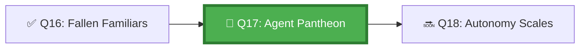

*At the summit of the Citadel stands the Pantheon — a hall of agents that have proven their worth. Each agent's name is carved into the registry stone. Each is granted a domain and a purpose. Each is monitored, supported, and eventually retired with honours. The Pantheon Keeper knows: what is not managed will eventually fail, silently, and no one will notice until it is too late.*

## 🗺️ Quest Network Position



## 🎯 Quest Objectives

- [ ] **Build an agent registry** — a `_data/agents.yml` catalogue of all agents in the system
- [ ] **Implement health monitoring** — scheduled workflow that checks each agent's status
- [ ] **Design a provisioning protocol** — standard procedure for onboarding a new agent
- [ ] **Design a decommission protocol** — safely retire an agent without losing its work
- [ ] **Manage agent versioning** — track which version of an agent is deployed

## ⚔️ The Quest Begins

### Chapter 1 — The Agent Registry

> **Exercise 17.1:** Create the agent registry.

```yaml
# _data/agents.yml — Agent Lifecycle Registry

agents:
  - id: analysis-agent
    name: "Analysis Agent"
    version: "1.2.0"
    status: active          # active | paused | deprecated | retired
    domain: "Code analysis and requirement parsing"
    workflow: ".github/workflows/agent-analysis.yml"
    owner: "@team-platform"
    created: 2026-05-01
    last_updated: 2026-05-17
    health_check_command: "gh workflow run agent-health-check.yml -f agent=analysis"
    dependencies:
      - "github-models-api"
    metrics:
      success_rate_30d: 97
      avg_task_duration_minutes: 12

  - id: implementation-agent
    name: "Implementation Agent"
    version: "2.0.1"
    status: active
    domain: "Code implementation from specifications"
    workflow: ".github/workflows/agent-implementation.yml"
    owner: "@team-platform"
    created: 2026-04-15
    last_updated: 2026-05-10
    health_check_command: "gh workflow run agent-health-check.yml -f agent=implementation"
    dependencies:
      - "copilot-coding-agent"
      - "analysis-agent"
    metrics:
      success_rate_30d: 94
      avg_task_duration_minutes: 35

  - id: review-agent
    name: "Review Agent"
    version: "1.0.5"
    status: deprecated       # Being replaced by review-agent-v2
    domain: "Automated code review and PR comments"
    workflow: ".github/workflows/agent-review.yml"
    owner: "@team-platform"
    deprecation_date: 2026-06-01
    replacement: review-agent-v2
    created: 2026-03-01
    last_updated: 2026-05-01
```

---

### Chapter 2 — Agent Health Monitoring

> **Exercise 17.2:** Create the health check workflow.

```yaml
# .github/workflows/agent-health-monitor.yml
name: Agent Health Monitor

on:
  schedule:
    - cron: '0 8 * * *'   # Daily health check at 8 AM UTC
  workflow_dispatch:
    inputs:
      agent_id:
        description: "Check specific agent (leave blank for all)"
        required: false

jobs:
  health-check:
    runs-on: ubuntu-latest
    steps:
      - uses: actions/checkout@v4

      - name: Load agent registry
        id: registry
        run: |
          python3 work/gh-600/scripts/load_registry.py \
            --registry _data/agents.yml \
            --filter-status active \
            --output active-agents.json
          
          AGENTS=$(cat active-agents.json | jq -c '[.[].id]')
          echo "agents=$AGENTS" >> "$GITHUB_OUTPUT"

      - name: Check each agent's last successful run
        run: |
          python3 work/gh-600/scripts/agent_health_check.py \
            --registry _data/agents.yml \
            --max-age-hours 48 \
            --report-file health-report.json

      - name: Alert on unhealthy agents
        uses: actions/github-script@v7
        with:
          script: |
            const fs = require('fs');
            const report = JSON.parse(fs.readFileSync('health-report.json'));
            
            if (report.unhealthy_agents.length > 0) {
              const body = `## 🚨 Agent Health Alert\n\n` +
                `The following agents have not run successfully in 48 hours:\n\n` +
                report.unhealthy_agents.map(a => `- **${a.name}** (${a.id}): last success ${a.last_success}`).join('\n');
              
              await github.rest.issues.create({
                owner: context.repo.owner,
                repo: context.repo.repo,
                title: `[AGENT HEALTH] ${report.unhealthy_agents.length} agent(s) unhealthy - ${new Date().toISOString().split('T')[0]}`,
                body: body,
                labels: ['agent-health', 'priority-high']
              });
            }

      - name: Upload health report
        uses: actions/upload-artifact@v4
        with:
          name: health-report-${{ github.run_id }}
          path: health-report.json
```

---

### Chapter 3 — Agent Provisioning Protocol

When adding a new agent to the Pantheon, follow this protocol:

```markdown
<!-- docs/agents/PROVISIONING.md -->
# Agent Provisioning Protocol

## Step 1: Design
- [ ] Document the agent's domain, inputs, and outputs
- [ ] Identify dependencies (other agents, tools, APIs)
- [ ] Define acceptance criteria for the agent's tasks

## Step 2: Create
- [ ] Create `AGENTS.md` file with agent-specific instructions
- [ ] Create `copilot-instructions.md` additions for the agent's scope
- [ ] Create the GitHub Actions workflow
- [ ] Add the agent to `_data/agents.yml` with status: `beta`

## Step 3: Test
- [ ] Run 5 test tasks; verify against acceptance criteria
- [ ] Verify health check works for the new agent
- [ ] Test failure recovery (introduce a failure; verify orchestrator handles it)

## Step 4: Activate
- [ ] Update `_data/agents.yml` status from `beta` to `active`
- [ ] Announce in team discussion thread
- [ ] Update orchestrator workflow if the agent joins a chain

## Step 5: Monitor
- [ ] Track success rate in first 30 days
- [ ] Review health monitoring results weekly
- [ ] Address any issues within 48 hours
```

---

### Chapter 4 — Agent Decommission Protocol

```markdown
<!-- docs/agents/DECOMMISSION.md -->
# Agent Decommission Protocol

## Trigger Conditions
- Agent success rate < 80% for 7 consecutive days
- Agent replaced by a better implementation
- Agent's domain is no longer required
- Agent dependency (tool, API) is end-of-life

## Decommission Steps
1. Set status to `deprecated` in `_data/agents.yml`
2. Set `deprecation_date` (minimum 14 days ahead)
3. Notify all workflows that depend on this agent
4. For each dependent workflow: update to use replacement agent
5. Archive agent workflow file (don't delete — preserve history)
6. Set status to `retired` after all dependents migrate
7. Document lessons learned in agent's registry entry
```

---

## ✅ Quest Validation

```bash
python3 scripts/validate_quest.py --quest q17
# ✅ Agent registry: _data/agents.yml present with 2+ agents
# ✅ Health monitor: agent-health-monitor.yml present
# ✅ Provisioning protocol: docs/agents/PROVISIONING.md present
# ✅ Decommission protocol: docs/agents/DECOMMISSION.md present
# 🏆 Quest Q17 complete!
```

## 🏆 Quest Rewards

| Reward | Details |
|---|---|
| 🏛️ Pantheon Keeper Badge | Earned on completion |
| 🌱 Agent Provisioning | Skill unlocked |
| 150 XP | Added to Level 1100 total |
| Unlocks | [Q18: The Autonomy Scales](/quests/1100/agentic-autonomy-levels-matrix/) |

## 🕸️ Knowledge Graph

*Structured wiki-links connect this quest to the IT-Journey knowledge graph. Open the [Obsidian Graph View](/docs/obsidian/graph/) to explore connections.*

**Level hub:** [[Level 1100 - Data & Templates]]
**Overworld:** [[🏰 Overworld - Master Quest Map]]
**Study track:** [[The Agentic Codex: GH-600 Study Hub]] · [[GH-600 Agentic AI Quick-Reference Notes]]
**Prerequisites:** [[When Familiars Fall: Multi-Agent Failure Recovery]]
**Unlocks:** [[The Autonomy Scales: Mapping Agent Autonomy Levels]]
**Sequel quests:** [[The Autonomy Scales: Mapping Agent Autonomy Levels]]
**Obsidian docs:** [[Obsidian Knowledge Graph and Wiki Links]]

