🌟 Welcome, Brave Data Sorcerer! 🌟

In the fog-shrouded realms of Financea, where gold flows like enchanted rivers and secrets are hoarded in
towering vaults, stands the impregnable Data Castle ruled by the tyrannical King EDGAR. This ancient monarch,
Sovereign of Electronic Data Gathering, Analysis, and Retrieval, guards the sacred scrolls of corporate
filings—balance sheets that shimmer like dragon scales, income statements pulsing with the lifeblood of profits,
and trends that whisper prophecies of market booms and busts.

But lo! King EDGAR hoards this knowledge for the elite wizards of Wall Street, leaving humble investors, analysts,
and scholars to grovel in ignorance. You must embark on the Mystical Quest to Conquer King EDGAR! Rally a legion
of AI Soldiers—ethereal beings forged from code and logic—to breach the castle walls, extract the forbidden
financial lore, and distribute it to the masses. APIs are your spells, rate limits your traps, and JSON responses
the glittering treasures you seek.

### 🌟 The Legend Behind This Quest

Democratizing financial data empowers research, education, and fairness. EDGAR exposes public, no-key endpoints at
`https://data.sec.gov` that—when used respectfully—unlock filings, concepts, and cross-company frames suitable for
analysis, dashboards, and learning.

## 🎯 Quest Objectives

By the end, you will:

### Primary Objectives

- [ ] Query the Submissions API to enumerate filings for a company (via CIK)
- [ ] Retrieve XBRL facts with Company Concept and Company Facts APIs
- [ ] Aggregate cross-entity values with the Frames API
- [ ] Respect SEC Fair Access (User-Agent + rate limits) with simple backoff

### Secondary Objectives

- [ ] Automate exports to CSV for reuse
- [ ] Compare at least two companies on a chosen tag
- [ ] Optionally enlist an LLM to summarize trends and anomalies

### Mastery Indicators

- [ ] You can pad CIKs to 10 digits and handle 404/429 gracefully
- [ ] You can explain the difference between Company Concept vs Company Facts vs Frames
- [ ] You can turn raw JSON facts into tidy time series for analysis

## 🗺️ Quest Prerequisites

### 📋 Knowledge

- [ ] Basics of HTTP/REST, headers, JSON
- [ ] Comfort with a scripting language (Python examples provided)

### 🛠️ System

- [ ] macOS, Windows, or Linux
- [ ] Python 3.10+ (or your language of choice)
- [ ] Network access to `https://data.sec.gov`

### 🧠 Skill Level

- [ ] Foundation API skills, growing toward intermediate data engineering

## 🌍 Choose Your Adventure Platform

Different platforms offer unique advantages. Pick your path and prepare your tools.

### 🍎 macOS Kingdom Path

```bash
brew install python
python3 -m venv .venv
source .venv/bin/activate
python -m pip install --upgrade pip requests pandas
```

### 🪟 Windows Empire Path

```powershell
winget install Python.Python.3.12
py -3 -m venv .venv
.\.venv\Scripts\activate
python -m pip install --upgrade pip requests pandas
```

### 🐧 Linux Territory Path

```bash
python3 -m venv .venv
source .venv/bin/activate
python -m pip install --upgrade pip requests pandas
```

### ☁️ Cloud Realms Path

Use a codespace or any notebook runtime; install `requests` and `pandas`. Containers welcome.

---

## Level 000: The Awakening – Forge Your AI Legion

Narrative: In the misty village of Queryton, the Oracle whispers of `https://data.sec.gov`. No key needed—but
beware the Rate Limit Goblins (target ≤10 req/s) and the 429 curse.

Challenge – Summon the Soldiers:

1) Gather allies: LLMs to summarize/paraphrase filings when needed.
2) Equip your amulet: always include a User-Agent.

```python
import requests
UA = 'DataDruidGuild questmaster@financea.com'  # Identify yourself per SEC Fair Access
HEADERS = {'User-Agent': UA}
```

Badge Unlock: Legion Leader – Imported requests and set a User-Agent.

## Level 001: The Scout's Path – Submissions API

Scout filing history for a company.

- Endpoint: `/submissions/CIK{10-digit-cik}.json`
- Example: `https://data.sec.gov/submissions/CIK0000320193.json` (Apple)

```python
import time
import requests

def get_submissions(cik: str) -> dict:
    cik10 = cik.zfill(10)
    url = f'https://data.sec.gov/submissions/CIK{cik10}.json'
    for attempt in range(3):
        r = requests.get(url, headers=HEADERS, timeout=30)
        if r.status_code == 200:
            return r.json()
        if r.status_code == 429:
            time.sleep(2 ** attempt)  # backoff on rate limit
            continue
        r.raise_for_status()
    raise RuntimeError('Failed to fetch submissions after retries')

data = get_submissions('320193')  # Apple without leading zeros
print(data['name'], len(data['filings']['recent']['form']))
```

Pitfall: Malformed CIKs (pad to 10 digits) → 400 errors. Nightly bulk zip for scale:
`https://www.sec.gov/Archives/edgar/daily-index/bulkdata/submissions.zip`.

Badge Unlock: Scout Supreme – Extracted first filing date.

## Level 002: The Alchemist's Brew – XBRL Company Concept

Extract a specific concept over time for one company.

- Endpoint: `/api/xbrl/companyconcept/CIK{cik}/{taxonomy}/{tag}.json`
- Example: `.../CIK0000320193/us-gaap/AccountsPayableCurrent.json`

```python
def get_company_concept(cik: str, taxonomy: str, tag: str) -> dict:
    url = f'https://data.sec.gov/api/xbrl/companyconcept/CIK{cik.zfill(10)}/{taxonomy}/{tag}.json'
    r = requests.get(url, headers=HEADERS, timeout=30)
    if r.status_code == 404:
        raise ValueError('No such tag/taxonomy for this entity')
    r.raise_for_status()
    return r.json()

concept = get_company_concept('320193', 'us-gaap', 'AccountsPayableCurrent')
last = concept['units']['USD'][-1]
print(concept['label'], last['end'], last['val'])
```

Hazard: Wrong taxonomy → 404 Phantom. Cache results to be kind.

Badge Unlock: Alchemist Adept – Brewed first fact without spills.

## Level 003: The Archivist's Vault – XBRL Company Facts

Get the full codex of facts for a company.

- Endpoint: `/api/xbrl/companyfacts/CIK{cik}.json`
- Bulk alternative: `https://www.sec.gov/Archives/edgar/daily-index/xbrl/companyfacts.zip`

```python
import pandas as pd

def get_company_facts(cik: str) -> dict:
    url = f'https://data.sec.gov/api/xbrl/companyfacts/CIK{cik.zfill(10)}.json'
    r = requests.get(url, headers=HEADERS, timeout=60)
    r.raise_for_status()
    return r.json()

facts = get_company_facts('320193')
series = facts['facts']['us-gaap']['NetIncomeLoss']['units'].get('USD', [])
df = pd.DataFrame(series)[['end','val','form']]
df.to_csv('apple_net_income.csv', index=False)
print('Saved apple_net_income.csv with', len(df), 'rows')
```

Hazard: Massive responses → memory strain. Filter early, export incrementally.

Badge Unlock: Vault Violator – Hoarded facts without meltdown.

## Level 004: The Oracle's Vision – XBRL Frames

Aggregate across entities for a period like `CY2019Q1I`.

- Endpoint: `/api/xbrl/frames/{taxonomy}/{tag}/{unit}/{period}.json`

```python
def get_frame(taxonomy: str, tag: str, unit: str, period: str) -> dict:
    url = f'https://data.sec.gov/api/xbrl/frames/{taxonomy}/{tag}/{unit}/{period}.json'
    r = requests.get(url, headers=HEADERS, timeout=60)
    r.raise_for_status()
    return r.json()

frame = get_frame('us-gaap','AccountsPayableCurrent','USD','CY2019Q1I')
print('Points Foreseen:', frame.get('pts'))
```

Hazard: Invalid period → 404. Use judiciously.

Badge Unlock: Oracle Overlord – Aggregated without paradox.

---

## 🎮 Quest Implementation Challenges

### Challenge 1: Silent Scout (🕐 20–30 min)

Objective: Fetch submissions for Apple (320193) and one other CIK.

Requirements:

- [ ] Valid User-Agent; backoff on 429
- [ ] Extract latest 10 forms and dates
- [ ] Save as `submissions_{cik}.csv`

Success:

- [ ] Two CSVs created; no unhandled errors

### Challenge 2: Concept Cauldron (🕐 20–30 min)

Objective: Pull `us-gaap/AccountsPayableCurrent` for Apple; chart/tables trend.

Requirements:

- [ ] Handle 404 taxonomy/tag
- [ ] Export `accounts_payable_apple.csv`

Success:

- [ ] Trend table with end-date, value, form

### Challenge 3: Archivist’s Ledger (🕐 25–35 min)

Objective: Use Company Facts to export `NetIncomeLoss` in USD for Apple and compare with a peer.

Requirements:

- [ ] Create two CSVs + a merged comparison table

Success:

- [ ] Comparison artifact ready for visualization

### Challenge 4: Oracle’s Panorama (🕐 20–30 min)

Objective: Use Frames to retrieve `AccountsPayableCurrent` for one quarter and compare Apple vs a peer.

Requirements:

- [ ] Extract at least two entities’ values; basic descriptive stats

Success:

- [ ] Summary report appended to README

### ✅ Quest Completion Verification

- [ ] All four challenges completed
- [ ] CSV exports present and readable
- [ ] Backoff implemented; no 429s on final run
- [ ] Short README with findings and caveats

---

## 🎁 Quest Rewards and Achievements

### 🏆 Badges Earned

- EDGAR Slayer – You have breached the data castle
- XBRL Adept – You wield concept and facts with care
- Oracle’s Eye – You read frames across realms

### ⚡ Skills Unlocked

- Practical API usage with respectful access patterns
- Tidy time-series construction from EDGAR JSON
- Baseline cross-entity benchmarking

### 🛠️ Tools Added to Your Arsenal

- Python, requests, pandas
- CSV exports for downstream dashboards (Chart.js, etc.)

## 🗺️ Quest Network Position

**Quest Series**: Data Realm Conquests

**Prerequisite Quests**:

- Level 0001: Terminal Mastery – Command-line fundamentals

**Follow-Up Quests**:

- Level 1110: Testing Rituals – Add unit tests and CI to your data pipeline
- Level 10001: Data Vis – Build dashboards from your CSVs

**Parallel Quests**:

- Level 1010: JSON Alchemy – Transformations and normalization

## 📚 Quest Resource Codex

```mermaid
graph TD
    A[🏰 Quest Start] --> B{🧙‍♂️ Choose Platform}
    B -->|🍎 macOS| C[Setup venv + deps]
    B -->|🪟 Windows| D[Setup venv + deps]
    B -->|🐧 Linux| E[Setup venv + deps]
    C --> F[⚔️ Submissions]
    D --> F
    E --> F
    F --> G[🧪 Concept]
    G --> H[📚 Facts]
    H --> I[🔮 Frames]
    I --> J{✅ Verify}
    J -->|Yes| K[🎁 Badges]
    J -->|Retry| F
```

- SEC Fair Access (User-Agent, rate limits): <https://www.sec.gov/os/accessing-edgar-data>
- SEC EDGAR API Documentation: <https://www.sec.gov/edgar/sec-api-documentation>
- EDGAR data portal root: <https://data.sec.gov/>



---

🎉 Congratulations, Hero! You’ve humbled King EDGAR—not by theft, but by wisdom. Use these powers ethically,
comply with SEC edicts, and share knowledge widely. Onward—may your APIs never 429! ⚔️📜✨
