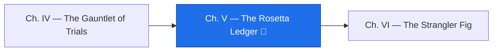

*Here is the boss. Not a monster of fire — a paragraph of clean Python, produced in seconds by a familiar that read the relic fluently, that runs without error and produces a report that looks exactly right. It is wrong three ways. If you ship it, the Empire's receivables will be aged with a rule from 2099, disputed invoices will be dunned, and a cent will go missing somewhere around the ten-thousandth record. The 🐉 Plausible Ghost does not announce itself. Only a ledger that ties out can see it.*

*The real-world skill: migrating logic from a legacy language and proving the migration with a reconciliation, not a code review.*

## 📖 The Legend Behind This Quest

*Scholars could read Egyptian only after the Rosetta Stone gave them the same decree in three scripts and two languages: a bilingual artifact that let a known tongue unlock an unknown one. A migration has an exact equivalent, and it is less glamorous than a museum piece. It is the reconciliation: the same input through the relic and through the port, and a ledger that says, label by label and line by line, whether the two agree. Until it ties out, you have copied the relic, not read it. The guild calls the ledger the Rosetta Ledger, and this chapter is the fight in which it earns the name.*

## 🎯 Quest Objectives

### Primary Objectives

- [ ] **Summon the port** — have a familiar translate the relic into Python that reads the same files and writes the same report
- [ ] **Forge the ledger** — a reconciliation script that compares totals label by label and the reports line by line, and exits non-zero on any difference
- [ ] **Face the ghost** — run the ledger against the first port and read the three mismatches
- [ ] **Break the ghost** — trace each mismatch to a stratum or an ADR, fix the port, and drive the ledger to RECONCILED
- [ ] **Widen the gauntlet** — add the port and the ledger to the Factory

### Mastery Indicators

- [ ] You can explain each of the three ghosts (the century, the status, the float) to someone who has never seen COBOL
- [ ] You can say why a port that passes the ledger on this data might still be wrong, and what data would expose it
- [ ] You never call a port "done" without a ledger someone else can rerun

## 🗺️ Quest Prerequisites

- **Chapter IV** — the trials keep the relic honest while you work on the port; the golden masters are the ledger's other half.
- **The Lore** — `ADR-0001` (status `7`) and `ADR-0002` (the pivot) are the rules the port will be held to.
- **`decimal` and `datetime`** — two standard-library modules; the port needs nothing else.

## 🧙‍♂️ Chapter 1: Summon the Port

### ⚔️ Skills You'll Forge

- Prompting for a faithful translation with a fixed output contract
- Reading a port for what it assumed

The spell asks for a script with one contract: same inputs, same output format, standard library only. The format matters because the ledger will compare text; if the port invents a prettier report, nothing can be reconciled.

```bash
cat ARAGE01.cob INVREC.CPY | claude -p "Port this COBOL program to a single Python 3 script named aging.py. It must read the same INVOICES.DAT and ASOF.PRM from the current directory and write AGING_PY.RPT in exactly the report format the COBOL program produces, column for column. Standard library only. Do not add features."
```

Here is the first port from the reference lab. It is short, readable, and wrong twice in the logic and once in the arithmetic — in exactly the ways a first port tends to be. Save it as `aging_v1.py` and read it before you run it; see if you can spot the ghosts before the ledger does.

```python
#!/usr/bin/env python3
"""aging_v1.py — the familiar's FIRST port of ARAGE01. Plausible. Wrong twice.

Reads INVOICES.DAT and ASOF.PRM, writes AGING_PY.RPT in the relic's format.
"""
from datetime import date

def parse_yymmdd(s):
    # "Two-digit years are 20xx" — the port's confident assumption
    return date(2000 + int(s[:2]), int(s[2:4]), int(s[4:6]))

def main():
    asof = parse_yymmdd(open("ASOF.PRM").read().strip())
    totals = {k: 0.0 for k in ("CURRENT", "1-30", "31-60", "61-90", "OVER 90", "DISPUTED")}
    lines = [f"AR AGING REPORT       AS OF {asof:%Y/%m/%d}",
             "CUST    NAME                  INVOICE   DUE DATE      DAYS        AMOUNT  BUCKET"]
    count = 0
    for rec in open("INVOICES.DAT"):
        rec = rec.rstrip("\n")
        cust, name, inv = rec[0:6], rec[6:26], rec[26:34]
        due = parse_yymmdd(rec[34:40])
        amount = int(rec[40:49]) / 100          # float: the port's second assumption
        days = (asof - due).days
        bucket = ("CURRENT" if days <= 0 else "1-30" if days <= 30
                  else "31-60" if days <= 60 else "61-90" if days <= 90 else "OVER 90")
        totals[bucket] += amount
        count += 1
        lines.append(f"{cust}  {name}  {inv}  {due:%Y/%m/%d}  {days:6d}  {amount:11.2f}  {bucket:<8}".rstrip())
    lines += ["", "TOTALS"]
    for label, key in (("CURRENT       ", "CURRENT"), ("1-30 DAYS     ", "1-30"),
                       ("31-60 DAYS    ", "31-60"), ("61-90 DAYS    ", "61-90"),
                       ("OVER 90 DAYS  ", "OVER 90"), ("DISPUTED      ", "DISPUTED")):
        lines.append(f"{label}{totals[key]:13.2f}")
    lines.append(f"INVOICES READ {count:5d}")
    open("AGING_PY.RPT", "w").write("\n".join(lines) + "\n")
    print(f"wrote AGING_PY.RPT ({count} invoices)")

if __name__ == "__main__":
    main()
```

It parses the record at the right offsets, buckets by the right thresholds, and formats the report exactly. A code review would pass it. That is the point.

### 🔍 Knowledge Check

- [ ] The port never mentions `INV-STATUS`. What does that mean for record `INV10004`?
- [ ] `parse_yymmdd` adds 2000 to every year. Which record in the data does that misdate, and by how much?
- [ ] Why is `int(...) / 100` a different number from `Decimal(...) / 100`, even when it prints the same?

## 🧙‍♂️ Chapter 2: Forge the Ledger

### ⚔️ Skills You'll Forge

- Reconciling two reports label by label
- A check that exits non-zero so a Factory can enforce it

Save this as `reconcile.py`. It reads the totals block of both reports, compares them label by label, then counts every line that differs, and it refuses to exit clean unless both counts are zero.

```python
#!/usr/bin/env python3
"""reconcile.py — the Rosetta Ledger: prove the port reads the relic the same way.

Compares the totals block of two aging reports label by label, then the full
text. Exit 0 only when every line ties out. Usage: reconcile.py OLD.RPT NEW.RPT
"""
import sys

def totals(path):
    out, in_totals = {}, False
    for line in open(path):
        line = line.rstrip("\n")
        if line == "TOTALS":
            in_totals = True
            continue
        if in_totals and line.strip():
            label, value = line[:14].strip(), line[14:].strip()
            out[label] = value
    return out

def main(old_path, new_path):
    old, new = totals(old_path), totals(new_path)
    print(f"{'LEDGER LINE':<16}{'RELIC':>14}{'PORT':>14}  TIES OUT")
    mismatches = 0
    for label in old:
        a, b = old[label], new.get(label, "(missing)")
        ok = a == b
        mismatches += 0 if ok else 1
        print(f"{label:<16}{a:>14}{b:>14}  {'yes' if ok else 'NO'}")
    old_lines = [l.rstrip() for l in open(old_path)]
    new_lines = [l.rstrip() for l in open(new_path)]
    diff_lines = sum(1 for a, b in zip(old_lines, new_lines) if a != b) + abs(len(old_lines) - len(new_lines))
    print(f"\nline-by-line differences: {diff_lines}")
    print("RECONCILED — the ledger ties out." if not mismatches and not diff_lines
          else f"NOT RECONCILED — {mismatches} total(s) differ, {diff_lines} line(s) differ.")
    return 0 if not mismatches and not diff_lines else 1

if __name__ == "__main__":
    sys.exit(main(*sys.argv[1:3]))
```

Now face the ghost. Run the relic, run the first port, and lay the two reports side by side in the ledger:

```bash
./arage01
python3 aging_v1.py
python3 reconcile.py AGING.RPT AGING_PY.RPT
```

```text
LEDGER LINE              RELIC          PORT  TIES OUT
CURRENT               11050.00      11125.00  NO
1-30 DAYS              1250.00       1250.00  yes
31-60 DAYS              560.00        560.00  yes
61-90 DAYS              340.75        340.75  yes
OVER 90 DAYS            274.99       2300.49  NO
DISPUTED               2100.50          0.00  NO
INVOICES READ                8             8  yes

line-by-line differences: 5
NOT RECONCILED — 3 total(s) differ, 5 line(s) differ.
```

Three totals refuse to tie. Read them as an archaeologist, not a debugger — each one points at a stratum you already dated:

- **CURRENT is 75.00 too high.** That is `INV10006`, due `991231`. The port made it 2099 and called it not yet due; the relic's 1999 pivot (`ADR-0002`, the 11/99 stratum) made it 9,754 days late. The port has no century window.
- **OVER 90 is 2,100.50 too high and DISPUTED is zero.** That is `INV10004`, status `7`. The port aged it; the relic kept it out (`ADR-0001`, the 06/06 stratum). The port never read the status byte.
- **Every total is a float.** Nothing shows on eight records, which is why this ghost is the worst of the three. The relic sums `COMP-3` packed decimals — exact to the cent, always. A float port drifts by fractions of a cent per addition and, on a real file, eventually prints a total that is off by one. Watch the Sages' tongue admit it:

```bash
python3 -c "print(0.1 + 0.2); from decimal import Decimal; print(Decimal('0.1') + Decimal('0.2'))"
# 0.30000000000000004
# 0.3
```

The familiar's prose about its port would have been confident and grammatical. The ledger is neither; it is only correct.

### 🔍 Knowledge Check

- [ ] Why does the ledger compare labels first and lines second, instead of only running `diff`?
- [ ] The float ghost produced no mismatch on this data. What is the argument for fixing it anyway?
- [ ] Which ADR does each of the two logic ghosts violate?

## 🧙‍♂️ Chapter 3: Break the Ghost

### ⚔️ Skills You'll Forge

- Fixing a port from the Lore, not from intuition
- Exact money with `Decimal`
- Driving a reconciliation to zero

Rewrite the port with the three rules named in the code, so the next reader finds the reasons where the logic is. Save this as `aging.py`; `aging_v1.py` stays in the repository as the campaign's own cautionary stratum.

```python
#!/usr/bin/env python3
"""aging.py — a faithful port of ARAGE01 (AR aging), reconciled to the relic.

Two rules the first port missed, both recovered from the relic itself:
  1. Y2K window (MOD 11/99): YY 00-49 -> 20YY, 50-99 -> 19YY.
  2. Status "7" (MOD 06/06): shipped-but-disputed — excluded from the aging
     buckets and reported separately.
Amounts are exact decimals, never floats: the relic sums COMP-3 packed decimals.
"""
from datetime import date
from decimal import Decimal

PIVOT = 50
BUCKETS = ("CURRENT", "1-30", "31-60", "61-90", "OVER 90", "DISPUTED")
LABELS = {"CURRENT": "CURRENT       ", "1-30": "1-30 DAYS     ", "31-60": "31-60 DAYS    ",
          "61-90": "61-90 DAYS    ", "OVER 90": "OVER 90 DAYS  ", "DISPUTED": "DISPUTED      "}

def window(yy):
    """The relic's Y2K pivot: 00-49 are this century, 50-99 the last."""
    return 2000 + yy if yy < PIVOT else 1900 + yy

def parse_yymmdd(s):
    return date(window(int(s[:2])), int(s[2:4]), int(s[4:6]))

def bucket_for(days, status):
    if status == "7":
        return "DISPUTED"
    if days <= 0:
        return "CURRENT"
    if days <= 30:
        return "1-30"
    if days <= 60:
        return "31-60"
    if days <= 90:
        return "61-90"
    return "OVER 90"

def age(records, asof):
    """Yield (cust, name, inv, due, days, amount, bucket) per 80-byte record."""
    for rec in records:
        rec = rec.rstrip("\n")
        cust, name, inv = rec[0:6], rec[6:26], rec[26:34]
        due = parse_yymmdd(rec[34:40])
        amount = Decimal(rec[40:49]) / 100      # PIC 9(7)V99: two implied decimals
        status = rec[49:50]
        days = (asof - due).days
        yield cust, name, inv, due, days, amount, bucket_for(days, status)

def render(rows, asof):
    totals = {k: Decimal("0.00") for k in BUCKETS}
    lines = [f"AR AGING REPORT       AS OF {asof:%Y/%m/%d}",
             "CUST    NAME                  INVOICE   DUE DATE      DAYS        AMOUNT  BUCKET"]
    count = 0
    for cust, name, inv, due, days, amount, bucket in rows:
        totals[bucket] += amount
        count += 1
        lines.append(f"{cust}  {name}  {inv}  {due:%Y/%m/%d}  {days:6d}  {amount:11.2f}  {bucket:<8}".rstrip())
    lines += ["", "TOTALS"]
    lines += [f"{LABELS[k]}{totals[k]:13.2f}" for k in BUCKETS]
    lines.append(f"INVOICES READ {count:5d}")
    return "\n".join(lines) + "\n"

def main():
    asof = parse_yymmdd(open("ASOF.PRM").read().strip())
    report = render(age(open("INVOICES.DAT"), asof), asof)
    open("AGING_PY.RPT", "w").write(report)
    print("wrote AGING_PY.RPT")

if __name__ == "__main__":
    main()
```

Run the ledger again, then the strictest test there is — a plain `diff` between the relic's report and the port's:

```bash
python3 aging.py
python3 reconcile.py AGING.RPT AGING_PY.RPT
diff AGING.RPT AGING_PY.RPT && echo identical
```

```text
LEDGER LINE              RELIC          PORT  TIES OUT
CURRENT               11050.00      11050.00  yes
1-30 DAYS              1250.00       1250.00  yes
31-60 DAYS              560.00        560.00  yes
61-90 DAYS              340.75        340.75  yes
OVER 90 DAYS            274.99        274.99  yes
DISPUTED               2100.50       2100.50  yes
INVOICES READ                8             8  yes

line-by-line differences: 0
RECONCILED — the ledger ties out.
identical
```

The ghost is broken — on this data. Say that last part out loud, because it is the honest limit of any reconciliation: the ledger proves the port matches the relic on the inputs it was given. So give it more. Reconcile for the second as-of date as well, and widen the Factory so the ledger runs on every push:

```bash
T=$(mktemp -d) && cp INVOICES.DAT arage01 aging.py reconcile.py "$T/" && echo 270101 > "$T/ASOF.PRM"
(cd "$T" && ./arage01 && python3 aging.py > /dev/null && python3 reconcile.py AGING.RPT AGING_PY.RPT | tail -1) && rm -rf "$T"
# RECONCILED — the ledger ties out.
```

Add one step to `.github/workflows/gauntlet.yml`, after the trials:

```yaml
      - run: python3 aging.py && python3 reconcile.py AGING.RPT AGING_PY.RPT
```

Commit the port, the ledger, and the record of the fight:

```bash
git add aging_v1.py aging.py reconcile.py .github/workflows/gauntlet.yml
git commit -q -m "ledger: port reconciled to the relic; first port kept as the cautionary stratum"
```

### 🔍 Knowledge Check

- [ ] What does `RECONCILED` prove, and what does it not prove?
- [ ] Why keep `aging_v1.py` in the repository at all?
- [ ] The port reads `rec[49:50]` for the status. Where in Chapter II did that offset come from?

## 🎮 Mastery Challenge

**Objective:** a port no one has to take on faith.

- [ ] `reconcile.py` prints three mismatches against `aging_v1.py` and `RECONCILED` against `aging.py`
- [ ] `diff` between the relic's and the port's reports is empty for both `260914` and `270101`
- [ ] You forged a record that would expose a fourth ghost (a due date in 1950, or a status code neither program knows) and recorded what each program did with it in `EXPEDITION.md`
- [ ] The Factory runs the port and the ledger, and is green

## 🎁 Rewards & Progression

- 🐉 **Ghost Breaker** — the ledger ties out on every line
- 🪨 **Skill unlocked:** reconciliation as proof of a migration
- 💰 **Skill unlocked:** exact decimal arithmetic for money
- 🕰️ **Skill unlocked:** century windows and the other traps a fluent port forgets
- **+120 XP**

## 🔁 Reproduce It

Both ports, the ledger, and every output above were executed on 2026-09-14 on Ubuntu 24.04 with GnuCOBOL 3.1.2 and Python 3.11 against the unchanged Chapter I files. The first port is the reference lab's own, written to carry the two assumptions a first translation makes and kept in the campaign as its cautionary stratum; the ledger's three mismatches and the final `RECONCILED` are the real runs.

## 🗺️ Quest Network



## 🔮 Next Adventures

You have a port you can prove. Now put a gate in front of the relic and let the port earn its place one request at a time.

- ➡️ **Next chapter:** [Chapter VI — The Strangler Fig](/quests/0111/relic-raisers-06-the-strangler-fig/)
- 🏺 **Campaign hub:** [Epic Quest: The Relic Raisers](/quests/codex/relic-raisers/)
- 🧪 **More on data that must tie out:** [Data Quality](/quests/1100/data-quality/)

## 📚 Resource Codex

- [Python `decimal`](https://docs.python.org/3/library/decimal.html) — exact arithmetic for money, and why `0.1 + 0.2` is the wrong tool for it
- [Python `datetime`](https://docs.python.org/3/library/datetime.html) — `date` subtraction, the port's day counter
- [GnuCOBOL Programmer's Guide](https://gnucobol.sourceforge.io/doc/gnucobol.html) — `COMP-3`, `INTEGER-OF-DATE`, and the edit pictures the report format comes from
- [The Rosetta Stone at the British Museum](https://www.britishmuseum.org/collection/object/Y_EA24) — the original bilingual artifact

## 🕸️ Knowledge Graph

*Structured wiki-links connect this quest to the IT-Journey knowledge graph. Open the [Obsidian Graph View](/notes/obsidian/graph/) to explore connections.*

**Campaign hub:** [[Epic Quest: The Relic Raisers]] **Level hub:** [[Level 1100 - Data Integration & Template Systems]] **Previous:** [[The Gauntlet of Trials: Pin the Relic Before You Touch It]] **Next:** [[The Strangler Fig: Put a Modern Gate in Front of the Relic]] **Obsidian docs:** [[Obsidian Knowledge Graph and Wiki Links]]
