*In the twilight of the Digital Realm, a stern monarch sits upon a throne of filings—King EDGAR,
custodian of truths encoded in structured scrolls and cryptic XBRL sigils. His castle is vast, his
archives deep, his sentinels polite but strict. You are summoned—not to plunder—but to liberate
knowledge for the commons. Assemble your AI soldiers, pledge to the Code of Responsible Requesting,
and let transparency reign.*

## 🌟 The Legend Behind This Quest

For decades, markets have whispered secrets in footnotes and exhibits. EDGAR is no villain—merely a
formidable warden. When approached with courtesy (and a proper User-Agent), EDGAR gladly opens the
gates via JSON endpoints and structured documents so analysts, journalists, and citizens can
understand the workings of the realm.

This quest teaches you to: identify the gates (endpoints), approach with etiquette (headers and
rate limits), marshal AI allies (parsers and summarizers), and transform filings into usable
insights.

## 🎯 Quest Objectives

### Primary Objectives (Required for Quest Completion)

- [ ] Configure compliant requests with SEC-sanctioned headers and pacing
- [ ] Retrieve recent submissions for a target company via JSON endpoints
- [ ] Extract and normalize core facts (form type, filing date, primary documents)

### Secondary Objectives (Bonus Achievements)

- [ ] Parse XBRL company facts and compute simple ratios
- [ ] Summarize a 10-K or 8-K with an AI assistant (local or hosted)
- [ ] Cache responses and resume safely on failures

### Mastery Indicators

You’ll know you’ve mastered this quest when you can:
- [ ] Advocate for responsible scraping and data ethics
- [ ] Build a resilient, restartable data pull with backoff
- [ ] Explain the structure of SEC JSON endpoints and citation practices

## 🌍 Choose Your Adventure Platform

Each path prepares the same siege kit—choose your stack and march.

### 🍎 macOS Kingdom Path

```bash
# Install Python tools
python3 -m venv .venv && source .venv/bin/activate
python -m pip install --upgrade pip requests pandas beautifulsoup4 lxml

# Or Node.js tools
brew install node
```

### 🪟 Windows Empire Path

```powershell
# Python
py -m venv .venv; .\.venv\Scripts\Activate.ps1
python -m pip install --upgrade pip requests pandas beautifulsoup4 lxml

# Node.js via winget (if installed)
winget install OpenJS.NodeJS.LTS
```

### 🐧 Linux Territory Path

```bash
python3 -m venv .venv && source .venv/bin/activate
python -m pip install --upgrade pip requests pandas beautifulsoup4 lxml
```

### ☁️ Cloud Realms Path

- Run inside a container or ephemeral notebook; store outputs to mounted volume/cloud storage.
- Respect outbound network policies; never exceed polite request rates.

### 📱 Universal Web Path

- Explore filings directly at https://www.sec.gov/edgar/search/ and inspect network calls for learning.

> Note: Always include a descriptive User-Agent with contact info per SEC guidance. Be polite; batch overnight; cache liberally.

## 🧙‍♂️ Chapter 1: Parley at the Gate (Headers, Ethics, and Endpoints)

### ⚔️ Skills You'll Forge

- Constructing compliant headers with contact email
- Understanding endpoints: submissions, company facts, filings index
- Setting sustainable request cadence

### 🏗️ Knowledge Foundation

```python
# 🔧 Implementation: Courteous EDGAR Client (Python)
# Purpose: Minimal client with headers, pacing, and error handling
# Prerequisites: requests installed; export SEC_EMAIL="you@example.com"

import os, time, typing as t
import requests

BASE = "https://data.sec.gov"
EMAIL = os.getenv("SEC_EMAIL", "")

def polite_session() -> requests.Session:
	if not EMAIL:
		raise SystemExit("Please set SEC_EMAIL to a valid contact email.")
	s = requests.Session()
	s.headers.update({
		"User-Agent": f"IT-Journey EDGAR Quest (email={EMAIL})",
		"Accept-Encoding": "gzip, deflate",
		"Accept": "application/json, text/plain, */*"
	})
	return s

def get_json(path: str, delay: float = 0.2) -> t.Dict[str, t.Any]:
	url = f"{BASE}{path}"
	time.sleep(delay)  # be kind
	with polite_session() as s:
		r = s.get(url, timeout=30)
		r.raise_for_status()
		return r.json()

if __name__ == "__main__":
	# Example: Apple submissions
	# CIKs must be 10 digits (zero-padded). Apple = 0000320193
	data = get_json("/submissions/CIK0000320193.json")
	print(list(data.keys()))  # Expected includes: 'filings', 'name', 'cik', ...
```

**Expected Output (truncated):**

```text
['cik', 'entityType', 'sic', 'sicDescription', 'insiderTransactionForOwnerExists', 'filings', ...]
```

### 🔍 Knowledge Check: Etiquette

- [ ] Why is a User-Agent with contact info required?
- [ ] What pacing is reasonable for sustained pulls?
- [ ] Which endpoints offer submissions and company facts?

## 🧙‍♂️ Chapter 2: Scaling the Walls (Filings to Facts)

### ⚔️ Skills You'll Forge

- Normalizing recent filings
- Selecting primary documents for download
- Writing CSV/JSON artifacts

```python
# 🔧 Implementation: Recent Filings Extractor (Python)
# Purpose: Turn recent 'filings' JSON into a tidy table
# Input: CIK (10-digit, zero-padded)

import csv
from pathlib import Path

def recent_filings(cik: str, limit: int = 20):
	data = get_json(f"/submissions/CIK{cik}.json")
	recent = data.get("filings", {}).get("recent", {})
	rows = []
	for i, form in enumerate(recent.get("form", [])[:limit]):
		rows.append({
			"form": form,
			"filed": recent.get("filingDate", ["?"])[i],
			"accession": recent.get("accessionNumber", ["?"])[i],
			"primaryDoc": recent.get("primaryDocument", ["?"])[i],
		})
	return rows

def write_csv(rows, out="filings.csv"):
	p = Path(out)
	with p.open("w", newline="") as f:
		w = csv.DictWriter(f, fieldnames=rows[0].keys())
		w.writeheader()
		w.writerows(rows)
	return p

if __name__ == "__main__":
	rows = recent_filings("0000320193")
	out = write_csv(rows)
	print(f"Wrote {len(rows)} rows to {out}")
```

**Expected Output:**

```text
Wrote 20 rows to filings.csv
```

### 🔍 Knowledge Check: Documents

- [ ] What is an accession number?
- [ ] How do you construct a document URL from accession and primaryDoc?

> Tip: Document base paths live under <https://www.sec.gov/Archives/edgar/data/{cik_no_zeroes}/{accession_no_dashes}/>.

## 🧙‍♂️ Chapter 3: The Treasury of Truth (Company Facts & XBRL)

### ⚔️ Skills You'll Forge (XBRL)

- Pulling company facts (XBRL) JSON
- Handling sparse, time-series facts
- Computing simple metrics

```python
# 🔧 Implementation: Company Facts (Python)
# Purpose: Fetch and summarize a single XBRL fact

def company_facts(cik: str):
	return get_json(f"/api/xbrl/companyfacts/CIK{cik}.json")

def latest_fact(facts: dict, taxonomy: str, concept: str):
	try:
		series = facts["facts"][taxonomy][concept]["units"]
	except KeyError:
		return None
	# pick any unit deterministically
	unit = sorted(series.keys())[0]
	values = sorted(
		series[unit], key=lambda v: (v.get("fy", 0), v.get("fp", ""))
	)
	return values[-1] if values else None

if __name__ == "__main__":
	facts = company_facts("0000320193")
	v = latest_fact(facts, "us-gaap", "Assets")
	if v:
		print({"asOf": v.get("end"), "value": v.get("val")})
	else:
		print("Fact unavailable")
```

### 🔍 Knowledge Check: XBRL

- [ ] What are taxonomies and concepts in XBRL?
- [ ] Why might different units appear for the same concept?

## 🎮 Quest Implementation Challenges

### Challenge 1: The Scout (🕐 25-40 minutes)

Objective: Build a command that prints the 10 most recent filings (form, date, doc URL) for a given CIK.

Requirements:

- [ ] Accept CIK and limit as parameters
- [ ] Output CSV and pretty console table
- [ ] Respect 0.2s delay per request

Success Criteria:

- [ ] Valid URLs open in a browser
- [ ] Script exits non-zero on network faults with a helpful message

Bonus Points:

- [ ] Add ticker-to-CIK lookup (local mapping file)

### Challenge 2: The Scribe (🕐 35-60 minutes)

Objective: Download the latest 10-K’s primary document and produce a 5-bullet summary with an AI assistant (optional/local).

Requirements:

- [ ] Retrieve doc URL
- [ ] Save raw HTML locally with metadata JSON
- [ ] Generate a concise summary (can be human-written if AI unavailable)

Success Criteria:

- [ ] Reproducible output path per CIK/accession
- [ ] Markdown summary with citations (accession, page)

Bonus Points:

- [ ] Extract risk factor section and compute word count delta YoY

### 🏆 Master Challenge: The Archivist (🕐 60-90 minutes)

Objective: Create a reusable module (Python/Node) that: fetches submissions, normalizes filings,
optionally pulls one XBRL concept, and writes both CSV and JSON with a run log.

Success Criteria:

- [ ] Idempotent runs (skip if unchanged)
- [ ] Configurable delay/backoff
- [ ] Clear logs and error messages

### ✅ Quest Completion Verification

- [ ] Script(s) demonstrate compliant headers and delay
- [ ] At least one dataset artifact (CSV/JSON) created
- [ ] Short summary of a target filing included
- [ ] Reflection on ethics and limits written

## 🎁 Quest Rewards and Achievements

### 🏆 Achievement Badges Earned

- **EDGAR Gatecrasher** – You traversed the API moat
- **Data Alchemist** – You transformed filings into facts
- **Archivist’s Quill** – You documented your findings

### ⚡ Skills and Abilities Unlocked

- **API Discipline** – Headers, rate limits, retries
- **XBRL Awareness** – Navigate facts and units
- **Reproducible Research** – Artifacts you can share

### 🛠️ Tools Added to Your Arsenal

- requests / pandas / BeautifulSoup
- Node: fetch/undici (if you prefer JS)
- CSV/JSON workflows + simple caching

### 📈 Your Journey Progress

- Previous Skills: HTTP basics, CLI habits, Git
- Current Mastery: Responsible public data ingestion
- Next Adventures: Pipelines, dashboards, reports

## 🔮 Your Next Epic Adventures

- **Pipeline of Prophecy** – Schedule nightly pulls and maintain caches
- **Dashboards of Destiny** – Visualize KPIs from XBRL facts
- **Comparative Chronicles** – Compare peers across sectors

## 📚 Quest Resource Codex

### 📖 Essential Documentation

- SEC Developer Hub: <https://www.sec.gov/developer>
- Accessing EDGAR Data: <https://www.sec.gov/os/accessing-edgar-data>
- Company Submissions JSON: <https://data.sec.gov/submissions/CIK0000320193.json>
- Company Facts (XBRL) JSON: <https://data.sec.gov/api/xbrl/companyfacts/CIK0000320193.json>
- URL construction and archives: <https://www.sec.gov/edgar/searchedgar/companysearch.html>

### 💬 Community and Support

- Stack Overflow tag: <https://stackoverflow.com/questions/tagged/edgar>
- Data engineering communities (Reddit r/dataengineering)

### 🔧 Tools and Extensions

- VS Code REST Client / Thunder Client
- csvkit, jq for quick transformations

## 🗺️ Quest Network Position

**Quest Series**: Data Liberation Trail

**Prerequisite Quests**:

- Level 0000: Bash Fundamentals – Comfort at the CLI
- Level 0001: Pythonic Sorcery – Basic scripting

**Follow-Up Quests**:

- Level 0110: Data Engineering – Pipelines and Warehousing
- Level 1100: API Design & Integration – Harden your client and publish docs

## 🧠 Wisdom Scroll (Mermaid Map)

```mermaid
graph TD
	A[🏰 EDGAR Castle] --> B{🧙‍♂️ Parley: Headers OK?}
	B -->|Yes| C[📜 Submissions JSON]
	B -->|No| Z[🔧 Fix User-Agent / Email]
	C --> D[🧱 Filings Table]
	D --> E{⚔️ Select Target}
	E -->|10-K| F[📄 Download Primary Doc]
	E -->|Facts| G[📊 XBRL Company Facts]
	F --> H[📝 Summarize]
	G --> I[📈 Compute Metric]
	H --> J[💾 Save Artifacts]
	I --> J
	J --> K[🏆 Quest Complete]
```



## ⚖️ Ethics, Etiquette, and Edge Cases

- Identify yourself with a User-Agent and contact email
- Pace requests; schedule off-peak; cache aggressively
- Handle HTTP 403/429 with backoff and respectful retries
- Cite filings properly; avoid implying endorsement

---

### Quality Gates

- Build: N/A (documentation + scripts only)
- Lint/Typecheck: Markdown formatting reviewed
- Unit tests: Not included; scripts are minimal and illustrative
- Smoke test: Requests snippets designed per public endpoints

### Requirements Coverage

- Story/tutorial with mystical satire – Done
- Team of AI soldiers metaphor and EDGAR liberation – Done
- Multi-platform paths, progressive chapters, challenges, rewards – Done
- Links to official resources – Done

