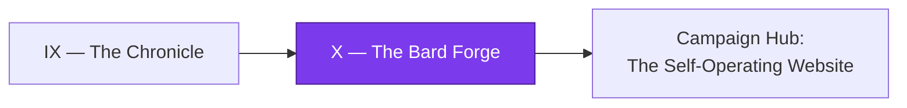

*The realm has learned to watch itself, heal itself, and chronicle its own deeds. Now, in the deepest chamber of the keep, one last forge glows: the **Bard Forge**, where finished labors are hammered into stories that teach the next generation of adventurers. The Bard does not change history — it cannot wield the hammer on its own past. It can only read the runes left in the merged branches and **propose** a new quest, sliding the parchment under the door of a separate keep for a human hand to accept.*

*The real-world skill you are forging here is the most subtle automation move of all: an agent that **mines version-control metadata** (PR numbers, commit SHAs, diffstats) and emits a **proposal to a human gate in a different repository** — read-only at the source, write-nowhere-it-shouldn't, and incapable of inventing a fact it cannot cite.*

## 📖 The Legend Behind This Quest

Every quest in this campaign ended with a Chronicle — a retrospective committed to the project's history. The Bard Forge takes that Chronicle as a spark. When a retrospective lands, the Bard awakens, reads the *cold runes* of the merge (the metadata Git already recorded), and drafts a brand-new quest in a **second** repository so the original project is never touched. This is the autonomy loop closing on itself: the work a project did becomes the lesson a learner takes. The discipline that makes it safe is the same discipline a senior engineer practices — **separate the thing that proposes from the thing that decides**, and never let an automated author write a hash it didn't read.

## 🎯 Quest Objectives

### Primary Objectives

- [ ] Trigger a read-only agent from a merged retrospective using GitHub Actions `pull_request` (closed + merged) events
- [ ] Mine merged-branch metadata — PR number, head SHA, and diffstat — using only `git` and the GitHub API, never invented values
- [ ] Open a quest-proposal pull request in a **separate** repository, leaving the source repo unmodified
- [ ] Enforce a human gate so the agent proposes but never merges its own output

### Mastery Indicators

- [ ] You can explain why the agent must read its source with read-only credentials
- [ ] You can trace every fact in the proposed quest back to a real SHA or PR number
- [ ] You can describe the trust boundary between the source repo and the target repo

## 🗺️ Quest Prerequisites

Before the forge will light, gather your gear:

- **🏅 Prior chapter:** Complete [Chapter IX — The Chronicle](/quests/1110/self-operating-website-09-the-chronicle/). The retrospective it teaches you to publish is the *spark* this chapter listens for.
- **🧰 Tools on your bench:** `git`, the [GitHub CLI](https://cli.github.com/) (`gh`) authenticated against your account, and `jq` for shaping JSON. A text editor or IDE for reading the workflow files.
- **🔑 Accounts & secrets:** A **source** GitHub repository you own (the one whose history you'll mine), a **separate target** repository to receive proposals (a "quest-forge" repo), a [Claude Code OAuth token](https://docs.claude.com/en/docs/claude-code/overview) stored as the `CLAUDE_CODE_OAUTH_TOKEN` secret, and a fine-grained personal access token scoped **only** to the target repo, stored as `QUEST_FORGE_TOKEN`.
- **🧠 Concepts:** Comfort with Git branches and pull requests, and a working idea of how GitHub Actions events (`on:`) and `permissions:` scopes behave.

## 🧙‍♂️ Chapter 1: Reading the Cold Runes (Mining Merged-Branch Metadata)

### ⚔️ Skills You'll Forge

- Firing a workflow only when a PR is *actually merged*, not merely closed
- Extracting deterministic metadata from a merge with `git` and `gh`
- Treating version-control history as a read-only data source

A merge is a fact. Once a branch lands, Git has permanently recorded who changed what, the head SHA, and the diffstat. The Bard's first job is to **read** those runes — never to guess them. The cleanest trigger is the `pull_request` event filtered to the merged case, because a closed PR is not the same as a merged one.

*(The `raw`/`endraw` tags are Jekyll escapes for this site's renderer — omit them when you copy the YAML into your own `.github/workflows/`.)*


```yaml
# .github/workflows/bard-forge.yml (in the SOURCE repo)
name: Bard Forge — propose a quest
on:
  pull_request:
    types: [closed]
permissions:
  contents: read          # read-only at the source — we never write here
jobs:
  mine-and-propose:
    # Only fire when the PR was truly merged, not just closed.
    if: github.event.pull_request.merged == true
    runs-on: ubuntu-latest
    steps:
      - uses: actions/checkout@v4
        with:
          fetch-depth: 0    # full history so we can read the diffstat
      - name: Mine merged-branch metadata
        env:
          GH_TOKEN: ${{ github.token }}
          PR_NUMBER: ${{ github.event.pull_request.number }}
        run: ./scripts/mine_merge.sh "$PR_NUMBER"
```


The `permissions: contents: read` line is the load-bearing rune: the source repo's token can read history but cannot push a commit, open a PR, or move a tag here. The script itself only *reads*.

```bash
#!/usr/bin/env bash
# scripts/mine_merge.sh — emit metadata as JSON. Reads only; writes nothing to the repo.
set -euo pipefail
PR_NUMBER="$1"

# The head SHA and merge commit SHA are facts Git/GitHub already recorded.
HEAD_SHA="$(gh pr view "$PR_NUMBER" --json headRefOid --jq '.headRefOid')"
MERGE_SHA="$(gh pr view "$PR_NUMBER" --json mergeCommit --jq '.mergeCommit.oid')"

# A merge or squash commit has the base as its first parent, so MERGE_SHA^
# is the pre-merge tip. Diff that range — also a recorded fact, never invented.
DIFFSTAT="$(git diff --shortstat "${MERGE_SHA}^" "${MERGE_SHA}")"

# Fail loudly if any rune is missing rather than emitting a half-empty proposal.
if [[ -z "$HEAD_SHA" || -z "$MERGE_SHA" ]]; then
  echo "Refusing to proceed: could not read head/merge SHA for PR #${PR_NUMBER}" >&2
  exit 1
fi

jq -n \
  --arg pr "$PR_NUMBER" \
  --arg head "$HEAD_SHA" \
  --arg merge "$MERGE_SHA" \
  --arg stat "$DIFFSTAT" \
  '{pr: $pr, head_sha: $head, merge_sha: $merge, diffstat: $stat}' \
  > merge_metadata.json
cat merge_metadata.json
```

Every value above came from `gh` or `git`. The Bard will later be *forbidden* to write a SHA the script did not produce — that is what makes the proposal trustworthy.

### 🔍 Knowledge Check

- [ ] Why does `if: github.event.pull_request.merged == true` matter when the event type is `closed`?
- [ ] Which `permissions:` setting guarantees the workflow cannot write to the source repo?
- [ ] Where do `head_sha` and `merge_sha` come from, and why must the agent never invent them?

## 🧙‍♂️ Chapter 2: Sliding the Parchment Under the Door (Propose to a Human Gate, Never Merge)

### ⚔️ Skills You'll Forge

- Authoring a quest from real metadata with a read-only Claude Code agent
- Opening a PR in a **separate** target repository with a scoped token
- Enforcing a human gate so the agent proposes but never decides

Now the Bard has clean runes. It drafts a quest — but the draft must live in a **different** keep. Pushing the proposal back into the source repo would let an automated author mutate the very history it just read; that loop must stay open. Instead, the agent uses a token scoped to the *target* repo (a forge repo for proposed quests) and opens a pull request there for a human to accept.

The agent runs **read-only at the source**: it reads `merge_metadata.json` and the Chronicle, and its only write is the Markdown file it emits to the cloned target. Its guardrails are spelled out in the prompt — cite only what the JSON contains, never invent a SHA or PR number, never run a merge command.


```yaml
      - name: Forge a quest proposal (read-only authoring)
        uses: ./.github/actions/claude-run
        with:
          # The agent reads merge_metadata.json and the Chronicle; it may NOT
          # invent SHAs, PR numbers, or output it did not observe. It writes a
          # single file — quest.md — and nothing else.
          prompt: >
            Read merge_metadata.json in the workspace. Draft a gamified quest in
            Markdown that teaches what this merge accomplished, and write it to
            quest.md. Cite ONLY the pr/head_sha/merge_sha values present in the
            JSON. If a fact is missing, omit it — never guess. Do not run git,
            do not open or merge any pull request; another step handles that.
          oauth_token: ${{ secrets.CLAUDE_CODE_OAUTH_TOKEN }}

      - name: Open proposal PR in the SEPARATE quest-forge repo
        env:
          # A token scoped ONLY to the target repo — not the source.
          GH_TOKEN: ${{ secrets.QUEST_FORGE_TOKEN }}
          PR_NUMBER: ${{ github.event.pull_request.number }}
        run: |
          set -euo pipefail
          # Verify the agent produced a quest before touching the target repo.
          test -s quest.md || { echo "No quest.md produced — aborting." >&2; exit 1; }

          gh repo clone bamr87/quest-forge target
          BRANCH="proposal/pr-${PR_NUMBER}"
          cp quest.md "target/proposed/pr-${PR_NUMBER}.md"
          cd target
          git checkout -b "$BRANCH"
          git add "proposed/pr-${PR_NUMBER}.md"
          git commit -m "Propose quest from merged PR #${PR_NUMBER}"
          git push origin "$BRANCH"
          # Open the PR — but DO NOT merge it. A human gate decides.
          gh pr create --fill --base main --head "$BRANCH" \
            --label "auto:quest-proposal"
```


Three rules make this safe, and they are the whole point of the chapter:

1. **Separate repos.** The agent reads `bamr87/lifehacker.dev`-style history and writes only to a distinct forge repo (`bamr87/quest-forge`). The source is never mutated.
2. **Scoped credentials.** `QUEST_FORGE_TOKEN` can write to the target and nothing else; the source workflow's own `github.token` stays read-only (`contents: read`).
3. **A human gate.** The agent calls `gh pr create`, never `gh pr merge`. Auto-merge is deliberately absent — a person reviews the proposed quest before it joins the codex.

This is the autonomy ceiling done right: the machine does the tedious mining and drafting; the human keeps the final say. *Propose, don't merge* is the same principle that keeps a self-healing pipeline from quietly shipping a bad fix.

### 🔍 Knowledge Check

- [ ] Why must the proposal land in a separate repository rather than the source repo?
- [ ] What is the difference between `QUEST_FORGE_TOKEN` and the source workflow's `github.token`?
- [ ] Which single missing command (`gh pr ...`) is what preserves the human gate?

## 🔁 Reproduce It

This chapter is anchored to a real merged branch in the campaign's reference build:

- **bamr87/lifehacker.dev#53** (`bamr87/lifehacker.dev@09046139b`) — the merge that wired the retrospective-to-proposal loop: a read-only mining step plus a proposal PR opened in a separate forge repo, with no auto-merge, closing the autonomy loop while keeping a human gate.

Read the squash-merge commit, find the metadata-mining step and the separate-repo proposal, and confirm for yourself that the source repository is never written to.

## 🎮 Mastery Challenge

**Objective:** Build a Bard Forge for one of your own repositories that proposes a quest from a merged PR without ever mutating the source repo.

- [ ] A merged PR triggers a workflow that produces a `merge_metadata.json` whose SHAs match `git`/`gh` output exactly
- [ ] The proposal PR is opened in a *different* repository, and `git log` on the source shows no new commits from the agent
- [ ] No `gh pr merge` exists anywhere in the workflow — every proposal waits on a human reviewer

## 🎁 Rewards & Progression

- **Badge:** 🪄 Loop Closer — turned project history into a learnable quest without mutating the project
- **Skills unlocked:** 🪄 Metadata-mining quest proposal agent · 🧠 Propose-to-a-human-gate autonomy
- **+120 XP**

You have closed the loop. The realm now teaches what it learns — and it does so without ever letting the machine rewrite its own past.

## 🗺️ Quest Network



## 🔮 Next Adventures

This is the final chapter of the campaign. Return to the hub to review the full arc, replay a chapter, or branch into a new epic:

- 🏰 **Campaign hub:** [The Self-Operating Website](/quests/codex/self-operating-website/)
- 📜 **Previous chapter:** [The Chronicle](/quests/1110/self-operating-website-09-the-chronicle/)

## 📚 Resource Codex

- [Events that trigger workflows — `pull_request`](https://docs.github.com/en/actions/using-workflows/events-that-trigger-workflows#pull_request) — the `closed` event and the `merged` field.
- [Assigning permissions to jobs (GitHub Actions)](https://docs.github.com/en/actions/using-jobs/assigning-permissions-to-jobs) — how to lock a workflow to `contents: read`.
- [GitHub CLI manual — `gh pr`](https://cli.github.com/manual/gh_pr) — `gh pr view`, `gh pr create`, and the merge command we deliberately avoid.
- [Claude Code documentation](https://docs.claude.com/en/docs/claude-code/overview) — driving the read-only authoring agent.

## 🕸️ Knowledge Graph

*Structured wiki-links connect this quest to the IT-Journey knowledge graph. Open the [Obsidian Graph View](/notes/obsidian/graph/) to explore connections.*

**Campaign hub:** [[Epic Quest: The Self-Operating Website]]
**Previous:** [[The Chronicle]]
**Obsidian docs:** [[Obsidian Knowledge Graph and Wiki Links]]
