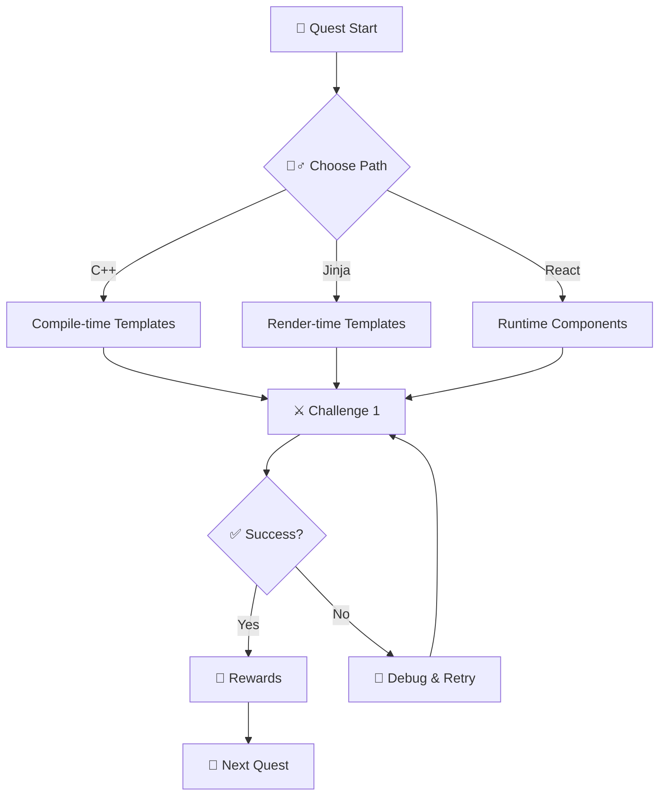

## 🧙‍♂️ Epic Introduction

In the vast digital matrix where data flows like rivers of light, an ancient archway awaits. Step through and behold The Temple of Templates—a sanctum where binary incantations become architecture and reusable patterns are carved in code like sacred runes. Here, temples and templates are kindred artifacts: both are blueprints that outlive their makers, both embed deep wisdom for future builders, and both scale from humble shrines to sprawling cathedrals (or from scripts to systems). Today, you’ll learn to forge reusable components across stacks, weaving type-safety, composition, and inheritance into an elegant tapestry of maintainable software.

### 🌟 The Legend Behind This Quest

From Angkor Wat to the Parthenon, great temples were designed with symmetry, purpose, and expansion in mind. Likewise, template-driven code—C++ generics, HTML/Jinja templates, React components—creates structures that endure change. Your mission: master the patterns that let small ideas grow into resilient systems.

## 🎯 Quest Objectives

### Primary Objectives

- [ ] Design and implement a reusable template in one stack (C++ OR Jinja OR React)
- [ ] Demonstrate composition and extension (inheritance or template inheritance)
- [ ] Explain trade-offs between abstraction depth and simplicity (KIS vs. flexibility)

### Secondary Objectives (Bonus)

- [ ] Build two stacks (e.g., Jinja and React) using a shared content model
- [ ] Add automated tests or validation (snapshot test, render check, or compile-time proof)
- [ ] Publish a README that teaches another adventurer the pattern

### Mastery Indicators

- [ ] You can describe when to choose composition over inheritance
- [ ] You can extend a template without modifying its source
- [ ] You can identify and avoid over-abstracted “temple sprawl”

## 🌍 Choose Your Adventure Platform

Pick one path—or explore them all. Each grants similar powers with different spellbooks.

### 🍎 macOS Kingdom Path

```bash
# Prereqs (optional if already installed)
brew install python node git
python3 -m venv .venv && source .venv/bin/activate
python -m pip install jinja2
npm install -g create-vite @vitejs/plugin-react
```

### 🪟 Windows Empire Path

```powershell
# Run in PowerShell
winget install -e --id Python.Python.3.12
winget install -e --id OpenJS.NodeJS
pip install jinja2
npm install -g create-vite @vitejs/plugin-react
```

### 🐧 Linux Territory Path

```bash
sudo apt-get update && sudo apt-get install -y python3-venv python3-pip nodejs npm
python3 -m venv .venv && source .venv/bin/activate
pip install jinja2
npm install -g create-vite @vitejs/plugin-react
```

### ☁️ Cloud Realms Path

- Use GitHub Codespaces or a dev container with Node 18+ and Python 3.10+
- Optional: Dockerize a tiny Jinja renderer for reproducible builds

### 📱 Universal Web Path

- Use StackBlitz (React) and a web-based Jinja playground alternative for quick experiments

## 🧙‍♂️ Chapter 1: Foundation Stones — Abstraction as Bedrock

### ⚔️ Skills You’ll Forge — Chapter 1

- Understand what “template” means across languages
- Recognize compile-time vs. render-time vs. runtime templating
- Choose safe defaults to avoid over-engineering

### 🏗️ Building Your Knowledge Foundation

#### 🔧 Implementation: C++ Generic Vector (compile-time template)

**Purpose**: Demonstrate type-parametric reuse and inlineable performance.
**Prerequisites**: A modern C++ compiler.

```cpp
// Minimal illustrative example: a typed Box
template <typename T>
struct Box {
  T value;
  explicit Box(T v) : value(v) {}
  T get() const { return value; }
};

// Usage
// Box<int> bi(42);
// Box<std::string> bs("runes");
```

**Key Insight**: Compile-time templates offer zero-cost abstractions but raise error complexity. Prefer clear errors via concepts/constraints when available.

#### 🔧 Implementation: HTML with Jinja2 (render-time template)

**Purpose**: Separate content from structure with inheritance and blocks.
**Prerequisites**: Python 3 with Jinja2.

```python
# render.py
from jinja2 import Environment, FileSystemLoader
env = Environment(loader=FileSystemLoader('templates'))
print(env.get_template('page.html').render(title='Temple of Templates', user={'name':'Acolyte'}))
```

```html
<!-- templates/base.html -->
<!doctype html>
<html>
  <head><title>Base</title></head>
  <body>
    <header>🏛️ {{ site_name | default('Temple') }}</header>
    <main></main>
  </body>
  </html>
```

```html
<!-- templates/page.html -->

{{ title }}

  <h1>Hello {{ user.name }}!</h1>

```

**Expected Output**:

```html
<h1>Hello Acolyte!</h1>
```

#### 🔧 Implementation: React Component Template (runtime component)

**Purpose**: Compose UI with props and slots.
**Prerequisites**: Node.js + a React starter.

```jsx
// Card.jsx
export function Card({ title, children }) {
  return (
    <section className="card">
      <h2>{title}</h2>
      <div>{children}</div>
    </section>
  );
}

// Usage
// <Card title="Sanctum"><p>Rendered content</p></Card>
```

#### Common Pitfalls

- C++: unreadable template errors → use constraints/concepts
- Jinja: tight coupling to data shape → validate inputs
- React: prop drilling → prefer composition and context

### 🔍 Knowledge Check — Chapter 1

- What differences matter between compile-time, render-time, and runtime templating?
- How would you refactor if the data model changes?

## 🧙‍♂️ Chapter 2: Sacred Carvings — Embedding Reusable Wisdom

### ⚔️ Skills You’ll Forge — Chapter 2

- Template inheritance and block overrides
- Composition over inheritance (where practical)
- Encapsulating defaults with extension points

#### 🔧 Implementation: Jinja Inheritance + Partials

```html
<!-- templates/partials/button.html -->
<button class="btn {{ variant | default('primary') }}">{{ label }}</button>
```

```html
<!-- templates/page.html (extended) -->


  

```

#### 🔧 Implementation: React Composition

```jsx
// Layout.jsx
export function Layout({ header, children }) {
  return (
    <div>
      <header>{header}</header>
      <main>{children}</main>
    </div>
  );
}
// <Layout header={<Logo/>}><Dashboard/></Layout>
```

### 🔍 Knowledge Check — Chapter 2

- Where is inheritance appropriate? Where is composition safer?
- How do partials/slots keep templates stable as features grow?

## 🧙‍♂️ Chapter 3: Inner Sanctum — Blueprints for the Future

### ⚔️ Skills You’ll Forge — Chapter 3

- Extensibility patterns (slots/blocks/hooks)
- Guardrails (linters, tests, constraints)
- Documentation as part of the artifact

#### 🔧 Implementation: Constraints (C++)

```cpp
#include <concepts>
template <typename T>
requires std::totally_ordered<T>
T max_of(T a, T b) { return a < b ? b : a; }
```

#### 🔧 Implementation: Snapshot Test (React)

```js
// Example with Vitest/RTL (outline)
// render(<Card title="Relic">text</Card>)
// expect(screen.getByText('Relic')).toBeInTheDocument()
```

### 🧪 Experimentation Station

- Swap data models and confirm templates still render
- Add a new block/slot without touching the base implementations

## 🎮 Quest Implementation Challenges

### Challenge 1: Temple Landing (🕐 25–35 min)

**Objective**: Render a landing page from a base layout.
**Requirements**:

- [ ] Base layout + page override (Jinja OR React)
- [ ] One reusable partial/component (button/card)
- [ ] README explaining structure and how to extend

**Success Criteria**:

- [ ] Page renders with dynamic title
- [ ] Partial is reused twice with different props/context

### Challenge 2: Dual-Temple Build (🕐 25–35 min)

**Objective**: Implement the same layout in a second stack.
**Requirements**:

- [ ] Mirror layout and content model
- [ ] Note differences (props vs. context; server vs. client render)
**Success Criteria**:

- [ ] Both stacks produce equivalent UI
- [ ] Document trade-offs (performance, complexity)

### 🏆 Master Challenge: Pattern Codex (🕐 30–45 min)

**Objective**: Create a small pattern library (2–3 components/partials) with usage examples and tests or constraints.

### ✅ Quest Completion Verification

- [ ] At least one working stack with inheritance/composition
- [ ] Clear explanation of pattern choices and trade-offs
- [ ] Repo/gist link with README and runnable steps

## 🎁 Quest Rewards and Achievements

### 🏆 Achievement Badges Earned

- Pattern Weaver • Template Mastery • Abstraction Adept

### ⚡ Skills and Abilities Unlocked

- Confidently select the right templating layer
- Build once, extend many times with minimal churn

### 🛠️ Tools Added to Your Arsenal

- C++ templates, Jinja2, React components, testing/constraints

### 📈 Your Journey Progress

- Previous: Programming Foundations → Functions and Modules
- Current: Level 1100 (12) Function Crafting
- Next: Integration Spells (APIs) or Testing Trials

## 🔮 Your Next Epic Adventures

- Level 1100: Composition over Inheritance—A Practical Guide
- Level 1101: Testing the Sanctum—Verification for Templates
- Level 1110: Security Sigils—Sanitization and Safe Rendering

## 📚 Quest Resource Codex

### 📖 Essential Documentation

- C++ Templates: <https://en.cppreference.com/w/cpp/language/templates>
- Jinja2: <https://jinja.palletsprojects.com/>
- React Components: <https://react.dev/learn/describing-the-ui>

### 🎥 Visual Learning Resources

- Templates & Composition talks (search: “composition over inheritance react”)

### 💬 Community and Support

- Stack Overflow: c++, jinja2, reactjs tags
- Reactiflux Discord; Python Discord (Jinja channel)

### 🔧 Tools and Extensions

- VS Code: Jinja, C/C++, ESLint, React snippets

### 📋 Cheat Sheets and References

- C++ concepts quick ref; Jinja filters; React props/children patterns

## 🗺️ Quest Network Position

**Quest Series**: Binary Function Crafting
**Prerequisites**:

- Level 0011: Programming Basics
- Level 0100: Git Fundamentals


**Follow-Up Quests**:

- Level 1101: Testing and QA Patterns
- Level 1100: Pattern Libraries and Design Systems


## 🧭 Mermaid Wayfinding



---

### 🧠 Knowledge Check (Comprehensive)

Before you depart the temple, ensure you can explain:

- Why templates/components reduce duplication yet can increase cognitive load
- How to add extension points without breaking consumers
- When to stop abstracting—what is “good enough” for today

May your blueprints be clear, your APIs stable, and your sanctums extensible. 🏛️💡
