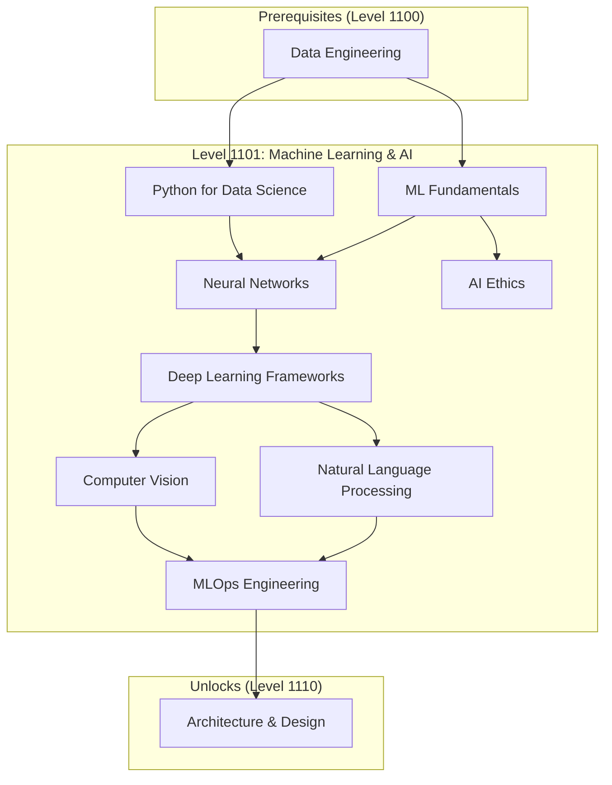

---

title: "Level 1101: Machine Learning & AI"
description: Master the fundamentals of machine learning, neural networks, and artificial intelligence to build intelligent systems
preview: images/previews/level-1101-machine-learning-ai.png
level: "1101"
level_decimal: 13
tier: Master
tier_emoji: ⚡
theme: Digital Intelligence
xp_range: 7000-8500
permalink: /quests/1101/
date: 2025-11-30
lastmod: 2025-12-01T04:36:39.401Z
categories:
  - quests
  - level-1101
  - master-tier
  - machine-learning
  - ai
tags:
  - machine-learning
  - ai
  - neural-networks
  - deep-learning
  - data-science
  - nlp
  - computer-vision
toc: true
toc_sticky: true
sidebar:
  nav: quests

layout: quest-collection
---

# ⚡ Level 1101: Machine Learning & AI

*Welcome, aspiring AI architect! You have reached the realm of Digital Intelligence, where machines learn from data and algorithms evolve to solve complex problems. Here you will master the arts of machine learning, neural networks, and artificial intelligence.*

## 🎯 Level Overview

| Attribute | Value |
|-----------|-------|
| **Level** | 1101 (Decimal: 13) |
| **Tier** | ⚡ Master Tier |
| **Theme** | Digital Intelligence |
| **XP Range** | 7000-8500 |
| **Prerequisites** | Level 1100 (Data Engineering) |
| **Unlocks** | Level 1110 (Architecture & Design) |

## 📚 Learning Objectives

By completing this level, you will:

- [ ] Understand fundamental machine learning concepts and algorithms
- [ ] Master Python libraries for data science (NumPy, Pandas, Scikit-learn)
- [ ] Build and train neural networks using TensorFlow and PyTorch
- [ ] Implement natural language processing solutions
- [ ] Develop computer vision applications
- [ ] Deploy ML models to production using MLOps practices
- [ ] Apply ethical AI principles in your projects

## 🗺️ Quest Map



## 📋 Available Quests

| Quest | Difficulty | Time | XP | Status | Tech |
|-------|------------|------|-----|--------|------|
| [Machine Learning Fundamentals](ml-fundamentals.md) | 🔴 Hard | 5-6 hours | 180 | 🔮 | Python, Scikit-learn |
| [Python for Data Science](python-data-science.md) | 🟡 Medium | 4-5 hours | 120 | 🔮 | Python, NumPy, Pandas |
| [Neural Networks Deep Dive](neural-networks.md) | ⚔️ Epic | 6-8 hours | 250 | 🔮 | TensorFlow |
| [Deep Learning Frameworks](deep-learning-frameworks.md) | 🔴 Hard | 5-6 hours | 180 | 🔮 | PyTorch |
| [Natural Language Processing](natural-language-processing.md) | 🔴 Hard | 5-6 hours | 180 | 🔮 | Python, Transformers |
| [Computer Vision Mastery](computer-vision.md) | 🔴 Hard | 5-6 hours | 180 | 🔮 | Python, OpenCV |
| [MLOps Engineering](mlops.md) | 🔴 Hard | 5-6 hours | 180 | 🔮 | Docker, Kubernetes |
| [AI Ethics and Responsible AI](ai-ethics.md) | 🟡 Medium | 2-3 hours | 80 | 🔮 | General |

**Legend:** ✅ Complete | 🔮 Placeholder | 📝 In Progress

## 🎮 Recommended Quest Order

1. **Foundation Track** (Start Here)
   - Python for Data Science → ML Fundamentals → AI Ethics

2. **Deep Learning Track**
   - Neural Networks → Deep Learning Frameworks

3. **Application Track**
   - Natural Language Processing → Computer Vision

4. **Production Track**
   - MLOps Engineering

## 🛠️ Required Tools & Technologies

- **Languages:** Python 3.9+
- **ML Libraries:** Scikit-learn, NumPy, Pandas
- **Deep Learning:** TensorFlow, PyTorch
- **NLP:** Hugging Face Transformers, NLTK, spaCy
- **Computer Vision:** OpenCV, PIL
- **MLOps:** Docker, MLflow, Kubernetes
- **Environment:** Jupyter Notebooks, VS Code

## 📈 Skill Progression

```
Data Engineering (1100) → Machine Learning → AI Applications → Production ML
                           │                    │
                           ├── Supervised Learning
                           ├── Unsupervised Learning
                           ├── Deep Learning ──────┤
                           └── Reinforcement       ├── NLP
                               Learning            ├── Computer Vision
                                                   └── Generative AI
```

## 🎯 Level Completion Criteria

To advance to Level 1110 (Architecture & Design), you must:

- [ ] Complete at least 5 quests in this level
- [ ] Build a working ML model from scratch
- [ ] Deploy an ML model to production
- [ ] Demonstrate understanding of AI ethics principles
- [ ] Earn minimum 1,000 XP in this level

## 🔗 Related Resources

- [Level 1100: Data Engineering](../1100/)
- [Level 1110: Architecture & Design](../1110/)
- [Data Scientist Path](/quests/#-data-scientist-path)

---

*"The measure of intelligence is the ability to change." — Albert Einstein*

**Ready to teach machines? Begin your journey into AI! 🤖**


## Available Quests

| Quest | Difficulty | Time | Type | Status |
|-------|------------|------|------|--------|
| [AI Ethics and Responsible AI: Bias Detection, Fairness & Governance](/quests/level-1101-ai-ethics/) | 🟡 Medium | 2-3 hours | side_quest | 🔮 Placeholder |
| [Computer Vision Mastery: Image Classification, Object Detection & Segmentation](/quests/level-1101-computer-vision/) | 🔴 Hard | 5-6 hours | main_quest | 🔮 Placeholder |
| [Deep Learning Frameworks: PyTorch vs TensorFlow Comparison & Implementation](/quests/level-1101-deep-learning-frameworks/) | 🔴 Hard | 5-6 hours | main_quest | 🔮 Placeholder |
| [Machine Learning Fundamentals: Supervised & Unsupervised Learning with Scikit-Learn](/quests/level-1101-ml-fundamentals/) | 🔴 Hard | 5-6 hours | main_quest | 🔮 Placeholder |
| [MLOps Engineering: CI/CD Pipelines for Machine Learning Production](/quests/level-1101-mlops/) | 🔴 Hard | 5-6 hours | main_quest | 🔮 Placeholder |
| [Natural Language Processing: Text Analysis, Transformers & LLMs with Python](/quests/level-1101-natural-language-processing/) | 🔴 Hard | 5-6 hours | main_quest | 🔮 Placeholder |
| [Neural Networks Deep Dive: Build CNNs, RNNs & Transformers from Scratch](/quests/level-1101-neural-networks/) | ⚔️ Epic | 6-8 hours | main_quest | 🔮 Placeholder |
| [Python for Data Science: NumPy, Pandas & Matplotlib Complete Guide](/quests/level-1101-python-data-science/) | 🟡 Medium | 4-5 hours | main_quest | 🔮 Placeholder |


